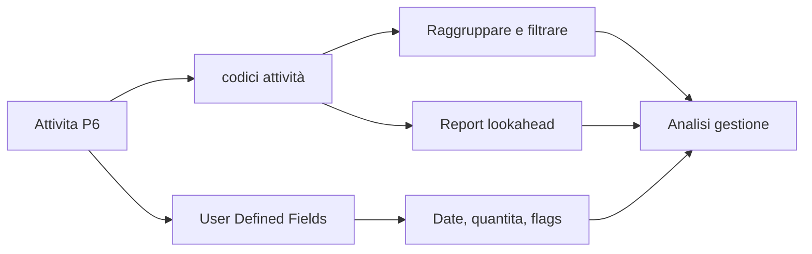

# codici attività

Gli codici attività in Primavera P6 sono uno degli strumenti principali che trasformano un cronoprogramma da lista di attivita a database utile per controllo di progetto. Permettono di raggruppare, filtrare, ordinare, reportare e analizzare il cronoprogramma da diverse prospettive di gestione.

Un cronoprogramma non e solo un bar chart. In P6, ogni attivita e anche un record che puo contenere informazioni su responsabile, fase, area, sistema, disciplina, contratto, tipo di milestone e altri attributi del progetto. Gli codici attività organizzano queste informazioni in modo controllato.

## Cosa Sono gli codici attività

Gli codici attività sono campi strutturati di classificazione assegnati alle attivita. Ogni code type rappresenta una dimensione di reporting, e ogni code value rappresenta un'opzione dentro quella dimensione.

Per esempio:

- Code type: Area.
- Code values: Unit 1, Unit 2, Tank Farm, Utilities.

Oppure:

- Code type: Discipline.
- Valori dei codici: civile, meccanico, elettrico, strumentazione, messa in servizio.

La WBS mostra dove si trova il lavoro nella struttura del progetto. Gli codici attività mostrano come il lavoro puo essere visto per reporting e analisi.

## Cosa Non Sono

I codici attività non sostituiscono la WBS. La WBS è la gerarchia dell'ambito. I codici sono viste aggiuntive delle stesse attività.

Gli codici attività non sostituiscono la logica. La logica definisce la sequenza del lavoro.

Gli codici attività non sostituiscono le risorse. Le risorse definiscono manodopera, equipment, materiali e cost loading.

Quando questi concetti si mescolano, il cronoprogramma diventa piu difficile da mantenere. Un cronoprogramma P6 pulito usa WBS, logica, risorse, codici attività e UDFs per scopi diversi.

## Global e Project codici attività

P6 ha Global codici attività e Project codici attività.

I Global codici attività sono condivisi tra progetti. Sono utili quando la stessa classificazione deve essere usata in un portfolio, come fasi standard, gruppi corporate di responsabilita o categorie di reporting cronoprogramma.

I Project codici attività appartengono a un progetto specifico. Sono utili per esigenze proprie del progetto, come aree, sistemi, contract packages, work fronts, turnover packages o categorie locali di reporting.

Usare i codici globali con cautela perché le modifiche possono influenzare altri progetti. Usare i codici di progetto per attributi che hanno senso solo dentro un progetto.

## Tipi Comuni di codici attività

I code types utili dipendono dal progetto, ma esempi comuni includono:

- Responsible Party.
- Discipline.
- Project Phase.
- Area or Location.
- System or Subsystem.
- Contract Package.
- Work Package.
- Milestone Type.
- Turnover Package.
- Reporting Level.

I migliori tipi di codice nascono dai bisogni di reporting. Prima di creare codici, chiedere: a quali domande deve rispondere il cronoprogramma?

Esempi:

- Quale lavoro e pianificato in Area A il mese prossimo?
- Quali attivita appartengono al contractor elettrico?
- Quali sistemi stanno guidando messa in servizio?
- Quale contract package sta slittando?
- Quali milestones devono essere riportati al cliente?

## User Defined Fields

Gli User Defined Fields, o UDF, sono diversi dai codici attività. I codici classificano le attività in categorie. Gli UDF memorizzano dati personalizzati come date, numeri, testo, costi, quantità o indicatori sì/no.

Usare UDFs quando l'informazione non e semplicemente una categoria.

Esempi:

- Contractual finish date.
- Data di fine prevista.
- Risk flag.
- Quantity planned.
- Quantity installed.
- Change order number.
- Drawing reference.
- Inspection status.

Gli codici attività sono migliori per raggruppare e filtrare. Gli UDFs sono migliori per memorizzare informazioni extra che P6 non fornisce nei campi standard.

## Perche Contano Nel Reporting

Una buona codifica rende i report più rapidi e affidabili.

Con codici attività consistenti, il pianificatore può produrre lookahead per disciplina, report per area, riepiloghi per pacchetto contrattuale, report per sistema di messa in servizio, report sulle milestone e dashboard senza ricostruire filtri ogni volta.

Senza codici, il reporting spesso diventa manuale. Il team esporta dati, modifica fogli di calcolo, aggiunge etichette a mano e ripete il lavoro a ogni aggiornamento. Questo crea errori e consuma tempo.

I codici rendono il cronoprogramma una fonte dati riutilizzabile.

## Governance

Gli codici attività richiedono governance. Se tutti creano values liberamente, il cronoprogramma diventa rapidamente incoerente.

Per esempio, una persona usa "Electrical", un'altra "Elec", un'altra "E&I". Il report puo perdere attivita perche la stessa categoria e divisa in piu labels.

Definire code types e valori validi prima della baseline quando possibile. Documentare cosa significa ogni code, chi lo mantiene e se e obbligatorio.

La completezza della codifica deve essere controllata come qualsiasi altro elemento di qualità del cronoprogramma. Se molte attività mancano di codici obbligatori, i report basati su quei codici non sono affidabili.

## Evitare Over-Engineering

Più codici non significano automaticamente miglior controllo.

Ogni code e UDF crea lavoro di manutenzione. Se un code non viene mai usato in report, filtro, dashboard o analisi, forse non vale lo sforzo.

Partire dalle domande di reporting che contano. Costruire struttura sufficiente per rispondervi, ma evitare campi creati solo perche potrebbero servire un giorno.

## Buone Pratiche

Progettare la codifica structure durante lo sviluppo del cronoprogramma, non dopo la baseline.

Allineare i codici al piano di reporting del progetto. Se il progetto riporta per area, disciplina, contratto e sistema, queste dimensioni devono esistere in P6.

Mantenere code values consistenti e controllati. Evitare duplicati e abbreviazioni poco chiare.

Usare UDFs per date, quantita, riferimenti e indicatori personalizzati. Non forzare informazioni numeriche o date dentro codici attività.

Revisionare la codifica a ogni aggiornamento. Le nuove attività devono ricevere i codici richiesti prima dell'emissione dei report.

## Conclusione

Gli codici attività non sono semplici labels amministrative. Permettono a un cronoprogramma Primavera P6 di rispondere rapidamente e coerentemente alle domande di gestione.

Usati bene, rendono il cronoprogramma piu facile da filtrare, raggruppare, reportare e analizzare. Gli UDFs estendono questa capacita memorizzando informazioni specifiche del progetto non coperte dai campi standard P6.

Il bar chart mostra il tempo. La codifica structure spiega come il cronoprogramma puo essere letto, diviso e usato.
## Contenuti correlati
- [Dipendenze mancanti in Primavera P6 - Panoramica](../../metrics/21_missing_dependencies/02_guide_template.md)
- [Sviluppare un Cronoprogramma di Progetto](../17_DEVELOPE%20A%20PROJECT%20SCHEDULE/17_DEVELOPE%20A%20PROJECT%20SCHEDULE.md)
- [Base del cronoprogramma](../19_SCHEDULE%20BASIS/19_SCHEDULE%20BASIS.md)
