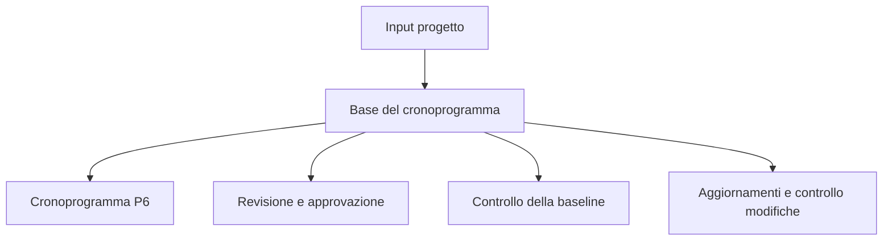

La base del cronoprogramma è il documento che spiega come è stato costruito il cronoprogramma di progetto e quali assunzioni lo supportano. È il complemento scritto del file Primavera P6.

Il cronoprogramma mostra date, logica, margine, milestone, risorse e percorso critico. La base del cronoprogramma spiega perché questi elementi appaiono così.

## A Cosa Serve

La base del cronoprogramma supporta revisione, approvazione, controllo della baseline, aggiornamenti, gestione delle modifiche e analisi dei ritardi. Aiuta il revisore a capire regole, assunzioni, input e limiti dietro il cronoprogramma.

Senza di essa, il file P6 puo calcolare correttamente, ma il team potrebbe non sapere quali assunzioni sono state usate o se il cronoprogramma e adatto alle decisioni.

## Chi La Scrive e A Chi Serve

Il pianificatore o ingegnere di pianificazione di solito prepara la base del cronoprogramma, con input da responsabili di progetto, ingegneria, approvvigionamento, costruzione, messa in servizio, controllo di progetto, contratti e team costi.

E indirizzata a project team, client, PMO, reviewers, claims analysts e chiunque debba capire come e stato costruito il cronoprogramma.

## Perche Conta

Un cronoprogramma contiene molte decisioni. Calendars, durations, logic, crews, milestones, approval cycles, permits e resource limits influenzano date e margine.

La base del cronoprogramma rende visibili queste decisioni. Riduce ambiguità, supporta la verificabilità e previene discussioni future su ciò che il cronoprogramma assumeva alla baseline.

## Cosa Deve Includere

Una base del cronoprogramma completa deve includere:

- Project scope ed exclusions.
- Purpose del cronoprogramma e contractual use.
- Metodologia di sviluppo del cronoprogramma.
- WBS e activity codifica structure.
- Calendars, shifts, holidays, weather e non-work periods.
- Assunzioni chiave e vincoli.
- Milestone di avvio, completamento, accesso, approvazioni e consegna materiali.
- Approval cycles e permit cycles.
- Assunzioni di consegna e turnover.
- Logic rules, relationship types e lag policy.
- Duration basis, productivity rates e norms.
- Crews, resource availability, labor limits e equipment limits.
- Cost rules, se applicabile.
- Spiegazione del percorso critico e dei percorsi quasi critici.
- Assunzioni di rischio e principali incertezze.
- Update cycle, status rules e reporting approach.

## Assunzioni

Le assunzioni devono essere chiare e verificabili. Possono includere date di accesso al sito, rilasci di ingegneria, date di consegna dei fornitori, durate di approvazione dei permessi, periodi di revisione del cliente, disponibilità delle squadre, margini per il meteo e assunzioni sulla sequenza di messa in servizio.

Se un'assunzione influenza date, margine, risorse o consegna, deve stare nella base del cronoprogramma.

## Calendari e Periodi di Lavoro

Il documento deve spiegare i principali calendari usati in P6. Includere working days, shifts, holidays, seasonal shutdowns, weather calendars, night work, weekend work e non-work periods.

I calendari influenzano direttamente le date delle attività e il margine. Se ingegneria, approvvigionamento, costruzione, messa in servizio o risorse usano calendari diversi, spiegare perché.

## Squadre, risorse e limiti

Le durate hanno senso solo quando le risorse assunte sono comprese. La base del cronoprogramma deve dichiarare assunzioni sulle squadre, disponibilità delle risorse, limiti di manodopera, limiti delle attrezzature, straordinari o strategia dei turni.

Se c'e resource loading, spiegare se serve a manpower planning, cost loading, earned value o resource leveling.

## Milestone, approvazioni, permessi e consegna

Le milestone principali devono essere elencate e spiegate: avvio del progetto, completamento contrattuale, accesso concesso, approvazioni del cliente, interfacce con terze parti, consegna materiali, permessi, consegne di sistema e turnover finale.

Approval e permit cycles devono mostrare durate assunte e responsabili. Se un'azione del client o di terzi guida il cronoprogramma, deve essere visibile.

## Metodologia, produttività e costi

La base del cronoprogramma deve spiegare come è stato sviluppato il cronoprogramma: fonti utilizzate, workshop, logica di sequenziamento, metodo di stima delle durate, tassi di produttività, norme e processo di validazione.

Se c'e cost loading, dichiarare le regole. Spiegare se i costs sono assegnati per resource, expense, activity, WBS, contract package o earned value method.

## Percorso critico e rischio

La base del cronoprogramma deve riassumere il percorso critico e spiegare perché è ragionevole. Deve anche identificare percorsi quasi critici, rischi principali, sensibilità del cronoprogramma e assunzioni che possono cambiare durante l'esecuzione.

Questo aiuta il team a capire non solo la planned finish date, ma cosa la controlla.

## Buone Pratiche

Scrivere la base del cronoprogramma prima dell'approvazione della baseline. Mantenerla allineata al file P6. Aggiornarla quando modifiche approvate cambiano assunzioni, calendari, milestone, strategia delle risorse o metodologia.

Non deve essere una narrativa generica. Deve essere abbastanza specifica da permettere a un altro pianificatore di capire come e stato costruito il cronoprogramma.

## Conclusione

La base del cronoprogramma è la spiegazione dietro il cronoprogramma. Dice cosa assume il cronoprogramma, come è stato costruito, cosa include, cosa esclude e quali condizioni devono restare vere per mantenere valide le date.

Una solida base del cronoprogramma rende il file P6 più facile da revisionare, difendere, aggiornare e considerare affidabile.
## Contenuti correlati
- [Attività che iniziano alla data di aggiornamento senza alcuna logica guida: perché questa metrica di pianificazione è importante - Panoramica](../../metrics/01_activities_starting_in_dd_with_no_logic_driving/02_guide_template.md)
- [codici attività](../18_ACTIVITY%20CODES/18_ACTIVITY%20CODES.md)
