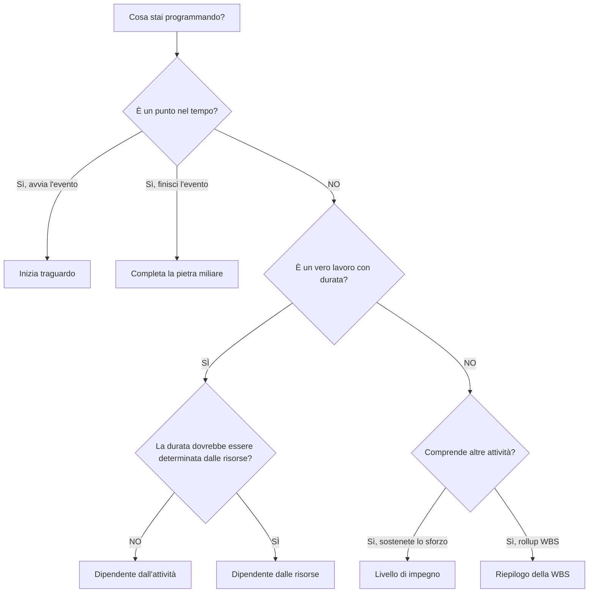

Il Tipo di attività è uno dei campi di configurazione più importanti in Primavera P6. Indica a P6 che tipo di attività sta calcolando e come tale attività dovrebbe comportarsi nella pianificazione.

Molti pianificatori si concentrano innanzitutto su nomi, durate, date e relazioni delle attività. Questi sono essenziali, ma anche il tipo di attività conta. Un'attività attività, un'attività cardine, un'attività Livello di impegno e un'attività Riepilogo WBS non si comportano allo stesso modo. La scelta del tipo sbagliato può distorcere date, avanzamento, caricamento delle risorse, float e reporting.

Lo scopo di questo blog è spiegare i principali tipi di attività disponibili in P6, a cosa serve ciascuno e come decidere quale tipo si adatta al lavoro pianificato.

## Perché il tipo di attività è importante

Un tipo di attività deve corrispondere allo scopo di pianificazione dell'elemento. È un vero lavoro con una durata? È un punto nel tempo? È una sintesi del lavoro che abbraccia altre attività? Lo sforzo dipende dalle risorse piuttosto che dalla durata fissa dell'attività?

Se il tipo di attività non corrisponde allo scopo, la pianificazione può creare confusione. Una pietra miliare con durata non è una pietra miliare. Una normale attività utilizzata come riepilogo può nascondere la logica. Un'attività di livello di impegno utilizzata per guidare il lavoro può distorcere il percorso critico. Un'attività dipendente dalle risorse utilizzata in modo errato può essere calcolata in modo diverso rispetto a quanto previsto.

In P6, il tipo di attività aiuta a rispondere a una domanda pratica: come dovrebbe comportarsi questo elemento quando viene calcolata la pianificazione?

## I principali tipi di attività in P6

I tipi di attività più comuni del Primavera P6 sono:

- Dipendente dall'attività.
- Dipendente dalle risorse.
- Livello di impegno.
- Inizia traguardo.
- Completa la pietra miliare.
- Riepilogo della WBS.

Ognuno ha uno scopo diverso.

## Attività dipendenti dalle attività

Dipendente dall'attività è il tipo di attività più comune in P6. Utilizzalo per il normale lavoro pianificato in cui la durata dell'attività è controllata dal calendario assegnato all'attività, non dai calendari delle singole risorse.

Gli esempi includono:

- Scavare le fondamenta.
- Installare il portacavi.
- Versare la lastra di cemento.
- Preparare il pacchetto di progettazione.
- Eseguire il test di pressione.

Le attività dipendenti dalle attività rappresentano in genere la scelta migliore per la maggior parte delle attività di costruzione, ingegneria, approvvigionamento, test e messa in servizio. Sono chiari, stabili e facili da capire. Lo scheduler definisce la durata, assegna il calendario delle attività, collega la logica e P6 calcola le date.

Utilizzare Dipendente da attività quando l'attività rappresenta un ambito di lavoro distinto e la durata del lavoro non deve cambiare in base ai calendari delle risorse.

## Attività dipendenti dalle risorse

Le attività dipendenti dalle risorse vengono utilizzate quando la durata e il comportamento di pianificazione devono essere influenzati dalle risorse assegnate all'attività. In questo caso, P6 può utilizzare i calendari delle risorse e la disponibilità delle risorse per calcolare la modalità di pianificazione dell'attività.

Ciò può essere utile quando la disponibilità delle risorse è un vero motore del lavoro. Ad esempio, un equipaggio specializzato, un ispettore o una risorsa attrezzatura potrebbero essere disponibili solo in determinati giorni o turni.

Gli esempi possono includere:

- Ispezione specializzata da parte di un ispettore limitato.
- Supporto tecnico del venditore.
- Calibrazione delle apparecchiature utilizzando una risorsa scarsa.
- Lavori di manutenzione basati sulle risorse.

Le attività dipendenti dalle risorse devono essere utilizzate con cautela. Se il progetto non è attivamente caricato o livellato in termini di risorse, l'uso abituale del metodo dipendente dalle risorse può creare confusione. Molte pianificazioni utilizzano Dipendente da attività come impostazione predefinita perché il calendario delle attività è la base di pianificazione principale.

Utilizzare Dipendente dalle risorse quando si intende che le risorse e i relativi calendari influenzino il calcolo della pianificazione.

## Inizia traguardo

Un traguardo iniziale è un'attività di durata zero che rappresenta l'inizio di un evento, fase, finestra di accesso, autorizzazione o condizione di lavoro importante.

Gli esempi includono:

- Avviso di procedere ricevuto.
- Accesso all'area concesso.
- Inizio della costruzione.
- Pacchetto di progettazione rilasciato per l'esecuzione.
- Avvia la finestra di messa in servizio.

Le tappe iniziali non rappresentano il lavoro svolto. Rappresentano un punto nel tempo che consente l'inizio del lavoro o segna un evento di inizio significativo.

Utilizza una tappa iniziale quando il programma deve segnare l'inizio di qualcosa di importante. Normalmente dovrebbe essere collegato alla logica che spiega cosa guida la pietra miliare e quale lavoro rilascia.

## Completa la pietra miliare

Un traguardo finale è un'attività di durata zero che rappresenta il completamento di un evento, fase, risultato finale o punto contrattuale.

Gli esempi includono:

- Completamento meccanico raggiunto.
- Turnover del sistema completato.
- Approvazione del permesso ricevuta.
- Completamento sostanziale.
- Completamento finale.

I traguardi finali sono utili per i report perché contrassegnano i risultati raggiunti. Non devono essere utilizzati come normali attività lavorative. Se è necessario uno sforzo per raggiungere il traguardo, tale sforzo dovrebbe essere modellato come compiti che conducono al traguardo.

Utilizza una pietra miliare finale quando il programma deve contrassegnare che qualcosa è stato completato o raggiunto.

## Livello di impegno

Il livello di impegno, spesso chiamato LOE, viene utilizzato per attività che abbracciano altri lavori anziché guidare direttamente il progetto. Le attività LOE sono comunemente utilizzate per la gestione, la supervisione, il supporto alle ispezioni, i controlli di progetto o il coordinamento continuo.

Gli esempi includono:

- Supporto alla gestione del progetto.
- Supervisione del sito.
- Gestione ingegneristica.
- Gestione della costruzione.
- Supporto al controllo qualità.

Un'attività LOE normalmente deriva le sue date da altre attività. Dovrebbe rappresentare lo sforzo di supporto che continua mentre sono in corso altri lavori. Di solito non è inteso come motore di compiti di costruzione o ingegneria discreti.

Utilizzare LOE quando l'attività rappresenta supporto, supervisione o gestione continua che dovrebbe estendersi a un gruppo di attività.

Fai attenzione alla logica LOE. Se un LOE è collegato in modo errato, potrebbe sembrare che guidi le date o distorca il float. Le attività LOE dovrebbero essere riviste durante i controlli di qualità della pianificazione, soprattutto quando compaiono sul percorso critico o presentano relazioni FS o SF insolite.

## Riepilogo della WBS

Le attività di riepilogo della WBS riepilogano un gruppo di attività all'interno di un elemento della WBS. Le loro date derivano dalle attività previste dalla WBS, non dalla loro logica dettagliata.

Gli esempi includono:

- Riepilogo di ingegneria.
- Riepilogo degli appalti.
- Area Una sintesi della costruzione.
- Riepilogo della messa in servizio del sistema 01.

Le attività di riepilogo della WBS possono essere utili per il reporting di alto livello, ma non devono sostituire le attività o la logica reali. Sono strumenti di rollup, non attività di esecuzione.

Utilizzare le attività di riepilogo della WBS quando è necessaria una visualizzazione a livello di riepilogo di una sezione della WBS e solo quando il metodo di reporting del progetto ne supporta l'utilizzo.

## Scegliere il tipo giusto

Una semplice regola aiuta:

- Se si tratta di un vero lavoro con durata, utilizza Dipendente dall'attività a meno che i calendari delle risorse non lo debbano guidare.
- Se la disponibilità delle risorse dovrebbe determinarlo, utilizzare Dipendente dalle risorse.
- Se si tratta di un evento di inizio, utilizza Start Milestone.
- Se si tratta di un evento di completamento, utilizza Finish Milestone.
- Se si tratta di un supporto continuo che abbraccia altri lavori, utilizzare il Livello di impegno.
- Se si tratta di un reporting cumulativo, utilizzare il riepilogo WBS.

Il tipo di attività dovrebbe rendere il programma più facile da comprendere. Se i revisori devono chiedere perché un traguardo ha una durata, perché un LOE guida il lavoro o perché un riepilogo WBS viene visualizzato in una logica dettagliata, il tipo di attività potrebbe essere sbagliato.

## Errori comuni

Un errore comune è utilizzare le pietre miliari come sostituti del lavoro. Una pietra miliare dovrebbe segnare un punto nel tempo. Se è richiesto lavoro, creare attività per il lavoro.

Un altro errore è utilizzare le attività LOE per controllare il lavoro discreto. LOE dovrebbe supportare o estendere il lavoro, non sostituire la logica tra attività reali.

Un terzo errore è l'utilizzo di Resource Dependent senza un processo di pianificazione basato sulle risorse. Se i calendari delle risorse non vengono mantenuti, il tipo di attività può creare più confusione che valore.

Infine, evitare di utilizzare le attività di riepilogo della WBS come sostituto di una WBS ben costruita e di una logica dettagliata. I riepiloghi sono utili per la reportistica, ma il programma necessita comunque di attività reali sottostanti.

## Conclusione

I tipi di attività in P6 definiscono il comportamento delle attività. Non sono solo etichette. Il giusto tipo di attività aiuta a calcolare correttamente il programma e a comunicare in modo chiaro.

Le attività dipendenti dalle attività rappresentano la maggior parte del lavoro normale. Le attività dipendenti dalle risorse sono utili quando i calendari delle risorse devono controllare la pianificazione. Le tappe di inizio e fine segnano i punti chiave nel tempo. Le attività del Livello di impegno rappresentano il supporto che abbraccia altri lavori. Le attività di riepilogo della WBS supportano il reporting di rollup.

La scelta del tipo di attività corretto rende la pianificazione più semplice da rivedere, più semplice da spiegare e più affidabile per i controlli del progetto. Un programma forte non ha solo buone date e logica. Utilizza anche il giusto tipo di attività per l'opera rappresentata.
