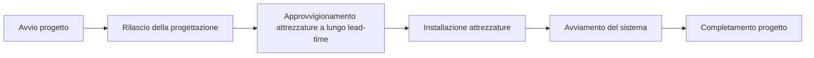

Il percorso critico (critical path) è la sequenza più lunga di attività dipendenti in un programma. Determina la durata minima possibile del progetto e definisce direttamente la data di fine progetto.

In termini pratici, il percorso critico è la catena di attività che non può subire ritardi senza influenzare la scadenza finale. Se un'attività del percorso critico slitta e tutto il resto rimane invariato, anche la data di completamento del progetto slitterà.

Ecco perché il percorso critico è uno degli output più importanti di un programma Primavera P6. Non è solo un filtro, un colore o un report. È la spiegazione del programma su ciò che sta guidando il completamento.

## Cosa significa il percorso critico

Un programma contiene molte attività, ma non tutte hanno lo stesso impatto sulla data di fine. Alcune attività hanno float. Possono spostarsi un po' prima di influenzare l'attività successiva o la data di fine progetto. Le attività critiche non hanno questa flessibilità, o ne hanno la minima a seconda del metodo e delle impostazioni del programma.

Il percorso critico mostra il tempo minimo necessario per completare il progetto sulla base della logica, delle durate, dei calendari, dei vincoli e dello stato attuale.

Se questa è la catena di controllo, un ritardo negli approvvigionamenti può ritardare l'installazione. Un ritardo nell'installazione può ritardare l'avviamento. Un ritardo nell'avviamento può ritardare il completamento del progetto. Il percorso critico aiuta il team a vedere questa connessione.

## È la catena che non si può ritardare

Il percorso critico non è semplicemente il lavoro che sembra importante. È la sequenza dipendente di lavoro che definisce la data di fine.

Questa distinzione è importante. Un'attività ad alto valore potrebbe non essere critica se ha float. Una milestone visibile al cliente potrebbe non essere critica se un altro percorso sta guidando il completamento. Una piccola attività tecnica può essere critica se si trova nell'unica catena che porta alla consegna finale.

Per i team di project controls, questo rende il percorso critico uno strumento decisionale. Aiuta a rispondere a:

- Cosa sta guidando la data di fine progetto?
- Quali attività richiedono maggiore attenzione al programma?
- Dove un ritardo influenzerebbe immediatamente il completamento?
- Quali azioni di recupero potrebbero proteggere la data di fine?
- Il percorso riportato ha senso?

L'ultima domanda è quella che i programmisti non dovrebbero mai saltare.

## Non accettare ciecamente il filtro critico

Primavera P6 può identificare le attività critiche, ma il software non comprende l'intento del progetto. Calcola sulla base dei dati forniti: logica, calendari, vincoli, durate, avanzamento e opzioni di programmazione.

Se i dati sono deboli, il percorso critico può sembrare strano.

Attività o milestone possono comparire nel filtro critico anche se non stanno realmente guidando il progetto. Ciò può accadere a causa di logica mancante, vincoli rigidi (hard constraints), date non aggiornate, estremità aperte (open ends), calendari insoliti, float negativo, stato errato o impostazioni della logica mantenuta (retained logic).

Il programmista deve esercitare il giudizio professionale. Il percorso critico deve essere messo in discussione. Deve sembrare ragionevole. Deve raccontare una storia che il team di progetto riconosca.

Se il percorso indica che il completamento finale è guidato da una milestone amministrativa senza un vero lavoro a valle, occorre metterlo in discussione. Se il percorso inizia con una milestone che non controlla effettivamente l'esecuzione, occorre metterlo in discussione. Se il percorso salta tra aree WBS non correlate senza una chiara interfaccia, occorre metterlo in discussione.

Il percorso critico è buono solo quanto il modello di programma che lo sostiene.

## Programmi di riferimento e percorso critico

In un programma che non è mai stato aggiornato, come un primo baseline, il percorso critico spesso inizia con la milestone di avvio progetto e termina con la milestone di completamento progetto.

È comune, ma non è una regola scritta nella pietra.

Alcuni progetti hanno un percorso critico che inizia da una milestone intermedia chiave. Ad esempio, la costruzione potrebbe non poter iniziare fino a quando il committente non consegna un'area, non viene rilasciato un permesso, o un pacchetto progettuale non raggiunge lo stato approvato. In tal caso, la milestone di consegna o rilascio può innescare l'avvio del percorso di controllo.

La stessa idea si applica verso la fine del progetto. Il percorso critico può terminare al completamento finale, ma può anche guidare una milestone contrattuale intermedia, una fase di consegna, il turnover di un sistema o una data di accesso del cliente che è attualmente più restrittiva.

La cosa importante non è se il percorso inizia e termina nel posto più tradizionale. La cosa importante è se il percorso è logico, completo e difendibile.

## Programmi in corso di esecuzione

Una volta che un programma è in corso di esecuzione, il percorso critico cambia forma. Il lavoro completato non dovrebbe più guidare il completamento futuro. Il percorso dovrebbe iniziare dal confine dello stato attuale.

In un programma aggiornato, il percorso critico spesso inizia con un'attività attualmente in corso, un'attività non iniziata pronta a cominciare, o una milestone valida che controlla l'accesso al lavoro futuro. Può anche iniziare da una milestone di interfaccia o di consegna quando quell'evento sta genuinamente guidando il prossimo lavoro critico.

È qui che la Data di Aggiornamento (Data Date) è importante. La Data di Aggiornamento separa le prestazioni effettive dal lavoro previsto. Un percorso critico dopo la Data di Aggiornamento dovrebbe spiegare come il lavoro residuo porta al completamento.

Se il percorso inizia con un'attività che non ha logica trainante, un avvio alla Data di Aggiornamento non spiegato, o una milestone discutibile, il revisore dovrebbe indagare. Il programma potrebbe mostrare un percorso calcolato, ma non necessariamente un percorso credibile.

## Attenzione alle milestone

Le milestone sono utili perché marcano punti chiave: ordine di inizio lavori (notice to proceed), consegna dell'area, approvazione progettuale, completamento meccanico, turnover del sistema, completamento sostanziale e completamento finale.

Ma le milestone possono anche fuorviare una revisione del percorso critico.

Una milestone può sembrare critica perché ha un vincolo. Può sembrare critica perché non ha durata e si trova a un confine di data. Può sembrare critica perché la logica attorno ad essa è mancante. Ciò non significa automaticamente che la milestone faccia davvero parte della catena esecutiva di controllo.

Prestare particolare attenzione quando il percorso critico inizia con una milestone. Chiedersi:

- Questa milestone rappresenta un vero evento di controllo?
- Quale attività o condizione esterna guida la milestone?
- Quale lavoro viene rilasciato dalla milestone?
- La milestone è vincolata piuttosto che guidata dalla logica?
- Il percorso sarebbe ancora critico se la logica della milestone venisse corretta?

Se la milestone non controlla il lavoro, non dovrebbe essere autorizzata a definire la storia del percorso critico.

## La logica mantenuta può cambiare la storia

La logica mantenuta (retained logic) è un'impostazione di Primavera P6 usata per gestire l'avanzamento fuori sequenza. Può essere appropriata, ma può anche influenzare il percorso critico in modi che i revisori devono comprendere.

Quando viene usata la logica mantenuta, P6 può preservare la logica del predecessore anche quando il lavoro del successore è già iniziato fuori sequenza. Ciò può causare che il lavoro residuo venga trattenuto o sequenziato in un modo che cambia il percorso critico calcolato.

Il problema non è che la logica mantenuta sia sempre sbagliata. Il problema è che il programmista deve capire se sta producendo una previsione realistica.

Se la logica mantenuta fa sì che il percorso critico passi attraverso relazioni che non riflettono più come il lavoro viene eseguito, il team dovrebbe esaminare lo stato, la logica e le opzioni di programmazione. Il percorso dovrebbe riflettere un piano residuo difendibile, non solo un calcolo meccanico.

## Come esaminare il percorso critico

Una buona revisione del percorso critico dovrebbe combinare l'output di P6 con il giudizio di programmazione.

Iniziare generando il report del percorso più lungo o del percorso critico. Poi esaminare il percorso attività per attività. Guardare predecessori, successori, tipi di relazione, lag, vincoli, calendari, date effettive, durata residua e float totale.

Chiedersi se il percorso ha senso:

- Il percorso segue una sequenza esecutiva credibile?
- Inizia da un driver corrente valido?
- Termina alla corretta milestone di completamento o di controllo?
- I vincoli stanno forzando il percorso?
- Le relazioni mancanti stanno nascondendo il vero driver?
- La logica mantenuta sta influenzando il percorso in modo fuorviante?
- Il team di progetto riconosce questo come il lavoro di controllo?

Se la risposta è no, il programma deve essere revisionato prima che il percorso critico possa essere utilizzato con fiducia.

## Conclusione

Il percorso critico è la sequenza di attività dipendenti che definisce la data di fine progetto. Mostra il tempo minimo necessario per completare il progetto e identifica il lavoro che non può slittare senza influenzare la scadenza.

Ma il percorso critico non è qualcosa da accettare ciecamente. P6 calcola ciò che i dati gli dicono di calcolare. Il programmista deve verificare se il risultato è ragionevole, logico e allineato con il piano esecutivo reale.

In un programma solido, il percorso critico racconta una storia chiara. Inizia da un driver corrente valido, segue dipendenze reali, evita vincoli fuorvianti, gestisce correttamente l'avanzamento e porta alla corretta milestone di completamento.

Quando questa storia ha senso, il percorso critico diventa uno degli strumenti più potenti nel controllo di progetto. Quando non lo ha, è un avvertimento che il programma necessita di ulteriore revisione prima che la previsione possa essere considerata affidabile.
