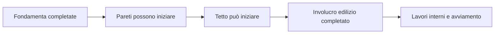
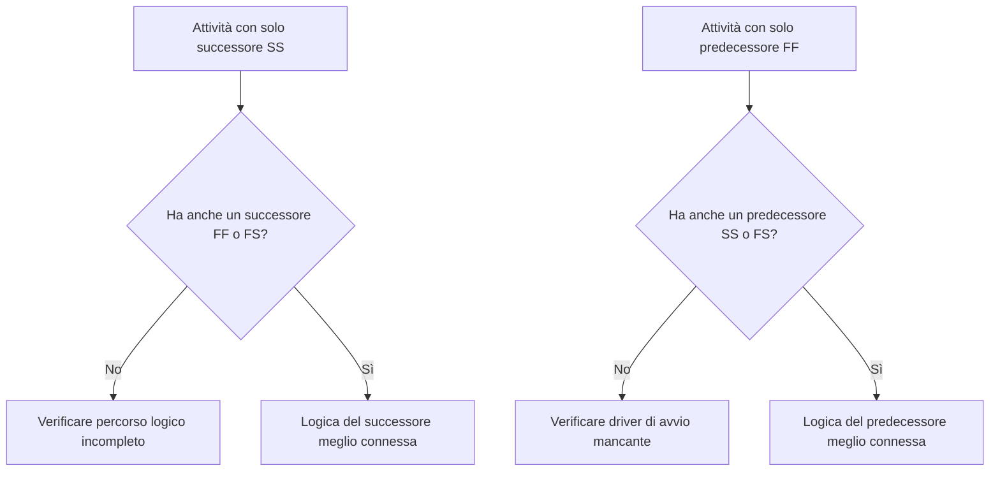

La logica è la rappresentazione matematica del sequenziamento e delle dipendenze all'interno di un programma di progetto. Spiega cosa deve accadere prima di cosa, quali attività possono avvenire contemporaneamente e come il team di progetto intende muoversi dalla prima attività al completamento finale.

In un buon programma Primavera P6, la logica non è un elemento decorativo. È il motore che consente al programma di calcolare date, float, percorso critico e movimenti della previsione. Racconta la storia dell'esecuzione in un modo che può essere revisionato, messo in discussione e migliorato.

Se il programma dice "gettare le fondamenta, poi costruire le pareti, poi costruire il tetto," è la logica che trasforma quella sequenza in una rete calcolabile. Il pianificatore non sta solo disegnando una timeline. Il pianificatore sta definendo il percorso di consegna.

## La logica racconta la storia del lavoro

Ogni team di progetto ha un modo intenzionale per eseguire il progetto. L'ingegneria può rilasciare la progettazione per area. Gli approvvigionamenti possono consegnare le attrezzature per pacchetto. I lavori civili possono preparare l'accesso prima che inizino i lavori strutturali. Il completamento meccanico può dover avvenire prima che possa iniziare l'avviamento.

I legami logici (logic links) sono l'espressione matematica di quel piano.

Questo semplice diagramma non è solo una sequenza. È un modello decisionale. Se le fondamenta sono in ritardo, le pareti potrebbero essere in ritardo. Se le pareti sono in ritardo, il tetto potrebbe essere in ritardo. Se il tetto è in ritardo, i lavori interni potrebbero essere influenzati. Il programma può mostrare quell'impatto solo se la logica è presente.

Una logica robusta significa che il programma può spiegare perché le attività iniziano, perché terminano, e cosa accade quando una parte del piano si sposta.

## Perché la logica robusta è importante alla Data di Aggiornamento

La metrica "Attività che iniziano alla Data di Aggiornamento senza logica trainante" è un test efficace della qualità del programma.

La Data di Aggiornamento (Data Date) è il confine tra le prestazioni effettive e il lavoro previsto. Quando un'attività inizia esattamente alla Data di Aggiornamento, il revisore dovrebbe porre una domanda semplice: cosa sta guidando questo avvio?

Se l'attività ha una logica predecessore valida, il programma può spiegare l'avvio. Forse un'area è stata rilasciata. Forse una consegna di materiali è stata completata. Forse l'attività predecessore è terminata e ha consentito alla squadra successiva di iniziare.

Se l'attività non ha logica trainante, l'avvio è più debole. L'attività può trovarsi alla Data di Aggiornamento perché non ha un predecessore, perché la logica è incompleta, perché un vincolo la sta forzando, o perché l'aggiornamento non è stato completamente inserito.

Ecco perché la logica robusta è importante. Un programma non dovrebbe consentire al lavoro di apparire pronto solo perché la Data di Aggiornamento è stata spostata. Dovrebbe mostrare la reale condizione che consente al lavoro di iniziare.

## L'equilibrio: logica sufficiente, non logica ridondante

Una buona logica è equilibrata. Il programma necessita di relazioni sufficienti per connettere correttamente le attività ai predecessori e ai successori. Allo stesso tempo, dovrebbe evitare logica ridondante che ripete la stessa dipendenza in modi non necessari.

Troppa poca logica crea avvii aperti (open starts), completamenti aperti (open finishes), float inaffidabile e risultati del percorso critico deboli. Troppa logica può rendere la rete difficile da revisionare e può nascondere il vero driver di un'attività.

L'obiettivo non è massimizzare il numero di relazioni. L'obiettivo è rappresentare chiaramente le dipendenze obbligatorie e richieste.

Per ogni attività, il programmista dovrebbe essere in grado di rispondere:

- Cosa consente a questa attività di iniziare?
- Cosa abilita questa attività a seguire?
- Quale relazione sta realmente guidando l'attività?
- Qualche relazione è duplicata o non necessaria?
- Un revisore capirebbe la sequenza prevista?

Questo equilibrio è centrale nelle revisioni dei programmi PMO. Una rete densa non è automaticamente una rete solida. Una rete leggera non è automaticamente una rete pulita. La rete giusta spiega il piano esecutivo senza ridondanze.

## Ogni attività ha bisogno di un driver di avvio

Una logica robusta significa che ogni attività ha un predecessore che consente o innesca il suo avvio, tranne per valide eccezioni di avvio progetto o autorizzate esternamente.

Per un'attività di costruzione, il driver di avvio può essere l'accesso all'area, il completamento del predecessore, la disponibilità del materiale, il rilascio della progettazione, l'approvazione del permesso o il completamento della lavorazione precedente. Per un'attività di approvvigionamento, può essere l'approvazione della progettazione o il rilascio dell'ordine di acquisto. Per l'avviamento, può essere il completamento meccanico, la prontezza del pacchetto di test o il turnover del sistema.

Quando questo driver di avvio è mancante, l'attività può flottare verso una posizione artificiale nel programma. Durante gli aggiornamenti, può apparire alla Data di Aggiornamento. Ciò crea una falsa sensazione di prontezza operativa.

Si consideri un'attività denominata "Installazione Pompe". Se inizia alla Data di Aggiornamento ma non ha alcun predecessore per il completamento delle fondamenta, la consegna delle pompe o la consegna dell'area, il programma non sta spiegando perché l'installazione può iniziare. L'attività può essere pianificata, ma la logica non è robusta.

## SS e FF sono relazioni "dimezzate"

Le relazioni Inizio-a-Inizio (Start-to-Start, SS) e Fine-a-Fine (Finish-to-Finish, FF) sono utili, ma dovrebbero essere usate con attenzione. In molte revisioni di programmi, vengono meglio intese come relazioni "dimezzate" perché da sole non collocano completamente l'attività in un percorso logico completo.

Una relazione SS può spiegare quando un'attività può iniziare, ma potrebbe non spiegare quando l'attività deve terminare o cosa consegna. Una relazione FF può spiegare l'allineamento del completamento, ma potrebbe non spiegare quando l'attività è autorizzata a iniziare.

Ciò non rende SS o FF errate. Il lavoro sovrapposto è comune e spesso realistico. Il problema è se l'attività è completamente connessa.

Per esempio:

- Un'attività con un successore SS dovrebbe di solito avere anche un successore FF o FS.
- Un'attività con un predecessore FF dovrebbe di solito avere anche un predecessore SS o FS.

Questo aiuta a prevenire che le attività siano connesse solo a un lato della loro durata. Il programma dovrebbe spiegare sia come il lavoro inizia sia come il lavoro termina.

## Logica robusta nella pratica

Una revisione logica pratica dovrebbe iniziare con le attività vicino alla Data di Aggiornamento, il lavoro critico e quasi critico, e i percorsi principali di consegna. Queste aree hanno il maggior impatto sulle decisioni correnti.

In P6, le colonne utili per la revisione includono ID Attività, Nome Attività, WBS, Inizio, Fine, Stato Attività, Float Totale, predecessori, successori, tipo di relazione, lag, vincoli, calendario e indicatori di relazione trainante, se disponibili.

Per ogni attività che inizia alla Data di Aggiornamento, chiedersi:

- L'attività è davvero pronta per iniziare?
- Quale predecessore consente l'avvio?
- Quel predecessore è completato, in corso o previsto?
- La relazione è trainante?
- Un vincolo o una data prevista sta sostituendo la logica?
- L'attività ha anche una logica successore valida?

Se la risposta non è chiara, l'attività dovrebbe essere revisionata con il responsabile. La correzione può consistere nell'aggiungere un predecessore mancante, nel cambiare il tipo di relazione, nel rimuovere un vincolo, nell'aggiornare i dati effettivi o nel documentare un'eccezione valida.

## Evitare la logica artificiale

Un errore è aggiungere relazioni solo per superare una metrica. Ciò non crea logica robusta. Crea logica artificiale.

Le relazioni dovrebbero rappresentare dipendenze reali. Se un legame non riflette la sequenza costruttiva, il rilascio dell'ingegneria, la necessità di approvvigionamento, l'accesso, l'approvazione, il collaudo, l'avviamento o la consegna, potrebbe non appartenere alla rete.

Un altro errore è lasciare logica ridondante perché sembra più sicura. Se la stessa dipendenza è già rappresentata da una relazione più chiara, i legami extra possono confondere il percorso critico e rendere la rete più difficile da verificare.

Una logica robusta è chiara, intenzionale e difendibile.

## Conclusione

La logica è la storia matematica di come verrà eseguito il progetto. Definisce cosa deve accadere prima, cosa può accadere insieme e cosa segue dopo.

Una logica robusta non significa aggiungere il maggior numero possibile di legami. Significa aggiungere i legami giusti: abbastanza da connettere ogni attività a predecessori e successori reali, ma non così tanti da rendere la rete ridondante o fuorviante.

Quando le attività iniziano alla Data di Aggiornamento senza logica trainante, il programma sta esponendo una debolezza in quella storia. L'attività può essere mostrata come pronta, ma la rete non spiega perché.

Un programma affidabile dovrebbe rispondere chiaramente a quella domanda. Cosa consente a questo lavoro di iniziare? Cosa abilita successivamente? Se il programma può rispondere ad entrambe, la logica sta diventando robusta. Se non può, il team di progetto ha ancora del lavoro di sequenziamento da fare prima che la previsione possa essere considerata affidabile.
