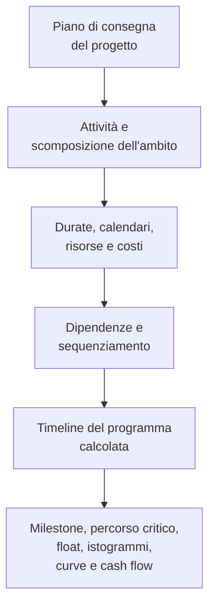

Un programma di progetto è molto più di un elenco di date. È una rappresentazione grafica e logica del piano di consegna del progetto. Spiega come il progetto verrà eseguito dall'inizio alla fine, come si collegano i pacchetti di lavoro, quando devono essere raggiunti i principali traguardi (milestone) e quali informazioni il team di progetto dovrebbe utilizzare per prendere decisioni.

In termini semplici, il programma trasforma il piano di progetto in una roadmap. Aiuta tutti i soggetti coinvolti a capire cosa deve essere fatto, quando deve accadere e chi è responsabile di farlo accadere. Per i project manager, i pianificatori, i team di costruzione, gli ingegneri, i responsabili degli acquisti e i revisori PMO, il programma diventa uno dei principali strumenti di coordinamento e controllo.

Il programma è una timeline, ma non è solo una timeline. Un programma debole può mostrare delle date. Un programma solido spiega perché quelle date sono credibili.

## Il programma come roadmap di consegna

Ogni progetto inizia con un obiettivo. Il team sa cosa deve essere consegnato: un edificio, un impianto, un sistema industriale, uno shutdown, un'infrastruttura o un pacchetto di lavoro. Ma la consegna richiede più della conoscenza dell'obiettivo finale. Il team deve comprendere la sequenza.

Cosa viene prima? Cosa può avvenire in parallelo? Cosa deve attendere l'approvazione progettuale, la consegna dei materiali, l'accesso all'area, il rilascio del permesso, il collaudo o la presa in consegna? Quali attività controllano la data di fine? Quali milestone sono più importanti per il cliente?

Un programma risponde a queste domande convertendo il piano in attività, durate, dipendenze, calendari, risorse, costi e milestone.

La timeline grafica è utile perché le persone possono vedere il lavoro. La rete logica è utile perché il software può calcolare il lavoro. Insieme, permettono al programma di diventare sia uno strumento di comunicazione sia uno strumento di controllo.

## Cosa alimenta il programma

Un programma è affidabile solo quanto le informazioni utilizzate per costruirlo. In Primavera P6, il programma è alimentato da diversi input principali.

Il primo input è l'elenco delle attività. Le attività suddividono il progetto in parti di lavoro gestibili. Ogni attività deve essere sufficientemente chiara da poter essere pianificata, aggiornata e misurata.

Il secondo input è la durata deterministica. È il tempo lavorativo pianificato necessario per completare ogni attività. La durata deve riflettere il metodo esecutivo, le ipotesi di produttività, la dimensione delle squadre, l'accesso, i vincoli di cantiere e le condizioni di progetto.

Il terzo input è la logica delle dipendenze. Le dipendenze spiegano come le attività si relazionano tra loro. Un'attività potrebbe dover finire prima che un'altra inizi. Due attività possono iniziare insieme. Due completamenti possono dover essere allineati. Queste relazioni creano la rete CPM.

Il quarto input è il sequenziamento. Il sequenziamento è l'ordine pratico di esecuzione. Considera la costruibilità, il flusso dell'ingegneria, i tempi degli approvvigionamenti, l'accesso, la logica di avviamento, la strategia di consegna e le priorità del cliente.

Il quinto input sono le risorse e i costi. Il caricamento delle risorse permette al programma di mostrare la domanda di manodopera, attrezzature e materiali nel tempo. Il caricamento dei costi permette al programma di supportare il cash flow, il valore guadagnato (earned value) e le previsioni finanziarie.

Quando questi input sono completi e realistici, il programma può produrre output utili.

## Cosa ci dice il programma

Un programma ben costruito indica la durata complessiva del progetto. Mostra le milestone di completamento pianificate e i deliverable intermedi. Produce istogrammi di risorse che mostrano quando la domanda di manodopera o attrezzature aumenta e diminuisce. Supporta le curve di avanzamento, le curve di cash flow, il reporting del valore guadagnato e la pianificazione a breve termine (lookahead).

Soprattutto, identifica il percorso critico (critical path) o il percorso più lungo (longest path). Questa è la catena di lavoro che guida la data di fine progetto. Se le attività su quel percorso slittano, la data di completamento del progetto potrebbe slittare. Ecco perché la logica è così importante. Senza buone dipendenze, il percorso critico potrebbe non mostrare i veri driver del progetto.

Il float è un altro output importante. Il float indica di quanta flessibilità dispone un'attività prima di influenzare un'altra attività o la data di fine progetto. Ma il float ha senso solo quando la rete del programma è completa. Se le attività hanno logica mancante, il float può sembrare migliore o peggiore della realtà.

## Perché la logica rende la timeline credibile

È qui che la metrica "Attività che iniziano alla Data di Aggiornamento senza logica trainante" diventa importante.

La Data di Aggiornamento (Data Date) in P6 è il confine tra le prestazioni effettive e la previsione. Tutto ciò che precede la Data di Aggiornamento deve rappresentare ciò che è già accaduto. Tutto ciò che segue la Data di Aggiornamento deve rappresentare il piano da questo momento in avanti.

Quando le attività iniziano esattamente alla Data di Aggiornamento senza alcuna logica che le guidi, il programma sta inviando un segnale di avvertimento. Può sembrare che il lavoro sia pronto per iniziare immediatamente, ma il programma potrebbe non essere in grado di spiegare perché. Potrebbe non esserci alcun predecessore che mostri che l'area è disponibile, nessun collegamento alla consegna dei materiali, nessun legame con l'approvazione progettuale, nessuna connessione al rilascio dell'ispezione e nessuna logica dal lavoro precedente.

Questo è importante perché un programma non dovrebbe semplicemente posizionare il lavoro in una data. Dovrebbe spiegare il percorso verso quella data.

Se un'attività inizia alla Data di Aggiornamento perché tutto il lavoro predecessore richiesto è completato e la logica supporta l'avvio, la data è difendibile. Se inizia lì perché l'attività è aperta, non guidata, vincolata o non correttamente aggiornata, la data è debole. Il team di progetto può credere che il lavoro sia pronto quando le reali condizioni abilitanti non sono state modellate.

## Un esempio pratico

Immagina un programma di progetto con una Data di Aggiornamento del 01 giugno. Dopo l'aggiornamento, diverse attività iniziano il 01 giugno:

- Installazione della passerella portacavi nell'Area B.
- Avvio del collaudo a pressione delle tubazioni.
- Inizio dell'allineamento delle apparecchiature.
- Mobilitazione della squadra di coibentazione.

A prima vista, il lookahead sembra affollato e pronto. Ma quando il programmista esamina la logica, il problema diventa chiaro. L'installazione della passerella portacavi non è collegata alla consegna dei materiali. Il collaudo a pressione non è collegato al completamento della tubazione. L'allineamento delle apparecchiature è privo del predecessore per il completamento meccanico. La mobilitazione della squadra di coibentazione non ha alcun predecessore di rilascio dell'accesso.

Il programma mostra il lavoro alla Data di Aggiornamento, ma non spiega perché il lavoro può iniziare. Non è una roadmap affidabile. È un elenco di intenzioni a breve termine.

La soluzione è aggiungere o correggere la reale logica CPM. Se la consegna dei materiali guida l'installazione della passerella portacavi, occorre collegarla. Se il completamento della tubazione guida il collaudo a pressione, occorre collegarla. Se il rilascio dell'accesso guida la coibentazione, bisogna modellare quella condizione. Dopo il ricalcolo, alcune attività potrebbero ancora iniziare vicino alla Data di Aggiornamento, ma ora il programma può spiegare perché.

## Cosa dovrebbe fare un buon programma

Un buon programma dovrebbe aiutare il team a vedere il piano, verificarlo e gestirlo.

Dovrebbe mostrare cosa deve essere fatto. Dovrebbe spiegare l'ordine del lavoro. Dovrebbe identificare chi deve agire e quando. Dovrebbe rivelare il percorso critico. Dovrebbe supportare la pianificazione delle risorse, la misurazione dell'avanzamento, la previsione del cash flow e il reporting PMO.

Dovrebbe anche rendere visibili i punti deboli. La logica mancante, i vincoli rigidi, le date non aggiornate, gli inizi aperti (open starts), i completamenti aperti (open finishes) e le attività che si raggruppano alla Data di Aggiornamento non sono solo problemi tecnici. Influenzano il modo in cui il team di progetto comprende la prontezza operativa, il rischio e il controllo.

## Conclusione

Un programma è il piano di consegna del progetto espresso come tempo, logica e lavoro misurabile. È una roadmap, un modello di calcolo e uno strumento di comunicazione.

Quando è ben costruito, dice al team di progetto cosa deve accadere, quando deve accadere e perché le date sono credibili. Quando le attività iniziano alla Data di Aggiornamento senza logica trainante, quella credibilità viene meno. Il programma smette di spiegare il piano e inizia a indovinare il passo successivo.

Per questo motivo, le revisioni della qualità del programma dovrebbero sempre porre una domanda semplice: il programma spiega perché il lavoro inizia quando inizia? Se la risposta è sì, il programma sta svolgendo il suo compito. Se la risposta è no, la roadmap ha bisogno di più logica prima di poter essere considerata affidabile.
