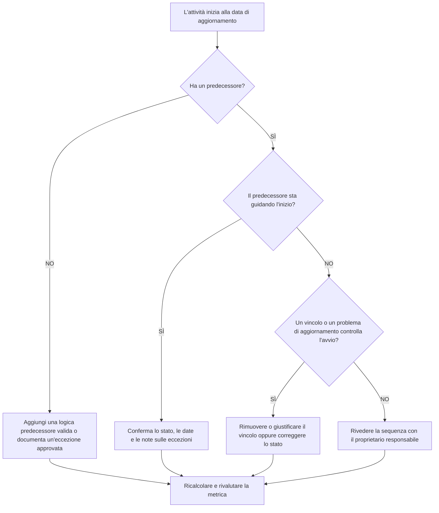

## Scopo

Questa guida aiuta gli addetti alla pianificazione e i team di controllo di progetto a ridurre o eliminare le attività pianificate per l'avvio alla data di aggiornamento Primavera P6 senza una logica precedente valida che guidi l'avvio. Si applica alle revisioni della qualità del cronoprogramma, ai controlli di integrità del PMO e alla convalida del ciclo di aggiornamento.

L'obiettivo è confermare che il lavoro a breve termine è supportato da una chiara logica CPM e che le attività non iniziano alla Data Data solo a causa di relazioni mancanti, vincoli, date manuali o aggiornamenti di avanzamento incompleti.

## Prima di iniziare

Raccogli le seguenti informazioni prima di agire:

- Risultato della valutazione attuale per questa metrica.
- Dati progetto Data utilizzata nell'ultimo calcolo della pianificazione.
- Elenco delle attività aperte o non avviate con data di inizio pari alla data di aggiornamento.
- Dettagli sulla relazione del predecessore e del successore per ciascuna attività.
- Vincoli, date previste, date effettive e assegnazioni di calendario.
- Opzioni di pianificazione P6 utilizzate per l'aggiornamento, inclusa la logica mantenuta o le impostazioni di override dell'avanzamento, ove pertinente.
- Qualsiasi eccezione approvata, come attività di avvio del progetto, tappe fondamentali dell'interfaccia esterna o avviamenti diretti dal proprietario.

## Comprendi il tuo risultato

Un risultato efficace è rappresentato da zero attività irrisolte che iniziano alla data di aggiornamento senza guidare la logica del predecessore. Ciò significa che il lavoro corrente e quello a breve termine sono collegati alla rete di pianificazione e la data di aggiornamento non nasconde la sequenza mancante.

Un risultato accettabile può includere un numero limitato di eccezioni documentate. Questi dovrebbero essere rivisti e approvati, non ignorati. Ad esempio, un'attività cardine con avviso di procedere o un'attività autorizzata esternamente potrebbe non richiedere un normale predecessore, ma il motivo dovrebbe essere visibile ai revisori.

Un risultato debole significa che più attività iniziano alla Data Data senza un chiaro driver logico. Ciò potrebbe indicare avvii aperti, relazioni con i predecessori mancanti, vincoli eccessivi, aggiornamenti di avanzamento incompleti o attività che non sono state risequenziate correttamente dopo l'ultimo aggiornamento.

## Obiettivo di miglioramento

L'obiettivo è 0 attività irrisolte a partire dalla data di aggiornamento senza logica determinante valida.

L’obiettivo del miglioramento non è solo ridurre il conteggio. L'obiettivo più profondo è garantire che ogni attività vicina alla Data Data abbia un motivo difendibile per l'inizio della previsione. Dopo la correzione, ciascuna attività interessata dovrebbe avere una logica precedente appropriata, un'eccezione documentata o una condizione di stato/data corretta.

## Piano d'azione

### Passaggio 1: identificare il problema principale

Creare un layout o un report P6 che filtri le attività aperte o non avviate con una data di inizio uguale alla data di aggiornamento. Includere colonne per ID attività, Nome attività, WBS, Inizio, Fine, Stato, Margine totale, Calendario, Vincolo primario, Predecessori, Successori e Indicatori di relazione determinante, se disponibili.

Rivedi ogni attività e chiedi:

- L’attività ha dei predecessori?
- Se esistono dei predecessori, sono davvero loro a dare l’avvio?
- L'attività è trattenuta o spostata da un vincolo?
- All'attività manca un effettivo aggiornamento sull'inizio o sullo stato di avanzamento?
- L'attività è un'eccezione valida, ad esempio una tappa fondamentale di avvio del progetto?
- L'attività appartiene ad un'area WBS in cui la logica è generalmente debole?

Raggruppare i risultati in cause pratiche: predecessori mancanti, predecessori che non guidano, vincoli o date previste, errori di aggiornamento/stato o eccezioni approvate.

### Passaggio 2: applicare le correzioni consigliate

Inizia con una logica mancante o debole. Aggiungi relazioni predecessore valide che rappresentano la sequenza reale del lavoro, ad esempio relazioni fine-inizio, inizio-inizio o fine-fine, ove appropriato. Evitare di aggiungere relazioni solo per soddisfare la metrica; ogni rapporto dovrebbe riflettere una reale dipendenza dalla costruzione, dall'ingegneria, dall'approvvigionamento, dall'accesso, dall'approvazione o dalla consegna.

Successivamente esaminare i vincoli. Se un'attività inizia alla data di aggiornamento a causa di un vincolo di inizio, verificare se il vincolo è contrattualmente o operativamente giustificato. Rimuovere i vincoli non necessari e consentire che l'attività sia guidata dalla logica. Se il vincolo è valido, documentarne il motivo e confermare che non distorce il percorso critico.

Controlla lo stato di avanzamento. Se il lavoro è già iniziato, aggiornare correttamente l'inizio effettivo e la durata rimanente. Se il lavoro non è iniziato, verificare che l'inizio previsto rimanga alla data di aggiornamento. Un'attività non dovrebbe apparire pronta per essere avviata semplicemente perché il ciclo di aggiornamento l'ha spostata alla data corrente.

Dopo aver apportato le modifiche, ricalcolare la pianificazione e rivedere nuovamente le attività interessate. Confermare che la data di inizio sia ora guidata dalla logica, identificata correttamente o documentata come eccezione approvata.

### Passaggio 3: rimuovere i blocchi comuni

Gli ostacoli più comuni includono feedback sul campo poco chiari, informazioni mancanti sull'interfaccia e pressione per far sì che il lavoro a breve termine sembri pronto. Risolvili esaminando le attività interessate con i responsabili della disciplina, i responsabili dei lavori, i proprietari degli appalti o i gestori dei pacchetti.

Un altro ostacolo comune è l’uso improprio dei vincoli come sostituti della logica. In alcuni casi potrebbero essere necessari vincoli, ma non dovrebbero sostituire la rete di orari. Se un vincolo viene mantenuto, documenta il motivo per cui esiste e come influisce sul margine e sul percorso più lungo.

Controlla anche se il problema è causato dalle impostazioni di calcolo della pianificazione o dalle pratiche di aggiornamento. Se la sostituzione dell'avanzamento, la logica mantenuta, l'avanzamento fuori sequenza o l'attualizzazione incompleta influiscono sul risultato, allineare il metodo di aggiornamento con la procedura di controllo di progetto prima di rivalutare la metrica.

### Passaggio 4: convalidare le modifiche

Convalidare il cronoprogramma corretto prima della valutazione successiva. Esegui nuovamente il filtro per le attività aperte o non avviate a partire dalla data di aggiornamento senza alcuna logica determinante. Confermare che ogni elemento rimanente sia corretto o documentato come eccezione approvata.

Esaminare il margine totale, il percorso più lungo e le attività lookahead a breve termine dopo il ricalcolo. Una correzione logica può modificare il percorso critico o rivelare ulteriori problemi di sequenziamento. Se lo spostamento della pianificazione è significativo, comunicare l'impatto al responsabile dei controlli di progetto o al revisore del PMO.

## Cronoprogramma di miglioramento

### Giorno 1: revisione e diagnosi

Eseguire la metrica, confermare la data di aggiornamento e produrre l'elenco delle attività. Separare i risultati in logica mancante, logica non guida, vincoli, errori di stato e potenziali eccezioni.

### Giorni 2-3: implementare le azioni prioritarie

Correggere innanzitutto le attività a maggiore impatto, in particolare le attività critiche o quasi critiche. Aggiungi una logica precedente valida, rimuovi i vincoli non necessari, aggiorna lo stato errato e documenta le eccezioni.

### Giorni 4-5: monitorare i primi risultati

Ricalcolare la pianificazione e verificare se le attività interessate sono ora guidate dalla logica. Controlla eventuali modifiche impreviste al margine totale, al percorso più lungo e alle date cardine.

### Giorno 6: aggiustamenti finali

Risolvere i restanti blocchi con la disciplina responsabile o con il proprietario del pacchetto. Confermare che eventuali eccezioni ritenute siano giustificate e chiaramente documentate.

### Giorno 7: rivalutare e confrontare

Eseguire nuovamente la valutazione e confrontare il nuovo risultato con il risultato precedente e la soglia target. Confermare se la metrica è ora pari a zero attività irrisolte o se sono necessarie ulteriori azioni.

## Monitoraggio dei progressi

Utilizza un semplice tracker per gestire correzioni e approvazioni.

| Data | Azione intrapresa | Impatto previsto | Risultato / Osservazione | Passaggio successivo |
| --- | --- | --- | --- | --- |
| [Data] | Attività riviste a partire dalla Data Data senza alcuna logica guida | Identificare la logica mancante o debole | [Risultato osservato] | Assegnare le correzioni al proprietario responsabile |
| [Data] | Aggiunte relazioni predecessore valide | Migliora la sequenza CPM | [Risultato osservato] | Ricalcolare e rivedere l'impatto del margine |
| [Data] | Vincoli rimossi o giustificati | Ridurre le partenze artificiali | [Risultato osservato] | Conferma le eccezioni rimanenti |
| [Data] | Stato attività errato aggiornato | Migliora la precisione dell'aggiornamento | [Risultato osservato] | Rieseguire la valutazione |

## Se i risultati non migliorano

Se il risultato non migliora, verificare se le stesse attività continuano a fallire o se vengono visualizzate nuove attività alla data di aggiornamento. Errori ripetuti possono indicare un problema di sviluppo della pianificazione più ampio, come una logica incompleta in un'area WBS, una disciplina di aggiornamento debole o un uso incoerente dei vincoli.

Inoltrare i problemi persistenti al responsabile dei controlli di progetto, al responsabile della pianificazione o al revisore del PMO. Per le pianificazioni più importanti, prendere in considerazione un seminario di revisione logica mirato per i pacchetti di lavoro interessati. Se la pianificazione viene utilizzata per il reporting contrattuale, l'analisi dei ritardi o la previsione del valore maturato, le questioni irrisolte devono essere trattate come un problema di qualità.

## Manutenzione

Esaminare questa metrica durante ogni ciclo di aggiornamento prima di pubblicare la pianificazione. Il controllo dovrebbe far parte della revisione dello stato della pianificazione standard, soprattutto dopo aggiornamenti sullo stato di avanzamento, risequenziazione, modifiche importanti dell'ambito o pianificazione del ripristino.

Buone abitudini di manutenzione includono il mantenimento delle colonne predecessore e successore visibili nei layout P6, la revisione degli inizi aperti prima di ogni invio, la documentazione delle eccezioni approvate e il controllo che lo spostamento della data di aggiornamento non crei un nuovo gruppo di attività non guidate.

## Lista di controllo riepilogativa

- [ ] Risultato attuale rivisto
- [ ] Soglia target confermata
- [ ] Data di aggiornamento confermata
- [ ] Attività che iniziano alla data di aggiornamento identificata
- [ ] Problema principale identificato
- [ ] Logica mancante o debole corretta
- [ ] Vincoli rivisti e giustificati o rimossi
- [ ] Date di stato controllate
- [ ] Eccezioni approvate documentate
- [ ] Cronoprogramma ricalcolato
- [ ] Risultati monitorati
- [ ] Valutazione ripetuta
- [ ] Passaggi successivi documentati
## Contenuti correlati
- [Modello di blog](03_blog_template.md)
- [Cos'è un cronoprogramma](../../11b_blogs_it/01_WHAT%20A%20SCHEDULE%20IS/01_blog.md)
- [Logica robusta](../../11b_blogs_it/02_ROBUST%20LOGIC/02_ROBUST%20LOGIC.md)
