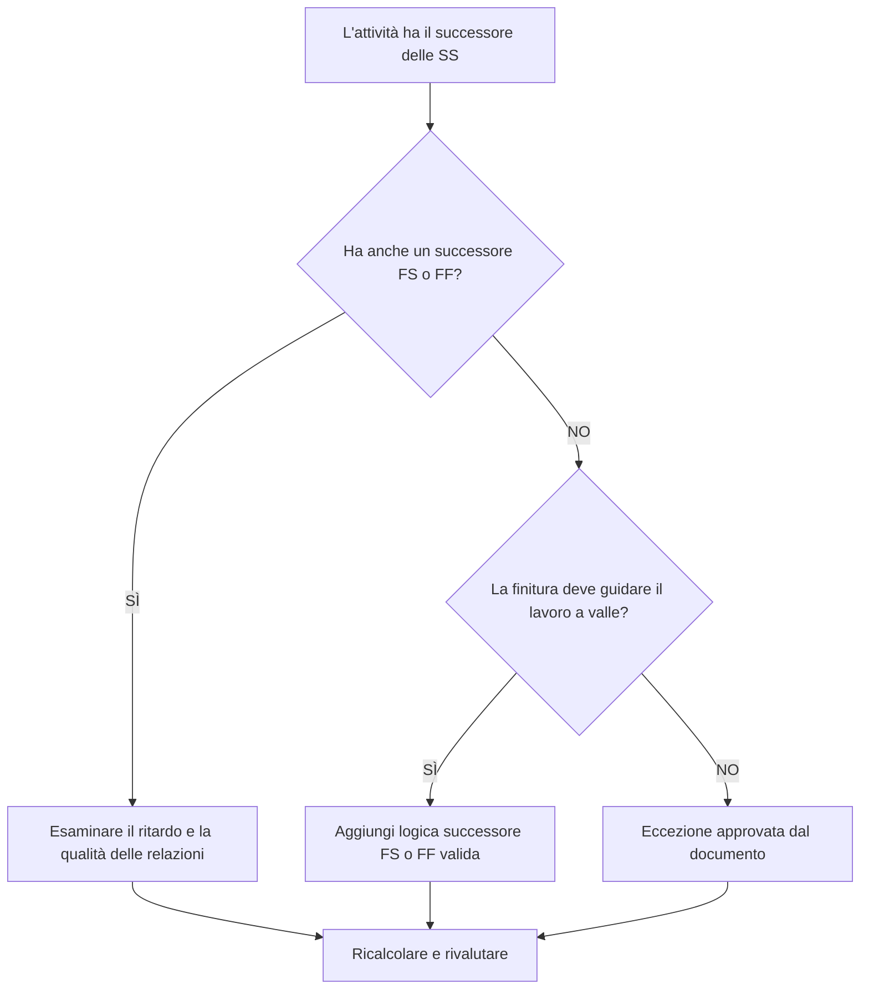

# Attività con successori SS e senza successori FS o FF - Guida al miglioramento

## Scopo

Questa guida aiuta gli addetti alla pianificazione a rivedere e correggere le attività che hanno successori Inizio-Inizio ma nessun successore Fine-Inizio o Fine-Fine. Supporta una logica CPM più forte confermando che le attività finite, e non solo iniziate, sono collegate alla rete di pianificazione downstream.

## Prima di iniziare

Raccogli le seguenti informazioni prima di agire:

- Risultato della valutazione attuale per questa metrica.
- Elenco delle attività con successori SS e senza successori FS o FF.
- Dettagli sulla relazione successore per ciascuna attività.
- Tipo di attività, durata, stato, calendario, margine totale e WBS.
- Eventuali ritardi, vincoli o date previste che influiscono sull'attività o sui suoi successori.
- Informazioni rilevanti sulla sequenza di costruzione, ingegneria, approvvigionamento o consegna.

## Comprendi il tuo risultato

Un risultato forte è zero attività irrisolte in questa condizione. Ciò significa che anche le attività che iniziano il lavoro a valle hanno una logica basata sulla finitura in cui conta il completamento del lavoro.

Un risultato accettabile può includere eccezioni documentate, come attività relative al livello di impegno, attività amministrative o lavoro intenzionalmente sovrapposto in cui la logica finale non è necessaria. Questi dovrebbero essere rivisti piuttosto che ritenuti validi.

Un risultato debole significa che diverse attività possono avviare i successori ma non controllano la fine di alcun successore o iniziano tramite il proprio completamento. Ciò potrebbe consentire al lavoro incompiuto di smettere di influenzare la pianificazione.

## Obiettivo di miglioramento

L'obiettivo è 0 attività irrisolte con successori SS e nessun successore FS o FF.

L'obiettivo è confermare che ciascuna attività abbia un successore realistico orientato al traguardo in cui il completamento influisce sul lavoro a valle o che la mancanza di una logica di finitura sia giustificata e documentata.

## Piano d'azione

### Passaggio 1: identificare il problema principale

Crea un layout o un'esportazione P6 che elenchi le attività con almeno un successore SS e nessun successore FS o FF. Includi ID attività, nome attività, WBS, durata originale, durata rimanente, margine totale, successori, tipo di relazione, ritardo, vincoli e stato attività.

Rivedi ogni attività e chiedi:

- Quale lavoro inizia perché inizia questa attività?
- Quale lavoro, tappa fondamentale, consegna o ispezione dipende dal completamento di questa attività?
- Manca un successore FS o FF?
- La relazione SS viene utilizzata per modellare correttamente il lavoro sovrapposto?
- L'attività costituisce un'eccezione valida, ad esempio un livello di impegno o un'attività di supporto?

### Passaggio 2: applicare le correzioni consigliate

Aggiungi una logica basata sul completamento in cui il completamento dell'attività dovrebbe controllare il lavoro successivo. Utilizzare FS quando il successore non può essere avviato fino al termine dell'attività. Utilizzare FF quando il successore può sovrapporsi ma non può terminare finché non termina il predecessore.

Esaminare le relazioni SS con ritardo. Se il ritardo viene utilizzato per approssimare la dipendenza dalla finitura, sostituirlo o integrarlo con una relazione FS o FF più chiara. Evitare di aggiungere logica solo per soddisfare la metrica; ogni relazione dovrebbe riflettere la reale sequenza di lavoro.

Se l'attività è un'eccezione valida, documentare il motivo in un argomento del taccuino, in una UDF, in un campo commento o nel tracker della qualità del cronoprogramma.

### Passaggio 3: rimuovere i blocchi comuni

Gli ostacoli più comuni includono la logica copiata da vecchi cronoprogrammi, eccessive relazioni SS, punti di passaggio di consegne poco chiari e input mancanti da parte di responsabili sul campo o sulla disciplina. Risolvere questi problemi rivedendo la sequenza di lavoro effettiva con il proprietario responsabile.

Un altro ostacolo è la convinzione che il lavoro sovrapposto richieda sempre solo la logica SS. La sovrapposizione può essere valida, ma la finitura del predecessore spesso deve ancora controllare la finitura, l'ispezione, il turnover o l'attività successiva del successore.

### Passaggio 4: convalidare le modifiche

Ricalcolare il cronoprogramma dopo le correzioni. Esegui nuovamente la metrica e conferma che ogni attività rimanente è corretta o documentata come eccezione approvata.

Esaminare l'impatto sul margine totale, sul percorso critico, sul percorso più lungo e sui traguardi a breve termine. Se l'aggiunta della logica di finitura modifica le date chiave, comunicare il risultato al responsabile dei controlli di progetto o al revisore PMO.

## Cronoprogramma di miglioramento

### Giorno 1: revisione e diagnosi

Esegui la metrica, conferma l'elenco delle attività interessate e separa le attività in logica di finitura mancante, logica SS debole, problemi di ritardo e possibili eccezioni.

### Giorni 2-3: implementare le azioni prioritarie

Correggere innanzitutto le attività critiche e quasi critiche. Aggiungi successori FS o FF validi, modifica la logica SS inappropriata e documenta le eccezioni giustificate.

### Giorni 4-5: monitorare i primi risultati

Ricalcola la pianificazione e rivedi il movimento in termini di margine, percorso più lungo e date cardine.

### Giorno 6: aggiustamenti finali

Risolvi gli elementi incerti rimanenti con la disciplina responsabile, il proprietario del pacchetto o il responsabile della costruzione.

### Giorno 7: rivalutare e confrontare

Eseguire nuovamente la valutazione e confrontare il risultato con la soglia target.

## Monitoraggio dei progressi

Utilizza un semplice tracker per gestire correzioni e approvazioni.

| Data | Azione intrapresa | Impatto previsto | Risultato / Osservazione | Passaggio successivo |
| --- | --- | --- | --- | --- |
| [Data] | Revisione delle attività successore solo SS | Identificare la logica finale mancante | [Risultato osservato] | Assegnare correzioni |
| [Data] | Aggiunta la logica successore FS o FF | Migliorare la continuità del CPM | [Risultato osservato] | Ricalcolare il cronoprogramma |
| [Data] | Eccezioni valide documentate | Migliora la tracciabilità delle recensioni | [Risultato osservato] | Rivalutare la metrica |

## Se i risultati non migliorano

Se i risultati non migliorano, controlla se il filtro identifica eccezioni valide, logica duplicata o attività in un'area specifica della WBS con uno sviluppo di rete debole. Un problema ripetuto potrebbe indicare che la squadra fa troppo affidamento sulle relazioni con le SS durante la pianificazione.

Inoltra gli elementi irrisolti al responsabile della pianificazione o al revisore del PMO quando influiscono sul lavoro critico, quasi critico, contrattuale o correlato al passaggio di consegne.

## Manutenzione

Esaminare questa metrica durante ogni aggiornamento della pianificazione e prima dell'approvazione della previsione. Prestare particolare attenzione dopo la risequenziazione, la pianificazione del ripristino, lo sviluppo della pianificazione copiata o le modifiche importanti dell'ambito.

## Lista di controllo riepilogativa

- [ ] Risultato attuale rivisto
- [ ] Soglia target confermata
- [ ] Problema principale identificato
- [ ] I successori delle SS esaminati
- [ ] Logica FS o FF mancante corretta
- [ ] Ritardi e vincoli controllati
- [ ] Eccezioni valide documentate
- [ ] Cronoprogramma ricalcolato
- [ ] Risultati monitorati
- [ ] Valutazione ripetuta
- [ ] Passaggi successivi documentati
## Contenuti correlati
- [Attività con successori SS e senza successori FS o FF - Panoramica](01_overview_template.md)
- [Modello di blog](03_blog_template.md)
- [Cos'è un cronoprogramma](../../11b_blogs_it/01_WHAT%20A%20SCHEDULE%20IS/01_blog.md)
- [Logica robusta](../../11b_blogs_it/02_ROBUST%20LOGIC/02_ROBUST%20LOGIC.md)
