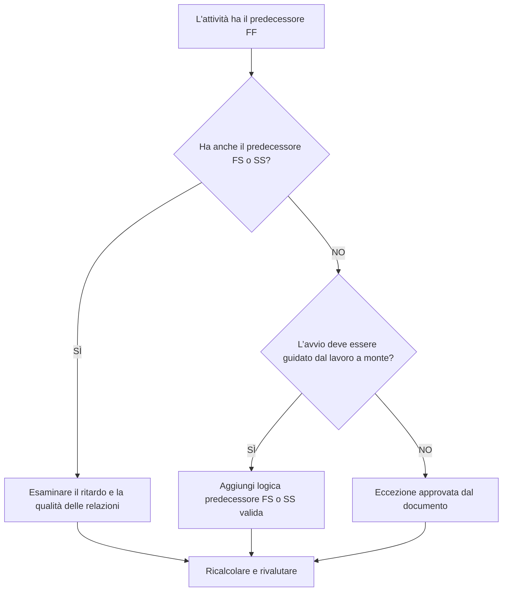

# Attività con predecessori FF e senza predecessori FS o SS - Guida al miglioramento

## Scopo

Questa guida aiuta gli addetti alla pianificazione a rivedere e correggere le attività che hanno predecessori Fine-Fine ma nessun predecessore Fine-Inizio o Inizio-Inizio. Supporta una logica CPM più forte confermando che l'inizio delle attività, e non solo la fine, sono collegati alla rete di pianificazione a monte.

## Prima di iniziare

Raccogli le seguenti informazioni prima di agire:

- Risultato della valutazione attuale per questa metrica.
- Elenco delle attività con predecessori FF e nessun predecessore FS o SS.
- Dettagli sulla relazione del predecessore per ciascuna attività.
- Tipo di attività, durata, stato, calendario, margine totale e WBS.
- Eventuali ritardi, vincoli o date previste che influiscono sull'attività o sui suoi predecessori.
- Informazioni pertinenti sulla costruzione, ingegneria, approvvigionamento, accesso, approvazione o sequenza di consegna.

## Comprendi il tuo risultato

Un risultato forte è zero attività irrisolte in questa condizione. Ciò significa che anche le attività la cui conclusione è legata al lavoro precedente hanno una valida logica di avvio dove necessario.

Un risultato accettabile può includere eccezioni documentate, come attività basate sul livello di impegno, attività amministrative o lavoro parallelo intenzionalmente modellato in cui non è richiesta la logica di avvio. Questi dovrebbero essere rivisti piuttosto che ritenuti validi.

Un risultato debole significa che diverse attività possono terminare rispetto a quelle precedenti, ma il loro inizio non è controllato dal lavoro a monte. Ciò potrebbe consentire l'avvio delle attività prima di quanto supportato dalla sequenza reale.

## Obiettivo di miglioramento

L'obiettivo è 0 attività irrisolte con predecessori FF e nessun predecessore FS o SS.

L'obiettivo è confermare che ciascuna attività abbia un predecessore realistico che guida l'avvio in cui l'avvio dipende dal lavoro a monte o che la mancanza di una logica di avvio sia giustificata e documentata.

## Piano d'azione

### Passaggio 1: identificare il problema principale

Crea un layout o un'esportazione P6 che elenchi le attività con almeno un predecessore FF e nessun predecessore FS o SS. Includi ID attività, Nome attività, WBS, Durata originale, Durata rimanente, Margine totale, Predecessori, Tipo di relazione, Ritardo, Vincoli e Stato attività.

Rivedi ogni attività e chiedi:

- Cosa deve accadere prima che questa attività possa iniziare?
- Il predecessore FF controlla solo l'allineamento della finitura?
- Manca un predecessore FS o SS?
- La relazione FF viene utilizzata per modellare correttamente il lavoro di sovrapposizione?
- L'attività costituisce un'eccezione valida, ad esempio un livello di impegno o un'attività di supporto?

### Passaggio 2: applicare le correzioni consigliate

Aggiungere una logica determinante iniziale in cui l'inizio dell'attività dovrebbe dipendere dal lavoro precedente. Utilizzare FS quando l'attività non può iniziare fino al termine del predecessore. Utilizzare SS quando l'attività può iniziare dopo l'avvio del predecessore o dopo aver raggiunto un punto di avanzamento definito.

Esamina le relazioni FF con il ritardo. Se il ritardo viene utilizzato per approssimare la dipendenza dall'avvio, sostituirlo o integrarlo con una logica FS o SS più chiara. Evitare di aggiungere relazioni solo per soddisfare la metrica; ogni relazione dovrebbe riflettere la reale sequenza di lavoro.

Se l'attività è un'eccezione valida, documentare il motivo in un argomento del taccuino, in una UDF, in un campo commento o nel tracker della qualità del cronoprogramma.

### Passaggio 3: rimuovere i blocchi comuni

I blocchi più comuni includono la logica copiata da vecchie pianificazioni, l'uso eccessivo di relazioni FF, punti di accesso o rilascio poco chiari e input mancanti da parte di responsabili sul campo o sulla disciplina. Risolvere questi problemi rivedendo la condizione di avvio effettiva con il proprietario responsabile.

Un altro ostacolo è la convinzione che la logica FF sia sufficiente quando due attività devono finire insieme. L'allineamento finale può essere valido, ma l'attività successiva spesso necessita ancora di una chiara condizione iniziale.

### Passaggio 4: convalidare le modifiche

Ricalcolare il cronoprogramma dopo le correzioni. Esegui nuovamente la metrica e conferma che ogni attività rimanente è corretta o documentata come eccezione approvata.

Esaminare l'impatto su date iniziali, margine totale, percorso critico, percorso più lungo e traguardi a breve termine. Se l'aggiunta della logica di avvio modifica le date principali, comunicare il risultato al responsabile dei controlli di progetto o al revisore PMO.

## Cronoprogramma di miglioramento

### Giorno 1: revisione e diagnosi

Esegui la metrica, conferma l'elenco delle attività interessate e separa le attività in logica di avvio mancante, logica FF debole, problemi di ritardo e possibili eccezioni.

### Giorni 2-3: implementare le azioni prioritarie

Correggere innanzitutto le attività critiche e quasi critiche. Aggiungi predecessori FS o SS validi, modifica la logica FF inappropriata e documenta le eccezioni giustificate.

### Giorni 4-5: monitorare i primi risultati

Ricalcola la pianificazione e rivedi il movimento in date iniziali, fluttuanti, percorso più lungo e date cardine.

### Giorno 6: aggiustamenti finali

Risolvi gli elementi incerti rimanenti con la disciplina responsabile, il proprietario del pacchetto o il responsabile della costruzione.

### Giorno 7: rivalutare e confrontare

Eseguire nuovamente la valutazione e confrontare il risultato con la soglia target.

## Monitoraggio dei progressi

Utilizza un semplice tracker per gestire correzioni e approvazioni.

| Data | Azione intrapresa | Impatto previsto | Risultato / Osservazione | Passaggio successivo |
| --- | --- | --- | --- | --- |
| [Data] | Revisionate le attività predecessori solo di FF | Identificare la logica di avvio mancante | [Risultato osservato] | Assegnare correzioni |
| [Data] | Aggiunta la logica predecessore FS o SS | Migliorare la continuità del CPM | [Risultato osservato] | Ricalcolare il cronoprogramma |
| [Data] | Eccezioni valide documentate | Migliora la tracciabilità delle recensioni | [Risultato osservato] | Rivalutare la metrica |

## Se i risultati non migliorano

Se i risultati non migliorano, controlla se il filtro identifica eccezioni valide, logica duplicata o attività in un'area specifica della WBS con uno sviluppo di rete debole. Un problema ripetuto può indicare che il team fa troppo affidamento sulle relazioni FF durante la pianificazione.

Inoltra gli elementi irrisolti al responsabile della pianificazione o al revisore del PMO quando influiscono su lavori critici, quasi critici, contrattuali, relativi all'accesso o al passaggio di consegne.

## Manutenzione

Esaminare questa metrica durante ogni aggiornamento della pianificazione e prima dell'approvazione della previsione. Prestare particolare attenzione dopo la risequenziazione, la pianificazione del ripristino, lo sviluppo della pianificazione copiata o le modifiche importanti dell'ambito.

## Lista di controllo riepilogativa

- [ ] Risultato attuale rivisto
- [ ] Soglia target confermata
- [ ] Problema principale identificato
- [ ] Revisione dei predecessori di FF
- [ ] Logica FS o SS mancante corretta
- [ ] Ritardi e vincoli controllati
- [ ] Eccezioni valide documentate
- [ ] Cronoprogramma ricalcolato
- [ ] Risultati monitorati
- [ ] Valutazione ripetuta
- [ ] Passaggi successivi documentati
## Contenuti correlati
- [Attività con predecessori FF e senza predecessori FS o SS - Panoramica](01_overview_template.md)
- [Modello di blog](03_blog_template.md)
- [Cos'è un cronoprogramma](../../11b_blogs_it/01_WHAT%20A%20SCHEDULE%20IS/01_blog.md)
- [Logica robusta](../../11b_blogs_it/02_ROBUST%20LOGIC/02_ROBUST%20LOGIC.md)
