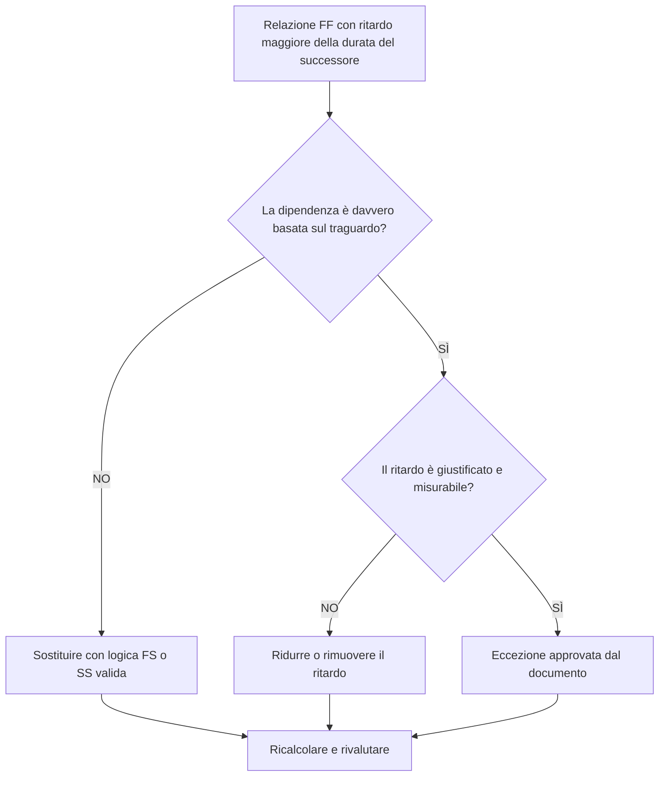

# Relazioni FF con ritardo maggiore della durata del successore - Guida al miglioramento

## Scopo

Questa guida aiuta gli addetti alla pianificazione a rivedere e correggere le relazioni Fine-Fine in cui il ritardo è maggiore della durata dell'attività successiva. Supporta una logica CPM più chiara sostituendo un eccessivo ritardo FF con una logica relazionale o attività visibili che rappresentano meglio la sequenza di lavoro reale.

## Prima di iniziare

Raccogli le seguenti informazioni prima di agire:

- Risultato della valutazione attuale per questa metrica.
- Elenco di relazioni FF in cui il ritardo è maggiore della durata del successore.
- ID attività predecessore e successore, nomi, WBS, durate, calendari e stato.
- Intervallo di relazione, tipo di relazione ed eventuali vincoli correlati.
- Impostazioni di calcolo della pianificazione e base di calendario utilizzata per il ritardo.
- Logica di campo, ingegneria, approvvigionamento, approvazione o trasferimento che spiega la dipendenza prevista.

## Comprendi il tuo risultato

Un risultato efficace è rappresentato da zero relazioni FF irrisolte in cui il ritardo supera la durata del successore.

Un risultato accettabile può includere eccezioni documentate, ma queste dovrebbero essere rare. Un ritardo FF lungo spesso indica che il tipo di relazione non corrisponde alla dipendenza modellata.

Un risultato debole significa che la pianificazione contiene più collegamenti dall'inizio alla fine in cui l'arrivo successivo viene ritardato di un tempo maggiore rispetto alla durata dell'attività successiva. Ciò potrebbe nascondere la logica di avvio, i periodi di attesa o le attività intermedie mancanti.

## Obiettivo di miglioramento

L'obiettivo è 0 relazioni FF non risolte con un ritardo maggiore della durata del successore.

L'obiettivo è verificare se ciascuna relazione debba rimanere FF, essere convertita in logica FS o SS, ridurre il ritardo o essere documentata come eccezione valida.

## Piano d'azione

### Passaggio 1: identificare il problema principale

Crea un layout o un'esportazione P6 che elenchi le relazioni FF in cui il ritardo è maggiore della durata successiva. Includi ID attività precedente e successiva, Nome attività, WBS, Durata originale, Durata rimanente, Tipo di relazione, Ritardo, Calendario, Margine totale e Stato attività.

Esamina ogni relazione e chiedi:

- Perché il successore termina dopo un ritardo così lungo?
- Il successore dipende effettivamente dalla finitura del predecessore o da un'altra condizione di avvio o di passaggio?
- Il ritardo è maggiore della durata originale successiva, della durata rimanente o di entrambe?
- Il ritardo viene utilizzato per modellare il tempo di revisione, la cura, la consegna, l'approvazione, l'accesso o un altro periodo di attesa reale?
- Una relazione FS o SS renderebbe più chiara la dipendenza?

### Passaggio 2: applicare le correzioni consigliate

Se il successore deve iniziare al termine del predecessore, sostituire la relazione FF con una relazione FS. Se il successore può iniziare dopo l'avvio del predecessore o dopo aver raggiunto un punto di avanzamento definito, utilizzare la logica SS.

Se la relazione è veramente basata sul traguardo, rivedere il valore del ritardo. Riduci il ritardo eccessivo laddove è stato utilizzato come segnaposto approssimativo o ereditato dalla logica copiata. Se il ritardo rappresenta un periodo di attesa reale, verificare che l'unità, il calendario e la spiegazione siano corretti.

Evitare di utilizzare un ritardo lungo come sostituto delle attività che dovrebbero essere visibili nel cronoprogramma. Se il ritardo rappresenta un tempo di revisione, cura, consegna, mobilitazione, approvazione o chiusura, considera la modellazione di tale lavoro come un'attività separata.

### Passaggio 3: rimuovere i blocchi comuni

Gli ostacoli più comuni includono la logica copiata da pianificazioni precedenti, periodi di attesa nascosti, confusione nel calendario e pressione per mantenere la rete semplice. Risolvili confermando la dipendenza prevista con il proprietario responsabile.

Un altro ostacolo è considerare il ritardo come innocuo. Un ritardo lungo può essere difficile da esaminare, può nascondere rischi e rendere più difficile l'analisi del ritardo perché il periodo di attesa non è visibile come attività.

### Passaggio 4: convalidare le modifiche

Ricalcolare il cronoprogramma dopo le correzioni. Esegui nuovamente la metrica e conferma che ogni elemento rimanente è corretto o documentato come eccezione approvata.

Esamina il margine totale, il percorso più lungo, il percorso critico e le tappe fondamentali a breve termine. Se le modifiche alla relazione spostano le date chiave, comunicare il risultato al responsabile dei controlli di progetto o al revisore PMO.

## Cronoprogramma di miglioramento

### Giorno 1: revisione e diagnosi

Esegui la metrica, conferma l'elenco delle relazioni interessate e separa gli elementi in tipo di relazione errata, ritardo eccessivo, attività nascosta, problema del calendario e possibile eccezione.

### Giorni 2-3: implementare le azioni prioritarie

Correggere innanzitutto le relazioni critiche e quasi critiche. Converti la logica FF in FS o SS ove appropriato, riduci i ritardi ingiustificati e documenta le eccezioni valide.

### Giorni 4-5: monitorare i primi risultati

Ricalcola la pianificazione e rivedi il movimento in termini di margine, percorso più lungo e date cardine.

### Giorno 6: aggiustamenti finali

Risolvi gli elementi incerti rimanenti con la disciplina responsabile, il proprietario del pacchetto o il responsabile della costruzione.

### Giorno 7: rivalutare e confrontare

Eseguire nuovamente la valutazione e confrontare il risultato con la soglia target.

## Monitoraggio dei progressi

Utilizza un semplice tracker per gestire correzioni e approvazioni.

| Data | Azione intrapresa | Impatto previsto | Risultato / Osservazione | Passaggio successivo |
| --- | --- | --- | --- | --- |
| [Data] | Ritardo FF esaminato maggiore della durata del successore | Identificare la logica debole o poco chiara | [Risultato osservato] | Assegnare correzioni |
| [Data] | Relazione convertita in FS o SS | Migliora la chiarezza della logica CPM | [Risultato osservato] | Ricalcolare il cronoprogramma |
| [Data] | Ritardo ridotto o documentato | Migliora la tracciabilità delle recensioni | [Risultato osservato] | Rivalutare la metrica |

## Se i risultati non migliorano

Se i risultati non migliorano, verificare se gli stessi modelli di relazione si ripetono in una specifica area, disciplina o sezione del cronoprogramma WBS copiata. Risultati ripetuti potrebbero indicare che il team sta utilizzando il ritardo FF come scorciatoia standard invece di modellare dipendenze reali.

Inoltrare le questioni irrisolte quando influiscono su lavori critici, quasi critici, contrattuali, di approvvigionamento, di approvazione, di messa in servizio o di consegna.

## Manutenzione

Esaminare questa metrica durante ogni aggiornamento della pianificazione e prima dell'approvazione della previsione. Prestare particolare attenzione dopo lo sviluppo della pianificazione, la risequenziazione, la pianificazione del ripristino o le modifiche importanti dell'ambito copiate.

## Lista di controllo riepilogativa

- [ ] Risultato attuale rivisto
- [ ] Soglia target confermata
- [ ] Problema principale identificato
- [ ] Relazioni FF riviste
- [ ] Ritardo eccessivo corretto o giustificato
- [ ] Sostituzioni FS o SS applicate dove necessario
- [ ] Lavoro nascosto modellato ove appropriato
- [ ] Cronoprogramma ricalcolato
- [ ] Risultati monitorati
- [ ] Valutazione ripetuta
- [ ] Passaggi successivi documentati
## Contenuti correlati
- [Relazioni FF con ritardo maggiore della durata del successore - Panoramica](01_overview_template.md)
- [Modello di blog](03_blog_template.md)
- [Cos'è un cronoprogramma](../../11b_blogs_it/01_WHAT%20A%20SCHEDULE%20IS/01_blog.md)
- [Logica robusta](../../11b_blogs_it/02_ROBUST%20LOGIC/02_ROBUST%20LOGIC.md)
