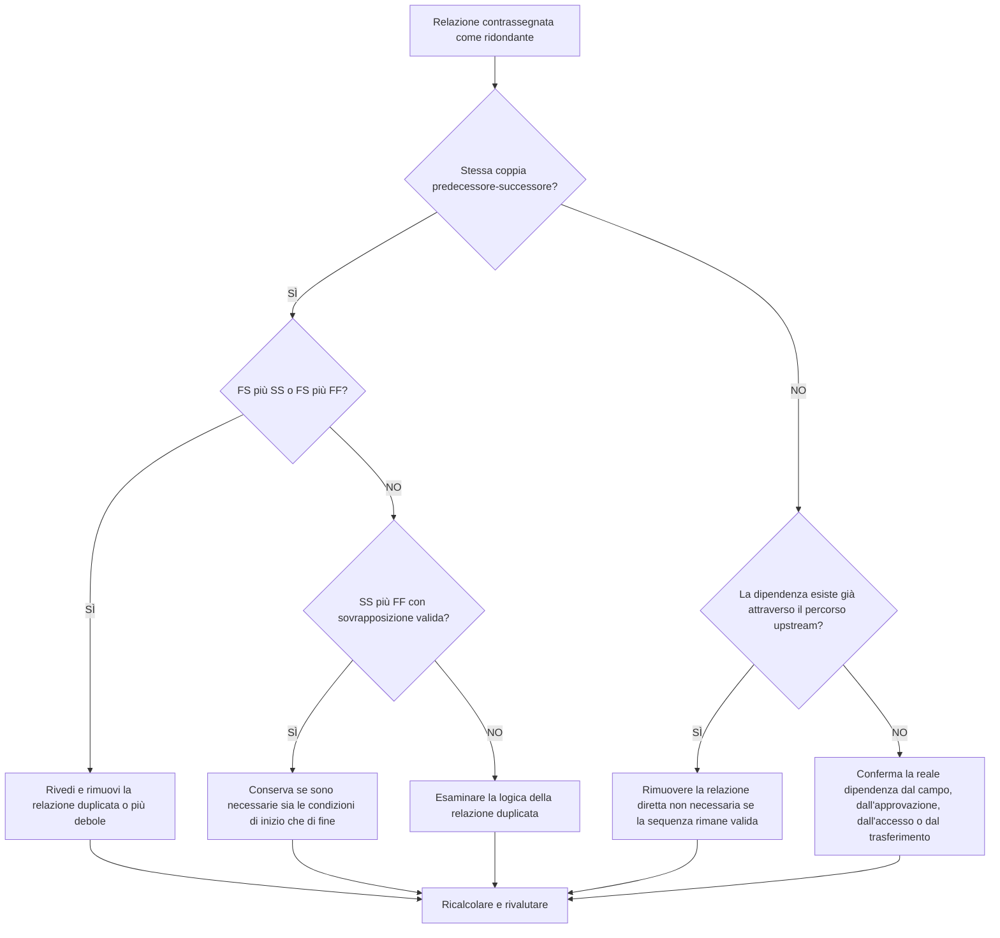

# Logica ridondante negli orari Primavera P6 - Guida al miglioramento

## Scopo

Questa guida aiuta gli addetti alla pianificazione a identificare e rimuovere la logica ridondante da una pianificazione Primavera P6. Si applica a modelli di relazione duplicati, logica precedente ripetuta e dipendenze non necessarie che non rappresentano una sequenza di lavoro reale.

## Prima di iniziare

Raccogli le seguenti informazioni prima di agire:

- Risultato della valutazione attuale per questa metrica.
- Elenco di attività e relazioni contrassegnate come logica ridondante.
- Dettagli del predecessore e del successore per ciascuna attività contrassegnata.
- Tipi di relazione, ritardi, calendari, margine totale e indicatori di relazione determinante.
- WBS, codici attività e proprietà della disciplina o del pacchetto di lavoro.
- Informazioni sul campo, sulla progettazione, sull'approvvigionamento, sull'approvazione o sulla consegna che spiegano la reale dipendenza.

## Comprendi il tuo risultato

Un risultato efficace è rappresentato da zero relazioni ridondanti irrisolte.

Un risultato accettabile può includere rare eccezioni documentate in cui la logica dall'aspetto duplicato viene utilizzata intenzionalmente per un motivo difendibile. Questi casi dovrebbero essere esaminati attentamente perché la logica ridondante è solitamente un problema di qualità del cronoprogramma.

Un risultato debole significa che la pianificazione contiene una logica di relazione ripetuta o non necessaria. Ciò può verificarsi quando le sezioni della pianificazione copiate non vengono ripulite, le relazioni vengono aggiunte senza controllare i percorsi esistenti o vengono utilizzati più tipi di dipendenza tra le stesse attività.

## Obiettivo di miglioramento

L'obiettivo è 0 relazioni ridondanti non risolte.

L'obiettivo è mantenere solo le relazioni che rappresentano dipendenze reali e rimuovere la logica che duplica, maschera o sovrastima l'effettiva sequenza di lavoro.

## Piano d'azione

### Passaggio 1: identificare il problema principale

Creare un layout, un report o una revisione delle relazioni esterne P6 che identifichi la probabile logica ridondante. Concentrati su questi casi:

- Lo stesso predecessore si è collegato più volte allo stesso successore, in particolare FS più SS o FS più FF.
- SS più FF tra le stesse due attività possono essere validi quando la sovrapposizione è modellata correttamente e contano sia le condizioni di inizio che quelle di fine.
- Un'attività con lo stesso predecessore e tipo di relazione del proprio predecessore, creando una logica ereditata ripetuta attraverso la catena.
- Catene predecessore ripetute più lunghe in cui la stessa dipendenza appare più passaggi indietro.
- Dipendenze che non modificano la sequenza, le date, il margine, il passaggio di consegne, l'accesso o il controllo del rischio.

Esamina ogni relazione segnalata e chiedi:

- Questa relazione aggiunge una dipendenza reale?
- La dipendenza è già rappresentata da un'altra relazione tra le stesse attività?
- La dipendenza è già rappresentata da un percorso a monte?
- La rimozione della relazione modificherebbe la logica di pianificazione valida o semplificherebbe solo la rete?
- La relazione determina le date per un motivo legittimo o solo perché è stata aggiunta una logica ridondante?

### Passaggio 2: applicare le correzioni consigliate

Inizia con duplicati esatti e ripetute coppie predecessore-successore. Se le stesse due attività sono connesse con FS più SS o FS più FF, determinare quale relazione rappresenta la reale dipendenza. Rimuovere la relazione che duplica o indebolisce la logica.

Esaminare separatamente le coppie SS più FF. Questa combinazione può essere valida quando una relazione controlla quando può iniziare il lavoro sovrapposto e l'altra relazione controlla quando può finire. Conservarlo solo quando entrambe le condizioni sono reali e documentate dalla sequenza di lavoro.

Successivamente, esaminare la logica del predecessore ereditata. Se l'attività C ha la stessa relazione di predecessore dell'attività B e l'attività B è già un predecessore dell'attività C, la relazione diretta con l'attività precedente potrebbe non essere necessaria. Rimuovilo se la sequenza CPM rimane corretta attraverso il percorso esistente.

Infine, rimuovi le dipendenze non necessarie che non supportano la sequenza di lavoro, l'accesso, l'approvazione, il passaggio di consegne, il controllo del rischio o la logica contrattuale.

### Passaggio 3: rimuovere i blocchi comuni

I blocchi comuni includono la logica copiata da pianificazioni precedenti, la modellazione eccessiva per far sembrare la rete connessa e l'aggiunta di relazioni durante gli aggiornamenti senza controllare il percorso esistente.

Un altro ostacolo è la paura che la rimozione delle relazioni indebolisca il cronoprogramma. L'obiettivo non è rimuovere i controlli validi; si tratta di rimuovere relazioni che duplicano controlli già presenti nella rete.

### Passaggio 4: convalidare le modifiche

Ricalcolare la pianificazione dopo aver rimosso o modificato la logica ridondante. Esamina il margine totale, le relazioni trainanti, il percorso più lungo, il percorso critico e le date chiave delle tappe fondamentali.

Se la rimozione di una relazione modifica le date in modo imprevisto, verifica se il collegamento rimosso serviva effettivamente una dipendenza valida o se è necessario aggiungere un'altra relazione mancante in modo più accurato.

## Cronoprogramma di miglioramento

### Giorno 1: revisione e diagnosi

Esegui la metrica, conferma l'elenco delle relazioni interessate e separa i risultati in coppie duplicate, combinazioni FS più SS/FF, logica del predecessore ereditata e dipendenze non necessarie.

### Giorni 2-3: implementare le azioni prioritarie

Correggere innanzitutto le relazioni critiche e quasi critiche. Rimuovi i duplicati esatti, ripulisci le coppie di predecessori ripetute e documenta le combinazioni SS più FF valide.

### Giorni 4-5: monitorare i primi risultati

Ricalcola la pianificazione e rivedi il movimento in fluttuazione, percorso più lungo, relazioni di guida e date cardine.

### Giorno 6: aggiustamenti finali

Risolvi le questioni incerte con la disciplina responsabile, il proprietario del pacchetto o il responsabile della costruzione.

### Giorno 7: rivalutare e confrontare

Eseguire nuovamente la valutazione e confrontare il risultato con la soglia target.

## Monitoraggio dei progressi

Utilizza un semplice tracker per gestire correzioni e approvazioni.

| Data | Azione intrapresa | Impatto previsto | Risultato / Osservazione | Passaggio successivo |
| --- | --- | --- | --- | --- |
| [Data] | Elenco delle relazioni ridondanti esaminato | Identificare la logica duplicata o non necessaria | [Risultato osservato] | Assegnare correzioni |
| [Data] | Rimosse le relazioni duplicate | Semplifica la rete CPM | [Risultato osservato] | Ricalcolare il cronoprogramma |
| [Data] | Eccezioni valide documentate | Migliora la tracciabilità delle recensioni | [Risultato osservato] | Rivalutare la metrica |

## Se i risultati non migliorano

Se i risultati non migliorano, verificare se la logica ridondante è concentrata in un'area specifica della WBS, in una sezione del progetto copiato, in una disciplina o in un periodo di aggiornamento della pianificazione. Risultati ripetuti potrebbero indicare che la pulizia della relazione non fa parte del normale flusso di lavoro di pianificazione.

Incrementare la logica ridondante irrisolta quando influisce su lavori critici, quasi critici, contrattuali, relativi all'accesso, all'approvazione o al trasferimento.

## Manutenzione

Esaminare questa metrica durante ogni aggiornamento della pianificazione e prima dell'approvazione della previsione. Prestare particolare attenzione dopo lo sviluppo della pianificazione copiata, la risequenziazione, la pianificazione del ripristino o le revisioni logiche di grandi dimensioni.

## Lista di controllo riepilogativa

- [ ] Risultato attuale rivisto
- [ ] Soglia target confermata
- [ ] Problema principale identificato
- [ ] Coppie duplicate predecessore-successore revisionate
- [ ] Sono state corrette le combinazioni FS più SS o FS più FF
- [ ] Combinazioni SS più FF valide documentate
- [ ] Logica predecessore ereditata rivista
- [ ] Dipendenze non necessarie rimosse
- [ ] Cronoprogramma ricalcolato
- [ ] Risultati monitorati
- [ ] Valutazione ripetuta
- [ ] Passaggi successivi documentati
## Contenuti correlati
- [Logica ridondante negli orari Primavera P6 - Panoramica](01_overview_template.md)
- [Modello di blog](03_blog_template.md)
- [Cos'è un cronoprogramma](../../11b_blogs_it/01_WHAT%20A%20SCHEDULE%20IS/01_blog.md)
- [Logica robusta](../../11b_blogs_it/02_ROBUST%20LOGIC/02_ROBUST%20LOGIC.md)
