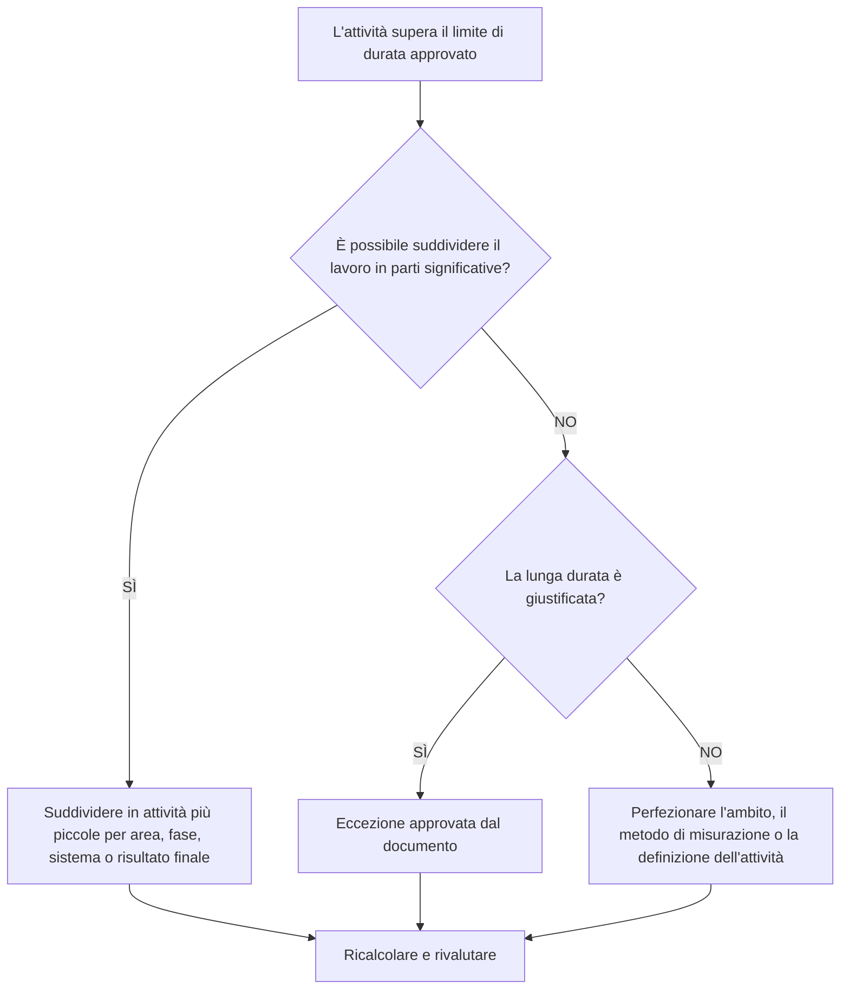

## Scopo

Questa guida aiuta gli addetti alla pianificazione a rivedere e migliorare le attività con durate superiori alla soglia del progetto approvato. La durata accettabile dipende dal tipo di progetto, dal livello di dettaglio, dal ciclo di reporting, dai requisiti contrattuali e dalla sensibilità del cliente alle attività lunghe.

## Prima di iniziare

Raccogli le seguenti informazioni prima di agire:

- Risultato della valutazione attuale per questa metrica.
- Durata massima dell'attività approvata per il progetto o il livello di pianificazione.
- Elenco delle attività sopra la soglia di durata.
- Durata originale, Durata rimanente, Tipo di attività, Stato, WBS, calendario e margine totale.
- Requisiti di base, aspettative di reporting del cliente e regole di qualità del cronoprogramma PMO.
- Periodo di pianificazione anticipata, ciclo di aggiornamento dell'avanzamento e disciplina o proprietà del pacchetto.
- Eventuali eccezioni giustificate, come attività di approvvigionamento, stagionatura, consegna, revisione, test o livello di impegno.

## Comprendi il tuo risultato

Un risultato valido è pari a zero attività irrisolte al di sopra della soglia di lunga durata approvata.

Un risultato accettabile può includere eccezioni documentate, in particolare per attività che non possono ragionevolmente essere suddivise o che sono intenzionalmente gestite come attività di controllo di tipo riepilogativo. Questi dovrebbero essere limitati e chiaramente giustificati.

Un risultato debole significa che la pianificazione contiene molte attività troppo ampie per una pianificazione e un controllo efficaci. Ciò potrebbe ridurre la visibilità dei progressi e rendere più difficile capire quale lavoro sta effettivamente determinando la pianificazione.

## Obiettivo di miglioramento

L'obiettivo è 0 attività irrisolte superiori al limite di durata approvato.

L'obiettivo è suddividere le attività lunghe in attività più piccole e significative dove è necessario un controllo migliore, documentando al contempo le eccezioni valide laddove è appropriata una lunga durata.

## Piano d'azione

### Passaggio 1: identificare il problema principale

Creare un layout o un report P6 che elenchi le attività che superano la soglia di durata definita dal progetto. Includere ID attività, Nome attività, WBS, Tipo attività, Durata originale, Durata rimanente, Inizio, Fine, Calendario, Margine totale e Stato attività.

Rivedi ogni attività e chiedi:

- La durata dell'attività è superiore alla soglia approvata per questo tipo di progetto e livello di pianificazione?
- L'attività copre più fasi di lavoro, ubicazioni, sistemi, aree o risultati finali?
- È possibile misurare oggettivamente i progressi durante ciascun ciclo di aggiornamento?
- L'attività necessita di maggiori dettagli perché il cliente o il PMO è sensibile alle lunghe durate?
- L'attività è un'eccezione valida che dovrebbe rimanere a lungo?

### Passaggio 2: applicare le correzioni consigliate

Suddividere attività lunghe in cui il lavoro può essere pianificato e misurato in parti più piccole. I metodi di suddivisione più comuni includono posizione, area WBS, disciplina, sistema, risultato finale, fase, sequenza dell'equipaggio o periodo di reporting.

Quando si suddivide un'attività, preservare la sequenza logica reale. Aggiungi predecessori e successori appropriati, assegna il calendario corretto e conferma che le nuove attività riflettono il modo in cui il lavoro verrà effettivamente eseguito.

Non dividere le attività solo per soddisfare la metrica. La ripartizione dovrebbe migliorare il controllo, la misurazione dei progressi, la pianificazione preventiva o la chiarezza del reporting.

### Passaggio 3: rimuovere i blocchi comuni

Gli ostacoli più comuni includono la definizione incompleta dell'ambito, la struttura debole della WBS, l'input limitato sul campo e la pressione per mantenere basso il numero delle attività. Risolvi questi problemi rivedendo le attività lunghe con la disciplina responsabile, il proprietario del pacchetto o il responsabile della costruzione.

Un altro ostacolo è l'utilizzo di un'attività lunga per rappresentare il lavoro che dovrebbe essere pianificato come una sequenza. Se l'attività contiene più passaggi di consegne, facce di lavoro, risultati finali o punti di controllo, probabilmente necessita di maggiori dettagli.

### Passaggio 4: convalidare le modifiche

Ricalcola il cronoprogramma dopo aver suddiviso o modificato le attività lunghe. Confermare che ogni nuova attività abbia logica, durata, calendario e misurazione dei progressi appropriati.

Esamina il margine totale, il percorso critico, il percorso più lungo e le date cardine. Se la suddivisione modifica le date chiave, comunicarne il motivo al responsabile dei controlli di progetto o al revisore del PMO.

## Cronoprogramma di miglioramento

### Giorno 1: revisione e diagnosi

Esegui la metrica, conferma la soglia di durata e separa le attività in candidati suddivisi, eccezioni valide ed elementi che richiedono l'input del proprietario.

### Giorni 2-3: implementare le azioni prioritarie

Correggere innanzitutto le attività critiche, quasi critiche e sensibili al cliente. Suddividere le attività generali e documentare le eccezioni valide.

### Giorni 4-5: monitorare i primi risultati

Ricalcola la pianificazione e rivedi il movimento in margine, percorso più lungo, date cardine e visibilità futura.

### Giorno 6: aggiustamenti finali

Risolvi gli elementi incerti rimanenti con la disciplina responsabile, il proprietario del pacchetto o il responsabile dei controlli di progetto.

### Giorno 7: rivalutare e confrontare

Eseguire nuovamente la valutazione e confrontare il risultato con la soglia target.

## Monitoraggio dei progressi

Utilizza un semplice tracker per gestire correzioni e approvazioni.

| Data | Azione intrapresa | Impatto previsto | Risultato / Osservazione | Passaggio successivo |
| --- | --- | --- | --- | --- |
| [Data] | Attività di lunga durata revisionate | Identificare le attività che necessitano di suddivisione | [Risultato osservato] | Assegna proprietari |
| [Data] | Suddividere l'attività in fasi di lavoro più piccole | Migliorare la visibilità dei progressi | [Risultato osservato] | Ricalcolare il cronoprogramma |
| [Data] | Eccezione valida documentata | Migliora la tracciabilità delle recensioni | [Risultato osservato] | Rivalutare la metrica |

## Se i risultati non migliorano

Se i risultati non migliorano, controlla se la soglia di durata non è chiara, applicata in modo incoerente o non allineata al livello di pianificazione. Verificare inoltre se le attività lunghe sono concentrate in una specifica area, disciplina o fase del progetto della WBS.

Incrementare le attività irrisolte di lunga durata quando influiscono su lavori critici, quasi critici, contrattuali, di reporting o sensibili al cliente.

## Manutenzione

Rivedi questa metrica durante ogni aggiornamento della pianificazione, sviluppo della baseline e esercizio di risequenziamento principale. Aggiorna la soglia se il progetto passa a una fase o a un livello di dettaglio diverso.

## Lista di controllo riepilogativa

- [ ] Risultato attuale rivisto
- [ ] Soglia target confermata
- [ ] Problema principale identificato
- [ ] Attività lunghe riviste
- [ ] Identificati i candidati divisi
- [ ] Attività suddivise dove utili
- [ ] Eccezioni valide documentate
- [ ] Cronoprogramma ricalcolato
- [ ] Risultati monitorati
- [ ] Valutazione ripetuta
- [ ] Passaggi successivi documentati
## Contenuti correlati
- [Modello di blog](03_blog_template.md)
- [Cos'è un cronoprogramma](../../11b_blogs_it/01_WHAT%20A%20SCHEDULE%20IS/01_blog.md)
- [Logica robusta](../../11b_blogs_it/02_ROBUST%20LOGIC/02_ROBUST%20LOGIC.md)
