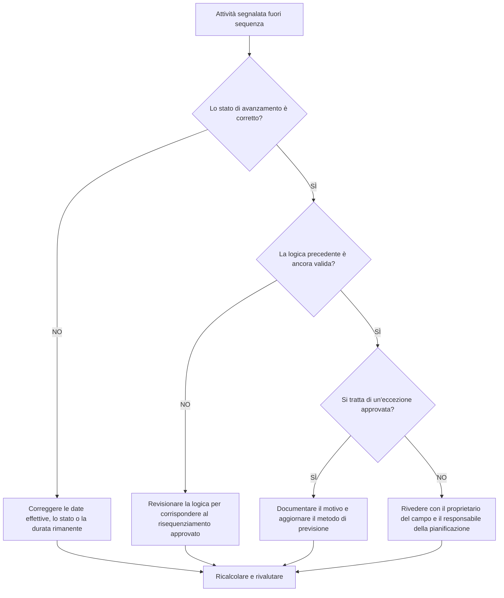

## Scopo

Questa guida aiuta gli addetti alla pianificazione a rivedere e correggere le attività fuori sequenza in Primavera P6. Si applica quando un'attività è iniziata o progredita prima che la logica precedente richiesta sia stata soddisfatta.

## Prima di iniziare

Raccogli le seguenti informazioni prima di agire:

- Risultato della valutazione attuale per questa metrica.
- Elenco delle attività contrassegnate come fuori sequenza.
- Data Data utilizzata nell'ultimo aggiornamento.
- Inizio effettivo, Fine effettiva, Durata rimanente e Stato attività.
- Dettagli sulla relazione del predecessore e del successore, inclusi il tipo di relazione e il ritardo.
- Impostazioni di calcolo della pianificazione, in particolare logica mantenuta e override dell'avanzamento.
- Spiegazione sul campo del motivo per cui il lavoro è avanzato prima che la logica pianificata fosse completata.

## Comprendi il tuo risultato

Un risultato forte è rappresentato da zero attività fuori sequenza irrisolte.

Un risultato accettabile può includere eccezioni documentate in cui il lavoro è stato intenzionalmente riprogrammato e la logica della pianificazione è stata aggiornata per riflettere il nuovo piano.

Un risultato debole significa che l'aggiornamento della pianificazione contiene progressi in conflitto con la rete logica esistente. Ciò potrebbe indicare uno stato non corretto, valori effettivi mancanti, logica obsoleta o risequenziamento dei campi reali che non è stato ancora riflesso nella previsione.

## Obiettivo di miglioramento

L'obiettivo è 0 attività fuori sequenza irrisolte.

L'obiettivo è determinare se ciascun elemento è un errore di stato, un errore logico o un evento di risequenziamento reale, quindi correggere la pianificazione in modo che rappresenti il ​​piano corrente.

## Piano d'azione

### Passaggio 1: identificare il problema principale

Crea un layout P6 o un report che elenca le attività fuori sequenza. Includere ID attività, Nome attività, WBS, Stato, Inizio effettivo, Fine effettiva, Durata rimanente, Inizio, Fine, Margine totale, predecessori, successori, tipo di relazione, ritardo e indicatori di relazione determinante.

Rivedi ogni attività e chiedi:

- L'attività è effettivamente iniziata prima che fosse soddisfatto il requisito precedente?
- Lo stato precedente è corretto?
- Lo status successore è corretto?
- La relazione è ancora valida dopo il risequenziamento dei campi?
- La logica della pianificazione dovrebbe essere modificata o l'aggiornamento dello stato di avanzamento dovrebbe essere corretto?
- Quale opzione di pianificazione P6 viene utilizzata: logica mantenuta o override dell'avanzamento?

### Passaggio 2: applicare le correzioni consigliate

Correggere prima gli errori di stato. Se l'inizio effettivo, la fine effettiva, la durata rimanente o lo stato precedente sono errati, aggiornare i dati dell'attività prima di modificare la logica.

Se la sequenza dei campi è cambiata, rivedere la logica per rappresentare il piano attuale approvato. Non rimuovere semplicemente le relazioni con i predecessori per cancellare la metrica. Sostituisci la logica obsoleta con relazioni che corrispondano alla sequenza di esecuzione reale.

Esaminare la logica conservata e le impostazioni di override dell'avanzamento. La logica mantenuta generalmente preserva la logica del predecessore originale per il lavoro rimanente, mentre l'override dell'avanzamento può consentire al lavoro rimanente di continuare nonostante la logica del predecessore incompleta. L'impostazione dovrebbe essere in linea con la procedura di controllo di progetto ed essere compresa prima di riferire il risultato.

### Passaggio 3: rimuovere i blocchi comuni

Gli ostacoli più comuni includono aggiornamenti tardivi sul campo, date effettive incomplete, pressione per accettare i progressi senza revisione logica e confusione sulle opzioni di calcolo della pianificazione.

Un altro ostacolo è trattare i progressi fuori sequenza solo come un problema software. La vera domanda è se il progetto abbia modificato la sequenza di lavoro e se il cronoprogramma ora rifletta la sequenza approvata.

### Passaggio 4: convalidare le modifiche

Ricalcolare il cronoprogramma dopo le correzioni. Eseguire nuovamente il controllo fuori sequenza e confermare che ogni elemento rimanente sia corretto, giustificato o assegnato per il follow-up.

Esamina il margine totale, il percorso più lungo, il percorso critico e le tappe fondamentali a breve termine. Le correzioni fuori sequenza possono modificare le date di previsione, quindi comunicare gli impatti significativi al responsabile dei controlli di progetto o al revisore del PMO.

## Cronoprogramma di miglioramento

### Giorno 1: revisione e diagnosi

Esegui la metrica, conferma la data di aggiornamento e separa i risultati in errori di stato, errori logici, risequenziamento reale e possibili eccezioni.

### Giorni 2-3: implementare le azioni prioritarie

Correggere innanzitutto le attività critiche, quasi critiche e lookahead. Aggiorna lo stato, rivedi la logica obsoleta e documenta la risequenziazione approvata.

### Giorni 4-5: monitorare i primi risultati

Ricalcola la pianificazione e rivedi il movimento in fluttuazione, percorso più lungo, percorso critico e date cardine.

### Giorno 6: aggiustamenti finali

Risolvere gli elementi rimanenti con i responsabili sul campo, i proprietari della disciplina o il responsabile della pianificazione.

### Giorno 7: rivalutare e confrontare

Eseguire nuovamente la valutazione e confrontare il risultato con la soglia target.

## Monitoraggio dei progressi

Utilizza un semplice tracker per gestire correzioni e approvazioni.

| Data | Azione intrapresa | Impatto previsto | Risultato / Osservazione | Passaggio successivo |
| --- | --- | --- | --- | --- |
| [Data] | Revisione delle attività fuori sequenza | Identificare lo stato o il problema logico | [Risultato osservato] | Assegna proprietario |
| [Data] | Stato corretto o date effettive | Migliora la precisione dell'aggiornamento | [Risultato osservato] | Ricalcolare il cronoprogramma |
| [Data] | Logica rivista per il risequenziamento approvato | Migliorare l'affidabilità delle previsioni | [Risultato osservato] | Rivalutare la metrica |

## Se i risultati non migliorano

Se i risultati non migliorano, verificare se le stesse aree di lavoro avanzano ripetutamente fuori sequenza. Ciò potrebbe indicare una disciplina di aggiornamento debole, una logica non realistica, un coordinamento sul campo incompleto o un frequente risequenziamento non approvato.

Inoltrare le questioni irrisolte quando riguardano lavori critici, quasi critici, contrattuali, di accesso, di passaggio o sensibili al cliente.

## Manutenzione

Esaminare questa metrica durante ogni ciclo di aggiornamento prima di pubblicare la pianificazione. Confermare che i progressi fuori sequenza siano stati risolti prima che i report di pianificazione vengano utilizzati per il reporting PMO, l'analisi dei ritardi o la pianificazione del ripristino.

## Lista di controllo riepilogativa

- [ ] Risultato attuale rivisto
- [ ] Soglia target confermata
- [ ] Data di aggiornamento confermata
- [ ] Problema principale identificato
- [ ] Errori di stato corretti
- [ ] Errori logici corretti
- [ ] Risequenziamento approvato e documentato
- [ ] Impostazione del calcolo della pianificazione rivista
- [ ] Cronoprogramma ricalcolato
- [ ] Risultati monitorati
- [ ] Valutazione ripetuta
- [ ] Passaggi successivi documentati
## Contenuti correlati
- [Modello di blog](03_blog_template.md)
- [Cos'è un cronoprogramma](../../11b_blogs_it/01_WHAT%20A%20SCHEDULE%20IS/01_blog.md)
- [Logica robusta](../../11b_blogs_it/02_ROBUST%20LOGIC/02_ROBUST%20LOGIC.md)
