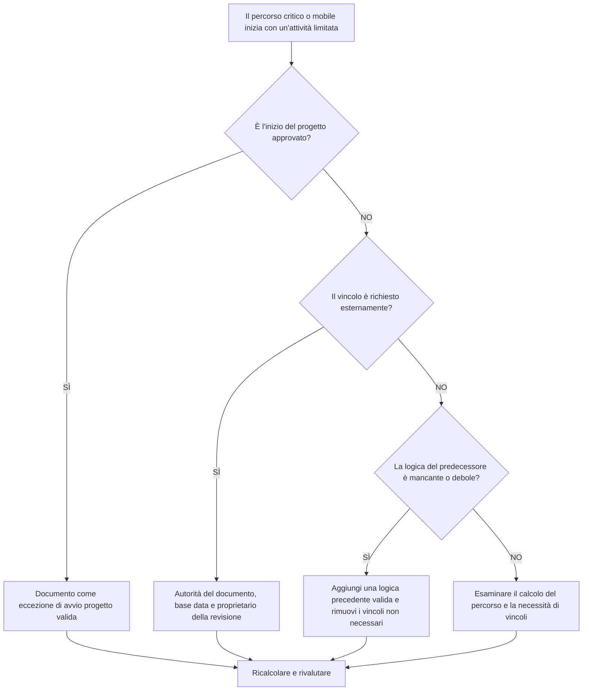

## Scopo

Questa guida aiuta gli addetti alla pianificazione a rivedere il percorso critico o le catene di percorsi mobili che iniziano con un'attività vincolata. L'inizio del progetto approvato costituisce normalmente un'eccezione valida; la preoccupazione è quando un percorso a valle inizia da un vincolo anziché da una sequenza logica.

## Prima di iniziare

Raccogli le seguenti informazioni prima di agire:

- Risultato della valutazione attuale per questa metrica.
- Rapporto sul percorso critico o sul percorso del margine da Primavera P6.
- Prima attività su ogni percorso segnalato.
- Tipo di vincolo, data di vincolo ed eventuali date previste.
- Relazioni predecessore e successore per l'attività di inizio percorso.
- Data di aggiornamento, traguardo di inizio del progetto, requisiti di base e regole di pianificazione del PMO o del cliente.
- Spiegazione di eventuali vincoli esterni approvati.

## Comprendi il tuo risultato

Un risultato efficace è rappresentato da zero percorsi critici o margine irrisolti che iniziano con un vincolo, ad eccezione dell'inizio del progetto approvato.

Un risultato accettabile può includere vincoli esterni documentati, come l'avviso di procedere, il rilascio dell'accesso del proprietario, il rilascio del permesso o punti di sospensione contrattuali. Questi dovrebbero essere chiaramente giustificati.

Un risultato debole significa che il percorso potrebbe essere controllato da date imposte anziché dalla logica di rete. Ciò può rendere il percorso critico o il percorso del margine meno affidabile per la previsione, il reporting e l'analisi dei ritardi.

## Obiettivo di miglioramento

L'obiettivo è 0 percorsi irrisolti che iniziano con un vincolo.

L'obiettivo è verificare se il percorso debba iniziare dall'inizio del progetto approvato, da una logica precedente valida o da un vincolo esterno documentato.

## Piano d'azione

### Passaggio 1: identificare il problema principale

Crea un layout o un report P6 che mostri il percorso critico e i percorsi mobili selezionati. Per la prima attività su ciascun percorso, includere ID attività, Nome attività, WBS, Inizio, Fine, Margine totale, Margine libero, Vincolo primario, Data vincolo, Predecessori, Successori e Stato attività.

Esamina ogni percorso contrassegnato e chiedi:

- Si tratta dell'avvio del progetto approvato o dell'attività di avviso di procedere?
- Il vincolo è richiesto contrattualmente o esternamente?
- All'attività manca la logica del predecessore?
- Il vincolo maschera una rete di orari debole o incompleta?
- Il percorso inizierebbe diversamente se il vincolo venisse rimosso?
- L'avvio vincolato è documentato per il PMO o la revisione del cliente?

### Passaggio 2: applicare le correzioni consigliate

Se l'attività vincolata corrisponde all'inizio del progetto approvato, documentarlo come un'eccezione valida e confermare che si tratta del punto di inizio previsto per il percorso.

Se il vincolo è richiesto esternamente, mantenerlo solo quando il motivo è chiaro. Documentare la fonte, ad esempio una tappa fondamentale del contratto, una liberatoria di accesso, un permesso, un'istruzione del proprietario o un requisito normativo.

Se il vincolo non è richiesto, rimuoverlo e aggiungere una logica precedente valida in cui l'attività dipende dal lavoro precedente, dalle approvazioni, dai trasferimenti, dall'approvvigionamento o dall'accesso. Ricalcolare la pianificazione e confermare che il percorso è ora guidato dalla logica.

### Passaggio 3: rimuovere i blocchi comuni

I blocchi comuni includono vincoli ereditati da vecchie baseline, vincoli utilizzati per forzare date, logica dell'interfaccia mancante e proprietà poco chiara di date esterne.

Un altro ostacolo è presupporre che un percorso critico sia affidabile semplicemente perché P6 lo identifica. Se il percorso inizia con un vincolo non necessario, è possibile che rifletta il controllo della data anziché la vera logica CPM.

### Passaggio 4: convalidare le modifiche

Ricalcolare la pianificazione dopo aver modificato i vincoli o la logica. Esamina il percorso critico, il percorso più lungo, i percorsi margine selezionati, il margine totale e le date chiave delle tappe fondamentali.

Se il percorso cambia in modo significativo, documentarne il motivo e comunicarne l'impatto al responsabile dei controlli di progetto, al revisore del PMO o allo schedulatore del cliente.

## Cronoprogramma di miglioramento

### Giorno 1: revisione e diagnosi

Esegui la metrica, identifica le attività vincolate di inizio percorso e separa i risultati in eccezioni di inizio progetto, vincoli esterni validi, logica mancante e vincoli non necessari.

### Giorni 2-3: implementare le azioni prioritarie

Correggere prima i percorsi critici e sensibili al cliente. Rimuovi i vincoli non necessari, aggiungi la logica mancante e documenta le eccezioni approvate.

### Giorni 4-5: monitorare i primi risultati

Ricalcola la pianificazione e rivedi il movimento nel percorso critico, nel percorso più lungo, nei percorsi fluttuanti e nelle date cardine.

### Giorno 6: aggiustamenti finali

La risoluzione del percorso vincolato rimanente inizia con il proprietario responsabile, il responsabile dei controlli di progetto o il revisore del cliente.

### Giorno 7: rivalutare e confrontare

Eseguire nuovamente la valutazione e confrontare il risultato con la soglia target.

## Monitoraggio dei progressi

Utilizza un semplice tracker per gestire correzioni e approvazioni.

| Data | Azione intrapresa | Impatto previsto | Risultato / Osservazione | Passaggio successivo |
| --- | --- | --- | --- | --- |
| [Data] | Revisione delle attività di inizio percorso vincolate | Identificare gli inizi del percorso guidati dalla data | [Risultato osservato] | Assegna proprietario |
| [Data] | Rimosso il vincolo non necessario | Ripristina il percorso basato sulla logica | [Risultato osservato] | Ricalcolare il cronoprogramma |
| [Data] | Eccezione approvata documentata | Migliora la tracciabilità delle recensioni | [Risultato osservato] | Rivalutare la metrica |

## Se i risultati non migliorano

Se i risultati non migliorano, verificare se i vincoli sono concentrati in un'area specifica della WBS, in un pacchetto di interfacce o in una fase del progetto. Risultati ripetuti possono indicare che la pianificazione è controllata da date imposte piuttosto che da una logica completa.

L'escalation di percorsi vincolati irrisolti inizia quando influiscono su lavori critici, quasi critici, contrattuali, sensibili al cliente, legati all'accesso o al passaggio di consegne.

## Manutenzione

Rivedere questa metrica durante ogni aggiornamento della pianificazione, revisione della baseline e esercizio di risequenziamento principale. Prestare particolare attenzione dopo la pianificazione del ripristino, le modifiche della data del cliente o le revisioni dell'interfaccia.

## Lista di controllo riepilogativa

- [ ] Risultato attuale rivisto
- [ ] Soglia target confermata
- [ ] Report sul percorso critico o mobile esaminato
- [ ] Eccezioni all'avvio del progetto identificate
- [ ] Base dei vincoli controllata
- [ ] Logica mancante corretta
- [ ] Eliminati i vincoli inutili
- [ ] Eccezioni approvate documentate
- [ ] Cronoprogramma ricalcolato
- [ ] Risultati monitorati
- [ ] Valutazione ripetuta
- [ ] Passaggi successivi documentati
## Contenuti correlati
- [Modello di blog](03_blog_template.md)
- [Cos'è un cronoprogramma](../../11b_blogs_it/01_WHAT%20A%20SCHEDULE%20IS/01_blog.md)
- [Logica robusta](../../11b_blogs_it/02_ROBUST%20LOGIC/02_ROBUST%20LOGIC.md)
