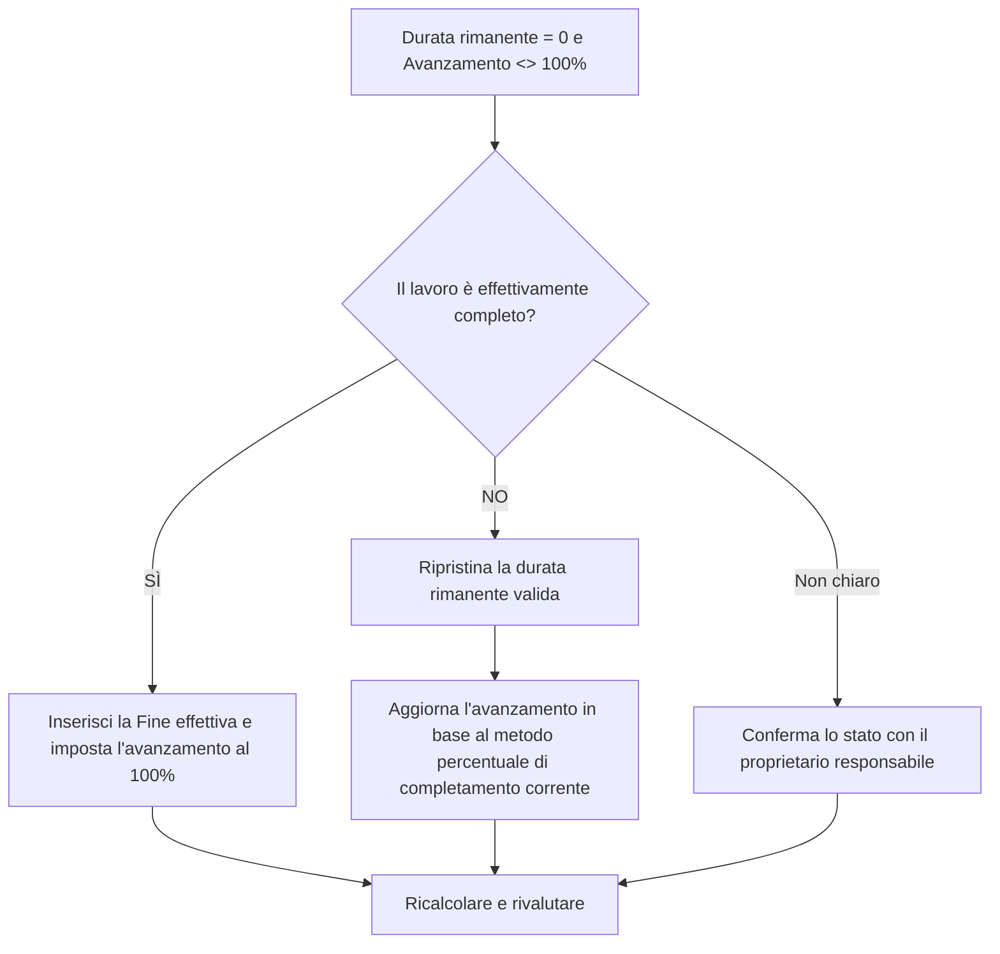

# Attività con durata rimanente 0 e avanzamento non al 100% - Guida al miglioramento

## Scopo

Questa guida aiuta gli addetti alla pianificazione a rivedere e correggere le attività in cui la Durata rimanente è pari a 0 ma il progresso non è al 100%. Supporta aggiornamenti di stato di Primavera P6 più puliti allineando la durata rimanente, la percentuale di avanzamento, il completamento effettivo e lo stato dell'attività.

## Prima di iniziare

Raccogli le seguenti informazioni prima di agire:

- Risultato della valutazione attuale per questa metrica.
- Elenco delle attività con Durata rimanente = 0 e progresso <> 100%.
- Stato attività, Inizio effettivo, Fine effettiva, Durata originale, Durata rimanente e Durata al completamento.
- Tipo di completamento percentuale e relativi campi di avanzamento.
- Percentuale di completamento fisico, Percentuale di completamento durata, Percentuale di completamento unità e Percentuale di completamento attività.
- Data di aggiornamento e note sull'ultimo aggiornamento dello stato di avanzamento.
- Conferma sul campo se il lavoro è completo o se c'è ancora del lavoro rimanente.

## Comprendi il tuo risultato

Un risultato valido è rappresentato da zero attività con Durata rimanente = 0 e progresso inferiore o superiore al 100%.

Un risultato accettabile può includere rari casi documentati in cui una specifica percentuale di metodo di completamento crea una differenza temporanea nella rendicontazione, ma questi dovrebbero essere risolti prima della rendicontazione formale.

Un risultato debole significa che la pianificazione contiene attività il cui lavoro rimanente e lo stato di avanzamento non concordano. Ciò potrebbe creare report imprecisi, problemi di valore maturato o stato di completamento fuorviante.

## Obiettivo di miglioramento

L'obiettivo è 0 attività irrisolte con Durata rimanente = 0 e progresso <> 100%.

L'obiettivo è verificare se ogni attività è completa, se l'avanzamento è stato aggiornato in modo errato o se utilizza un metodo di completamento percentuale che necessita di revisione.

## Piano d'azione

### Passaggio 1: identificare il problema principale

Creare un layout o un report P6 che filtri le attività in cui la Durata rimanente è uguale a 0 e l'avanzamento non è al 100%. Includere ID attività, Nome attività, WBS, Stato attività, Inizio effettivo, Fine effettiva, Durata originale, Durata rimanente, Tipo di completamento percentuale, Percentuale di completamento fisico, Percentuale di durata completata, Percentuale di completamento unità e Percentuale di completamento attività.

Rivedi ogni attività e chiedi:

- Il lavoro è effettivamente completo?
- Se completo, manca la fine effettiva?
- Se non è completa, perché la Durata rimanente è 0?
- Quale tipo di percentuale di completamento viene utilizzato?
- Il valore del progresso deriva dal progresso fisico, dalla durata o dalle unità?
- Si tratta di un errore di aggiornamento dello stato o di un problema di calcolo dei progressi?

### Passaggio 2: applicare le correzioni consigliate

Se il lavoro è completo, aggiorna l'attività come completata. Immettere la Fine effettiva, confermare che la Durata rimanente è 0 e confermare che l'avanzamento è al 100% secondo la procedura di aggiornamento del progetto.

Se il lavoro non è completo, ripristinare una Durata rimanente adeguata. Confermare il lavoro rimanente con il proprietario responsabile e aggiornare il campo di avanzamento pertinente in base al tipo di completamento percentuale dell'attività.

Se il problema è causato da un metodo di completamento percentuale, verificare se l'attività deve utilizzare Percentuale di completamento fisica, Durata Percentuale di completamento o Unità Percentuale di completamento. Non modificare casualmente il tipo di percentuale di completamento; allinearlo con la procedura dei controlli di progetto.

### Passaggio 3: rimuovere i blocchi comuni

I blocchi comuni includono aggiornamenti dei campi incompleti, date di fine effettiva mancanti, confusione tra percentuale fisica e durata completata e avanzamento importato da sistemi esterni senza convalida.

Un altro ostacolo è trattare la Durata rimanente come un campo di avanzamento. La Durata rimanente dovrebbe rappresentare quanto tempo è ancora necessario per completare l'attività, non semplicemente la quantità di lavoro dichiarato completato.

### Passaggio 4: convalidare le modifiche

Ricalcolare il cronoprogramma dopo le correzioni. Eseguire nuovamente la metrica e confermare che ogni elemento rimanente sia corretto o assegnato per il follow-up.

Esaminare le attività completate, le date di fine effettive, i report sullo stato di avanzamento, gli output del valore maturato e i report lookahead per confermare che la correzione non ha creato nuove incoerenze.

## Cronoprogramma di miglioramento

### Giorno 1: revisione e diagnosi

Esegui la metrica, conferma la data di aggiornamento e separa i risultati in stato di lavoro completato mancante, lavoro incompiuto con durata rimanente pari a zero e problemi relativi al metodo percentuale di completamento.

### Giorni 2-3: implementare le azioni prioritarie

Attività corrette utilizzate per prime nel reporting. Aggiorna la fine effettiva, ripristina la durata rimanente o correggi i valori di avanzamento secondo necessità.

### Giorni 4-5: monitorare i primi risultati

Ricalcola la pianificazione ed esamina i rapporti sullo stato di avanzamento, gli elenchi delle attività completate e gli output del valore maturato.

### Giorno 6: aggiustamenti finali

Risolvere gli elementi incerti rimanenti con la disciplina responsabile, il responsabile sul campo o il responsabile dei controlli di progetto.

### Giorno 7: rivalutare e confrontare

Eseguire nuovamente la valutazione e confrontare il risultato con la soglia target.

## Monitoraggio dei progressi

Utilizza un semplice tracker per gestire correzioni e approvazioni.

| Data | Azione intrapresa | Impatto previsto | Risultato / Osservazione | Passaggio successivo |
| --- | --- | --- | --- | --- |
| [Data] | Revisionato RD 0 e progresso non 100 attività | Identificare l'incoerenza dello stato | [Risultato osservato] | Assegna proprietario |
| [Data] | Immesso il fine effettiva e corretto l'avanzamento | Allinea lo stato completato | [Risultato osservato] | Ricalcolare il cronoprogramma |
| [Data] | Durata rimanente ripristinata | Correggere lo stato delle attività non completate | [Risultato osservato] | Rivalutare la metrica |

## Se i risultati non migliorano

Se i risultati non migliorano, controlla se gli aggiornamenti sull'avanzamento vengono importati, copiati o calcolati in modo incoerente. Verificare se diversi team utilizzano metodi di percentuale di completamento diversi o se mancano le date di fine effettiva dal flusso di lavoro di aggiornamento.

Inoltrare le questioni irrisolte quando incidono su attività critiche, quasi critiche, sul valore maturato, sulla reportistica dei clienti, sui pagamenti o sul lavoro correlato alla consegna.

## Manutenzione

Esaminare questa metrica durante ogni ciclo di aggiornamento prima di emettere report. Dovrebbe far parte della convalida standard dell'aggiornamento insieme alle date effettive, alla durata rimanente, alla percentuale di completamento e ai controlli sullo stato delle attività.

## Lista di controllo riepilogativa

- [ ] Risultato attuale rivisto
- [ ] Soglia target confermata
- [ ] Data di aggiornamento confermata
- [ ] Problema principale identificato
- [ ] Attività completate aggiornate correttamente
- [ ] Date di fine effettive inserite dove necessario
- [ ] Durata rimanente ripristinata laddove il lavoro è incompleto
- [ ] Tipo di completamento percentuale rivisto
- [ ] Cronoprogramma ricalcolato
- [ ] Risultati monitorati
- [ ] Valutazione ripetuta
- [ ] Passaggi successivi documentati
## Contenuti correlati
- [Attività con durata rimanente 0 e avanzamento non al 100% - Panoramica](01_overview_template.md)
- [Modello di blog](03_blog_template.md)
- [Cos'è un cronoprogramma](../../11b_blogs_it/01_WHAT%20A%20SCHEDULE%20IS/01_blog.md)
- [Logica robusta](../../11b_blogs_it/02_ROBUST%20LOGIC/02_ROBUST%20LOGIC.md)
