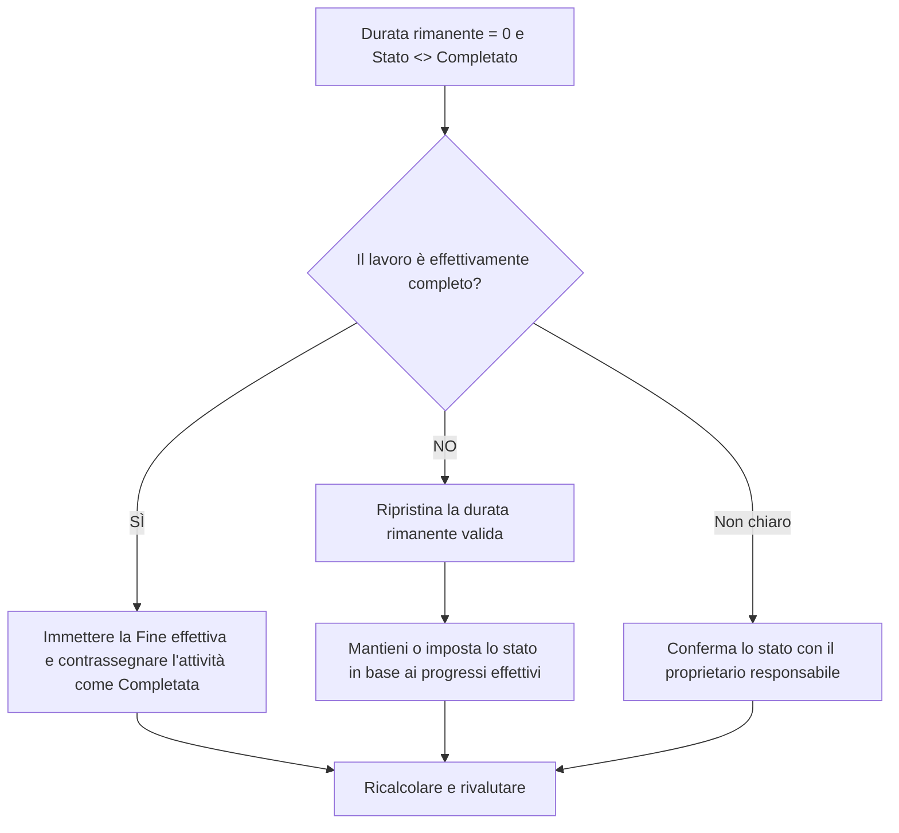

# Attività con durata rimanente 0 e stato non completato - Guida al miglioramento

## Scopo

Questa guida aiuta gli addetti alla pianificazione a rivedere e correggere le attività in cui la Durata rimanente è uguale a 0 ma lo Stato attività non è Completato. Supporta aggiornamenti puliti di Primavera P6 allineando la durata rimanente, la fine effettiva e lo stato dell'attività.

## Prima di iniziare

Raccogli le seguenti informazioni prima di agire:

- Risultato della valutazione attuale per questa metrica.
- Elenco delle attività con Durata rimanente = 0 e Stato attività <> Completato.
- Stato attività, Inizio effettivo, Fine effettiva, Durata originale, Durata rimanente e Durata al completamento.
- Tipo di completamento percentuale e campi chiave di avanzamento.
- Data di aggiornamento e note dell'ultimo aggiornamento.
- Conferma sul campo se il lavoro è completo o se c'è ancora del lavoro rimanente.

## Comprendi il tuo risultato

Un risultato valido è rappresentato da zero attività con Durata rimanente = 0 e stato non Completato.

Un risultato accettabile può includere rari casi di aggiornamento temporaneo, ma questi dovrebbero essere risolti prima della segnalazione formale.

Un risultato debole significa che la pianificazione contiene attività il cui tempo rimanente e lo stato di completamento non concordano. Ciò può creare report sullo stato di avanzamento fuorvianti, attualizzazione incompleta e risultati inaffidabili di lookahead o di valore maturato.

## Obiettivo di miglioramento

L'obiettivo è 0 attività non risolte con Durata rimanente = 0 e Stato attività <> Completato.

L'obiettivo è verificare se ogni attività è completa e deve essere chiusa oppure incompleta e deve essere ripristinata una Durata rimanente valida.

## Piano d'azione

### Passaggio 1: identificare il problema principale

Creare un layout o un report P6 che filtri le attività in cui la Durata rimanente è uguale a 0 e lo Stato attività non è Completato. Includere ID attività, Nome attività, WBS, Stato attività, Inizio effettivo, Fine effettiva, Durata originale, Durata rimanente, Tipo di completamento percentuale, Percentuale di completamento attività, Inizio, Fine e Margine totale.

Rivedi ogni attività e chiedi:

- Il lavoro è effettivamente completo?
- Se completo, perché lo stato dell'attività non è completato?
- Manca la fine effettiva?
- Se il lavoro non è completo, perché la Durata rimanente è 0?
- Lo stato è stato importato o aggiornato manualmente?
- L'attività rappresenta un traguardo, un livello di impegno o un altro tipo di attività speciale?

### Passaggio 2: applicare le correzioni consigliate

Se il lavoro è completo, aggiorna l'attività come Completato. Immettere la Fine effettiva, confermare che la Durata rimanente è 0 e verificare che i valori di avanzamento siano allineati con la procedura di aggiornamento del progetto.

Se il lavoro non è completo, ripristinare una Durata rimanente adeguata. Conferma il lavoro rimanente con il proprietario responsabile e mantieni lo stato dell'attività come In corso o Non iniziato in base allo stato di avanzamento effettivo.

Se il problema deriva dai dati di avanzamento importati, esamina la mappatura dell'importazione e aggiorna il flusso di lavoro. Il processo di aggiornamento non dovrebbe lasciare le attività con zero tempo rimanente ma con stato incompleto.

### Passaggio 3: rimuovere i blocchi comuni

I blocchi comuni includono date di fine effettiva mancanti, conferma di campi incompleta, dati di aggiornamento importati e confusione tra lo stato della durata e lo stato dell'attività.

Un altro blocco sta chiudendo la durata rimanente senza completare formalmente l'attività. La Durata rimanente e lo Stato dell'attività dovrebbero raccontare la stessa storia riguardo alla permanenza del lavoro.

### Passaggio 4: convalidare le modifiche

Ricalcolare il cronoprogramma dopo le correzioni. Eseguire nuovamente la metrica e confermare che ogni elemento rimanente sia corretto o assegnato per il follow-up.

Esaminare gli elenchi delle attività completate, le date di fine effettive, i rapporti sullo stato di avanzamento, gli output del valore maturato e i rapporti previsionali per confermare che la correzione non ha creato nuove incoerenze.

## Cronoprogramma di miglioramento

### Giorno 1: revisione e diagnosi

Esegui la metrica, conferma la data di aggiornamento e separa i risultati in lavoro completo senza stato completato, lavoro incompleto con durata rimanente pari a zero e problemi di importazione o flusso di lavoro.

### Giorni 2-3: implementare le azioni prioritarie

Attività corrette utilizzate per prime nel reporting. Inserisci la fine effettiva, contrassegna le attività come completate o ripristina la durata rimanente secondo necessità.

### Giorni 4-5: monitorare i primi risultati

Ricalcolare la pianificazione ed esaminare i rapporti sulle attività completate, i rapporti sui progressi e gli output sul valore maturato.

### Giorno 6: aggiustamenti finali

Risolvere gli elementi incerti rimanenti con la disciplina responsabile, il responsabile sul campo o il responsabile dei controlli di progetto.

### Giorno 7: rivalutare e confrontare

Eseguire nuovamente la valutazione e confrontare il risultato con la soglia target.

## Monitoraggio dei progressi

Utilizza un semplice tracker per gestire correzioni e approvazioni.

| Data | Azione intrapresa | Impatto previsto | Risultato / Osservazione | Passaggio successivo |
| --- | --- | --- | --- | --- |
| [Data] | Revisionato RD 0 e stato non Attività completate | Identificare l'incoerenza dello stato | [Risultato osservato] | Assegna proprietario |
| [Data] | Immesso la Fine effettiva e contrassegnato come Completato | Allinea lo stato completato | [Risultato osservato] | Ricalcolare il cronoprogramma |
| [Data] | Durata rimanente ripristinata | Correggere lo stato delle attività non completate | [Risultato osservato] | Rivalutare la metrica |

## Se i risultati non migliorano

Se i risultati non migliorano, controlla se gli aggiornamenti sull'avanzamento vengono importati, copiati o modificati manualmente in modo incoerente. Verificare se nel flusso di lavoro di aggiornamento mancano le date di fine effettiva o se gli utenti stanno impostando la durata rimanente su 0 senza completare le attività.

Inoltrare le questioni irrisolte quando incidono su attività critiche, quasi critiche, sul valore maturato, sulla reportistica dei clienti, sui pagamenti o sul lavoro correlato alla consegna.

## Manutenzione

Esaminare questa metrica durante ogni ciclo di aggiornamento prima di emettere report. Dovrebbe far parte della convalida standard dell'aggiornamento insieme alle date effettive, alla durata rimanente, alla percentuale di completamento e ai controlli sullo stato delle attività.

## Lista di controllo riepilogativa

- [ ] Risultato attuale rivisto
- [ ] Soglia target confermata
- [ ] Data di aggiornamento confermata
- [ ] Problema principale identificato
- [ ] Attività completate contrassegnate correttamente
- [ ] Date di fine effettive inserite dove necessario
- [ ] Durata rimanente ripristinata laddove il lavoro è incompleto
- [ ] Flusso di lavoro di importazione o aggiornamento selezionato
- [ ] Cronoprogramma ricalcolato
- [ ] Risultati monitorati
- [ ] Valutazione ripetuta
- [ ] Passaggi successivi documentati
## Contenuti correlati
- [Attività con durata rimanente 0 e stato non completato - Panoramica](01_overview_template.md)
- [Modello di blog](03_blog_template.md)
- [Cos'è un cronoprogramma](../../11b_blogs_it/01_WHAT%20A%20SCHEDULE%20IS/01_blog.md)
- [Logica robusta](../../11b_blogs_it/02_ROBUST%20LOGIC/02_ROBUST%20LOGIC.md)
