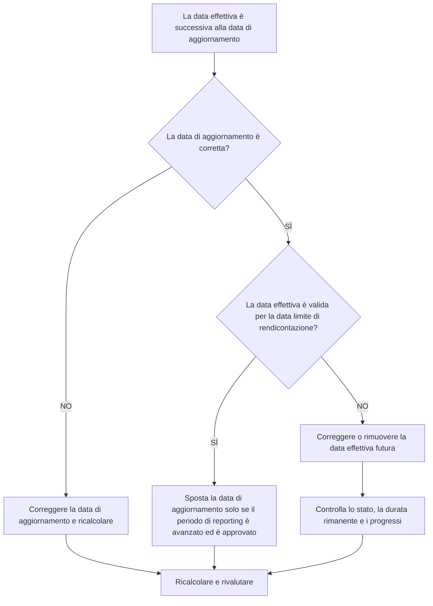

# Date effettive successive alla data di aggiornamento in Primavera P6 - Guida al miglioramento

## Scopo

Questa guida aiuta gli addetti alla pianificazione a rivedere e correggere le attività con date effettive successive alla data di aggiornamento del Primavera P6. Supporta la disciplina dell'aggiornamento pulito mantenendo le prestazioni effettive entro o prima del limite di aggiornamento.

## Prima di iniziare

Raccogli le seguenti informazioni prima di agire:

- Risultato della valutazione attuale per questa metrica.
- Dati del progetto Data utilizzata nell'ultimo aggiornamento della pianificazione.
- Elenco delle attività con date effettive superiori alla Data Data.
- Campi Inizio effettivo, Fine effettiva, Stato attività, Durata rimanente e Percentuale di completamento.
- Origine dell'aggiornamento sullo stato di avanzamento, ad esempio rapporto sul campo, file di importazione, scheda attività o aggiornamento manuale.
- Regole di interruzione dell'aggiornamento del progetto e periodo di riferimento.
- Qualsiasi voce di lavoro nota con data futura o problema di importazione dei dati.

## Comprendi il tuo risultato

Un risultato efficace è costituito da zero attività con date effettive successive alla data di aggiornamento.

Un risultato accettabile dovrebbe essere ancora zero. Le date effettive successive alla data di aggiornamento normalmente indicano un errore di aggiornamento o una data di aggiornamento errata.

Un risultato debole significa che la pianificazione contiene valori effettivi futuri. Ciò può far sì che il report di pianificazione funzioni come completato o iniziato prima che il periodo di aggiornamento abbia effettivamente raggiunto quella data.

## Obiettivo di miglioramento

L'obiettivo è 0 attività non risolte con date effettive superiori alla data di aggiornamento.

L'obiettivo è verificare se la data effettiva è errata, la data di aggiornamento è errata o il processo di importazione degli aggiornamenti consente valori effettivi futuri.

## Piano d'azione

### Passaggio 1: identificare il problema principale

Creare un layout o un report P6 che filtri le attività con Inizio effettivo, Fine effettiva o altre date effettive successive alla data di aggiornamento. Includere ID attività, Nome attività, WBS, Stato attività, Inizio effettivo, Fine effettiva, Inizio, Fine, Durata rimanente, Percentuale di completamento, Calendario e Riferimento data di aggiornamento.

Rivedi ogni attività e chiedi:

- La data di aggiornamento del progetto è corretta?
- La data effettiva è corretta?
- L'aggiornamento includeva progressi oltre la data limite?
- Un file di importazione ha caricato date effettive future?
- È opportuno modificare la data effettiva o spostare la data di aggiornamento?
- Lo stato dell'attività corrisponde alla data effettiva corretta?

### Passaggio 2: applicare le correzioni consigliate

Se la data di aggiornamento è sbagliata, correggila in base al periodo di reporting approvato e ricalcola la pianificazione.

Se la data effettiva è sbagliata, correggere l'Inizio effettivo o la Fine effettiva con la data corretta. Se il lavoro non è effettivamente iniziato o terminato entro la data di aggiornamento, rimuovere l'effettivo futuro e aggiornare correttamente lo stato, la durata rimanente e la percentuale di completamento.

Se il problema deriva da un'importazione, esamina il file di importazione e la mappatura. Confermare che le date effettive future siano bloccate o controllate prima dell'emissione dei rapporti di pianificazione.

### Passaggio 3: rimuovere i blocchi comuni

I blocchi più comuni includono file di avanzamento che coprono date oltre il limite temporale del reporting, aggiornamenti manuali immessi senza controllare la data di aggiornamento e confusione tra date effettive e date di previsione.

Un altro blocco sta spostando la data di aggiornamento solo per accettare gli effettivi futuri. La data di aggiornamento deve rappresentare il limite di aggiornamento approvato e non essere modificata casualmente per nascondere un errore di stato.

### Passaggio 4: convalidare le modifiche

Ricalcolare il cronoprogramma dopo le correzioni. Eseguire nuovamente la metrica e verificare che non rimangano date effettive dopo la data di aggiornamento.

Esaminare gli elenchi di attività completate, gli elenchi di attività in corso, gli output del valore maturato e i report di confronto della pianificazione per confermare che la correzione non ha creato altre incoerenze di stato.

## Cronoprogramma di miglioramento

### Giorno 1: revisione e diagnosi

Eseguire la metrica, confermare la data di aggiornamento e separare i risultati in date effettive errate, data di aggiornamento errata, problemi di importazione e problemi di interruzione dell'aggiornamento.

### Giorni 2-3: implementare le azioni prioritarie

Attività corrette utilizzate per prime nel reporting. Correggi le date effettive, aggiorna gli stati e risolvi i problemi di importazione.

### Giorni 4-5: monitorare i primi risultati

Ricalcola la pianificazione ed esamina i rapporti sullo stato di avanzamento, gli elenchi delle attività completate, i risultati del valore maturato e le date delle tappe fondamentali.

### Giorno 6: aggiustamenti finali

Risolvere gli elementi incerti rimanenti con la disciplina responsabile, il responsabile sul campo o il responsabile dei controlli di progetto.

### Giorno 7: rivalutare e confrontare

Eseguire nuovamente la valutazione e confrontare il risultato con la soglia target.

## Monitoraggio dei progressi

Utilizza un semplice tracker per gestire correzioni e approvazioni.

| Data | Azione intrapresa | Impatto previsto | Risultato / Osservazione | Passaggio successivo |
| --- | --- | --- | --- | --- |
| [Data] | Date effettive riviste dopo la data di aggiornamento | Identificare i futuri effettivi | [Risultato osservato] | Assegna proprietario |
| [Data] | Inizio effettivo o Fine effettiva corretti | Ripristina il limite di stato valido | [Risultato osservato] | Ricalcolare il cronoprogramma |
| [Data] | Processo di importazione rivisto | Prevenire il ripetersi di effettivi futuri | [Risultato osservato] | Rivalutare la metrica |

## Se i risultati non migliorano

Se i risultati non migliorano, controlla se i valori effettivi futuri vengono introdotti ripetutamente tramite importazioni, schede attività o flussi di lavoro di aggiornamento manuale. Esaminare la procedura di interruzione degli aggiornamenti e verificare che la data di aggiornamento sia comunicata chiaramente a tutti i contributori.

Inoltrare le questioni irrisolte quando incidono su attività critiche, quasi critiche, sul valore maturato, sulla reportistica dei clienti, sui pagamenti o sul lavoro correlato alla consegna.

## Manutenzione

Esaminare questa metrica durante ogni ciclo di aggiornamento prima di emettere report. Dovrebbe far parte della convalida dello stato standard insieme ai controlli delle date effettive, della data di aggiornamento, della durata rimanente, della percentuale di completamento e dello stato dell'attività.

## Lista di controllo riepilogativa

- [ ] Risultato attuale rivisto
- [ ] Soglia target confermata
- [ ] Data di aggiornamento confermata
- [ ] Problema principale identificato
- [ ] Date effettive future corrette
- [ ] Stato dell'attività controllato
- [ ] Durata rimanente e progresso controllati
- [ ] Flusso di lavoro di importazione o aggiornamento esaminato
- [ ] Cronoprogramma ricalcolato
- [ ] Risultati monitorati
- [ ] Valutazione ripetuta
- [ ] Passaggi successivi documentati
## Contenuti correlati
- [Date effettive successive alla data di aggiornamento in Primavera P6 - Panoramica](01_overview_template.md)
- [Modello di blog](03_blog_template.md)
- [Cos'è un cronoprogramma](../../11b_blogs_it/01_WHAT%20A%20SCHEDULE%20IS/01_blog.md)
- [Logica robusta](../../11b_blogs_it/02_ROBUST%20LOGIC/02_ROBUST%20LOGIC.md)
