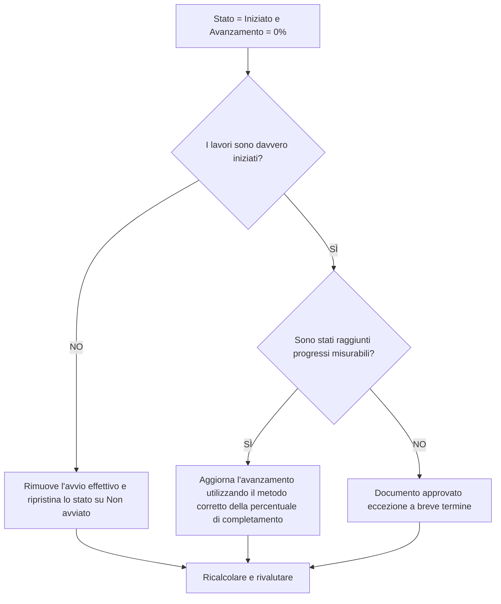

## Scopo

Questa guida aiuta gli addetti alla pianificazione a rivedere e correggere le attività in cui lo Stato attività è Avviato ma il progresso è 0%. Supporta aggiornamenti Primavera P6 più puliti allineando l'inizio effettivo, lo stato dell'attività, la percentuale di completamento e la durata rimanente.

## Prima di iniziare

Raccogli le seguenti informazioni prima di agire:

- Risultato della valutazione attuale per questa metrica.
- Elenco delle attività con Stato attività = Avviato e avanzamento = 0%.
- Inizio effettivo, Fine effettiva, Durata rimanente, Durata originale e Stato attività.
- Tipo di completamento percentuale e relativi campi di avanzamento.
- Percentuale di completamento fisico, Percentuale di completamento durata, Percentuale di completamento unità e Percentuale di completamento attività.
- Data di aggiornamento e note dell'ultimo aggiornamento.
- Conferma sul campo se il lavoro è effettivamente iniziato e quali progressi sono stati raggiunti.

## Comprendi il tuo risultato

Un risultato efficace è rappresentato da zero attività con stato Avviato e 0% di progresso.

Un risultato accettabile può includere rari casi documentati in cui un'attività è stata avviata proprio alla fine del periodo di aggiornamento e non è stato ancora ottenuto alcun progresso misurabile. Questi casi dovrebbero essere limitati e spiegati chiaramente.

Un risultato debole significa che la pianificazione contiene attività il cui stato di inizio e valore di avanzamento non concordano. Ciò può creare rapporti sui progressi fuorvianti, problemi di valore maturato e confusione nel guardare al futuro.

## Obiettivo di miglioramento

L'obiettivo è 0 attività non risolte con Stato attività = Avviato e avanzamento = 0%.

L'obiettivo è verificare se ogni attività è stata effettivamente avviata, se sono stati persi progressi o se l'attività deve essere reimpostata su Non iniziata.

## Piano d'azione

### Passaggio 1: identificare il problema principale

Crea un layout o un report P6 che filtri le attività con stato Avviato e 0% di progresso. Includere ID attività, Nome attività, WBS, Stato attività, Inizio effettivo, Fine effettiva, Durata originale, Durata rimanente, Tipo di completamento percentuale, Percentuale di completamento fisico, Percentuale di completamento durata, Percentuale di completamento unità, Percentuale di completamento attività, Inizio, Fine e Margine totale.

Rivedi ogni attività e chiedi:

- I lavori sono effettivamente iniziati?
- Se il lavoro fosse iniziato, quali progressi misurabili sarebbero stati raggiunti?
- L'inizio effettivo è corretto?
- Quale tipo di percentuale di completamento viene utilizzato?
- Mancano progressi nel campo corretto?
- L'attività è stata avviata amministrativamente senza un vero e proprio inizio lavorativo?

### Passaggio 2: applicare le correzioni consigliate

Se il lavoro non è effettivamente iniziato, rimuovere l'Inizio effettivo errato e riportare l'attività su Non iniziata. Conferma che la durata rimanente e le date di previsione sono ancora valide.

Se il lavoro è iniziato e sono stati raggiunti i progressi, aggiornare il campo di avanzamento corretto in base al tipo di completamento percentuale. Per Percentuale di completamento fisico, immettere il progresso fisico. Per Durata Percentuale di completamento, verificare che la Durata rimanente rifletta il lavoro svolto. Per Percentuale di completamento unità, verificare che l'avanzamento delle unità sia aggiornato.

Se il lavoro è iniziato ma non sono stati ottenuti progressi misurabili, documentarne il motivo. Questo dovrebbe essere raro e temporaneo, come un inizio di mobilitazione registrato vicino al termine dell’aggiornamento senza ancora alcun progresso ottenuto.

### Passaggio 3: rimuovere i blocchi comuni

I blocchi comuni includono quantità di campi mancanti, inizi effettivi importati senza valori di avanzamento, confusione sul tipo di percentuale di completamento e pressione nel mostrare il lavoro come iniziato prima che sia disponibile un progresso misurabile.

Un altro ostacolo è trattare l'inizio effettivo come un segnale di pianificazione invece che come un fatto di stato. L'inizio effettivo dovrebbe rappresentare l'inizio reale del lavoro, non l'intenzione di iniziare presto.

### Passaggio 4: convalidare le modifiche

Ricalcolare il cronoprogramma dopo le correzioni. Eseguire nuovamente la metrica e confermare che ogni elemento rimanente sia corretto, giustificato o assegnato per il follow-up.

Esaminare i report sullo stato di avanzamento, gli output del valore maturato, i report lookahead e gli elenchi delle attività in corso per confermare che la correzione non ha creato nuove incoerenze.

## Cronoprogramma di miglioramento

### Giorno 1: revisione e diagnosi

Esegui la metrica, conferma la data di aggiornamento e separa i risultati in avvii errati, progressi mancanti, problemi con il metodo percentuale di completamento e possibili eccezioni.

### Giorni 2-3: implementare le azioni prioritarie

Attività corrette utilizzate per prime nel reporting. Rimuovere gli avvii effettivi errati, aggiornare i valori di avanzamento o documentare le eccezioni valide.

### Giorni 4-5: monitorare i primi risultati

Ricalcola la pianificazione ed esamina i rapporti sullo stato di avanzamento, i risultati del valore maturato, gli elenchi delle attività in corso e i rapporti di previsione.

### Giorno 6: aggiustamenti finali

Risolvere gli elementi incerti rimanenti con la disciplina responsabile, il responsabile sul campo o il responsabile dei controlli di progetto.

### Giorno 7: rivalutare e confrontare

Eseguire nuovamente la valutazione e confrontare il risultato con la soglia target.

## Monitoraggio dei progressi

Utilizza un semplice tracker per gestire correzioni e approvazioni.

| Data | Azione intrapresa | Impatto previsto | Risultato / Osservazione | Passaggio successivo |
| --- | --- | --- | --- | --- |
| [Data] | Attività avviate esaminate con progressi dello 0%. | Identificare l'incoerenza dello stato | [Risultato osservato] | Assegna proprietario |
| [Data] | Rimosso l'avvio effettivo errato | Ripristina lo stato accurato | [Risultato osservato] | Ricalcolare il cronoprogramma |
| [Data] | Valore di avanzamento aggiornato | Allinea lo stato iniziato con l'avanzamento | [Risultato osservato] | Rivalutare la metrica |

## Se i risultati non migliorano

Se i risultati non migliorano, controlla se le partenze effettive vengono importate senza corrispondere ai valori di avanzamento o se i team utilizzano regole diverse per ciò che conta come iniziato. Esaminare la procedura di interruzione dell'aggiornamento e il metodo della percentuale di completamento.

Inoltrare le questioni irrisolte quando incidono su attività critiche, quasi critiche, sul valore maturato, sulla reportistica dei clienti, sui pagamenti o sul lavoro correlato alla consegna.

## Manutenzione

Esaminare questa metrica durante ogni ciclo di aggiornamento prima di emettere report. Dovrebbe far parte della convalida standard dell'aggiornamento insieme alle date effettive, alla durata rimanente, alla percentuale di completamento e ai controlli sullo stato delle attività.

## Lista di controllo riepilogativa

- [ ] Risultato attuale rivisto
- [ ] Soglia target confermata
- [ ] Data di aggiornamento confermata
- [ ] Problema principale identificato
- [ ] Gli avvii effettivi errati sono stati rimossi
- [ ] Progressi mancanti aggiornati
- [ ] Tipo di completamento percentuale rivisto
- [ ] Eccezioni valide documentate
- [ ] Cronoprogramma ricalcolato
- [ ] Risultati monitorati
- [ ] Valutazione ripetuta
- [ ] Passaggi successivi documentati
## Contenuti correlati
- [Modello di blog](03_blog_template.md)
- [Cos'è un cronoprogramma](../../11b_blogs_it/01_WHAT%20A%20SCHEDULE%20IS/01_blog.md)
- [Logica robusta](../../11b_blogs_it/02_ROBUST%20LOGIC/02_ROBUST%20LOGIC.md)
