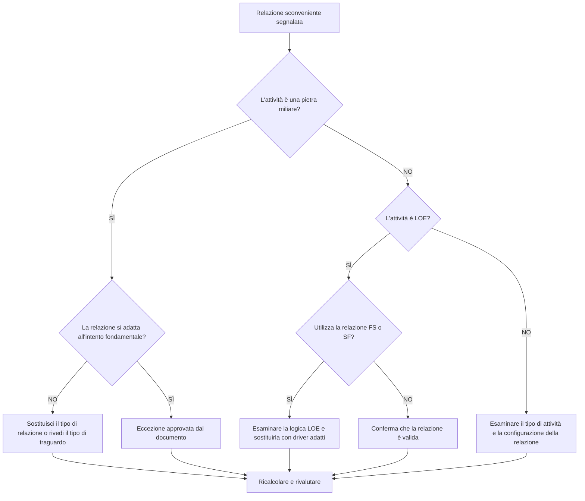

## Scopo

Questa guida aiuta gli addetti alla pianificazione a rivedere e correggere le relazioni inadeguate che coinvolgono le attività Milestone di fine, Start Milestone e Livello di impegno (LOE) in Primavera P6.

## Prima di iniziare

Raccogli le seguenti informazioni prima di agire:

- Risultato della valutazione attuale per questa metrica.
- Elenco delle relazioni contrassegnate per predecessore, successore, tipo di attività e tipo di relazione.
- ID attività, nome attività, WBS, tipo attività, inizio, fine, margine totale e stato del percorso critico o più lungo.
- Tipo di relazione, ritardo, tipo di attività predecessore e tipo di attività successore.
- Scopo fondamentale, scopo LOE e relativi requisiti di reporting.
- Dati Data e ultimo calcolo del cronoprogramma.

## Comprendi il tuo risultato

Un risultato forte è zero relazioni sconvenienti irrisolte.

La metrica dovrebbe contrassegnare questi casi:

- Completa Milestone con il successore SS o SF.
- Completa Milestone con il predecessore SS.
- Avvia Milestone con il predecessore FF o SF.
- Avvia Milestone con il successore FS o FF.
- LOE con relazione FS.
- LOE con relazione SF.

Possono esistere rare eccezioni, ma dovrebbero essere documentate e facili da spiegare durante una revisione del cronoprogramma.

## Obiettivo di miglioramento

L'obiettivo sono 0 relazioni sconvenienti irrisolte.

L'obiettivo è fare in modo che ogni tappa fondamentale e la relazione LOE corrispondano al comportamento di pianificazione previsto senza forzare date o nascondere una logica debole.

## Piano d'azione

### Passaggio 1: identificare il problema principale

Crea un layout o un report P6 che mostri tutte le attività cardine e LOE con i dettagli del predecessore e del successore. Includi tipo di attività, tipo di relazione, ritardo, inizio, fine, margine totale e indicatori di percorso critico o più lungo.

Esamina ogni relazione segnalata e chiedi:

- Il tipo di attività è corretto?
- Il tipo di relazione corrisponde allo scopo dell'obiettivo o del LOE?
- La relazione sta cercando di forzare una data di inizio, fine o di reporting?
- Una normale relazione FS, SS o FF rappresenterebbe meglio la logica?
- La relazione è un'eccezione approvata?

### Passaggio 2: applicare le correzioni consigliate

Per i traguardi finali, verificare che la logica guidi o risponda al completamento. Sostituisci le relazioni SS o SF quando non rappresentano una reale dipendenza basata sulla finitura.

Per le tappe iniziali, verificare che la logica supporti l'evento di inizio. Sostituire FF, SF, successore di FS o altre relazioni inadeguate quando vengono utilizzate per forzare una data di reporting.

Per le attività LOE, verificare se le relazioni FS o SF rendono erroneamente il funzionamento discreto dell'unità LOE. Le attività LOE normalmente riassumono o abbracciano altri lavori, quindi le loro relazioni dovrebbero essere gestite con attenzione.

Se il rapporto è valido per contratto, metodo del cliente o progettazione di un cronoprogramma speciale, documentare il motivo e l'approvazione.

### Passaggio 3: rimuovere i blocchi comuni

I blocchi comuni includono la logica copiata da pianificazioni precedenti, l'incomprensione del comportamento delle tappe fondamentali, l'uso delle relazioni SF come scorciatoia e l'uso delle attività LOE per controllare il lavoro che dovrebbe essere guidato da attività discrete.

Un altro ostacolo è considerare la pulizia della relazione come un’operazione cosmetica. Questi collegamenti possono influenzare il margine, il reporting del percorso critico, le date delle tappe fondamentali e la credibilità della pianificazione.

### Passaggio 4: convalidare le modifiche

Ricalcolare il cronoprogramma dopo le correzioni. Eseguire nuovamente la metrica e confermare che ogni elemento rimanente sia corretto, giustificato o assegnato per il follow-up.

Esaminare le date cardine, le date LOE, il margine totale, il percorso critico o più lungo e i principali output di reporting per confermare che la correzione non ha creato nuovi problemi.

## Cronoprogramma di miglioramento

### Giorno 1: revisione e diagnosi

Esegui la metrica e raggruppa i risultati per tipo di attività e modello di relazione.

### Giorni 2-3: implementare le azioni prioritarie

Correggere innanzitutto le relazioni sui traguardi critici, quasi critici, contrattuali, di consegna e rivolti al cliente.

### Giorni 4-5: monitorare i primi risultati

Ricalcola la pianificazione ed esamina il margine, il percorso critico, il movimento cardine e il comportamento LOE.

### Giorno 6: aggiustamenti finali

Risolvi le eccezioni rimanenti con il pianificatore, il responsabile dei controlli di progetto o il revisore PMO.

### Giorno 7: rivalutare e confrontare

Eseguire nuovamente la valutazione e confrontare il risultato con la soglia target.

## Monitoraggio dei progressi

Utilizza un semplice tracker per gestire correzioni e approvazioni.

| Data | Azione intrapresa | Impatto previsto | Risultato / Osservazione | Passaggio successivo |
| --- | --- | --- | --- | --- |
| [Data] | Rivisto relazioni sconvenienti | Identificare i problemi di tipo relazionale | [Risultato osservato] | Assegna proprietario |
| [Data] | Corretta la relazione tra le tappe fondamentali | Allineare la logica con lo scopo fondamentale | [Risultato osservato] | Ricalcolare il cronoprogramma |
| [Data] | Revisione delle relazioni LOE | Impedire a LOE di gestire il lavoro discreto in modo errato | [Risultato osservato] | Rivalutare la metrica |

## Se i risultati non migliorano

Se i risultati non migliorano, controlla se le stesse relazioni vengono reintrodotte tramite importazioni, logica copiata, modifiche globali o integrazione di pianificazioni esterne.

Inoltra le questioni irrisolte quando influiscono su traguardi contrattuali, reportistica sui percorsi critici, invii dei clienti, eventi di pagamento o date di consegna.

## Manutenzione

Esaminare questa metrica durante ogni ciclo di aggiornamento e prima dell'approvazione della baseline. È particolarmente utile dopo importazioni programmate, frammenti copiati, risequenziamenti importanti e revisioni di tappe fondamentali.

## Lista di controllo riepilogativa

- [ ] Risultato attuale rivisto
- [ ] Soglia target confermata
- [ ] Tipi di attività Milestone e LOE esaminati
- [ ] Tipi di relazione contrassegnati selezionati
- [ ] Corrette le relazioni errate
- [ ] Eccezioni valide documentate
- [ ] Cronoprogramma ricalcolato
- [ ] Margine e percorso critico rivisti
- [ ] Risultati monitorati
- [ ] Valutazione ripetuta
- [ ] Passaggi successivi documentati
## Contenuti correlati
- [03_blog_template](../14_unusual_relations/03_blog_template.md)
- [Cos'è un cronoprogramma](../../11b_blogs_it/01_WHAT%20A%20SCHEDULE%20IS/01_blog.md)
- [Logica robusta](../../11b_blogs_it/02_ROBUST%20LOGIC/02_ROBUST%20LOGIC.md)
