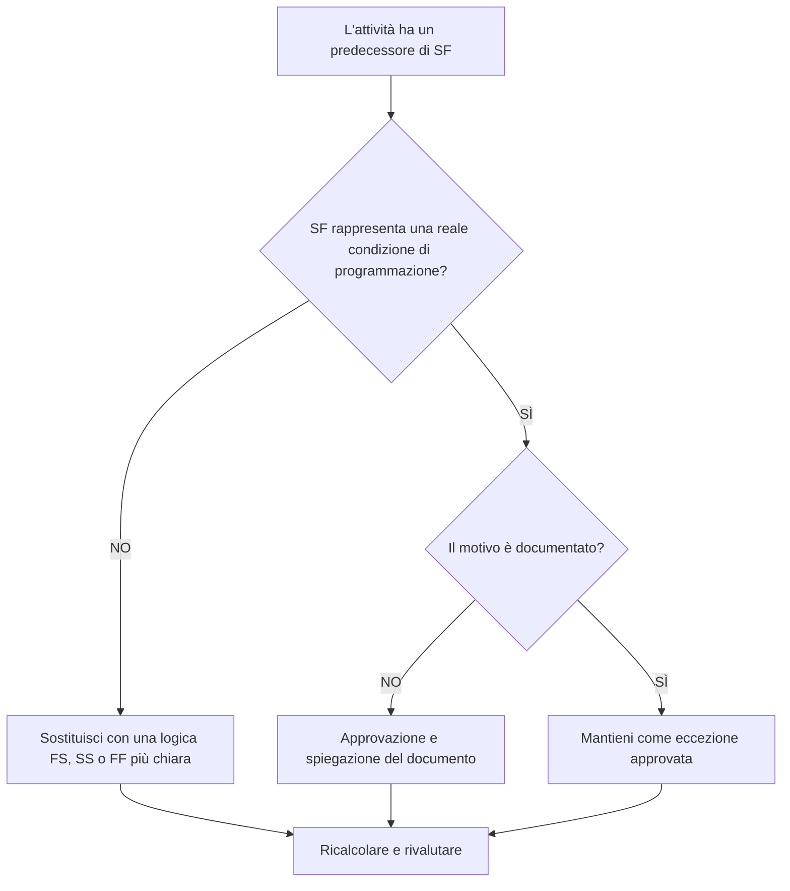

## Scopo

Questa guida aiuta gli addetti alla pianificazione a rivedere e correggere le attività delle attività che hanno relazioni predecessori dall'inizio alla fine (SF) in Primavera P6.

## Prima di iniziare

Raccogli le seguenti informazioni prima di agire:

- Risultato della valutazione attuale per questa metrica.
- Elenco delle attività del compito con almeno un predecessore SF.
- ID attività, nome attività, WBS, tipo attività, inizio, fine, margine totale e stato del percorso critico o più lungo.
- ID attività predecessore, tipo attività predecessore, tipo di relazione e ritardo.
- Eventuali vincoli, calendari, condizioni di finitura previste e relative note di aggiornamento.
- Dati Data e ultimo calcolo del cronoprogramma.

## Comprendi il tuo risultato

Un risultato importante è rappresentato da zero attività irrisolte con relazioni con i predecessori di SF.

Una relazione SF significa che l'attività successore non può terminare finché non viene avviata l'attività predecessore. Ciò è raro nella normale logica di costruzione, ingegneria, approvvigionamento o messa in servizio. La maggior parte delle relazioni tra attività dovrebbero essere rappresentate con la logica FS, SS o FF quando riflettono la sequenza reale.

Un risultato debole significa che il completamento dell'attività dell'attività può essere controllato da una logica difficile da giustificare o che è stata copiata da un'altra parte della pianificazione senza revisione.

## Obiettivo di miglioramento

L'obiettivo è 0 relazioni predecessori SF irrisolte sulle attività delle attività.

L'obiettivo è confermare se ciascuna relazione SF è un modello di pianificazione valido o dovrebbe essere sostituita con una logica più chiara.

## Piano d'azione

### Passaggio 1: identificare il problema principale

Crea un layout o un report P6 che filtri le attività delle attività con un predecessore SF. Includere ID predecessore e successore, tipo di attività, tipo di relazione, ritardo, inizio, fine, margine totale, vincoli e indicatori di percorso critico o più lungo.

Esamina ogni relazione e chiedi:

- Quale condizione reale cerca di rappresentare il rapporto di fantascienza?
- L'inizio del predecessore dovrebbe davvero controllare la fine del successore?
- La logica FS, SS o FF descriverebbe la sequenza in modo più chiaro?
- Viene utilizzato il ritardo per forzare una data?
- La relazione è sul percorso critico o quasi critico?
- Esiste una ragione documentata per utilizzare SF?

### Passaggio 2: applicare le correzioni consigliate

Se la relazione SF non rappresenta una condizione reale, sostituitela con il tipo di relazione che meglio descrive la sequenza. Utilizzare FS quando il successore deve iniziare dopo il completamento del predecessore, SS quando gli inizi sono collegati e FF quando l'allineamento finale è la logica prevista.

Se la relazione SF è stata aggiunta per controllare una data di fine, verificare se la pianificazione necessita invece di un predecessore, di un punto cardine, di una revisione dei vincoli o di una suddivisione delle attività adeguati.

Se la relazione SF è valida, documentare il motivo per cui è richiesta e chi l'ha approvata. Questa dovrebbe essere un'eccezione rara, non un modello di pianificazione comune.

### Passaggio 3: rimuovere i blocchi comuni

I blocchi comuni includono relazioni copiate, logica esterna importata, incomprensione del comportamento di SF e utilizzo di SF con ritardo per forzare una data di fine.

Un altro ostacolo sta abbandonando la relazione perché la data calcolata sembra accettabile. La relazione deve ancora essere logicamente difendibile.

### Passaggio 4: convalidare le modifiche

Ricalcolare il cronoprogramma dopo le correzioni. Eseguire nuovamente la metrica e confermare che ciascun predecessore SF rimanente sia corretto, giustificato o assegnato per il follow-up.

Esaminare il margine totale, il percorso critico o più lungo, le tappe fondamentali interessate e gli output lookahead per confermare che il cambiamento logico non ha creato nuovi problemi.

## Cronoprogramma di miglioramento

### Giorno 1: revisione e diagnosi

Esegui la metrica, conferma la data di aggiornamento e separa i risultati in relazioni SF non valide, possibili eccezioni ed elementi che richiedono l'input del proprietario.

### Giorni 2-3: implementare le azioni prioritarie

Correggere innanzitutto le relazioni SF sulle attività critiche, quasi critiche, contrattuali e a breve termine.

### Giorni 4-5: monitorare i primi risultati

Ricalcola la pianificazione e rivedi il margine, il percorso critico, le date di previsione e il movimento delle tappe fondamentali.

### Giorno 6: aggiustamenti finali

Risolvi le eccezioni rimanenti con il pianificatore, il responsabile della disciplina, il responsabile dei controlli di progetto o il revisore del PMO.

### Giorno 7: rivalutare e confrontare

Eseguire nuovamente la valutazione e confrontare il risultato con la soglia target.

## Monitoraggio dei progressi

Utilizza un semplice tracker per gestire correzioni e approvazioni.

| Data | Azione intrapresa | Impatto previsto | Risultato / Osservazione | Passaggio successivo |
| --- | --- | --- | --- | --- |
| [Data] | Attività revisionate con i predecessori di SF | Identificare la logica relazionale insolita | [Risultato osservato] | Assegna proprietario |
| [Data] | Sostituita la relazione SF non valida | Migliorare la chiarezza logica | [Risultato osservato] | Ricalcolare il cronoprogramma |
| [Data] | Eccezione SF valida documentata | Preservare la logica speciale approvata | [Risultato osservato] | Rivalutare la metrica |

## Se i risultati non migliorano

Se i risultati non migliorano, controlla se le relazioni SF vengono reintrodotte tramite importazioni, frammenti copiati, modifiche globali o integrazione di cronoprogrammi esterni.

Inoltra gli elementi irrisolti quando influiscono sul percorso critico, sulle tappe contrattuali, sugli invii dei clienti, sugli eventi di pagamento o sul lavoro di esecuzione a breve termine.

## Manutenzione

Rivedi questa metrica durante ogni ciclo di aggiornamento e prima dell'approvazione della baseline. È particolarmente utile dopo le importazioni pianificate, il risequenziamento importante e gli esercizi di pulizia logica.

## Lista di controllo riepilogativa

- [ ] Risultato attuale rivisto
- [ ] Soglia target confermata
- [ ] Generato elenco dei predecessori SF
- [ ] Viene data la priorità agli elementi critici e quasi critici
- [ ] Corrette le relazioni SF non valide
- [ ] Eccezioni valide documentate
- [ ] Cronoprogramma ricalcolato
- [ ] Margine e percorso critico rivisti
- [ ] Risultati monitorati
- [ ] Valutazione ripetuta
- [ ] Passaggi successivi documentati
## Contenuti correlati
- [Attività con i predecessori di SF in Primavera P6](03_blog_template.md)
- [Cos'è un cronoprogramma](../../11b_blogs_it/01_WHAT%20A%20SCHEDULE%20IS/01_blog.md)
- [Logica robusta](../../11b_blogs_it/02_ROBUST%20LOGIC/02_ROBUST%20LOGIC.md)
