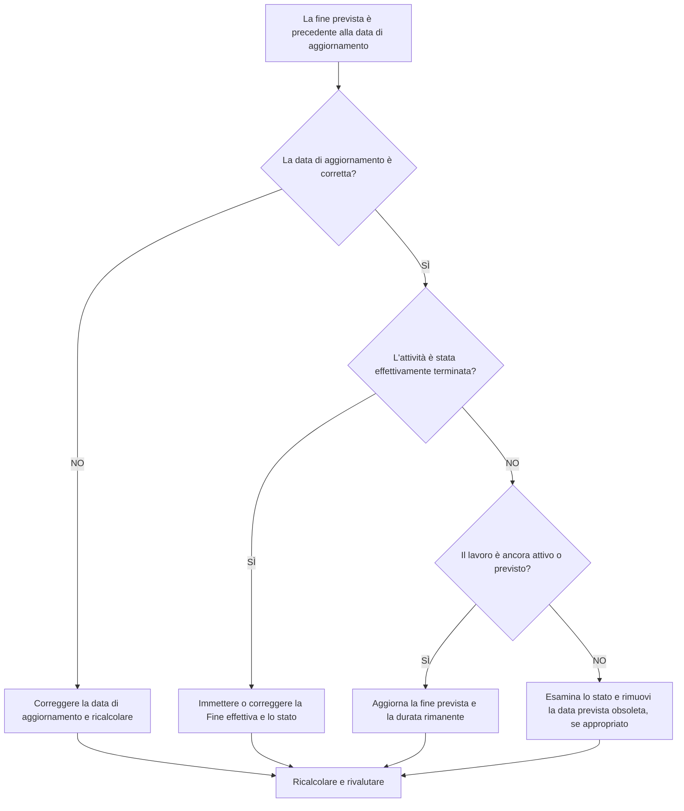

# Fine prevista prima della data di aggiornamento in Primavera P6 - Guida al miglioramento

## Scopo

Questa guida aiuta gli addetti alla pianificazione a rivedere e correggere le attività la cui data di fine prevista è precedente alla data di aggiornamento Primavera P6. Supporta una disciplina di aggiornamento più pulita mantenendo le date previste allineate all'attuale limite di reporting.

## Prima di iniziare

Raccogli le seguenti informazioni prima di agire:

- Risultato della valutazione attuale per questa metrica.
- Dati del progetto Data utilizzata nell'ultimo aggiornamento della pianificazione.
- Elenco di attività in cui la fine prevista è precedente alla data di aggiornamento.
- Stato attività, inizio effettivo, fine effettiva, durata rimanente, percentuale di completamento, inizio, fine e margine totale.
- Origine della finitura prevista, ad esempio immissione manuale, file di importazione, previsione del campo o flusso di lavoro di aggiornamento P6.
- Regole di interruzione dell'aggiornamento del progetto e ultime note sullo stato di avanzamento.

## Comprendi il tuo risultato

Un risultato efficace è costituito da zero attività con fine prevista prima della data di aggiornamento.

Una fine prevista prima della data di aggiornamento in genere significa che le informazioni sulla previsione o sul completamento previsto non sono state aggiornate quando la pianificazione è andata avanti. Potrebbe anche indicare che l'attività dovrebbe avere una Fine effettiva, una Durata rimanente rivista o uno stato corretto.

Un risultato debole significa che la pianificazione contiene date di completamento previste che si trovano nel passato rispetto al limite di aggiornamento corrente.

## Obiettivo di miglioramento

L'obiettivo è 0 attività non risolte con fine prevista prima della data di aggiornamento.

L'obiettivo è verificare se ciascuna attività è stata completata, ancora in corso, non avviata o aggiornata in modo errato.

## Piano d'azione

### Passaggio 1: identificare il problema principale

Creare un layout o un report P6 che filtri le attività in cui la fine prevista è precedente alla data di aggiornamento. Includere ID attività, Nome attività, WBS, Stato attività, Fine prevista, Inizio effettivo, Fine effettiva, Durata rimanente, Percentuale di completamento, Inizio, Fine, Margine totale e Calendario.

Rivedi ogni attività e chiedi:

- La data di aggiornamento è corretta?
- L'attività è stata effettivamente terminata prima della Data Data?
- Se è finito, manca la Fine effettiva?
- Se non è terminato, è necessario aggiornare la fine prevista?
- La Durata Rimanente rappresenta ancora il lavoro rimasto?
- Un'importazione o un aggiornamento manuale hanno lasciato indietro un vecchio valore di Fine prevista?

### Passaggio 2: applicare le correzioni consigliate

Se la data di aggiornamento è sbagliata, correggila in base al periodo di reporting approvato e ricalcola la pianificazione.

Se l'attività è terminata prima della data di aggiornamento, immettere o correggere la fine effettiva e verificare che lo stato dell'attività, la percentuale di completamento e la durata rimanente siano coerenti.

Se l'attività è ancora attiva o non completata, aggiornare la Fine prevista a una data valida corrispondente o successiva alla data di aggiornamento. Conferma la durata rimanente e le date di previsione riflettono le informazioni più recenti sul campo.

Se la fine prevista è stata introdotta tramite un'importazione, rivedere il file di importazione e la mappatura in modo che le date previste obsolete non vengano caricate ripetutamente.

### Passaggio 3: rimuovere i blocchi comuni

I blocchi comuni includono previsioni sui campi obsolete, importazioni di avanzamento che aggiornano la percentuale di completamento ma non le date previste e confusione tra Fine prevista, Fine prevista e Fine effettiva.

Un altro blocco ignora la fine prevista perché le date pianificate sembrano accettabili. In P6, le date previste possono influenzare il calcolo della pianificazione in base alle impostazioni e ai flussi di lavoro, pertanto è necessario rivedere i valori obsoleti.

### Passaggio 4: convalidare le modifiche

Ricalcolare il cronoprogramma dopo le correzioni. Eseguire nuovamente la metrica e verificare che non rimangano date di fine prevista irrisolte prima della data di aggiornamento.

Esaminare le attività in corso, la previsione a breve termine, il margine totale, le date delle tappe fondamentali e i rapporti di confronto della pianificazione per confermare che la correzione non ha creato nuove incoerenze.

## Cronoprogramma di miglioramento

### Giorno 1: revisione e diagnosi

Esegui la metrica, conferma la data di aggiornamento e separa i risultati in lavoro completato, date previste obsolete, problemi di durata rimanente e problemi di importazione.

### Giorni 2-3: implementare le azioni prioritarie

Attività corrette utilizzate per prime nel reporting. Aggiorna la fine effettiva, la fine prevista, la durata rimanente, la percentuale di completamento o lo stato dell'attività secondo necessità.

### Giorni 4-5: monitorare i primi risultati

Ricalcola la pianificazione ed esamina i report preventivi, gli elenchi delle attività in corso, i movimenti delle tappe fondamentali e le modifiche fluttuanti.

### Giorno 6: aggiustamenti finali

Risolvere gli elementi incerti rimanenti con la disciplina responsabile, il responsabile sul campo o il responsabile dei controlli di progetto.

### Giorno 7: rivalutare e confrontare

Eseguire nuovamente la valutazione e confrontare il risultato con la soglia target.

## Monitoraggio dei progressi

Utilizza un semplice tracker per gestire correzioni e approvazioni.

| Data | Azione intrapresa | Impatto previsto | Risultato / Osservazione | Passaggio successivo |
| --- | --- | --- | --- | --- |
| [Data] | Fine prevista rivista prima della data di aggiornamento | Identificare le date previste obsolete | [Risultato osservato] | Assegna proprietario |
| [Data] | Fine prevista o effettiva aggiornata | Allinea lo stato al limite dell'aggiornamento | [Risultato osservato] | Ricalcolare il cronoprogramma |
| [Data] | Processo di importazione rivisto | Prevenire il ripetersi di date previste obsolete | [Risultato osservato] | Rivalutare la metrica |

## Se i risultati non migliorano

Se i risultati non migliorano, controlla se le date previste vengono importate da sistemi di campo, fogli di calcolo o file di aggiornamento precedenti senza convalida. Esaminare il flusso di lavoro dell'aggiornamento e verificare chi possiede gli aggiornamenti di finitura prevista.

Inoltrare le questioni irrisolte quando incidono su attività critiche, quasi critiche, di reporting dei clienti, di pagamento, di consegna o di esecuzione a breve termine.

## Manutenzione

Esaminare questa metrica durante ogni ciclo di aggiornamento prima di emettere report. Dovrebbe far parte della convalida dello stato standard insieme ai controlli data di aggiornamento, date effettive, Durata rimanente, Percentuale di completamento e Stato attività.

## Lista di controllo riepilogativa

- [ ] Risultato attuale rivisto
- [ ] Soglia target confermata
- [ ] Data di aggiornamento confermata
- [ ] Elenco dei risultati previsti generato
- [ ] Lavoro completato con fine effettiva
- [ ] Date di fine previste obsolete aggiornate
- [ ] Durata rimanente selezionata
- [ ] Stato attività e percentuale di completamento controllati
- [ ] Flusso di lavoro di importazione o aggiornamento esaminato
- [ ] Cronoprogramma ricalcolato
- [ ] Valutazione ripetuta
- [ ] Passaggi successivi documentati
## Contenuti correlati
- [Fine prevista prima della data di aggiornamento in Primavera P6 - Panoramica](01_overview_template.md)
- [Fine prevista prima della data di aggiornamento in Primavera P6](03_blog_template.md)
- [Cos'è un cronoprogramma](../../11b_blogs_it/01_WHAT%20A%20SCHEDULE%20IS/01_blog.md)
- [Logica robusta](../../11b_blogs_it/02_ROBUST%20LOGIC/02_ROBUST%20LOGIC.md)
