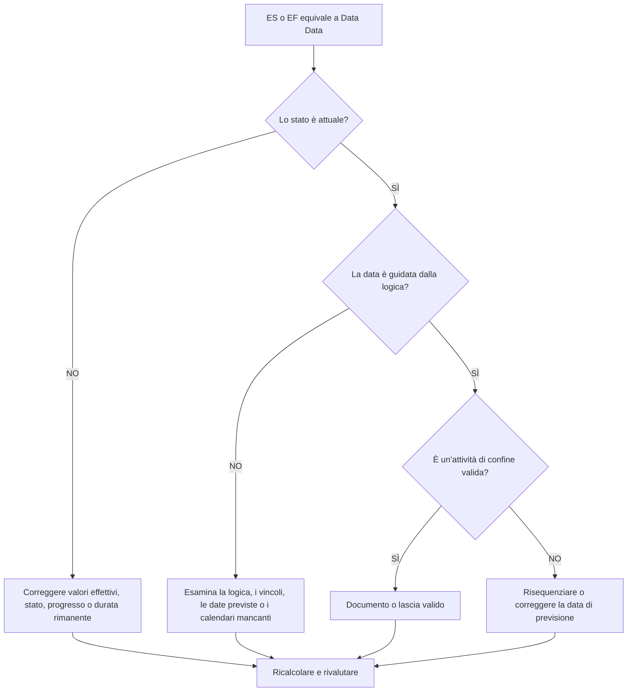

## Scopo

Questa guida aiuta gli addetti alla pianificazione a rivedere le attività il cui inizio anticipato o fine anticipata cade esattamente nella data di aggiornamento Primavera P6. Supporta i controlli del ciclo di aggiornamento mostrando dove si sta raccogliendo il lavoro al confine tra le prestazioni effettive e il lavoro previsto.

## Prima di iniziare

Raccogli le seguenti informazioni prima di agire:

- Risultato della valutazione attuale per questa metrica.
- Dati progetto Data utilizzata nell'ultimo calcolo della pianificazione.
- Elenco delle attività in cui Inizio anticipato = data di aggiornamento.
- Elenco delle attività in cui Fine anticipata = data di aggiornamento.
- Stato attività, Inizio effettivo, Fine effettiva, Durata rimanente, Inizio, Fine, Margine totale e Calendario.
- Dettagli sulla relazione del predecessore e del successore.
- Vincoli, date previste e note di aggiornamento.

## Comprendi il tuo risultato

Un risultato efficace è pari a zero attività inspiegabili con inizio anticipato o fine anticipata alla data di aggiornamento.

Alcune attività potrebbero legittimamente rientrare nella data di aggiornamento, in particolare il lavoro a breve termine pronto per procedere o il lavoro che termina al limite dell'aggiornamento. Il problema non è solo la data; il problema è se la data è spiegata da informazioni valide sullo stato, sulla logica e sull'aggiornamento.

Un risultato debole significa che molte attività vengono raccolte alla data di aggiornamento senza un chiaro motivo di pianificazione.

## Obiettivo di miglioramento

L'obiettivo è 0 attività inspiegabili con ES = data di aggiornamento o EF = data di aggiornamento.

L'obiettivo è verificare se ogni attività è stata correttamente classificata, guidata logicamente e prevista dal giusto limite di aggiornamento.

## Piano d'azione

### Passaggio 1: identificare il problema principale

Creare un layout o un report P6 che filtri per le attività in cui Inizio anticipato è uguale alla data di aggiornamento o Fine anticipata è uguale alla data di aggiornamento. Includere ID attività, Nome attività, WBS, Stato attività, Inizio anticipato, Fine anticipata, Inizio, Fine, Inizio effettivo, Fine effettiva, Durata rimanente, Margine totale, Calendario, vincoli, predecessori e successori.

Rivedi ogni attività e chiedi:

- L'attività è completa, in corso o non è iniziata?
- Manca un inizio effettivo o una fine effettiva?
- L'attività è logicamente guidata alla data di aggiornamento?
- Un vincolo, una data prevista o un calendario spostano l'attività alla data di aggiornamento?
- L’attività è aperta o debolmente collegata?
- La data di aggiornamento è corretta per il periodo di aggiornamento?

### Passaggio 2: applicare le correzioni consigliate

Se lo stato è incompleto, correggere Inizio effettivo, Fine effettiva, Durata rimanente, Percentuale di completamento e Stato attività prima di modificare la logica.

Se un'attività inizia alla data di aggiornamento perché la logica precedente è mancante o non guida, aggiungere o correggere le relazioni che rappresentano la sequenza di lavoro reale.

Se un'attività sta terminando alla data data perché lo stato di avanzamento non è stato aggiornato, verificare se il lavoro è terminato entro il limite di aggiornamento. Inserisci la Fine effettiva se completata o aggiorna la Durata rimanente e la fine prevista se rimane del lavoro.

Se vincoli o date previste spingono le attività alla data di aggiornamento, rimuoverle, rivederle o documentarle secondo la procedura di controllo di progetto.

### Passaggio 3: rimuovere i blocchi comuni

I blocchi comuni includono l'attualizzazione incompleta, gli inizi aperti, le finiture aperte, i vincoli utilizzati come sostituti della logica e lo spostamento della data di aggiornamento senza un'adeguata revisione dello stato.

Un altro ostacolo è presupporre che le attività alla Data Data siano innocue. Un cluster di grandi dimensioni al limite dell'aggiornamento può nascondere la sequenza mancante o far sembrare la previsione a breve termine più chiara di quanto non sia.

### Passaggio 4: convalidare le modifiche

Ricalcolare il cronoprogramma dopo le correzioni. Esegui nuovamente la metrica e conferma che ogni attività rimanente nella data di aggiornamento è spiegata dallo stato corrente, dalla logica valida o da un'eccezione approvata.

Esamina il margine totale, il percorso critico o più lungo, le date delle tappe fondamentali e i report lookahead a breve termine per confermare che la correzione non ha creato nuove incoerenze.

## Cronoprogramma di miglioramento

### Giorno 1: revisione e diagnosi

Eseguire la metrica, confermare la data di aggiornamento e separare i risultati in ES alla data di aggiornamento, EF alla data di aggiornamento, problemi di stato, problemi di logica, vincoli e attività di confine valide.

### Giorni 2-3: implementare le azioni prioritarie

Correggere innanzitutto le attività critiche, quasi critiche e a breve termine. Aggiorna lo stato, aggiungi o correggi la logica e rivedi i vincoli.

### Giorni 4-5: monitorare i primi risultati

Ricalcola la pianificazione ed esamina i risultati di previsione, le modifiche fluttuanti, il movimento delle tappe fondamentali e le attività ancora presenti alla data di aggiornamento.

### Giorno 6: aggiustamenti finali

Risolvere gli elementi incerti rimanenti con la disciplina responsabile, il responsabile sul campo o il responsabile dei controlli di progetto.

### Giorno 7: rivalutare e confrontare

Eseguire nuovamente la valutazione e confrontare il risultato con la soglia target.

## Monitoraggio dei progressi

Utilizza un semplice tracker per gestire correzioni e approvazioni.

| Data | Azione intrapresa | Impatto previsto | Risultato / Osservazione | Passaggio successivo |
| --- | --- | --- | --- | --- |
| [Data] | ES/EF revisionato alla data di aggiornamento | Identificare il clustering dei confini | [Risultato osservato] | Assegna proprietario |
| [Data] | Stato corretto o date effettive | Allinea lo stato del lavoro con il limite di aggiornamento | [Risultato osservato] | Ricalcolare il cronoprogramma |
| [Data] | Logica o vincoli corretti | Riduci il clustering di date dati inspiegabile | [Risultato osservato] | Rivalutare la metrica |

## Se i risultati non migliorano

Se i risultati non migliorano, controlla se le attività vengono ripetutamente riportate alla data di aggiornamento a causa di logica mancante, vincoli, date previste obsolete o procedure di aggiornamento incomplete.

Inoltrare le questioni irrisolte quando incidono su attività critiche, quasi critiche, di reporting dei clienti, di consegna, di pagamento o di esecuzione a breve termine.

## Manutenzione

Esaminare questa metrica durante ogni ciclo di aggiornamento prima di emettere report. È particolarmente utile dopo aver spostato la data di aggiornamento, importato lo stato di avanzamento, riordinato il lavoro o ricalcolato dopo importanti modifiche di stato.

## Lista di controllo riepilogativa

- [ ] Risultato attuale rivisto
- [ ] Soglia target confermata
- [ ] Data di aggiornamento confermata
- [ ] ES = Data Data attività revisionate
- [ ] EF = Data Data attività revisionate
- [ ] Stato e date effettive controllate
- [ ] Durata rimanente selezionata
- [ ] Logica e vincoli rivisti
- [ ] Attività di confine valide documentate
- [ ] Cronoprogramma ricalcolato
- [ ] Valutazione ripetuta
- [ ] Passaggi successivi documentati
## Contenuti correlati
- [Attività alla Data Data: Verifiche Inizio Anticipato e Fine Anticipata in Primavera P6](03_blog_template.md)
- [Cos'è un cronoprogramma](../../11b_blogs_it/01_WHAT%20A%20SCHEDULE%20IS/01_blog.md)
- [Logica robusta](../../11b_blogs_it/02_ROBUST%20LOGIC/02_ROBUST%20LOGIC.md)
