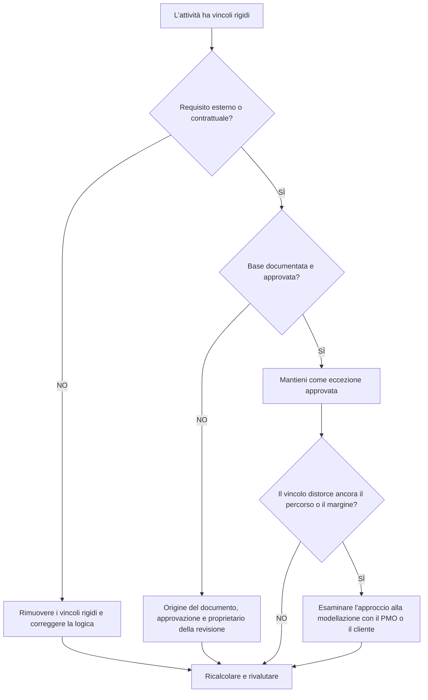

## Scopo

Questa guida aiuta gli addetti alla pianificazione a rivedere e ridurre i vincoli rigidi in Primavera P6. Si concentra sui vincoli che controllano fortemente le date delle attività, in particolare Inizio obbligatorio e Fine obbligatoria.

## Prima di iniziare

Raccogli le seguenti informazioni prima di agire:

- Risultato della valutazione attuale per questa metrica.
- Elenco delle attività con vincoli rigidi.
- Tipo di vincolo e Data di vincolo per ciascuna attività.
- ID attività, nome attività, WBS, stato attività, inizio, fine, margine totale e stato del percorso critico o più lungo.
- Dettagli sulla relazione del predecessore e del successore.
- Contratto, cliente, permesso, accesso, regolamentazione o base di consegna per qualsiasi vincolo richiesto.
- Confronto della baseline o dell'aggiornamento precedente che mostra quando è stato aggiunto il vincolo.

## Comprendi il tuo risultato

Un risultato forte è rappresentato da zero vincoli rigidi inspiegabili.

I vincoli rigidi possono sovrascrivere o limitare fortemente il normale calcolo del CPM. Possono essere validi per date di contratto, finestre di accesso, rilasci di permessi, punti di attesa normativi o requisiti diretti dal proprietario, ma non devono essere utilizzati come sostituti della logica mancante.

Un risultato debole significa che la pianificazione contiene date imposte che potrebbero controllare la previsione anziché la logica della rete.

## Obiettivo di miglioramento

L'obiettivo è 0 vincoli rigidi inspiegabili.

L'obiettivo è rimuovere i vincoli rigidi non necessari e documentare eventuali vincoli realmente necessari.

## Piano d'azione

### Passaggio 1: identificare il problema principale

Crea un layout o un report P6 che filtri le attività con tipi di vincoli rigidi. Includere ID attività, Nome attività, WBS, Stato attività, Inizio, Fine, Tipo di vincolo, Data di vincolo, Margine totale, stato del percorso critico o più lungo, predecessori e successori.

Esamina ciascuna attività vincolata e chiedi:

- Qual è la fonte del vincolo rigido?
- È richiesto contrattualmente o esternamente?
- Sta sostituendo la logica del predecessore o del successore mancante?
- Sta forzando una data target che dovrebbe essere prevista dal cronoprogramma?
- Influisce sul margine totale, sul percorso critico o sul reporting delle tappe fondamentali?
- Il motivo è documentato e approvato?

### Passaggio 2: applicare le correzioni consigliate

Se il vincolo rigido non è richiesto esternamente, rimuovilo e aggiungi o correggi la logica CPM. Utilizza relazioni, sequenze di attività, calendari e durate realistiche per modellare il lavoro invece di forzare le date.

Se è richiesto un vincolo rigido, documentare la base. Cattura la fonte, l'approvazione, la data, il proprietario responsabile e il motivo per cui non è possibile modellarlo con la logica normale.

Se il vincolo viene utilizzato per preservare una data prevista, verificare se un vincolo, un traguardo, una scadenza o una nota di reporting più flessibili sarebbero più appropriati.

### Passaggio 3: rimuovere i blocchi comuni

I blocchi comuni includono vincoli ereditati da vecchie baseline, date di destinazione del client immesse come date obbligatorie, piani di ripristino che lasciano dietro di sé vincoli temporanei e logica dell'interfaccia mancante.

Un altro ostacolo presuppone che un vincolo rigido sia accettabile perché la data è importante. Le date importanti dovrebbero essere visibili, ma il cronoprogramma dovrebbe comunque spiegare come il lavoro le raggiunge.

### Passaggio 4: convalidare le modifiche

Ricalcolare il cronoprogramma dopo le correzioni. Eseguire nuovamente la metrica e confermare che i vincoli rigidi rimanenti siano approvati e documentati.

Esaminare il margine totale, il percorso critico o più lungo, le date delle tappe fondamentali e gli output del confronto della pianificazione per confermare che la correzione non ha creato movimenti imprevisti.

## Cronoprogramma di miglioramento

### Giorno 1: revisione e diagnosi

Esegui la metrica e raggruppa i risultati per WBS, tipo di vincolo, criticità e base documentata.

### Giorni 2-3: implementare le azioni prioritarie

Rimuovere innanzitutto i vincoli rigidi non necessari dalle attività critiche, quasi critiche, contrattuali e a breve termine. Aggiungi la logica mancante dove necessario.

### Giorni 4-5: monitorare i primi risultati

Ricalcola il cronoprogramma ed esamina il movimento del galleggiante, i cambiamenti critici del percorso e gli impatti delle tappe fondamentali.

### Giorno 6: aggiustamenti finali

Risolvi le eccezioni rimanenti con il pianificatore, il responsabile dei controlli di progetto, il revisore PMO o il rappresentante del cliente.

### Giorno 7: rivalutare e confrontare

Eseguire nuovamente la valutazione e confrontare il risultato con la soglia target.

## Monitoraggio dei progressi

Utilizza un semplice tracker per gestire correzioni e approvazioni.

| Data | Azione intrapresa | Impatto previsto | Risultato / Osservazione | Passaggio successivo |
| --- | --- | --- | --- | --- |
| [Data] | Revisione dei vincoli rigidi | Identificare i controlli della data imposta | [Risultato osservato] | Assegna proprietario |
| [Data] | Rimosso il vincolo rigido non necessario | Ripristina il calcolo basato sulla logica | [Risultato osservato] | Ricalcolare il cronoprogramma |
| [Data] | Vincolo rigido approvato documentato | Preservare l'eccezione giustificata | [Risultato osservato] | Rivalutare la metrica |

## Se i risultati non migliorano

Se i risultati non migliorano, verificare se vengono reintrodotti vincoli rigidi tramite importazioni, frammenti copiati, aggiornamenti di base o modifiche alla pianificazione di ripristino.

Inoltra le questioni irrisolte quando influiscono sul percorso critico, sulle tappe contrattuali, sulla reportistica dei clienti, sull'analisi dei ritardi, sugli eventi di pagamento o sulle date di consegna.

## Manutenzione

Rivedi questa metrica durante ogni ciclo di aggiornamento e prima dell'approvazione della baseline. I vincoli rigidi dovrebbero far parte dei controlli di integrità della pianificazione standard, soprattutto dopo il risequenziamento importante, la pianificazione del ripristino e la preparazione della presentazione del cliente.

## Lista di controllo riepilogativa

- [ ] Risultato attuale rivisto
- [ ] Soglia target confermata
- [ ] Elenco dei vincoli rigidi generato
- [ ] Tipo di vincolo e data verificati
- [ ] Confermata la base esterna
- [ ] Sono stati rimossi i vincoli rigidi non necessari
- [ ] Logica mancante corretta
- [ ] Eccezioni approvate documentate
- [ ] Cronoprogramma ricalcolato
- [ ] Margine e percorso critico rivisti
- [ ] Valutazione ripetuta
- [ ] Passaggi successivi documentati
## Contenuti correlati
- [Vincoli rigidi in Primavera P6](03_blog_template.md)
- [Cos'è un cronoprogramma](../../11b_blogs_it/01_WHAT%20A%20SCHEDULE%20IS/01_blog.md)
- [Logica robusta](../../11b_blogs_it/02_ROBUST%20LOGIC/02_ROBUST%20LOGIC.md)
