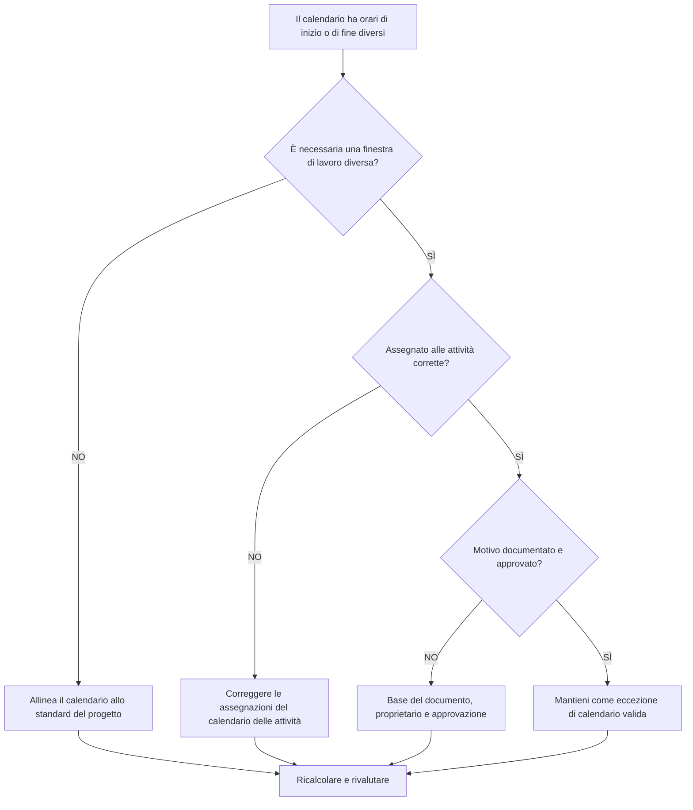

## Scopo

Questa guida aiuta gli addetti alla pianificazione a rivedere i calendari Primavera P6 che utilizzano orari di inizio o fine della giornata lavorativa diversi. Supporta i controlli di qualità del cronoprogramma confermando che le differenze orarie del calendario sono intenzionali, approvate e comprese.

## Prima di iniziare

Raccogli le seguenti informazioni prima di agire:

- Risultato della valutazione attuale per questa metrica.
- Standard del calendario di progetto approvato e normale finestra di lavoro giornaliero.
- Elenco di calendari con orari di inizio, orari di fine, finestre di turni o schemi di giornate parziali diversi.
- Attività assegnate a ciascun calendario interessato.
- Tipo di calendario, ad esempio calendario globale, di progetto o di risorsa.
- Attività critiche o quasi critiche che utilizzano i calendari interessati.
- Motivo per ciascun calendario non standard, ad esempio turno notturno, interruzione del lavoro, accesso limitato o cronoprogramma speciale dell'equipaggio.

## Comprendi il tuo risultato

Un risultato forte è rappresentato da zero calendari inspiegabili con orari di inizio o fine diversi.

Le differenze di calendario possono essere valide quando il lavoro segue veramente turni, finestre di accesso o disponibilità delle risorse diversi. La preoccupazione nasce quando i calendari differiscono in base all’ora del giorno senza una ragione chiara.

Un risultato debole significa che la pianificazione potrebbe contenere presupposti di calendario nascosti che influiscono sulle date, sul margine e sul comportamento logico.

## Obiettivo di miglioramento

L'obiettivo è 0 calendari inspiegabili con orari di inizio o fine diversi.

L'obiettivo è verificare se ogni diversa finestra di lavoro è richiesta, documentata e assegnata solo alle attività giuste.

## Piano d'azione

### Passaggio 1: identificare il problema principale

Crea un'esportazione di revisione del calendario da P6 o uno strumento di valutazione della pianificazione che elenca ciascun calendario, l'ora di inizio e di fine della normale giornata lavorativa, le ore giornaliere, le eccezioni e le attività assegnate.

Esamina ogni calendario non standard e chiedi:

- Qual è la giornata lavorativa standard approvata per il progetto?
- Quali calendari utilizzano orari di inizio o di fine diversi?
- Le differenze sono intenzionali o accidentali?
- Quali attività utilizzano ciascun calendario?
- Le attività critiche o quasi critiche sono interessate?
- La differenza di calendario è documentata e approvata?

### Passaggio 2: applicare le correzioni consigliate

Se la differenza di calendario è accidentale, allineare l'ora di inizio, l'ora di fine e i periodi lavorativi giornalieri allo standard di progetto approvato.

Se la differenza di calendario è valida documentarne il motivo. I casi validi comuni includono il turno di notte, il lavoro nel fine settimana, le finestre di arresto, le restrizioni di accesso del proprietario, le restrizioni ambientali o i periodi di lavoro specifici per risorsa.

Se le attività vengono assegnate al calendario sbagliato, correggere l'assegnazione del calendario delle attività prima di modificare il calendario stesso. Un calendario speciale valido può comunque creare problemi se assegnato in modo troppo ampio.

### Passaggio 3: rimuovere i blocchi comuni

I blocchi comuni includono calendari copiati da vecchie pianificazioni, calendari importati con impostazioni di tempo nascoste, calendari di risorse utilizzati come calendari di attività e piccole differenze orarie non visibili nei layout di data standard.

Un altro blocco è rivedere solo la data senza l'ora. In P6, l'ora del giorno può influenzare il posizionamento delle attività, il fluttuare, il comportamento relazionale e lo spostamento apparente della data di un giorno.

### Passaggio 4: convalidare le modifiche

Ricalcolare il cronoprogramma dopo le correzioni del calendario. Esegui nuovamente la metrica e conferma che le restanti differenze di calendario sono valide e documentate.

Esaminare le date delle attività interessate, il margine totale, il percorso critico o più lungo, i legami relazionali e i rapporti di previsione a breve termine per confermare che la correzione non ha creato movimenti inaspettati.

## Cronoprogramma di miglioramento

### Giorno 1: revisione e diagnosi

Esegui la metrica e raggruppa i risultati per calendario, finestra di lavoro, tipo di calendario, attività assegnate e criticità.

### Giorni 2-3: implementare le azioni prioritarie

Correggere innanzitutto le differenze orarie accidentali del calendario e le assegnazioni errate del calendario delle attività su attività critiche, quasi critiche e a breve termine.

### Giorni 4-5: monitorare i primi risultati

Ricalcola il cronoprogramma ed esamina il movimento del margine, i cambiamenti di data, gli impatti delle tappe fondamentali e le modifiche future.

### Giorno 6: aggiustamenti finali

Risolvi le rimanenti eccezioni del calendario con il pianificatore, il proprietario della disciplina, il responsabile dei controlli di progetto o il revisore PMO.

### Giorno 7: rivalutare e confrontare

Eseguire nuovamente la valutazione e confrontare il risultato con la soglia target.

## Monitoraggio dei progressi

Utilizza un semplice tracker per gestire correzioni e approvazioni.

| Data | Azione intrapresa | Impatto previsto | Risultato / Osservazione | Passaggio successivo |
| --- | --- | --- | --- | --- |
| [Data] | Orari di inizio e fine del calendario rivisti | Identificare finestre di lavoro non standard | [Risultato osservato] | Assegna proprietario |
| [Data] | Calendario allineato allo standard di progetto | Rimuovere la differenza oraria accidentale | [Risultato osservato] | Ricalcolare il cronoprogramma |
| [Data] | Eccezione di calendario valida documentata | Conserva la finestra di lavoro giustificata | [Risultato osservato] | Rivalutare la metrica |

## Se i risultati non migliorano

Se i risultati non migliorano, controlla se i calendari non standard vengono reintrodotti tramite importazioni, pianificazioni copiate, assegnazioni di risorse o aggiornamenti di base.

Incrementa le differenze di calendario non risolte quando influiscono sul percorso critico, sulla reportistica dei clienti, sulle tappe fondamentali dei pagamenti, sulle interruzioni del lavoro, sulle date di consegna o sull'esecuzione a breve termine.

## Manutenzione

Esamina questa metrica durante lo sviluppo di base, la pianificazione delle importazioni e ogni ciclo di aggiornamento principale. Le impostazioni dell'ora del calendario dovrebbero far parte dei controlli di integrità della pianificazione standard prima dell'emissione dei report.

## Lista di controllo riepilogativa

- [ ] Risultato attuale rivisto
- [ ] Soglia target confermata
- [ ] Confermato lo standard del calendario del progetto
- [ ] Individuati orari di calendario non standard
- [ ] Attività assegnate revisionate
- [ ] Impatti critici e quasi critici controllati
- [ ] Corrette le differenze accidentali del calendario
- [ ] Eccezioni di calendario valide documentate
- [ ] Cronoprogramma ricalcolato
- [ ] Modifiche alla data e al margine riviste
- [ ] Valutazione ripetuta
- [ ] Passaggi successivi documentati
## Contenuti correlati
- [Calendari con orari di inizio e fine diversi in Primavera P6](03_blog_template.md)
- [Cos'è un cronoprogramma](../../11b_blogs_it/01_WHAT%20A%20SCHEDULE%20IS/01_blog.md)
- [Logica robusta](../../11b_blogs_it/02_ROBUST%20LOGIC/02_ROBUST%20LOGIC.md)
