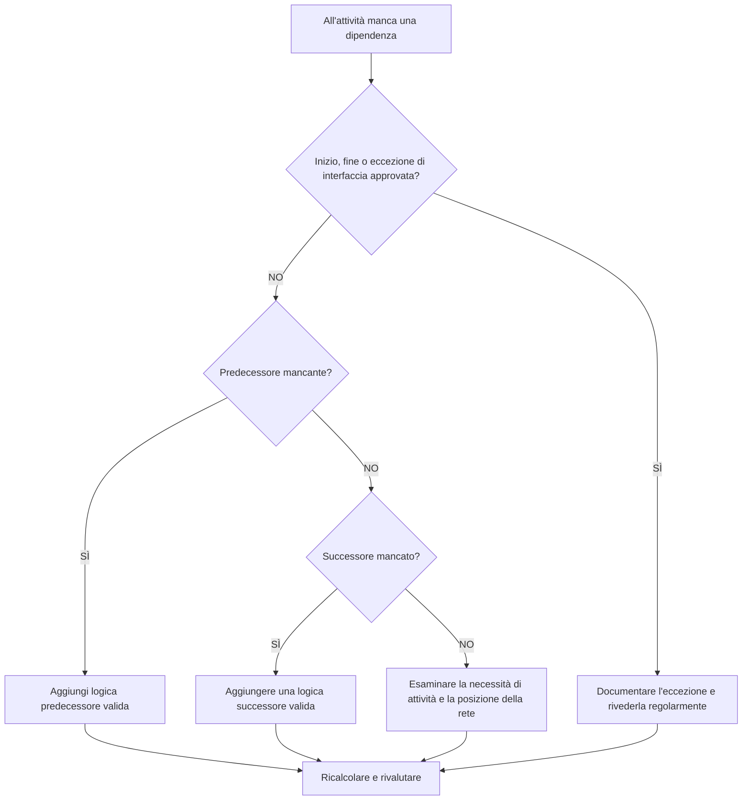

## Scopo

Questa guida aiuta gli pianificatore a identificare e correggere la logica del predecessore o del successore mancante in Primavera P6. Supporta la qualità del cronoprogramma migliorando la completezza della rete CPM.

## Prima di iniziare

Raccogli le seguenti informazioni prima di agire:

- Risultato della valutazione attuale per questa metrica.
- Elenco delle attività senza predecessori.
- Elenco delle attività senza successori.
- Elenco di attività senza logica precedente né successiva.
- ID attività, nome attività, WBS, tipo attività, stato attività, inizio, fine, margine totale e calendario.
- Inizio del progetto approvato, fine del progetto, interfaccia esterna ed elenco delle eccezioni contrattuali.
- Note sull'ultimo aggiornamento e disciplina responsabile o proprietario del pacchetto.

## Comprendi il tuo risultato

Un risultato efficace è rappresentato da zero attività irrisolte con logica di dipendenza mancante.

Alcune attività potrebbero legittimamente non avere alcun predecessore o successore, come la tappa fondamentale di inizio progetto approvata, la tappa fondamentale di completamento finale o le tappe fondamentali approvate dell'interfaccia esterna. Questi dovrebbero essere limitati e documentati.

Un risultato debole significa che la pianificazione contiene attività che non sono connesse correttamente alla rete CPM.

## Obiettivo di miglioramento

L'obiettivo è 0 attività irrisolte con dipendenze mancanti.

L'obiettivo è collegare ciascuna attività alla logica precedente e successiva valida o documentare il motivo approvato per cui costituisce un'eccezione.

## Piano d'azione

### Passaggio 1: identificare il problema principale

Crea un layout o un report P6 che filtri le attività senza predecessori, senza successori o nessuno dei due. Includere ID attività, Nome attività, WBS, Tipo attività, Stato attività, Inizio, Fine, Margine totale, Calendario, vincoli, predecessori e successori.

Rivedi ogni attività e chiedi:

- Questa attività è un elemento di inizio progetto o di fine progetto approvato?
- Si tratta di un'interfaccia esterna, di una data controllata dal proprietario o di un'eccezione contrattuale?
- Quale lavoro deve essere svolto prima che questa attività possa iniziare?
- Quale lavoro dipende dalla fine o dall'inizio di questa attività?
- L'attività è obsoleta, duplicata o con uno status errato?
- Quale proprietario può confermare la reale dipendenza?

### Passaggio 2: applicare le correzioni consigliate

Per le partenze aperte, aggiungere la logica predecessore che rappresenta la condizione reale richiesta prima che l'attività possa iniziare. Ciò può includere lavori precedenti, approvazioni, accesso, appalti, rilascio del progetto, ispezione o consegna.

Per le finiture aperte, aggiungere la logica successore che rappresenta ciò che dipende dall'attività. Ciò può includere lavoro successivo, test, messa in servizio, turnover, chiusura o una tappa fondamentale del completamento.

Per le attività isolate senza predecessori e senza successori, confermare se l'attività è ancora necessaria. Se è un lavoro valido, collegalo alla rete. Se è obsoleto, rimuovilo o chiudilo secondo la procedura di controllo di progetto.

### Passaggio 3: rimuovere i blocchi comuni

I blocchi più comuni includono attività copiate, frammenti incompleti, passaggi poco chiari tra le discipline, informazioni di interfaccia mancanti e pressione per caricare le attività prima che sia nota la sequenza.

Un altro blocco è l'aggiunta di relazioni segnaposto solo per passare la metrica. Le relazioni dovrebbero rappresentare dipendenze reali, non collegamenti artificiali.

### Passaggio 4: convalidare le modifiche

Ricalcolare il cronoprogramma dopo le correzioni. Esegui nuovamente la metrica e conferma che ogni attività rimanente è connessa o documentata come eccezione approvata.

Esamina il margine totale, il percorso critico o più lungo, le date delle tappe fondamentali e i report lookahead a breve termine per confermare che la logica aggiunta non ha creato movimenti imprevisti.

## Cronoprogramma di miglioramento

### Giorno 1: revisione e diagnosi

Esegui la metrica e i risultati del gruppo in predecessori mancanti, successori mancanti, attività isolate, eccezioni valide e attività obsolete.

### Giorni 2-3: implementare le azioni prioritarie

Correggere innanzitutto le attività critiche, quasi critiche, contrattuali e a breve termine. Aggiungi logica valida e rimuovi attività obsolete ove appropriato.

### Giorni 4-5: monitorare i primi risultati

Ricalcola la pianificazione ed esamina il margine, il percorso critico, le date di previsione e gli impatti delle tappe fondamentali.

### Giorno 6: aggiustamenti finali

Risolvi le rimanenti domande sulle dipendenze con i responsabili della disciplina, i proprietari dei pacchetti, i responsabili dei lavori o la leadership dei controlli di progetto.

### Giorno 7: rivalutare e confrontare

Eseguire nuovamente la valutazione e confrontare il risultato con la soglia target.

## Monitoraggio dei progressi

Utilizza un semplice tracker per gestire correzioni e approvazioni.

| Data | Azione intrapresa | Impatto previsto | Risultato / Osservazione | Passaggio successivo |
| --- | --- | --- | --- | --- |
| [Data] | Revisione delle dipendenze mancanti | Identificare gli inizi aperti e le finiture aperte | [Risultato osservato] | Assegna proprietario |
| [Data] | Aggiunta la logica del predecessore | Migliorare la logica di inizio attività | [Risultato osservato] | Ricalcolare il cronoprogramma |
| [Data] | Aggiunta logica successore | Migliorare la continuità della conclusione dell'attività | [Risultato osservato] | Rivalutare la metrica |

## Se i risultati non migliorano

Se i risultati non migliorano, controlla se le nuove attività vengono aggiunte senza logica, i fragnet importati sono incompleti o le regole di eccezione sono troppo vaghe.

Inoltrare le questioni irrisolte quando incidono sul percorso critico, sulla reportistica del cliente, sulle tappe fondamentali del pagamento, sulla consegna, sull'approvvigionamento o sull'esecuzione a breve termine.

## Manutenzione

Esaminare questa metrica durante ogni ciclo di aggiornamento, dopo le importazioni pianificate e prima dell'approvazione della baseline. Le dipendenze mancanti dovrebbero far parte dei controlli sanitari della pianificazione standard.

## Lista di controllo riepilogativa

- [ ] Risultato attuale rivisto
- [ ] Soglia target confermata
- [ ] Inizio aperto rivisto
- [ ] Finiture Open riviste
- [ ] Attività isolate riviste
- [ ] Eccezioni valide documentate
- [ ] Aggiunta la logica del predecessore mancante
- [ ] Aggiunta della logica successore mancante
- [ ] Attività obsolete risolte
- [ ] Cronoprogramma ricalcolato
- [ ] Valutazione ripetuta
- [ ] Passaggi successivi documentati
## Contenuti correlati
- [Dipendenze mancanti in Primavera P6](03_blog_template.md)
- [Cos'è un cronoprogramma](../../11b_blogs_it/01_WHAT%20A%20SCHEDULE%20IS/01_blog.md)
- [Logica robusta](../../11b_blogs_it/02_ROBUST%20LOGIC/02_ROBUST%20LOGIC.md)
