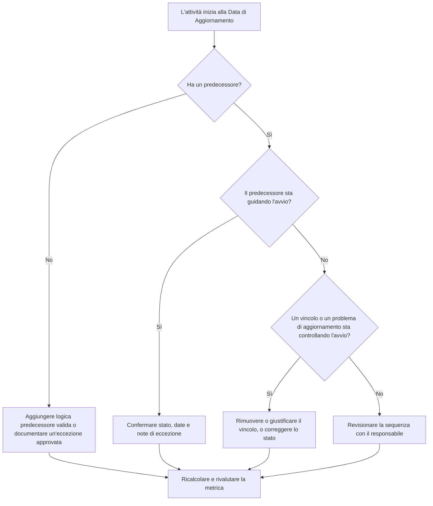

## Scopo

Questa guida aiuta i programmisti e i team di project controls a ridurre o eliminare le attività programmate per iniziare alla Data di Aggiornamento (Data Date) di Primavera P6 senza una logica predecessore valida che guidi l'avvio. Si applica alle revisioni della qualità dei programmi, ai controlli di salute PMO e alla validazione del ciclo di aggiornamento.

L'obiettivo è confermare che il lavoro a breve termine sia supportato da una chiara logica CPM e che le attività non inizino alla Data di Aggiornamento solo a causa di relazioni mancanti, vincoli, date manuali o aggiornamenti di avanzamento incompleti.

## Prima di iniziare

Raccogliere le seguenti informazioni prima di agire:

- Risultato della valutazione corrente per questa metrica.
- Data di Aggiornamento del progetto utilizzata nell'ultimo calcolo del programma.
- Elenco delle attività aperte o non iniziate con una data di inizio uguale alla Data di Aggiornamento.
- Dettagli delle relazioni predecessore e successore per ogni attività.
- Vincoli, date previste, date effettive e assegnazioni di calendario.
- Opzioni di programmazione P6 utilizzate per l'aggiornamento, incluse le impostazioni di logica mantenuta (retained logic) o di avanzamento prevalente (progress override) ove pertinenti.
- Eventuali eccezioni approvate, come attività di avvio progetto, milestone di interfaccia esterna o avvii disposti dal committente.

## Comprendere il proprio risultato

Un risultato ottimale è zero attività non risolte che iniziano alla Data di Aggiornamento senza logica predecessore trainante. Ciò significa che il lavoro corrente e a breve termine è connesso alla rete del programma e che la Data di Aggiornamento non nasconde un sequenziamento mancante.

Un risultato accettabile può includere un numero limitato di eccezioni documentate. Queste devono essere riviste e approvate, non ignorate. Ad esempio, una milestone di ordine di inizio lavori (notice-to-proceed) o un'attività autorizzata esternamente potrebbero non necessitare di un normale predecessore, ma il motivo deve essere visibile ai revisori.

Un risultato debole significa che più attività iniziano alla Data di Aggiornamento senza un chiaro driver logico. Ciò può indicare avvii aperti, relazioni predecessore mancanti, vincoli eccessivi, aggiornamenti di avanzamento incompleti, o attività che non sono state correttamente ri-sequenziate dopo l'ultimo aggiornamento.

## Obiettivo di miglioramento

Il target è 0 attività non risolte che iniziano alla Data di Aggiornamento senza una logica trainante valida.

L'obiettivo di miglioramento non è solo ridurre il conteggio. L'obiettivo più profondo è assicurarsi che ogni attività vicino alla Data di Aggiornamento abbia una ragione difendibile per la sua data di inizio prevista. Dopo la correzione, ogni attività interessata dovrebbe avere una logica predecessore appropriata, un'eccezione documentata o una condizione di stato/data corretta.

## Piano d'azione

### Passo 1: Identificare il problema principale

Creare un layout o un report P6 che filtra le attività aperte o non iniziate con una data di inizio uguale alla Data di Aggiornamento. Includere colonne per ID Attività, Nome Attività, WBS, Inizio, Fine, Stato, Float Totale, Calendario, Vincolo Principale, Predecessori, Successori e indicatori di Relazione Trainante se disponibili.

Esaminare ogni attività e chiedersi:

- L'attività ha predecessori?
- Se i predecessori esistono, stanno effettivamente guidando l'avvio?
- L'attività è trattenuta o spostata da un vincolo?
- All'attività manca un avvio effettivo o un aggiornamento di avanzamento?
- L'attività è un'eccezione valida, come una milestone di avvio progetto?
- L'attività appartiene a un'area WBS dove la logica è generalmente debole?

Raggruppare i risultati in cause pratiche: predecessori mancanti, predecessori non trainanti, vincoli o date previste, errori di aggiornamento/stato, o eccezioni approvate.

### Passo 2: Applicare le correzioni raccomandate

Iniziare dalla logica mancante o debole. Aggiungere relazioni predecessore valide che rappresentano la reale sequenza del lavoro, come relazioni fine-a-inizio (finish-to-start), inizio-a-inizio (start-to-start) o fine-a-fine (finish-to-finish) dove appropriato. Evitare di aggiungere relazioni solo per soddisfare la metrica; ogni relazione dovrebbe riflettere una reale dipendenza di costruzione, ingegneria, approvvigionamento, accesso, approvazione o consegna.

Revisionare i vincoli successivamente. Se un'attività inizia alla Data di Aggiornamento a causa di un vincolo di avvio, verificare se il vincolo è contrattualmente o operativamente giustificato. Rimuovere i vincoli non necessari e permettere all'attività di essere guidata dalla logica. Se il vincolo è valido, documentare il motivo e confermare che non distorce il percorso critico.

Verificare lo stato di avanzamento. Se il lavoro è già iniziato, aggiornare l'avvio effettivo e la durata residua correttamente. Se il lavoro non è iniziato, confermare che la data di inizio prevista debba rimanere alla Data di Aggiornamento. Un'attività non dovrebbe apparire pronta per iniziare semplicemente perché il ciclo di aggiornamento l'ha portata alla data corrente.

Dopo aver apportato le modifiche, ricalcolare il programma e revisionare nuovamente le attività interessate. Confermare che la data di inizio sia ora guidata dalla logica, correttamente aggiornata come stato, o documentata come eccezione approvata.

### Passo 3: Rimuovere i blocchi comuni

I blocchi comuni includono feedback di cantiere non chiaro, informazioni di interfaccia mancanti e pressione per far sembrare il lavoro a breve termine pronto. Risolvere questi problemi revisionando le attività interessate con i responsabili di disciplina, i responsabili di costruzione, i responsabili degli approvvigionamenti o i responsabili di pacchetto.

Un altro blocco comune è l'uso improprio dei vincoli come sostituto della logica. I vincoli possono essere necessari in alcuni casi, ma non dovrebbero sostituire la rete del programma. Se un vincolo viene mantenuto, documentare perché esiste e come influenza il float e il percorso più lungo.

Verificare anche se il problema è causato dalle impostazioni di calcolo del programma o dalle pratiche di aggiornamento. Se la prevalenza dell'avanzamento (progress override), la logica mantenuta (retained logic), l'avanzamento fuori sequenza o un'attualizzazione incompleta stanno influenzando il risultato, allineare il metodo di aggiornamento con la procedura di project controls prima di rivalutare la metrica.

### Passo 4: Validare le modifiche

Validare il programma corretto prima della prossima valutazione. Eseguire nuovamente il filtro per le attività aperte o non iniziate che iniziano alla Data di Aggiornamento senza logica trainante. Confermare che ogni elemento rimanente sia stato corretto o documentato come eccezione approvata.

Revisionare il float totale, il percorso più lungo e le attività del lookahead a breve termine dopo il ricalcolo. Una correzione logica può cambiare il percorso critico o rivelare ulteriori problemi di sequenziamento. Se lo spostamento del programma è significativo, comunicare l'impatto al responsabile di project controls o al revisore PMO.

## Piano di miglioramento

### Giorno 1: Revisione e diagnosi

Eseguire la metrica, confermare la Data di Aggiornamento e produrre l'elenco delle attività. Separare i risultati in logica mancante, logica non trainante, vincoli, errori di stato ed eccezioni potenziali.

### Giorni 2-3: Implementare le azioni prioritarie

Correggere prima le attività ad alto impatto, specialmente quelle critiche o quasi critiche. Aggiungere logica predecessore valida, rimuovere vincoli non necessari, aggiornare lo stato errato e documentare le eccezioni.

### Giorni 4-5: Monitorare i risultati iniziali

Ricalcolare il programma e verificare se le attività interessate sono ora guidate dalla logica. Verificare la presenza di cambiamenti inattesi al float totale, al percorso più lungo e alle date delle milestone.

### Giorno 6: Aggiustamenti finali

Risolvere i blocchi rimanenti con il responsabile di disciplina o di pacchetto. Confermare che le eccezioni mantenute siano giustificate e chiaramente documentate.

### Giorno 7: Rivalutare e confrontare

Eseguire nuovamente la valutazione e confrontare il nuovo risultato con il risultato precedente e la soglia target. Confermare se la metrica è ora a zero attività non risolte o se sono necessarie ulteriori azioni.

## Monitoraggio del progresso

Utilizzare un semplice registro per gestire le correzioni e le approvazioni.

| Data | Azione intrapresa | Impatto previsto | Risultato / Osservazione | Passo successivo |
| --- | --- | --- | --- | --- |
| [Data] | Revisione delle attività che iniziano alla Data di Aggiornamento senza logica trainante | Identificare logica mancante o debole | [Risultato osservato] | Assegnare correzioni al responsabile |
| [Data] | Aggiunta di relazioni predecessore valide | Migliorare il sequenziamento CPM | [Risultato osservato] | Ricalcolare e revisionare l'impatto sul float |
| [Data] | Rimozione o giustificazione dei vincoli | Ridurre gli avvii artificiali | [Risultato osservato] | Confermare le eccezioni rimanenti |
| [Data] | Aggiornamento dello stato errato delle attività | Migliorare l'accuratezza dell'aggiornamento | [Risultato osservato] | Eseguire nuovamente la valutazione |

## Se i risultati non migliorano

Se il risultato non migliora, verificare se le stesse attività continuano a non superare il controllo o se nuove attività stanno apparendo alla Data di Aggiornamento. Fallimenti ripetuti possono indicare un problema più ampio di sviluppo del programma, come logica incompleta in un'area WBS, scarsa disciplina di aggiornamento o uso incoerente dei vincoli.

Escalare i problemi persistenti al responsabile di project controls, al planning manager o al revisore PMO. Per i programmi di grande scala, considerare un workshop di revisione della logica mirato per i pacchetti di lavoro interessati. Se il programma è utilizzato per la rendicontazione contrattuale, l'analisi dei ritardi o la previsione del valore guadagnato, gli elementi non risolti dovrebbero essere trattati come una preoccupazione di qualità.

## Manutenzione

Revisionare questa metrica durante ogni ciclo di aggiornamento prima di emettere il programma. Il controllo dovrebbe far parte della revisione standard della salute del programma, specialmente dopo aggiornamenti di avanzamento, ri-sequenziamenti, modifiche significative dell'ambito o pianificazione di recupero.

Le buone pratiche di manutenzione includono il mantenimento delle colonne predecessore e successore visibili nei layout P6, la revisione degli avvii aperti prima di ogni invio, la documentazione delle eccezioni approvate e la verifica che lo spostamento della Data di Aggiornamento non crei un nuovo gruppo di attività non guidate.

## Lista di controllo riepilogativa

- [ ] Risultato corrente revisionato
- [ ] Soglia target confermata
- [ ] Data di Aggiornamento confermata
- [ ] Attività che iniziano alla Data di Aggiornamento identificate
- [ ] Problema principale identificato
- [ ] Logica mancante o debole corretta
- [ ] Vincoli revisionati e giustificati o rimossi
- [ ] Date di stato verificate
- [ ] Eccezioni approvate documentate
- [ ] Programma ricalcolato
- [ ] Risultati monitorati
- [ ] Valutazione ripetuta
- [ ] Passi successivi documentati
