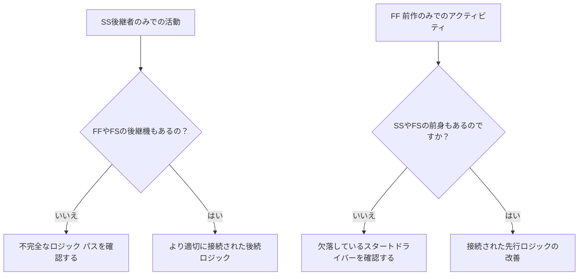

ロジックは、プロジェクト スケジュール内の順序と依存関係を数学的に表現したものです。ここでは、何を行う前に何を行う必要があるか、どのアクティビティを同時に実行できるか、プロジェクト チームが最初のアクティビティから最終的な完了までどのように移行するつもりかについて説明します。

Primavera P6 の良好なスケジュールでは、ロジックは飾りではありません。これは、スケジュールで日付、フロート、クリティカル パス、予測移動を計算できるようにするエンジンです。実行のストーリーを、見直し、挑戦し、改善できる方法で伝えます。

スケジュールに「基礎を築き、次に壁を建て、次に屋根を建てる」と書かれている場合、そのシーケンスを計算可能なネットワークに変えるのはロジックです。プランナーはタイムラインを描くだけではありません。プランナーは配信パスを定義しています。

## ロジックが作品のストーリーを語る

すべてのプロジェクト チームには、プロジェクトを実行するための意図された方法があります。エンジニアリング部門は領域ごとにデザインをリリースする場合があります。調達では機器をパッケージで納品する場合があります。土木工事では、構造工事が始まる前にアクセスを準備する場合があります。試運転を開始する前に、機械的な完了が必要になる場合があります。

ロジック リンクは、その計画の数学的表現です。

この単純な図は単なるシーケンスではありません。意思決定モデルです。基礎が遅れると壁も遅れる可能性があります。壁が遅れれば屋根も遅れる可能性があります。屋根の葺きが遅れると内装工事に影響が出る可能性があります。スケジュールは、ロジックが存在する場合にのみその影響を示すことができます。

堅牢なロジックとは、アクティビティが開始される理由、終了する理由、および計画の一部が移動したときに何が起こるかをスケジュールで説明できることを意味します。

## データ作成時に堅牢なロジックが重要な理由

「駆動ロジックなしでデータ日付に開始されるアクティビティ」という指標は、スケジュールの品質を評価する強力なテストです。

データ日付は、実際のパフォーマンスと予測作業の境界です。アクティビティがデータ日付に正確に開始される場合、レビュー担当者は単純な質問をする必要があります。「何がこの開始の原因となっているのか?」というものです。

アクティビティに有効な先行ロジックがある場合、スケジュールで開始を説明できます。もしかしたらエリアが解放されたのかもしれません。資材の納品が完了したのかもしれません。おそらく、前のアクティビティが終了し、次のクルーが開始できるようになったのでしょう。

アクティビティに駆動ロジックがない場合、開始は弱くなります。先行アクティビティがない、ロジックが不完全である、制約によって強制されている、または更新が完全にステータス化されていないため、アクティビティがデータ日付に留まっている可能性があります。

だからこそ、堅牢なロジックが重要なのです。データ日付が移動したからといって、作業が完了したように見えるスケジュールを設定する必要はありません。作業を開始できる実際の状態を示す必要があります。

## バランス: 冗長なロジックではなく、十分なロジック

優れたロジックはバランスが取れています。スケジュールには、アクティビティを先行者と後続者に適切に接続するのに十分な関係が必要です。同時に、同じ依存関係を不必要に繰り返す冗長なロジックを避ける必要があります。

ロジックが少なすぎると、オープン スタート、オープン フィニッシュ、信頼性の低いフロート、弱いクリティカル パスの結果が作成されます。ロジックが多すぎるとネットワークのレビューが困難になり、アクティビティの真の推進力が隠れてしまう可能性があります。

目標は関係の数を最大化することではありません。目標は、必須の依存関係と必須の依存関係を明確に表現することです。

各アクティビティについて、スケジューラは次のことに答えることができる必要があります。

- このアクティビティを開始できるのは何ですか?
- このアクティビティによって次に何が可能になるのでしょうか?
- どの関係が実際に活動を推進しているのでしょうか?
- 重複した関係や不要な関係はありますか?
- 査読者は意図した順序を理解できるでしょうか?

このバランスは、PMO スケジュールのレビューの中心となります。高密度のネットワークが自動的に強力なネットワークになるわけではありません。ライト ネットワークが自動的にクリーンなネットワークになるわけではありません。適切なネットワークは実行計画を混乱なく説明します。

## すべてのアクティビティには開始ドライバーが必要です

堅牢なロジックとは、有効なプロジェクト開始または外部で許可された例外を除き、すべてのアクティビティにその開始を許可またはトリガーする先行要素があることを意味します。

建設活動の場合、開始要因となるのは、エリアへのアクセス、先行工事の完了、材料の入手可能性、設計リリース、許可の承認、または事前の取引の完了です。調達活動の場合、設計の承認や発注書のリリースなどが考えられます。コミッショニングの場合は、機械的な完了、テスト パッケージの準備完了、またはシステムの回転などが考えられます。

この開始ドライバーが欠落していると、アクティビティがスケジュール内で不自然な位置に移動する可能性があります。アップデート中、データ日付に表示される場合があります。それは誤った準備ができているという感覚を生み出します。

「ポンプのインストール」というアクティビティを考えてみましょう。データ日付に開始されるものの、基礎の完成、ポンプの配送、またはエリアの引き渡しの前倒しが予定されていない場合、スケジュールはなぜ設置を開始できるのかを説明していません。アクティビティは計画されている可能性がありますが、ロジックは堅牢ではありません。

## SSとFFは半分の関係

開始から開始および終了から終了の関係は便利ですが、慎重に使用する必要があります。多くのスケジュール レビューでは、アクティビティを単独で完全なロジック パスに完全に配置するわけではないため、スケジュール レビューは「半分」の関係として最もよく理解されています。

SS 関係は、アクティビティがいつ開始されるかを説明できますが、アクティビティがいつ終了する必要があるか、または何を引き渡すかについては説明できない場合があります。 FF 関係は終了位置合わせを説明できますが、アクティビティの開始がいつ許可されるかを説明できない場合があります。

だからといってSSやFFが間違っているわけではありません。重複した作業は一般的であり、多くの場合現実的です。問題は、アクティビティが完全に接続されているかどうかです。

例えば：

- SS サクセサを持つアクティビティには、通常、FF または FS サクセサも必要です。
- FF 先行操作を持つアクティビティには、通常、SS または FS 先行操作も必要です。

これにより、アクティビティが継続時間の片側のみに接続されるのを防ぐことができます。スケジュールでは、作業がどのように開始され、どのように完了するかを説明する必要があります。

## 堅牢なロジックの実践

実際のロジックのレビューは、データ日付に近いアクティビティ、クリティカルおよびクリティカルに近い作業、および主要な引き継ぎパスから開始する必要があります。これらの領域は、現在の意思決定に最も大きな影響を与えます。

P6 では、便利なレビュー列には、アクティビティ ID、アクティビティ名、WBS、開始、終了、アクティビティ ステータス、合計フロート、先行者、後続者、関係タイプ、ラグ、制約、カレンダー、および使用可能な場合は駆動関係インジケーターが含まれます。

データ日付から始まる各アクティビティについて、次のように尋ねます。

- 本当にアクティビティを開始する準備ができていますか?
- どの前任者が開始を許可しますか?
- その先行製品は完了していますか、進行中ですか、それとも予測されていますか?
- 関係が推進力になっているでしょうか？
- 制約または予想される日付がロジックを置き換えますか?
- アクティビティには有効な後続ロジックもありますか?

答えが不明瞭な場合は、責任ある所有者と一緒にアクティビティを検討する必要があります。修正には、欠落している先行者の追加、関係タイプの変更、制約の削除、実績値の更新、または有効な例外の文書化が含まれる場合があります。

## 人工論理の回避

間違いの 1 つは、メトリックを渡すためだけにリレーションシップを追加することです。これでは堅牢なロジックは作成されません。それは人為的なロジックを生み出します。

関係は実際の依存関係を表す必要があります。リンクが建設順序、エンジニアリングリリース、調達の必要性、アクセス、承認、テスト、試運転、または引き渡しを反映していない場合、そのリンクはネットワークに属していない可能性があります。

もう 1 つの間違いは、安全に見えるために冗長ロジックを残すことです。同じ依存関係がすでに明確な関係で表されている場合、余分なリンクによってクリティカル パスが混乱し、ネットワークの監査が困難になる可能性があります。

堅牢なロジックは明確で目的があり、防御可能です。

## 結論

ロジックとは、プロジェクトがどのように実行されるかについての数学的なストーリーです。最初に何が起こらなければならないか、何が一緒に起こり得るか、次に何が続くかを定義します。

堅牢なロジックとは、できるだけ多くのリンクを追加することを意味するものではありません。これは、適切なリンクを追加することを意味します。各アクティビティを実際の先行者および後続者に接続するには十分ですが、ネットワークが冗長になったり誤解を招くほど多くはありません。

データ日付にアクティビティが推進ロジックなしで開始されると、スケジュールによってそのストーリーの弱点が明らかになります。アクティビティは準備完了として表示される場合がありますが、ネットワークではその理由が説明されません。

信頼できるスケジュールは、その質問に明確に答える必要があります。この作業を開始できるのは何でしょうか?次に何が可能になるのでしょうか?スケジュールが両方に答えることができれば、ロジックは堅牢になります。それができない場合、予測を信頼できるようになるまでに、プロジェクト チームはさらに順序付け作業を行う必要があります。
## 関連コンテンツ
- [Primavera P6 で不足している依存関係 - 概要](../../metrics/21_missing_dependencies/02_guide_template.md)
- [Primavera P6 スケジュールの冗長ロジック - 概要](../../metrics/06_redundant_logic/02_guide_template.md)
- [スケジュールとは](../01_WHAT%20A%20SCHEDULE%20IS/01_blog.md)
- [クリティカル パス](../03_CRITICAL%20PATH/03_CRITICAL%20PATH.md)
