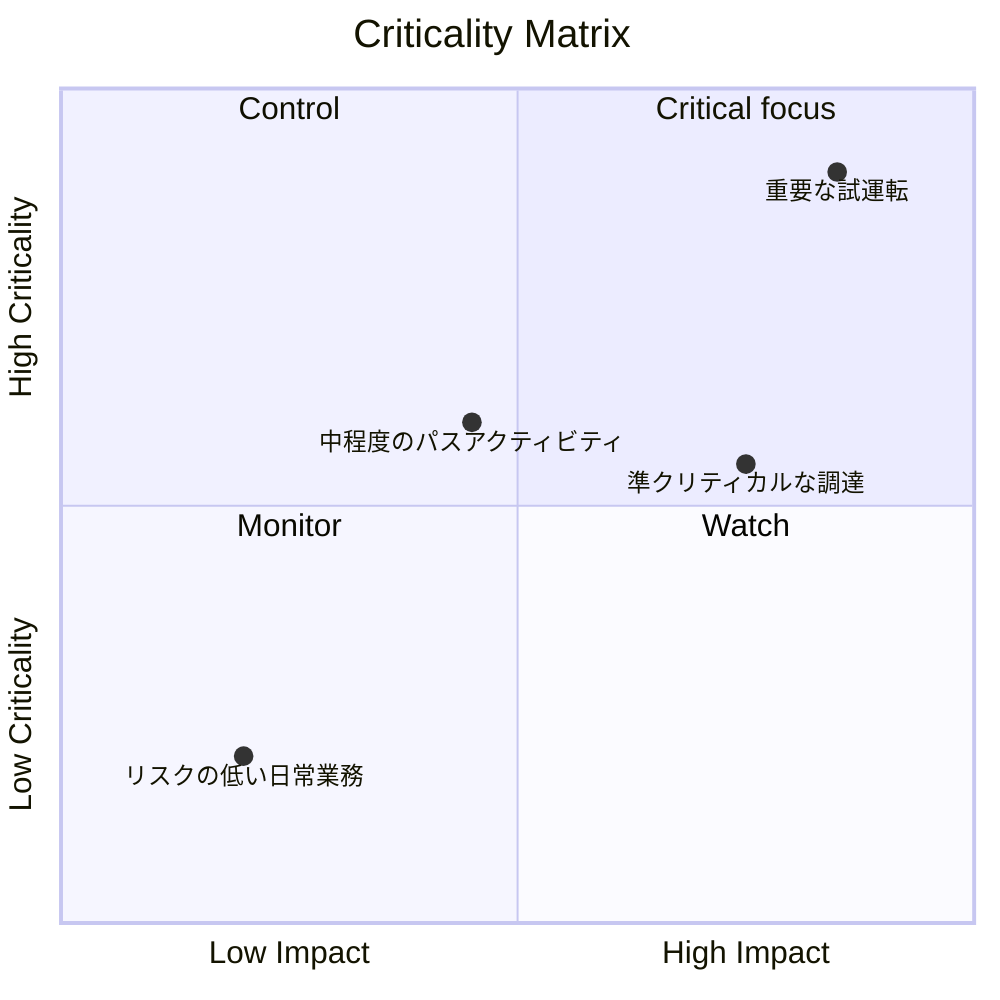

重要度マトリックスは、プロジェクト完了に対する重要度に基づいてプロジェクト活動を分類し、優先順位を付けるために使用される視覚的または分析的な方法です。 Primavera P6 のコンテキストでは、プロジェクト マネージャー、プランナー、PMO レビュー担当者が、どのアクティビティが最大のスケジュール リスクを生み出すかを特定するのに役立ちます。

クリティカル パスは、スケジュールの現在の決定的なストーリーを伝えます。重要度マトリックスはさらに一歩進んだものです。これは、どのアクティビティがすでにクリティカルになっているのか、どのアクティビティがクリティカルに近づいているのか、どれが失敗すると深刻な影響を与えるのかをチームが理解するのに役立ちます。

これは、今日重要なアクティビティだけが注目に値するとは限らないため、重要です。遅延の影響が大きいクリティカルに近いアクティビティは、明日の問題になる可能性があります。長期にわたる調達活動は現在のクリティカル パス上にない可能性がありますが、厳重な管理を正当化するのに十分なリスクを伴う可能性があります。

## P6 におけるクリティカリティの意味

Primavera P6 では、通常、重要度はアクティビティが遅延した場合にプロジェクトの終了日に影響を与える可能性があるかどうかを指します。従来、P6 は合計フロートまたは最長パス設定を使用して重要なアクティビティを識別します。

一般的な決定論的な定義は単純です。

- クリティカルなアクティビティは、フロートがゼロまたは負のアクティビティです。
- これらの活動はクリティカル パス上にある、またはクリティカル パスと密接に結びついています。
- 遅れた場合、プロジェクトの終了日も遅れる可能性があります。

この定義は役に立ちますが、完全ではありません。計算された 1 つのスケジュール条件に基づいています。活動が失敗した場合の不確実性、確率、または影響の大きさを完全に説明するものではありません。

重要度マトリックスは、「このアクティビティは今日重要ですか?」というところから議論を広げます。 「このアクティビティが重大になる可能性はどのくらいですか? また、それが引き起こす損害はどのくらいですか?」

## 重要度マトリックスの組み合わせ

重要度マトリックスは通常、2 つの次元を組み合わせたものです。

最初の次元は、スケジュールの感度または可能性です。これは、モンテカルロ シミュレーション中にアクティビティがどのくらいの頻度でクリティカルになるか、または合計フロートまたはクリティカルに近いしきい値に基づいてアクティビティがクリティカルにどの程度近づくかによって測定できます。

2 番目の次元はインパクトです。これは、アクティビティが遅れた場合の遅延の深刻さを意味します。影響は、活動期間、プロジェクト終了に対する遅延の影響、感度指数、コスト負担、契約上のマイルストーンへの影響、または経営判断に基づく場合があります。

これらの側面を組み合わせることで、チームがアクティビティに優先順位を付けるのに役立ちます。

このタイプのビューは、クリティカル フィルターに単に表示されるアクティビティと、積極的に管理する必要があるアクティビティを分離するため便利です。

## 単純なマトリックス構造

基本的な重要度マトリックスはグリッドとして表示できます。

| 重要度/影響度 | 低影響 | 中程度の影響 | 高い影響力 |
| --- | --- | --- | --- |
| 低重要度 | モニター | モニター | 時計 |
| 中程度の重大度 | レビュー | コントロール | 高優先度 |
| 高いクリティカル度 | コントロール | 高優先度 | クリティカルフォーカス |

正確なラベルは組織によって異なる場合がありますが、考え方は同じです。重要度が低く、影響も少ないアクティビティを監視できます。重要度が高く影響力の大きいアクティビティには、集中的な制御が必要です。

## マトリックスで使用される P6 データ

Primavera P6 は通常、デフォルトでは組み込みの重要度マトリックス ビューを提供しません。マトリックスは通常、P6 アクティビティ データと外部分析を組み合わせて使用​​して構築されます。

有用な P6 フィールドには次のものがあります。

- 総フロート。
- フリーフロート。
- 活動期間。
- 残りの期間。
- アクティビティステータス。
- 開始日と終了日。
- 制約。
- 関係ロジック。
- カレンダー。
- WBS またはアクティビティ コード。
- クリティカルまたは最長パスのインジケーター。

このデータにより、決定的なスケジュール ビューが得られます。現在計算されているパス、クリティカルに近い作業、制約されたアクティビティ、および長時間にわたってエクスポージャが残っているアクティビティが表示されます。

## リスク分析の入力

マトリックスをより強力にするために、チームはモンテカルロ分析からの確率的スケジュール リスク データを追加できます。これは、Primavera Risk Analysis やその他のリスク シミュレーション プラットフォームなどのツールから得られる場合があります。

重要なリスク指標には、重大度指数、合計フロート、スケジュール感度指数、期間または影響値が含まれます。

クリティカリティ インデックス (CI とも呼ばれます) は、アクティビティがクリティカル パス上に現れるシミュレーションの割合を示します。たとえば、アクティビティの CI = 80% がある場合、シミュレーションされたシナリオの 80% でクリティカルでした。

Total Float は、確定的なスケジュールにおいてアクティビティがプロジェクトの終了にどの程度影響を及ぼしているかを示します。フロートがゼロに近い場合は警告サインです。

スケジュール感度指数は、重要性と影響力を組み合わせたものです。これは、アクティビティがクリティカルになるかどうかだけでなく、結果に意味のある影響を与えるかどうかを示すのにも役立ちます。

期間または影響値は、重大度の推定に役立ちます。より長い活動、高リスクの調達パッケージ、または契約上のマイルストーンに関連するタスクは、遅延するとより大きな影響を与える可能性があります。

## 例

次の単純化されたアクティビティ セットを考えてみましょう。

| 活動 | フロート | 重要度指数 | 間隔 | マトリックスの結果 |
| --- | ---: | ---: | ---: | --- |
| あ | 0日 | 95% | 20日 | クリティカルフォーカス |
| B | 5日間 | 60% | 15日 | 高優先度 |
| C | 20日 | 15% | 10日間 | モニター |

アクティビティ A は、重要度が高く、影響度が高い領域に属します。これにはフロートがなく、ほとんどのシミュレーションでクリティカルに見え、持続時間が長くなります。集中的に制御する価値があります。

アクティビティ B はアクティビティ A ほど緊急ではないかもしれませんが、それでも注目に値します。フロートは限られており、クリティカルになる可能性はかなりあります。

アクティビティ C はフロートが多く、クリティカル度が低くなります。これを無視すべきではありませんが、同じレベルの管理の焦点は必要ありません。

## なぜ役立つのか

クリティカリティ マトリックスは、プロジェクト チームが単一の決定論的なクリティカル パスのみに依存することを避けるのに役立ちます。決定的なパスは重要ですが、それはスケジュールの 1 つの見方にすぎません。

マトリックスはチームに次のことを助けます。

- 綿密に監視するものに優先順位を付けます。
- 主要なリスク活動の軽減に重点を置きます。
- クリティカルに近いアクティビティを、クリティカルになる前に特定します。
- 確率的なスケジュールのリスクを理解する。
- 可能性と影響を 1 つのビューで比較します。
- スケジュールのリスクを経営陣にもっと明確に伝えます。

PMO レポートの場合、これはスケジュールの複雑さを意思決定の枠組みに変換するため、特に役立ちます。チームは、何百ものアクティビティを提示する代わりに、どのアクティビティが「重要な焦点」、「高優先度」、「制御」、または「監視」ゾーンにあるかを示すことができます。

## 簡単に構築する方法

まず、P6 からアクティビティ データをエクスポートします。アクティビティ ID、アクティビティ名、WBS、合計フロート、残り期間、開始、終了、カレンダー、制約、およびクリティカルまたは最長パスのインジケーターが含まれます。

次に、重要度指数やスケジュール感度指数などのオプションのリスク分析フィールドを追加します。シミュレーション データが利用できない場合は、フロートと期間に基づいた実用的なしきい値を使用します。たとえば、重大度が高いとは、合計フロートが 0 日以下、または CI が 70% を超えることを意味する場合があります。中程度の臨界度は、臨界に近いフロートまたは CI が 40% ～ 70% であることを意味する場合があります。

影響のしきい値を定義します。影響の大きいアクティビティは、長期間にわたる場合や、契約上のマイルストーンに関連付けられている場合、リスクの高いパッケージの一部である場合、またはプロジェクトの完了に影響を与えるシミュレーションによって示される場合があります。

最後に、Excel、Power BI、またはその他のレポート ツールでアクティビティをプロットします。結果は複雑である必要はありません。優先順位を可視化することで価値が生まれます。

## 使用判定

重要度マトリックスは意思決定支援ツールであり、自動的に答えが得られるものではありません。しきい値はプロジェクト管理チームによって検討され、プロジェクトの種類、契約の機密性、スケジュールの成熟度に合わせて調整される必要があります。

また、マトリックスはスケジュールの品質に依存することにも注意してください。 P6 スケジュールに欠落しているロジック、非現実的な期間、厳しい制約、貧弱なカレンダー、または弱いステータス更新がある場合、マトリックスはそれらの弱点を継承します。

マトリックスの最適な使用法は、分析結果と専門的なスケジューリング判断を組み合わせることです。

## 結論

重要度マトリックスは、プロジェクト活動が重要になる可能性の高さと遅延した場合の影響の大きさによってランク付けされます。合計フロート、期間、制約、ロジックなどの P6 データを使用し、重要度指数やスケジュール感度指数などのモンテカルロ結果で強化できます。

プロジェクト マネージャーや PMO レビュー担当者にとって、このマトリックスはスケジュールのリスクをより明確な管理上の会話に変えます。これにより、チームは今日の重要なフィルターに表示されるアクティビティだけでなく、最も重要なアクティビティに集中することができます。

重要度マトリックスをうまく活用すると、プロジェクト チームが事後的なレポート作成から事前的なスケジュール管理に移行するのに役立ちます。
## 関連コンテンツ
- [制約で始まるクリティカル パスまたはフロート パス - 概要](../../metrics/09_cp_or_float_path_starting_with_constraint/02_guide_template.md)
- [クリティカル パス](../03_CRITICAL%20PATH/03_CRITICAL%20PATH.md)
- [P6 のアクティビティの種類](../05_ACTIVITY%20TYPES%20IN%20P6/05_ACTIVITY%20TYPES%20IN%20P6.md)
