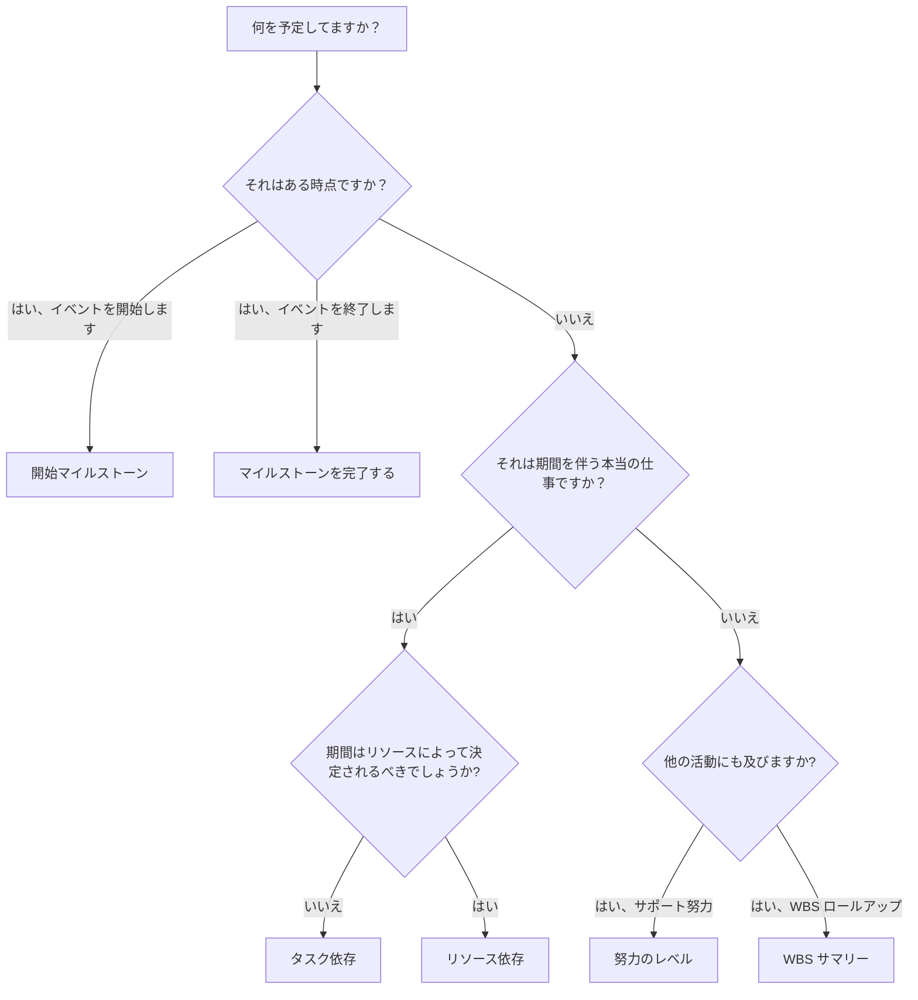

# P6 のアクティビティの種類

アクティビティ タイプは、Primavera P6 の最も重要な設定フィールドの 1 つです。これは、P6 にどのような種類のアクティビティを計算しているか、およびそのアクティビティがスケジュール内でどのように動作するかを指示します。

多くのスケジューラは、まずアクティビティ名、期間、日付、関係に焦点を当てます。これらは不可欠ですが、アクティビティの種類も重要です。タスク アクティビティ、マイルストーン、作業レベル アクティビティ、および WBS 概要アクティビティは同じように動作しません。間違ったタイプを選択すると、日付、進行状況、リソースの読み込み、フロート、レポートが歪む可能性があります。

このブログの目的は、P6 で使用できる主なアクティビティ タイプ、それぞれの用途、および計画されている作業にどのタイプが適しているかを決定する方法を説明することです。

## アクティビティの種類が重要な理由

アクティビティの種類は、項目のスケジュールの目的と一致している必要があります。それは期間を伴う本当の仕事ですか？それはある時点ですか？他の活動にまたがる作業の概要ですか?固定されたタスク期間ではなく、リソースに依存する労力ですか?

アクティビティの種類が目的と一致しない場合、スケジュールが混乱する可能性があります。期間のあるマイルストーンはマイルストーンではありません。サマリーとして使用される通常のタスクでは、ロジックが隠蔽される場合があります。作業を推進するために使用される作業レベルのアクティビティによって、クリティカル パスが歪む可能性があります。リソース依存アクティビティを誤って使用すると、予想とは異なる計算が行われる可能性があります。

P6 では、アクティビティ タイプは、スケジュールが計算されるときにこのアイテムがどのように動作するべきかという実際的な質問に答えるのに役立ちます。

## P6 の主なアクティビティの種類

最も一般的な Primavera P6 アクティビティ タイプは次のとおりです。

- タスクに依存します。
- リソースに依存します。
- 努力のレベル。
- マイルストーンを開始します。
- マイルストーンを完了します。
- WBS の概要。

それぞれに異なる目的があります。

## タスクに依存するアクティビティ

タスク依存は、P6 で最も一般的なアクティビティ タイプです。これは、アクティビティの期間が個々のリソース カレンダーではなく、アクティビティに割り当てられたカレンダーによって制御される通常の計画作業に使用します。

例としては次のものが挙げられます。

- 基礎を掘削します。
- ケーブルトレイを取り付けます。
- コンクリートスラブを流し込みます。
- デザインパッケージを用意します。
- 圧力テストを実施します。

タスク依存アクティビティは、通常、ほとんどの建設、エンジニアリング、調達、テスト、および試運転タスクに最適な選択です。それらは明確で安定しており、理解しやすいです。スケジューラは期間を定義し、アクティビティ カレンダーを割り当て、ロジックを接続し、P6 が日付を計算します。

アクティビティが個別の作業範囲を表し、作業期間がリソース カレンダーに基づいて変更されるべきでない場合は、タスク依存を使用します。

## リソース依存のアクティビティ

リソース依存アクティビティは、アクティビティに割り当てられたリソースによって期間とスケジュール動作が影響を受ける必要がある場合に使用されます。この場合、P6 はリソース カレンダーとリソースの可用性を使用して、アクティビティのスケジュール方法を計算できます。

これは、リソースの可用性が作業の実際の推進力である場合に役立ちます。たとえば、専門の乗務員、検査官、または機器リソースは、特定の日またはシフトでしか利用できない場合があります。

例としては次のものが挙げられます。

- 限られた検査員による専門的な検査。
- ベンダー技術者のサポート。
- 希少なリソースを使用した機器の校正。
- リソース主導のメンテナンス作業。

リソースに依存するアクティビティは注意して使用する必要があります。プロジェクトがアクティブにリソースをロードまたはリソースレベル化していない場合、習慣によってリソース依存を使用すると混乱が生じる可能性があります。アクティビティ カレンダーが主なスケジュールの基準であるため、多くのスケジュールではデフォルトとしてタスク依存が使用されます。

リソースとそのカレンダーがスケジュール計算に影響を与えることが意図されている場合は、リソース依存を使用します。

## 開始マイルストーン

開始マイルストーンは、イベント、フェーズ、アクセス ウィンドウ、承認、または主要な作業条件の開始を表す期間ゼロのアクティビティです。

例としては次のものが挙げられます。

- 続行の通知を受け取りました。
- エリアへのアクセスが許可されました。
- 工事開始。
- 実行用にリリースされたデザイン パッケージ。
- コミッショニングウィンドウを開始します。

開始マイルストーンは、実行中の作業を表すものではありません。これらは、作業を開始できる時点、または重要な開始イベントをマークする時点を表します。

スケジュールで重要なことの開始をマークする必要がある場合は、開始マイルストーンを使用します。通常は、何がマイルストーンを推進し、どのような作品がリリースされるのかを説明するロジックと関連付けられる必要があります。

## マイルストーンを完了する

終了マイルストーンは、イベント、フェーズ、成果物、または契約上のポイントの完了を表す期間ゼロのアクティビティです。

例としては次のものが挙げられます。

- 機械的に完成しました。
- システムの切り替えが完了しました。
- 許可の承認を受け取りました。
- 実質的な完成。
- 最終完成。

終了マイルストーンは達成をマークするため、レポートに役立ちます。通常の作業活動として使用しないでください。マイルストーンに到達するために努力が必要な場合、その努力はマイルストーンにつながるタスクとしてモデル化される必要があります。

スケジュールで何かが完了または達成されたことをマークする必要がある場合は、終了マイルストーンを使用します。

## 努力のレベル

LOE と呼ばれる作業レベルは、プロジェクトを直接推進するのではなく、他の作業にまたがるアクティビティに使用されます。 LOE 活動は、通常、管理、監督、検査サポート、プロジェクト管理、または継続的な調整に使用されます。

例としては次のものが挙げられます。

- プロジェクト管理のサポート。
- 現場監督。
- エンジニアリングマネジメント。
- 施工管理。
- 品質検査サポート。

LOE アクティビティは通常、他のアクティビティから日付を取得します。これは、他の作業が行われている間も継続するサポート作業を表す必要があります。通常、個別の建設タスクやエンジニアリング タスクを推進することは意図されていません。

LOE は、アクティビティが一連のアクティビティにまたがる継続的なサポート、監視、または管理を表す場合に使用します。

LOE ロジックには注意してください。 LOE が正しくリンクされていない場合、日付がずれたり、フロートが歪んだりするように見える場合があります。 LOE アクティビティは、特にクリティカル パス上にある場合、または異常な FS または SF 関係がある場合、スケジュールの品質チェック中にレビューする必要があります。

## WBS サマリー

WBS 概要アクティビティは、WBS 要素内のアクティビティのグループを要約します。これらの日付は、独自の詳細なロジックからではなく、WBS に基づくアクティビティから導出されます。

例としては次のものが挙げられます。

- エンジニアリングの概要。
- 調達概要。
- エリアAの工事概要です。
- システム 01 の試運転の概要。

WBS 概要アクティビティは、高レベルのレポート作成に役立ちますが、実際のアクティビティやロジックを置き換えるものではありません。これらはロールアップ ツールであり、実行タスクではありません。

WBS セクションの概要レベルのビューが必要な場合、およびプロジェクトのレポート方法でその使用がサポートされている場合にのみ、WBS 概要アクティビティを使用します。

## 適切なタイプの選択

簡単なルールが役立ちます。

- 期間を伴う実際の作業の場合は、リソース カレンダーによって駆動される必要がない限り、タスク依存を使用します。
- リソースの可用性がそれを促進する必要がある場合は、リソース依存を使用します。
- 開始イベントの場合は、開始マイルストーンを使用します。
- 完了イベントの場合は、「完了マイルストーン」を使用します。
- 他の作業にまたがる継続的なサポートの場合は、「作業レベル」を使用します。
- レポートのロールアップの場合は、WBS 概要を使用します。

アクティビティの種類によってスケジュールが理解しやすくなるはずです。レビュー担当者が、マイルストーンに期間がある理由、LOE が作業を推進している理由、または詳細ロジックに WBS 概要が表示される理由を尋ねる必要がある場合、アクティビティ タイプが間違っている可能性があります。

## よくある間違い

よくある間違いの 1 つは、マイルストーンを仕事の代用として使用することです。マイルストーンはある時点を示すものでなければなりません。作業が必要な場合は、その作業用のアクティビティを作成します。

もう 1 つの間違いは、LOE アクティビティを使用して個別作業を制御することです。 LOE は、実際の活動間のロジックを置き換えるのではなく、作業をサポートまたはスパンする必要があります。

3 番目の間違いは、リソース主導のスケジューリング プロセスを使用せずにリソース依存を使用することです。リソース カレンダーが維持されていない場合、アクティビティ タイプによって価値よりも混乱が生じる可能性があります。

最後に、WBS の概要アクティビティを、よく構築された WBS や詳細なロジックの代わりとして使用することは避けてください。概要はレポートには便利ですが、スケジュールにはその下に実際のアクティビティが必要です。

## 結論

P6 のアクティビティ タイプは、アクティビティの動作方法を定義します。それらは単なるラベルではありません。適切なアクティビティ タイプは、スケジュールを正しく計算し、明確に伝えるのに役立ちます。

タスク依存アクティビティは、最も通常の作業を表します。リソース依存アクティビティは、リソース カレンダーでスケジュールを制御する必要がある場合に便利です。開始マイルストーンと終了マイルストーンは、重要な時点をマークします。取り組みレベルのアクティビティは、他の作業にまたがるサポートを表します。 WBS 概要アクティビティは、ロールアップ レポートをサポートします。

適切なアクティビティ タイプを選択すると、スケジュールの確認と説明が容易になり、プロジェクト管理の信頼性が高まります。強力なスケジュールには、適切な日付とロジックがあるだけではありません。また、表現されている作品に適した種類のアクティビティも使用します。
## 関連コンテンツ
- [駆動ロジックなしでデータ日付に開始されるアクティビティ: このスケジュール指標が重要な理由 - 概要](../../12_metrics_jp/01_activities_starting_in_dd_with_no_logic_driving/01_overview_template.md)
- [重要度マトリックス](../04_CRITICALITY%20MATRIX/04_CRITICALITY%20MATRIX.md)
- [P6 の期間タイプ](../06_DURATION%20TYPES%20IN%20P6/06_DURATION%20TYPES%20IN%20P6.md)
