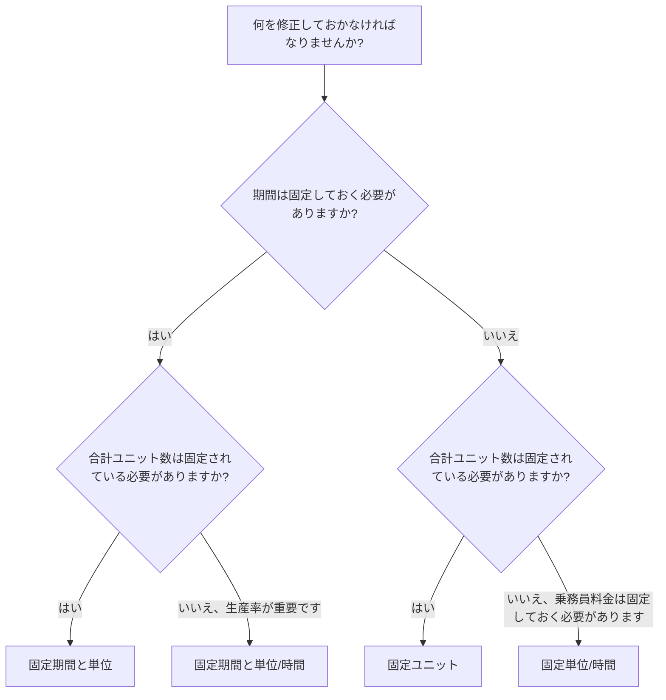

期間タイプは、Primavera P6 のフィールドの 1 つで、期間、単位、リソースの生産性が変化したときにアクティビティがどのように動作するかを制御します。見落としがちですが、スケジュールの日付、リソースの読み込み、コスト予測、獲得価値、更新動作に影響を与える可能性があります。

多くのスケジューラは期間を日数としてのみ考えます。 P6 では、持続時間は数値以上です。アクティビティには、労働単位、非労働単位、時間あたりの単位、リソース カレンダー、アクティビティ カレンダー、および残りの作業を含めることもできます。期間タイプは、スケジュールが再計算されるとき、またはスケジューラがリソースと期間を変更するときに、何を固定しておくべきかを P6 に指示します。

このブログでは、P6 のアクティビティで使用できる主な期間タイプ、それらの違い、それぞれの用途、およびいつ別の期間の代わりに使用するかを説明します。

## 期間タイプが期間フィールドと同じではありません

タイプを検討する前に、2 つのアイデアを区別するのに役立ちます。

期間フィールドは、元の期間、残りの期間、実際の期間、完了期間などの値です。これらは時間を表します。

期間タイプは計算設定です。これは、何かが変化したときに、期間、合計単位、および時間ごとの単位のバランスをとる方法を P6 に指示します。

たとえば、アクティビティにさらにリソースを追加する場合、アクティビティは早く終了する必要がありますか?それとも、期間は同じままで、総労力を増やす必要がありますか?答えは期間タイプによって異なります。

## 主な持続時間の種類

一般的な P6 期間タイプは次のとおりです。

- 固定期間と単位。
- 固定期間と単位/時間。
- 固定ユニット。
- 固定単位/時間。

最初は名前が専門的に聞こえるかもしれませんが、それぞれの名前は、何かが変更されたときに P6 がアクティビティのどの部分を保護する必要があるかという実用的な質問に答えています。

## 固定期間と単位

[固定期間と単位] では、アクティビティの期間と合計単位が固定されます。時間あたりの単位が変化した場合、P6 は期間や総努力量を変更するのではなく、レートを調整します。

このタイプは、計画された時間枠と総作業量の両方を安定させたい場合に便利です。

例：

アクティビティは 10 日間、400 時間の作業時間が計画されています。スケジュール チームは、期間を 10 日間のままにし、予算に計上された総作業量を 400 時間のままにしたいと考えています。リソース割り当ての詳細が変更された場合、計画された期間と合計ユニットは自動的に移動しないようにする必要があります。

次の場合に固定期間と単位を使用します。

- アクティビティには固定の作業ウィンドウがあります。
- 総努力額はすでに合意されています。
- リソースレートの変更により、アクティビティの期間が自動的に変更されるべきではありません。
- スケジュールは、安定したコストまたは獲得価値の管理に使用されます。

これは、スケジュール期間と予算に基づいた作業量の両方が制御される管理作業パッケージに役立つことがよくあります。

## 固定期間と単位/時間

[固定期間と単位/時間] では、期間とリソース レートが固定されます。リソースが追加または削除された場合、P6 は合計ユニットを調整できます。

このタイプは、アクティビティが一定の時間枠内で発生する必要があり、リソースの読み込み速度を一定に保つ必要がある場合に便利です。

例：

プロジェクト管理サポート活動は 20 日間続きます。チームは 1 人のプロジェクト エンジニアを 1 日あたり 8 時間割り当てます。期間は 20 日間のまま、日割り料金は 1 日あたり 8 時間のままにする必要があります。合計単位は、時間枠とレートの結果です。

次の場合に、固定期間と単位/時間を使用します。

- 活動期間は固定されています。
- 日次または時間別のリソース レートが重要です。
- 合計ユニットは期間とレートから計算する必要があります。
- このアクティビティは、継続的なサポートまたは一定の作業期間を表します。

これは、監視、管理、検査サポート、または時間ベースのサポート活動に役立ちます。

## 固定ユニット

固定単位では、合計単位が固定されます。リソース レートが変化した場合、P6 は期間を調整できます。

このタイプは、作業量は固定されているものの、その期間は生産性やリソースの可用性に依存する場合に便利です。

例：

1 つのアクティビティには 800 時間の労働時間が必要です。チームがより多くの乗組員を割り当てた場合、アクティビティはより早く終了する可能性があります。利用可能な乗組員の定員が少ない場合は、アクティビティに時間がかかる場合があります。総作業時間は800時間にとどまります。

次の場合に固定単位を使用します。

- 仕事の量または総労力は固定されています。
- 期間は、リソースの可用性または生産性に応じて決定する必要があります。
- 乗組員の人数によって、アクティビティを完了するのに必要な時間が変わる場合があります。
- リソース計画はアクティブかつ維持されます。

これは、総工数がわかっていて、作業員の負荷に応じて所要時間が予想される生産スタイルの作業に役立ちます。

## 固定単位/時間

[固定単位/時間] では、リソース レートが固定されます。期間が変化すると、それに伴って合計ユニット数も変化します。

このタイプは、作業員またはリソースがアクティビティが続く限り固定レートで作業する場合に便利です。

例：

現場監督活動では、1 人の監督者が 1 日あたり 8 時間勤務します。アクティビティ期間が 10 日から 15 日に増加した場合、スーパーバイザーが必要な日数が増えるため、合計単位数も増加するはずです。日割り料金は固定のままです。

次の場合に固定単位/時間を使用します。

- 乗組員またはリソースのレートは固定されています。
- 期間が変更されると、合計ユニット数が増減する必要があります。
- アクティビティは時間ベースの労力を表します。
- リソースはアクティビティ期間全体にわたって割り当てられます。

これは、時間が総作業量を左右するサポート、監督、検査、管理活動に役立つことがよくあります。

## 適切な期間タイプを選択する方法

最適な期間タイプは、アクティビティが何を表すか、およびプロジェクト管理チームが P6 にどのように変更を計算するかを期待するかによって異なります。

選択する簡単な方法は、次のように尋ねることです。

- 期間はプラン、契約、窓口、またはアクセスによって固定されていますか?
- 総工数は数量、予算、または見積もりによって決まりますか?
- リソース率は乗組員計画または人員配置計画によって固定されていますか?
- リソースを追加するとアクティビティが短縮されるべきですか?
- アクティビティを延長すると、合計ユニット数が増加する必要がありますか?

期間と合計単位を固定する必要がある場合は、固定期間と単位を使用します。

期間と生産速度を固定する必要がある場合は、固定期間と単位/時間を使用します。

総作業量を固定し、期間をリソースの負荷に応じて変化させる必要がある場合は、固定単位を使用します。

リソースレートを固定し、期間に応じて単位を変更する必要がある場合は、「固定単位/時間」を使用します。

## 実践例

定義された作業員とコスト予算による固定の 1 日作業として計画されたコンクリート打設の場合、固定期間と単位が適切な場合があります。

固定レポート期間にわたって一定の日次レートで割り当てられるプロジェクト管理サポートの場合、総単位数または期間の変更が予測を推進するかどうかに応じて、固定期間と単位/時間または固定単位/時間が適切な場合があります。

総作業量が既知で、作業員の人数が完了時間に影響する設置作業の場合は、固定ユニットが適切な場合があります。

工事期間が長く続く現場監督の場合は、単位・時間固定が適切な場合があります。

重要な点は、選択は習慣ではなくプロジェクト管理方法を反映する必要があるということです。

## よくある間違い

よくある間違いの 1 つは、アクティビティの目的と一致するかどうかを確認せずに、すべてのアクティビティでデフォルトの期間タイプをそのままにすることです。

もう 1 つの間違いは、プロジェクトがリソースの割り当てを注意深く維持していない場合に、リソース主導の期間動作を使用することです。リソース データが弱い場合、リソース ベースの計算では信頼性の低い結果が生成される可能性があります。

3 番目の間違いは、P6 が単位やレートをどのように再計算するかを理解せずに、更新中に期間を変更することです。これは、コスト負荷、獲得価値、リソースのヒストグラムに影響を与える可能性があります。

最後に、期間タイプを純粋に技術的な設定として扱うことは避けてください。計画が変更されたときのスケジュールの動作に影響します。

## 期間のタイプとスケジュールの品質

期間タイプは、予測が信頼できるかどうかに影響するため、スケジュールの品質の一部です。アクティビティの期間、単位、およびリソース率が期待どおりに動作しない場合、スケジュールには誤解を招く日付またはリソース需要が表示される可能性があります。

PMO レビューの場合、類似したアクティビティ グループ間で期間タイプが一貫しているかどうかを確認すると便利です。エンジニアリング活動、調達活動、建設活動、LOE 活動、およびサポート活動には異なるルールが必要になる場合がありますが、選択は意図的に行う必要があります。

スケジュールにリソースがロードされている場合、期間タイプはさらに重要になります。これは、リソースの変更が期間、合計単位、または時間あたりの単位に影響を与えるかどうかを判断するのに役立ちます。

## 結論

P6 の期間タイプは、期間、合計ユニット、リソース レートが変化したときにアクティビティがどのように応答するかを定義します。これらは単なる背景設定ではありません。

期間と単位が固定されているため、時間と総労力の両方が保護されます。固定期間と単位/時間により、時間とレートが保護されます。固定ユニットは総労力を保護します。固定単位/時間はリソース レートを保護します。

適切な期間タイプを選択すると、プロジェクト計画に一致する方法でスケジュールを計算することができます。また、リソースの読み込み、進捗状況の更新、コスト予測、スケジュール レポートの理解と防御が容易になります。
## 関連コンテンツ
- [駆動ロジックなしでデータ日付に開始されるアクティビティ: このスケジュール指標が重要な理由 - 概要](../../metrics/01_activities_starting_in_dd_with_no_logic_driving/02_guide_template.md)
- [P6 のアクティビティの種類](../05_ACTIVITY%20TYPES%20IN%20P6/05_ACTIVITY%20TYPES%20IN%20P6.md)
- [P6の日付](../07_DATES%20IN%20P6/07_DATES%20IN%20P6.md)
