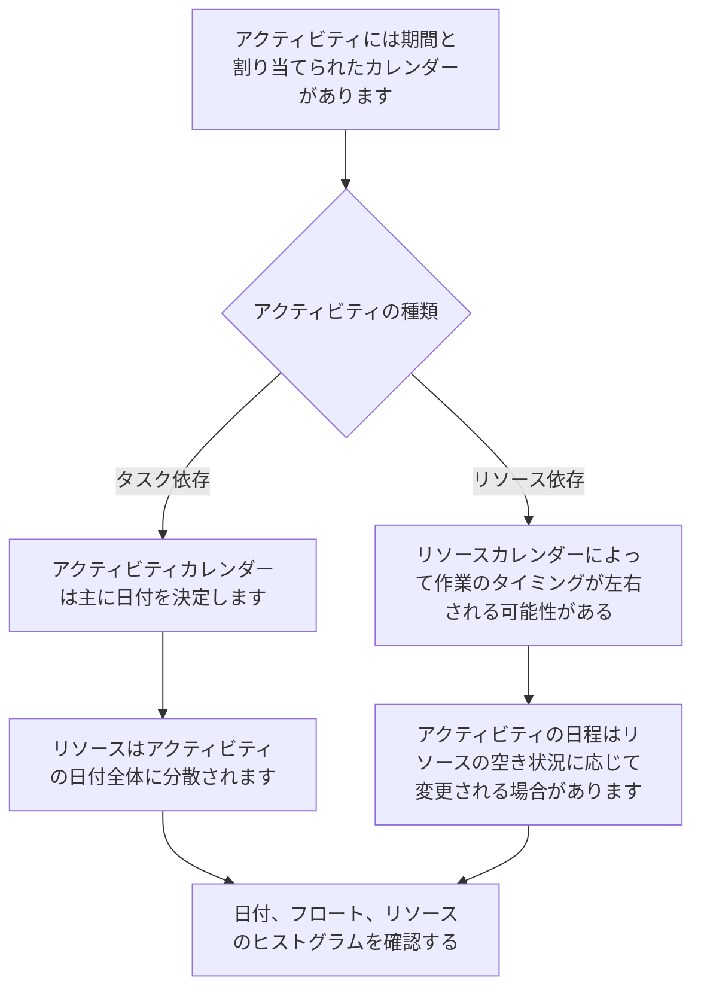

# P6のカレンダー

カレンダーは、Primavera P6 スケジュールの静かな基盤の 1 つです。作業がいつ行われるかを定義します。彼らは P6 に、どの日が稼働日で、どの日が非稼働日であるか、1 日に利用できる時間は何時間か、および作業の開始時刻と終了時刻を通知します。

カレンダーは舞台裏で機能するため、過小評価されがちです。スケジュールには強力なロジックと妥当な期間が含まれている場合がありますが、カレンダーが間違っていたり一貫性がなかったりすると、日付が誤解を招く可能性があります。

カレンダーを理解することは、スケジュールの品質、リソース計画、クリティカル パスのレビュー、更新規律にとって不可欠です。

## P6 でのカレンダーの役割

P6 では、カレンダーが期間を日付に変換します。アクティビティの期間が 10 営業日の場合、P6 は営業日が何を意味するかを知る必要があります。月曜から金曜までですか？土曜日も含まれますか？労働時間は 8 時間ですか、10 時間ですか、それとも 12 時間ですか?仕事は7時から始まりますか、8時からですか？祝日は除外されますか？

カレンダーはそれらの質問に答えます。

カレンダーの影響:

- アクティビティの開始日と終了日。
- 早い日付と遅い日付。
- 総フロート。
- クリティカル パスと最長パス。
- リソースの使用タイミング。
- 関係ラグの解釈。
- 更新中に日付が変わります。
- 先読みとレポートの精度。

カレンダーは単なる管理用の設定アイテムではありません。スケジュール計算の一部です。

## 複数のカレンダーが必要な理由

すべての作業が同じ作業パターンに従っているわけではないため、多くのプロジェクトでは複数のカレンダーが必要です。

例としては次のものが挙げられます。

- オフィス エンジニアリングの作業は 5 日間のカレンダーで行われます。
- 6 日間のカレンダーでの現場の建設作業。
- 24 時間カレンダーでのシャットダウンまたは停止作業。
- 夜勤の試運転作業。
- 所有者アクセス ウィンドウ。
- 環境上の制限。
- サプライヤーの営業日に基づいた調達活動。
- 検査官、ベンダー、または専門スタッフ向けのリソース固有のカレンダー。

すべてに 1 つのカレンダーを使用するのは簡単に見えるかもしれませんが、非現実的な日付が作成される可能性があります。試運転が夜間にのみ行われる場合、通常の日中のカレンダーは間違っている可能性があります。ベンダーが平日のみ作業する場合、7 日間の工事カレンダーでは空き状況が誇張される可能性があります。

目標は、カレンダーをたくさん作成することではありません。目標は、スケジュールを不必要に複雑にすることなく、実際の労働条件をモデル化するのに十分なカレンダーを作成することです。

## アクティビティカレンダー

アクティビティ カレンダーはアクティビティに直接割り当てられます。これは、特にタスクに依存するアクティビティの場合、そのアクティビティの期間と日付の計算に使用される作業時間を定義します。

たとえば、「ケーブル トレイの設置」に 6 日間の建設カレンダーがある場合、P6 はそのカレンダーに基づいて作業を計算します。土曜日が営業日の場合、アクティビティは 5 日間のカレンダーよりも早く終了する可能性があります。

通常、アクティビティ カレンダーは、通常のスケジュール アクティビティのメイン カレンダー コントロールです。

日勤、夜勤、シャットダウン作業、事務作業など、作業自体が定義された作業パターンに従っている場合は、アクティビティ カレンダーを使用します。

## リソースカレンダー

リソース カレンダーは、リソースがいつ利用可能になるかを定義します。リソースは、人、乗務員、機器アイテム、ベンダーの専門家、またはその他の割り当てられたリソースです。

リソース カレンダーは、アクティビティがリソースに依存する場合、またはプロジェクトでリソースの平準化や詳細なリソース計画が使用されている場合に特に重要になります。

たとえば、アクティビティが 6 日間の建設カレンダーに割り当てられている場合でも、それに割り当てられた専門の検査官は月曜日から水曜日までしか対応できない場合があります。アクティビティがリソース主導型の場合、P6 はアクティビティ カレンダーだけではなくリソース カレンダーに基づいて日付を計算する場合があります。

リソース カレンダーは、リソースの可用性が実際のスケジュール上の制約となる場合に役立ちます。また、割り当てられても維持されていない場合、混乱が生じる可能性があります。

## アクティビティ カレンダーとリソース カレンダーのインターフェイス方法

アクティビティ カレンダーとリソース カレンダーの関係は、アクティビティ タイプ、リソース設定、スケジュール計算動作によって異なります。

タスク依存アクティビティの場合、通常、アクティビティ カレンダーがアクティビティ期間の主な基準となります。リソース カレンダーは、リソースのスプレッドと使用量に影響を与える可能性があります。

リソースに依存するアクティビティの場合、リソース カレンダーが作業の実行時期に影響を与える可能性があります。これは、リソース カレンダーがアクティビティの日付により直接的に影響を与える可能性があることを意味します。

重要な点は、カレンダーを一緒に確認する必要があるということです。アクティビティ カレンダーでは作業が可能であると示される一方で、リソース カレンダーでは、割り当てられたリソースが利用できないと示される場合があります。この不一致によって非同期が発生する可能性があります。

## カレンダーの非同期の意味

カレンダーの非同期は、スケジュール内のさまざまなカレンダーがプロジェクトの実際の動作方法と一致していない場合に発生します。

一般的な例は次のとおりです。

- アクティビティでは 6 日間のカレンダーが使用されますが、割り当てられたリソースでは 5 日間のカレンダーが使用されます。
- アクティビティは日勤カレンダーを使用しますが、リソースは夜勤を使用します。
- リンクされた 2 つのアクティビティでは、1 日の異なる開始時刻と終了時刻が使用されます。
- ラグは、作業と一致しないカレンダーを通じて解釈されます。
- コピーされたアクティビティには、別のプロジェクトの古いカレンダーが保持されます。
- リソース カレンダーには、アクティビティ カレンダーにない休日があります。

結果は混乱を招く可能性があります。日付は予期せず変更される場合があります。アクティビティは 1 日遅れて終了するように見える場合があります。明らかな論理的理由がなくても、Float は変更される可能性があります。リソースのヒストグラムが実行計画と一致しない可能性があります。クリティカル パスは、実際のシーケンスではなく、カレンダーの動作によって移動する可能性があります。

## カレンダーの不一致によって引き起こされる問題

カレンダーの不一致により、スケジュールの品質に関するいくつかの問題が発生する可能性があります。

まず、誤解を招く日付が作成される可能性があります。カレンダーの作業期間が少ないため、タスクに時間がかかるように見える場合があります。

第二に、フロートが歪む可能性があります。異なるカレンダーでのアクティビティでは、説明が難しい方法で早い日付と遅い日付が計算される場合があります。

第三に、クリティカル パスに影響を与える可能性があります。ロジック シーケンスが実際に制御しているためではなく、カレンダーによって作業が制限されているためにパスがクリティカルになる場合があります。

第 4 に、リソースのレポートに損害を与える可能性があります。リソースのヒストグラムには、リソースが実際には利用できない日付のリソース需要が表示される場合や、表示されるはずの需要が見逃される場合があります。

最後に、更新の混乱を引き起こす可能性があります。データ日付が移動すると、異なるカレンダー上のアクティビティの反応が異なる可能性があり、スケジュールのステータスを確認したり確認したりすることが難しくなります。

## 非同期を解決する方法

まずはプロジェクトのカレンダー標準を特定することから始めます。通常の週の勤務時間、勤務日の開始時刻と終了時刻、休日、シャットダウン期間、および特別な作業時間帯を定義します。

次に、スケジュール内のすべてのカレンダーを確認します。チェック：

- カレンダーの名前と目的。
- 勤務日。
- 毎日の労働時間。
- 開始時間と終了時間。
- 休日と例外。
- カレンダータイプ。
- カレンダーに割り当てられたアクティビティ。
- カレンダーに割り当てられたリソース。

次に、日付が奇妙に見えるアクティビティを確認します。アクティビティ カレンダー、アクティビティ タイプ、開始、終了、早期開始、早期終了、合計フロート、リソース、およびリソース カレンダー (可能な場合) の列を追加します。

カレンダーが間違っている場合は修正してください。アクティビティが間違ったカレンダーに割り当てられている場合は、割り当てを変更します。リソース カレンダーが有効であるにもかかわらず予期しない結果が発生する場合は、アクティビティをリソース依存にするかタスク依存にするかを確認してください。

修正後、スケジュールを再計算し、影響を受ける日付、フロート、クリティカル パス、リソース ヒストグラムを確認します。

## 優れたカレンダーガバナンス

カレンダーはロジックや制約と同じように管理される必要があります。制御なしに増殖してはなりません。

良い実践には次のものが含まれます。

- 明確な命名規則を使用してください。
- 承認されたプロジェクト カレンダーの限られたセットを保持します。
- 特別なカレンダーが存在する理由を文書化します。
- 古いスケジュールから未使用のカレンダーをコピーしないでください。
- ベースラインの承認前に、アクティビティ カレンダーの割り当てを確認します。
- リソースの読み込みが使用されている場合は、リソース カレンダーを確認してください。
- 営業日だけでなく、カレンダーの開始時刻と終了時刻も確認します。

カレンダーのガバナンスは、多くのユーザーがアクティビティを追加またはコピーできる大規模なスケジュールの場合に特に重要です。

## 実践例

建設プロジェクトでは、現場作業に 6 日間のカレンダーが使用されます。ほとんどの建設作業は月曜日から土曜日の 7:00 から 17:00 まで行われます。テストは運用がオフラインの場合にのみ実行できるため、試運転チームは 22:00 から 6:00 まで夜勤で働きます。

どちらのカレンダーも有効です。

この問題は、コピーされた建設活動が誤って夜勤カレンダーを継承した場合に発生します。二人のデートは奇妙な動きを始める。一部の関係は後継者を翌日に押しやるようです。フロートはチームが説明できない方法で変化します。

解決策は、夜勤カレンダーを削除しないことです。修正するには、アクティビティ カレンダーの割り当てを修正し、どのアクティビティに本当に夜勤カレンダーが必要かを確認し、スケジュールを再計算します。

## 結論

P6 のカレンダーは、いつ仕事を開始できるかを定義します。これらは、アクティビティの日付、フロート、クリティカル パス、リソースの読み込み、ラグ、更新動作に影響します。

プロジェクトには、現場作業、オフィス作業、夜勤、シャットダウン、サプライヤーの作業、リソースの可用性など、さまざまな作業パターンが含まれるため、複数のカレンダーが必要になることがよくあります。ただし、複数のカレンダーは慎重に管理する必要があります。

主なリスクは非同期です。アクティビティ カレンダーとリソース カレンダーが実際の実行計画と一致しない場合、スケジュールには紛らわしい日付、誤解を招くフロート、および信頼性の低いリソース情報が表示される可能性があります。

強力なスケジュールでは、カレンダーを意図的に使用します。各カレンダーには目的があり、それぞれの特別なカレンダーが文書化され、スケジュールが信頼される前にアクティビティとリソースのカレンダーの割り当てがレビューされます。
## 関連コンテンツ
- [Primavera P6 の開始時刻と終了時刻が異なるカレンダー - 概要](../../metrics/20_calendars_with_different_start_finish_time_in_day/02_guide_template.md)
- [P6の日付](../07_DATES%20IN%20P6/07_DATES%20IN%20P6.md)
- [P6 の持続時間](../09_DURATION%20IN%20P6/09_DURATION%20IN%20P6.md)
