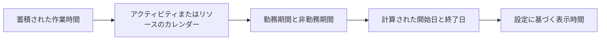

# P6 の持続時間

Primavera P6 の期間は、最初は単純に見えます。アクティビティには一定の日数がかかります。実際には、期間はスケジュールの中で最も重要であり、最も誤解されている部分の 1 つです。

期間は、カレンダー、アクティビティの種類、リソースの割り当て、進捗状況の更新、およびユーザーの表示設定に関連しています。 「5 日」として表示される期間は、すべてのスケジュール、すべてのカレンダー、またはすべてのユーザーのレイアウトで同じ意味を意味するわけではありません。このため、プランナーは期間とは何かだけでなく、P6 が期間をどのように保存し、計算し、表示するかを理解する必要があります。

## 期間の意味

期間は、アクティビティを実行するために必要な作業時間です。これは、単に開始日と終了日の間の暦日数ではありません。

たとえば、5 日間のアクティビティの期間は次のとおりです。

- 月曜日から金曜日までのカレンダーで中断のない 5 暦日。
- 週末が勤務期間内にある場合は、7 暦日。
- 24 時間または延長シフト カレンダーで 5 暦日未満。
- 休日または非稼働日が業務を中断する場合は、暦日で 5 日を超えます。

これが最初の重要なレッスンです。期間は作業時間であり、開始日と終了日はカレンダーの位置です。

## P6 が継続時間を保存する方法

P6 は、通常、基礎となるスケジュール データの時間レベルで、期間を時間として保存します。レイアウト内でユーザーに表示される内容は、好みに応じて日、週、月、または年として表示される場合があります。

つまり、表示される期間は多くの場合コンバージョンです。 P6 がアクティビティを 40 労働時間として保存する場合、表示換算で 1 日あたり 8 時間を使用すると、1 人のユーザーはアクティビティを 5 日として表示する可能性があります。別の設定では、期間の変換またはカレンダーの基準が異なる場合、表示が異なる場合があります。

ユーザー設定や管理期間の設定が一致していないと、2 人が同じスケジュールを見て混乱する可能性があるのはこのためです。

## 期間とカレンダー

カレンダーは P6 にいつ仕事が起こるかを知らせます。期間は P6 にどれだけの作業時間が必要かを示します。その後、カレンダーはその作業時間を実際の日付に配置します。

アクティビティの残り時間が 40 時間ある場合、カレンダーによってその 40 時間がどのように分散されるかが決まります。

1 日 8 時間のカレンダーでは、40 時間が 5 営業日として表示される場合があります。 1 日あたり 10 時間のカレンダーでは、同じ 40 時間が 4 営業日として表示される場合があります。 24 時間カレンダーでは、カレンダー時間ははるかに短くなります。

これが、カレンダーの割り当てが重要である理由です。カレンダーを変更すると、保存されている作業期間が同じであっても、終了日が変更される可能性があります。

## 元の期間

元の期間は、進行状況が適用される前のアクティビティの計画期間です。これは、アクティビティを完了するために必要な作業時間の初期見積もりを表します。

元の期間は、計画およびベースライン開発中に重要です。これは、タスクに予想される労力や時間枠を定義するのに役立ちます。これは、アクティビティにかかる時間が予想される基準点を提供するため、進捗状況やパフォーマンスに関する議論にも使用されます。

元の期間を使用して、このアクティビティのステータスが更新されるまでにどれくらいの時間がかかる予定でしたか?に答えてください。

## 残りの持続時間

残りの期間は、現在のデータ日からアクティビティを完了するためにまだ必要な作業時間です。

開始されていないアクティビティの場合、残りの期間は通常、修正されない限り元の期間と一致します。進行中のアクティビティの場合、残りの期間は、まだ必要な現実的な作業を反映する必要があります。完了したアクティビティの場合、残りの期間は 0 である必要があります。

残り期間は、P6 の最も重要な更新フィールドの 1 つです。それが間違っている場合、予測は間違っています。

残りの期間を使用して、まだどれくらいの作業時間が必要か? に答えます。

## 実際の継続時間

実際の期間は、実際の進行状況に基づいて、アクティビティにすでに費やされた時間を表します。これは、実際の開始、実際の終了、データ日付、カレンダー、および更新方法に関連付けられています。

実際の期間はステータス ストーリーを裏付ける必要があります。アクティビティが開始されている場合、実際の期間は実際の開始日とデータの日付と比較して意味があるはずです。アクティビティが完了している場合、実際の期間は実際の作業期間と一致する必要があります。

実際の所要時間を使用して、すでにどのくらいの作業時間が費やされているかを回答します。

## 完了期間時

「完了時継続時間」は、実際の作業時間と残りの作業時間を組み合わせた後のアクティビティの予想される合計時間を表します。

簡単に言うと:

実際の継続時間 + 残りの継続時間 = 完了時の継続時間

これは、アクティビティにかかる時間が当初の計画よりも長いか短いかを示すので便利です。元の期間が 10 日であったが、完了時の期間が 15 日になった場合、アクティビティには計画よりも時間がかかることが予測されます。

「完了期間」を使用して、このアクティビティに合計でどのくらいの時間がかかると予想されているかを回答します。

## 期間とユーザー設定

ユーザー設定は、個々のユーザーに対して時間単位を表示する方法を制御します。ユーザーは、期間を時間、日、週、月、または年で表示するかどうかを選択できます。

これはユーザーに表示される内容に影響しますが、必ずしも基礎となるスケジュール計算には影響しません。たとえば、同じ保存期間を、あるレイアウトでは時間として表示し、別のレイアウトでは日として表示することができます。

これは便利ですが、混乱を引き起こす可能性もあります。詳細な作業をレビューするプランナーは、数時間を好む場合があります。プロジェクト マネージャーは数日を好む場合があります。ポートフォリオ レポートには月が表示される場合があります。換算基準が理解されていない場合、数値が矛盾しているように見える可能性があります。

継続時間を検討する場合は表示単位をご確認ください。表示される期間が時間、日、週、または別の単位のいずれであるかを尋ねます。

## 管理者の設定と期間

管理者設定には、P6 が時間を日、週、月、年などのより大きな単位に変換する方法を定義する期間設定が含まれます。これらの設定は、期間値の表示および変換方法に影響するため、重要です。

たとえば、システムが 1 日あたり 8 時間を使用する場合、40 時間は 5 日として表示されます。システムが 1 日あたり 10 時間を使用する場合、40 時間は 4 日として表示されます。

これは必ずしも作品が変わったことを意味するものではありません。変換が変更されただけである可能性があります。

一部の P6 構成では、期間の表示は、システムまたはユーザーが時間と期間の変換に割り当てられたカレンダー時間を使用しているかどうかにも依存する場合があります。このため、プロジェクト チームは、正式なレポートを作成する前に、カレンダーの標準、ユーザー設定、管理者の期間設定を調整する必要があります。

## 期間が異なるように見える理由

期間はいくつかの理由で異なって見えることがあります。

- ユーザーごとに異なる単位で時間を表示します。
- 管理者の期間設定では、時間の変換方法が異なります。
- アクティビティ カレンダーには、1 日ごとに異なる時間が設定されています。
- リソース カレンダーはアクティビティ カレンダーとは異なります。
- アクティビティではさまざまなアクティビティ タイプが使用されます。
- 残りの期間は手動で更新されました。
- 進行状況が正しく適用されませんでした。
- 時刻はレイアウトに隠されています。

これが、期間の問題が必ずしも期間の問題であるとは限らない理由です。カレンダーの問題である場合もあります。ディスプレイ設定に問題がある場合もあります。進行状況の更新の問題である場合もあります。

## アクティビティタイプと期間タイプとの関係

アクティビティ タイプは、どのカレンダー基準が最も重要であるかに影響します。タスク依存アクティビティは通常、主にアクティビティ カレンダーに依存します。リソースに依存するアクティビティは、リソース カレンダーの影響を大きく受ける可能性があります。

期間タイプは、P6 が期間、リソース単位、および時間あたりの単位のバランスをとる方法に影響します。たとえば、リソースを追加すると、期間タイプに応じてアクティビティが短縮される場合と短縮されない場合があります。

したがって、期間が予期しない動作をする場合は、次の 3 つのことを一緒に確認してください。

- アクティビティカレンダーとリソースカレンダー。
- アクティビティのタイプ。
- 期間タイプ。

これらのフィールドは連携して機能します。そのうちの 1 つだけを確認すると、誤った結論につながる可能性があります。

## よくある問題

よくある問題の 1 つは、アクティビティ カレンダーで予想よりも異なる 1 日あたりの時間が使用されていることに気づかずに、期間を日数で入力することです。

もう 1 つの問題は、異なるカレンダーを使用するアクティビティ間の期間を比較することです。あるカレンダーの 5 日は、別のカレンダーの 5 日と同じ労働時間を表すとは限りません。

3 番目の問題は、一貫性のないユーザー設定です。あるレビュー担当者は時間単位を表示し、別のレビュー担当者は日数単位を表示し、どちらもスケジュールが変更されたと考える可能性があります。

もう 1 つの一般的な問題は、スケジュールがすでに存在した後に管理者設定を変更することです。これにより、基礎となる保存時間が変更されていない場合でも、表示される期間が異なって見える場合があります。

## 期間を正しく確認する方法

P6 で期間を確認するときは、[期間] 列に表示されている数字だけを見ないでください。

チェック：

- 元の期間。
- 残りの期間。
- 実際の期間。
- 完了期間時。
- アクティビティカレンダー。
- リソースが使用されている場合のリソース カレンダー。
- アクティビティのタイプ。
- 期間タイプ。
- ユーザー設定の時間単位の表示。
- 管理者設定の期間と期間の変換。

日付や期間が奇妙に見える場合は、カレンダーと時刻のフィールドをレイアウトに追加します。トラブルシューティング中に時刻を隠さないでください。

## 結論

P6 の期間は、単なる経過カレンダー時間ではなく、作業時間です。 P6 は期間を時間として保存し、カレンダーを適用してその時間をスケジュールに配置し、ユーザーの好みと管理者の期間設定に従って表示します。

これは、期間をコンテキストに合わせて見直す必要があることを意味します。 「5 日」として表示される値は、カレンダー時間、表示単位、変換設定、アクティビティ タイプ、期間タイプ、および更新ステータスによって異なります。

優れたスケジューラは、期間が単なる入力ではないことを理解しています。これは計算エンジンの一部です。期間、カレンダー、好みが一致すると、スケジュールの説明が容易になり、プロジェクト管理の信頼性が高まります。
## 関連コンテンツ
- [駆動ロジックなしでデータ日付に開始されるアクティビティ: このスケジュール指標が重要な理由 - 概要](../../12_metrics_jp/01_activities_starting_in_dd_with_no_logic_driving/01_overview_template.md)
- [P6のカレンダー](../08_CALENDARS%20IN%20P6/08_CALENDARS%20IN%20P6.md)
- [P6 の完了率タイプ](../10_PERCENT%20COMPLETION%20TYPES%20IN%20P6/10_PERCENT%20COMPLETION%20TYPES%20IN%20P6.md)
