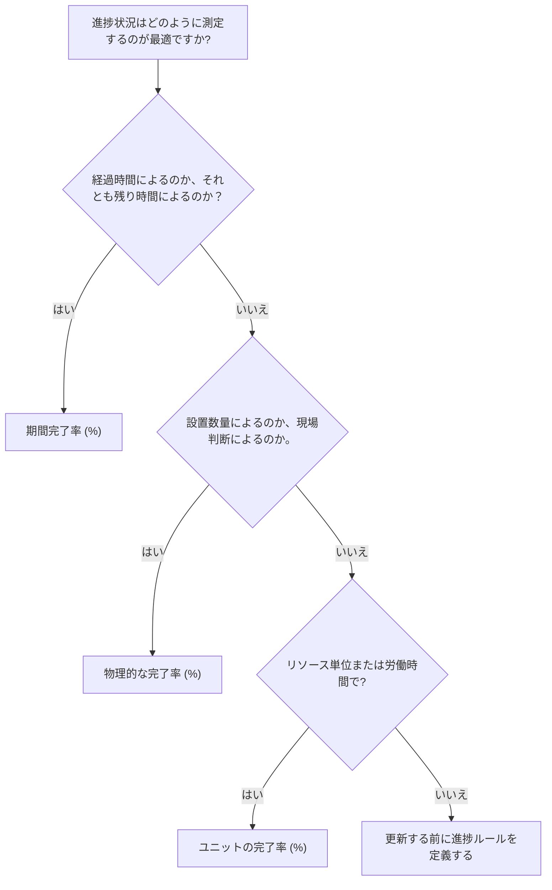

# P6 の完了率タイプ

完了率は、Primavera P6 で最も目に見える進捗フィールドの 1 つですが、最も誤解されているフィールドの 1 つでもあります。 50% 完了という値は、アクティビティの構成方法とプロジェクトの進捗状況の測定方法に応じて異なる意味を持ちます。

P6 では、完了率タイプは、アクティビティの完了率の計算方法または更新方法を制御します。これは P6 に、進歩が時間、身体的達成、またはリソース単位のいずれに基づくべきかを指示します。

アクティビティの主な完了率タイプは次のとおりです。

- 期間完了率 (%)。
- 物理的な完了率 (%)。
- ユニットの完了率 (%)。

進捗状況は単なる報告数値ではないため、適切なものを選択することが重要です。これは、残りの期間、獲得価値、リソースのレポート、スケジュールの信頼性、および各更新サイクルの品質に影響します。

## 完了率タイプが重要な理由

アクティビティが異なれば、進捗状況を測定するための異なる方法が必要になります。

一部のアクティビティでは、時間を適切に代用することができます。タスクの期間が 10 日間で、5 営業日で完了した場合、アクティビティは約 50% 完了したと考えるのが妥当でしょう。

他の活動をするには時間が足りません。乗組員は 10 日間のタスクに 5 日間を費やしても、物理的な作業の 20% しか完了できない場合があります。別の乗組員が期間の前半で数量の 80% を完了する場合があります。このような場合、期間ベースの進捗状況はプロジェクト チームに誤解を与える可能性があります。

リソースがロードされたスケジュールの場合、単位が最良の進捗基準となる場合があります。アクティビティが 1,000 労働時間で計画されており、600 労働時間が獲得または消費されている場合、完了単位率は進捗状況をより適切に反映する可能性があります。

適切な完了率タイプは、アクティビティが何を表すか、および進捗が実際にどのように測定されるかによって異なります。

## アクティビティの完了率 (%)

アクティビティの完了率 (%) は、アクティビティに対して表示される一般的な進行状況の値です。そのソースは、選択した完了率タイプによって異なります。

アクティビティで「期間の完了率」を使用する場合、「アクティビティの完了率」は、元の期間、実際の期間、および残りの期間の関係によって決まります。

アクティビティで物理的な完了率を使用する場合、アクティビティの完了率は、ユーザーが入力した物理的な完了率の値に従います。

アクティビティで完了率単位を使用する場合、アクティビティ完了率はリソース単位の進捗状況に基づきます。

2 つのアクティビティが両方とも 50% 完了していることを示していても、意味が大きく異なるのはこのためです。

## 期間完了率 (%)

期間 % は時間に基づいて測定の進行状況を完了します。消費された継続時間を、予想される合計継続時間と比較します。

簡単に言うと、アクティビティの計画期間または完了時点の期間が 10 日間で、5 日間が消費されている場合、アクティビティは約 50% の期間 (%) 完了率を示す可能性があります。

期間の完了率 (%) は、進行状況が時間に適度に比例する場合に役立ちます。

例としては次のものが挙げられます。

- 行政審査期間。
- 待機期間または治癒期間。
- 時間ベースのサポート タスク。
- 着実に作品を生み出す簡単なアクティビティ。

時間が進行状況の公正な尺度であり、残りの期間が慎重に維持される場合は、「期間 % 完了」を使用します。

リスクとしては、費やした時間と達成された作業が必ずしも一致するとは限らないことです。タスクは計画期間の半分を消費しても、物理的には大幅に遅れている可能性があります。スケジューラが期間のみに依存している場合、進捗レポートは実際よりも良く見える可能性があります。

## 物理的な完了率 (%)

物理的な完了率は、実際の物理的な進行状況に基づいて手動で入力または更新されます。これは、期間やリソース単位に関係なく、その作業で実際に達成された内容を表します。

これは、建設、エンジニアリング成果物、設置作業、パッケージのコミッショニング、または測定可能な成果に基づいて進捗を評価する必要があるアクティビティに最適なオプションであることがよくあります。

例としては次のものが挙げられます。

- 発行された図面の 40%。
- ケーブル トレイが 60% 取り付けられています。
- 配管の75％が溶接されています。
- テスト パッケージの 30% が完了しました。
- 設備調整は100％完了しました。

進捗状況を数量、成果物のステータス、現場検証、または責任者の判断によって測定する必要がある場合は、物理的な完了率を使用します。

利点は、経過時間よりも現実をより正確に反映できることです。リスクがあるのは、規律が必要なことだ。プロジェクト チームは、身体的な進歩をどのように測定するか、誰が承認するか、および証拠をどのように収集するかを定義する必要があります。

## ユニットの完了率 (%)

単位 % 完了は、リソース単位に基づいて進行状況を測定します。実際の単位と完了時の単位を比較します。

これは、スケジュールにリソースがロードされており、労働時間、設備時間、またはその他の測定可能なリソース単位を通じて進捗状況が追跡される場合に便利です。

例としては次のものが挙げられます。

- 予算上の労働時間に対して稼いだ実際の労働時間。
- 計画された設備時間に対して使用された設備時間。
- リソースユニットの進行状況に関連付けられたインストール作業。
- 単位に基づいた獲得価値ワークフロー。

リソース単位が信頼でき、維持され、プロジェクトの進行方法の一部である場合は、「単位の完了率」を使用します。

リスクは、リソースの消費が必ずしも物理的な進歩と等しくないことです。チームは、期待された作業を完了できないまま、何時間も費やしてしまう可能性があります。このため、ユニットの完了率は、リソースのレポートと進捗状況の測定が適切に制御されている場合に最も効果的に機能します。

## 正しいタイプの選び方

完了率タイプを選択する実際的な方法は、アクティビティの進捗状況を尋ねることです。

進行状況が時間が経過したことを意味する場合は、「期間 % 完了」を使用します。

進捗状況が物理的な作業が達成されたことを意味する場合は、「物理的な完了率」を使用します。

進行状況がリソース ユニットの獲得または消費を意味する場合は、[ユニットの完了率] を使用します。

選択は、同様のアクティビティ グループ間で一貫している必要があります。エンジニアリング成果物では、物理的な完了率を使用する場合があります。建設工事では、数量に基づいて物理的な完了率を使用する場合があります。時間ベースの管理サポートでは、「期間完了率」を使用する場合があります。リソースを大量に使用するワーク パッケージでは、リソース データが信頼できる場合、単位完了率を使用できます。

## 残存期間との関係

完了率と残りの期間は、一貫したストーリーを伝える必要があります。

アクティビティは物理的に 80% 完了していても、残りの作業が困難、遅れている、または別の条件に依存している場合は、残り期間が 10 日間残っている場合があります。それは有効かもしれません。

計画された時間の半分が経過しているため、アクティビティは 50% 期間 % 完了である可能性がありますが、物理的に作業が 20% しか完了していない場合は、おそらく残り期間を修正する必要があります。

このため、適切な更新には進捗状況と予測のレビューの両方が必要です。完了率は、どれだけのことが達成されたかを示します。残りの期間は、まだどれくらいの時間が必要かを示します。

## よくある間違い

よくある間違いの 1 つは、身体的な進歩が時間に比例しないアクティビティに「期間の完了率 (%)」を使用することです。これにより、進捗状況が実際の作業より良く見えたり、悪く見えたりする可能性があります。

もう 1 つの間違いは、測定ルールを使用せずに「Physical % Complete」を使用することです。ある分野が設置量に基づいて物理的な進捗状況を報告し、別の分野が意見に基づいて報告すると、スケジュールに一貫性がなくなります。

3 番目の間違いは、リソース データが不完全であるか信頼性が低い場合に、Units % Complete を使用することです。実際の単位が維持されていない場合、進捗値は信頼できません。

もう 1 つの問題は、完了率を更新しても残りの期間を無視することです。アクティビティには進捗が表示されていても、非現実的な予測が続く場合があります。

## グッドプラクティス

更新サイクルを開始する前に進行ルールを定義します。プロジェクト チームは、どのアクティビティ グループが期間、物理的、または完了率単位を使用するかを知っておく必要があります。

完了率タイプ、アクティビティ完了率 (%)、物理完了率 (%)、期間完了率 (%)、完了単位数 (%)、残り期間、実際の開始、実際の終了、およびアクティビティのステータスを表示するレイアウトを使用します。

次のような不一致がないか確認してください。

- 進捗率0%のまま活動を開始。
- 残り期間 = 0 ですが、ステータスは完了していません。
- 実際の終了なしで 100% 進捗。
- 物理的な完了率が現場の証拠と一致しません。
- 不足しているリソースの更新に基づく完了単位 (%)。

これらのチェックは、進捗状況が入力されるだけでなく、信頼できるものであることを確認するのに役立ちます。

## 結論

P6 の完了率タイプは、アクティビティの進捗状況を測定する方法を定義します。 [期間 % 完了] は、時間ベースの進捗状況を測定します。物理的完了率は、達成された実際の作業を測定します。 Units % Complete は、リソース単位の進捗状況を測定します。

すべてのアクティビティに最適な単一のタイプはありません。正しい選択は、作業がどのように計画、測定、制御されるかによって決まります。

強力なスケジュールでは、完了率タイプを意図的に使用します。方法が作業に一致すると、進捗状況の更新がより明確になり、残り期間の信頼性が高まり、プロジェクトのレポートの防御が容易になります。
## 関連コンテンツ
- [駆動ロジックなしでデータ日付に開始されるアクティビティ: このスケジュール指標が重要な理由 - 概要](../../metrics/01_activities_starting_in_dd_with_no_logic_driving/02_guide_template.md)
- [P6 の持続時間](../09_DURATION%20IN%20P6/09_DURATION%20IN%20P6.md)
- [P6 のコストのかかる場所](../11_WHERE%20THE%20COST%20LIVE%20IN%20P6/11_WHERE%20THE%20COST%20LIVE%20IN%20P6.md)
