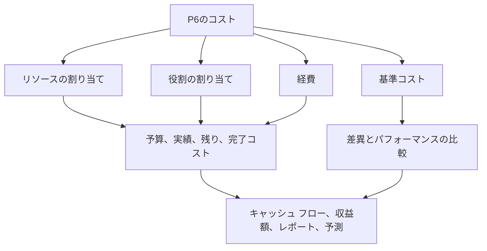

Primavera P6 のコストは複数の場所に存在できます。それは便利ですが、混乱を招く可能性もあります。スケジュールには、予算コスト、実際のコスト、残存コスト、完了コスト、リソース コスト、ロール コスト、経費コスト、達成額フィールド、およびベースライン コストが表示される場合があります。これらの値は関連していますが、すべてが同じことを意味するわけではありません。

プロジェクト管理チームにとって重要な質問は、「コストはいくらか?」ということだけではありません。もっと良い質問は、このコストはどこから来て、何を意味し、どのように使用する必要があるのか​​ということです。

このブログでは、P6 で利用可能な主なコストの種類、それらの違い、およびそれぞれがいつ役立つかを説明します。

## コストの場所が重要な理由

P6 は主にスケジューリング ツールですが、コストを加味したスケジュール、稼得価値、キャッシュ フロー、および予測レポートもサポートできます。これを適切に行うには、コストをスケジュール モデルの正しい部分に配置する必要があります。

人件費が経費として入力されている場合、リソースのヒストグラムでは正確な情報が得られない可能性があります。実際のコストが手動で入力されているにもかかわらず、プロジェクトがリソースの実績から得られることを期待している場合、レポートに一貫性がなくなる可能性があります。ベースラインコストが欠落している場合、スケジュール差異およびコスト差異レポートのコンテキストが失われます。

コストの発生源はコストの集計、更新、予測、レポートの方法に影響を与えるため、コストの場所は重要です。

## リソースコスト

リソースのコストは、アクティビティに割り当てられたリソースから発生します。リソースは、労働力、設備、または別のリソース カテゴリを表す場合があります。各リソースにはレート、単位、コスト計算を含めることができます。

たとえば、アクティビティでパイプフィッター作業員を定義された時間給で 80 時間使用する場合、P6 は割り当てられた単位と料金から人件費を計算できます。

リソース コストは、プロジェクトでスケジュール アクティビティを労働力、設備、生産性、リソースのヒストグラムに関連付けたい場合に役立ちます。

次の場合にリソース コストを使用します。

- 労働力や設備の需要が重要です。
- リソースのヒストグラムが必要です。
- コストは時間または単位に関連付けられます。
- 獲得価値または進捗状況はリソースベースです。
- スケジュールはリソース計画に使用されます。

主なリスクはメンテナンスです。リソースを満載したスケジュールには規律が必要です。単位、レート、カレンダー、または実績が維持されていない場合、コスト レポートは信頼できません。

## 役割のコスト

役割は、エンジニア、電気技師、プランナー、検査官、クレーンオペレーターなどの一般的な職務です。 P6 では、名前付きリソースが認識される前に、アクティビティにロールを割り当てることができます。

チームが必要なリソースの種類を知っているが、特定の人物やスタッフについてはわかっていない場合、役割コストは早期の計画をサポートできます。

たとえば、初期のエンジニアリング計画中に、アクティビティに 120 時間の「上級エンジニア」の時間が必要になる場合があります。指定された担当者はまだ割り当てられていない可能性がありますが、役割によって計画レートとコストの見積もりが提供されます。

次の場合にロール コストを使用します。

- スケジュールはまだ計画中です。
- 名前付きリソースはまだ確認されていません。
- プロジェクトでは、大まかなリソースまたはコストの見積もりが必要です。
- ロールは後で実際のリソースに置き換えられます。

ロールのコストは初期段階の計画には役立ちますが、プロジェクトが成熟するにつれて見直す必要があります。実際のリソースがわかった後に役割が残っている場合、スケジュールが一般的になりすぎて詳細な制御ができない可能性があります。

## 経費 原価

経費は、アクティビティに直接割り当てられる非リソースコストです。これらは、労働力や設備リソースでは最もよく表されないコストに役立ちます。

例としては次のものが挙げられます。

- 許可します。
- 旅行。
- ベンダー一時金。
- 下請け業者のパッケージ。
- 材料は定額で購入します。
- 受験料。
- 動員料。

経費コストは、プロジェクトの追跡方法に応じて、予算、実績、残存、または完了時に設定できます。

次の場合に経費を使用します。

- コストはリソース時間によって決まりません。
- 費用は固定費または一括払いです。
- アクティビティには直接的な非リソースコストが必要です。
- プロジェクトは非労働項目のキャッシュフローを望んでいます。

リスクは、出費がゴミ捨て場になる可能性があることです。すべてのコストを経費として入力すると、スケジュールでは人件費、設備、生産性を個別に説明できなくなる可能性があります。

## 予算コスト

予算コストは​​、アクティビティに割り当てられる計画コストです。これは、リソースの割り当て、役割の割り当て、経費、またはこれらの組み合わせによって発生する場合があります。

予算コストは​​実行前のコスト計画を表すため重要です。キャッシュ フロー、ベースライン コスト、達成額の設定、およびプロジェクト管理レポートをサポートします。

「予算コスト」を使用して、「このアクティビティの計画コストはいくらでしたか?」に答えます。

予算コストが欠落しているか矛盾している場合でも、スケジュールは日付を計算できますが、意味のあるコストをロードしたレポートをサポートできません。

## 実際のコスト

実際のコストは、すでに発生したコストを表します。プロジェクトの設定に応じて、実際のコストは実際のリソース単位とレートから計算されたり、手動で入力されたり、タイムシートからインポートされたり、外部コスト システムから読み込まれたりする場合があります。

実際のコストは、進捗レポートと獲得価値にとって重要です。これまでに費やされた金額、または記録された金額が表示されます。

実際のコストを使用して、すでに発生または記録されたコストは何ですか?

リスクはソースを混合することです。実際のコストの一部が会計からインポートされ、その他が P6 に手動で入力される場合、チームは重複やギャップを避けるための明確なルールが必要です。

## 残りのコスト

残りのコストは、アクティビティを完了するためにまだ必要な予測コストです。これは、残りのユニット、リソース料金、残りの費用、および更新の前提条件に関連付けられます。

残存コストは最も重要な予測フィールドの 1 つです。これにより、プロジェクト チームは現在のデータ日付以降にどれだけのコストが残っているかがわかります。

残りのコストを使用して、予想されるコストはどれくらいですか?

残存期間は更新されるが、残存コストは更新されない場合、予測に一貫性がなくなる可能性があります。リソース単位または経費残額が維持されていない場合も同様です。

## 完成費用あり

完了時コストは、実際のコストと残りのコストを組み合わせた後のアクティビティの予想総コストです。

簡単に言うと:

実際のコスト + 残りのコスト = 完了コスト

完了コストは、アクティビティが予算を上回るか下回るか、または予算内で終了すると予測されるかを示すのに役立ちます。

「完了コスト」を使用して、「最新の予想総コストはいくらですか?」と答えます。

## 基準コスト

ベースライン コストは、割り当てられたベースライン スケジュールから取得されます。現在のコスト値を承認された計画と比較するために使用されます。

基準コストは差異レポートにとって重要です。ベースラインがないと、プロジェクトは現在の予測コストを知ることができますが、その予測が承認された計画よりも良いか悪いかはわかりません。

基準コストを使用して、現在のコストを承認されたコスト計画と比較してどうですか? に答えます。

ベースラインコストは、達成額または正式な PMO レポートに P6 を使用する場合に特に重要です。

## 収益価値コストフィールド

P6 は、プロジェクトの設定に応じて、計画値、達成額、実際コスト、コスト差異、スケジュール差異などの達成額フィールドをサポートできます。

アーンド バリューでは、コストがロードされたスケジュール情報を使用して、計画作業、アーンド作業、および実際のコストを比較します。

これらのフィールドは、プロジェクトに正式な達成額プロセスがある場合に役立ちます。一貫したベースライン、進捗ルール、完了率の方法、およびコスト負荷が必要です。

次の場合に達成額コスト フィールドを使用します。

- このプロジェクトでは EV レポートが必要です。
- 進行ルールが定義されています。
- 基準コストが承認されます。
- 実際の原価ソースが管理されます。
- アクティビティの進捗状況は一貫して維持されます。

これらのコントロールがないと、達成額の出力は正確に見えても信頼性が低くなります。

## どのコスト タイプを使用する必要がありますか?

リソース計画、生産性、ヒストグラムをサポートする必要がある人件費と設備のリソース コストを使用します。

名前付きリソースがまだ不明な場合は、初期計画にロール コストを使用します。

直接的な非リソースコスト、一時金、ベンダー品目、許可、旅費、または下請けパッケージには経費を使用します。

予算コスト、実績コスト、残存コスト、完了時コストの各フィールドを使用して、時間段階のコスト ライフサイクルを理解します。

承認された計画との比較には基準コストを使用します。

EV レポートをサポートするために必要なガバナンスがプロジェクトにある場合は、達成額フィールドを使用します。

## よくある問題

よくある問題の 1 つはコストの重複です。同じ下請け業者のコストをリソースコストとして入力し、再度経費として入力することもできます。

もう 1 つの問題は、実際の原価が欠落していることです。スケジュールには予算と残りのコストが含まれている場合がありますが、実際のコストは別の会計システムに存在し、P6 に到達しない可能性があります。

3番目の問題は、あらゆるものに経費を使用することです。これにより、総コストが発生する可能性がありますが、リソースの可視性が低くなります。

もう一つの問題は、一貫性のない進捗です。完了率、残りの期間、および残りのコストが一致していない場合、完了時のコストは信頼できなくなります。

## グッドプラクティス

スケジュールをロードする前にコスト戦略を定義します。労働力、設備、資材、下請け業者、間接費をどこに置くかを決定します。

一貫したコストアカウント、活動コード、リソース、役割、および経費カテゴリを使用します。

実際原価を P6 に入力するか、インポートするか、別のシステムから報告するかを文書化します。

各更新サイクル中にコスト フィールドを確認します。予算、実績、残存コスト、完成コストは、一貫したストーリーを伝える必要があります。

## 結論

P6 のコストは、リソース、役割、経費、ベースライン、獲得価値フィールドに存在します。それぞれの場所には異なる目的があります。

リソースコストは、コストを労働力と設備に結び付けます。役割のコストは、早期の計画をサポートします。経費コストは、直接的な非リソース項目を取得します。予算コスト、実績コスト、残存コスト、完了時コストは、コストのライフサイクルを示します。ベースラインおよび達成額フィールドは、比較およびパフォーマンス レポートをサポートします。

コストを考慮した強力なスケジュールは、数字を適当な場所に配置することで構築されるものではありません。これは、各タイプのコストがどこに属するかを決定し、更新サイクルごとにその構造を維持することによって構築されます。
## 関連コンテンツ
- [駆動ロジックなしでデータ日付に開始されるアクティビティ: このスケジュール指標が重要な理由 - 概要](../../metrics/01_activities_starting_in_dd_with_no_logic_driving/02_guide_template.md)
- [P6 の完了率タイプ](../10_PERCENT%20COMPLETION%20TYPES%20IN%20P6/10_PERCENT%20COMPLETION%20TYPES%20IN%20P6.md)
- [P6 のリソース タイプ](../12_RESOURCE%20TYPES%20IN%20P6/12_RESOURCE%20TYPES%20IN%20P6.md)
