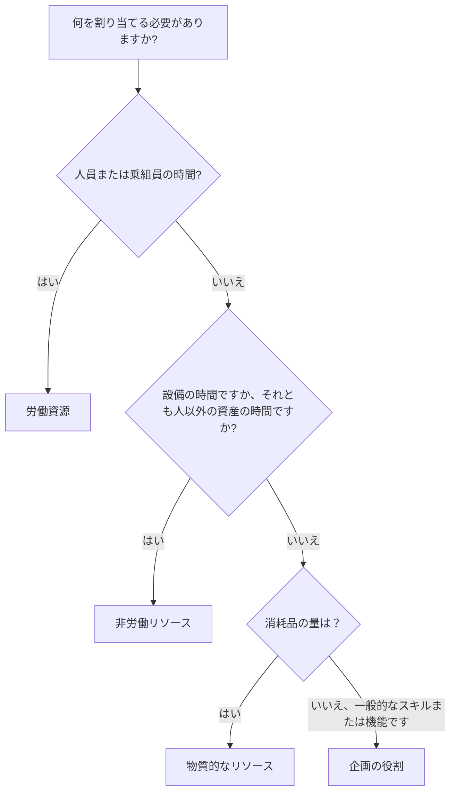

# P6 のリソース タイプ

Primavera P6 のリソースは、作業を実行するために必要な人材、機器、資材を表します。これらは、時間の経過とともにスケジュールを容量、生産性、コスト、リソース需要に結び付けます。

スケジュールはリソースなしでも存在できますが、リソースが読み込まれたスケジュールにより、プロジェクト チームはより深い視野を得ることができます。労働力のヒストグラム、設備の需要、材料の使用状況、コスト曲線、リソースの制約、および起こり得る過負荷を表示できます。この情報を役立つようにするには、スケジューラは P6 で利用可能なさまざまなリソース タイプと、それぞれをいつ使用するかを理解する必要があります。

P6 の主なリソース タイプは次のとおりです。

- 労働。
- 非労働。
- 材料。

P6 ではロールも使用します。ロールはリソースとまったく同じではありませんが、密接に関連しており、計画時に非常に役立ちます。

## リソースの種類が重要な理由

リソースのタイプは、P6 が単位、料金、コスト、カレンダー、レポートを処理する方法に影響します。

労働リソースは、物質的リソースとは異なる動作をします。クレーンをコンクリートの体積と同じように扱うべきではありません。一般的なエンジニア ロールは、名前付きエンジニア リソースと同じではありません。リソース タイプが誤って混合されると、ヒストグラム、コスト レポート、生産性レビュー、および達成額の出力が誤解を招く可能性があります。

リソース タイプは、アクティビティにどのようなものが割り当てられているのかという実際的な質問に答えます。

## 労働資源

労働リソースは人または乗組員を表します。通常、時間、日、またはその他の時間ベースの単位で測定されます。労働リソースには、レート、カレンダー、可用性制限、およびコスト値を含めることができます。

例としては次のものが挙げられます。

- プランナー。
- 民間乗組員。
- 電気技師。
- 溶接作業員。
- エンジニア。
- 検査官。
- コミッショニング技術者。

スケジュールに人的労力や乗組員の需要を示す必要がある場合は、労働リソースを使用します。労働リソースは、人員ヒストグラム、人員配置計画、生産性分析、人件費予測に役立ちます。

たとえば、「ケーブル トレイの取り付け」というアクティビティには 4 人の電気技師が 5 日間必要になる場合があります。労働リソースを割り当てると、その期間中の電気技師の需要をスケジュールに示すことができます。

労働リソースは、プロジェクトで計画労働時間を実際の労働時間と比較する必要がある場合にも役立ちます。

## 非労働リソース

非労働リソースは、設備やその他の再利用可能な非人的資産を表します。これらは通常、労働のように時間ベースですが、人的資源ではありません。

例としては次のものが挙げられます。

- クレーン。
- 掘削機。
- 溶接機。
- 試験装置。
- 足場作業員の装備。
- 専用工具セット。
- ジェネレータ。

機器の可用性が重要な場合、または機器のコストを長期的に追跡する必要がある場合は、非労働リソースを使用します。

たとえば、重量物を持ち上げるのに 2 日間クレーンが必要な場合、労働者以外のクレーン リソースを割り当てると、プロジェクト チームがクレーンの需要を把握し、競合を回避し、設備コストを予測するのに役立ちます。

非労働リソースは、機器が不足している場合、高価である場合、作業領域間で共有されている場合、または作業シーケンスの推進要因である場合に重要です。

## 重要なリソース

物的リソースは消耗品を表します。通常、時間ではなく量で測定されます。

例としては次のものが挙げられます。

- コンクリート立方メートル。
- 鋼鉄トン。
- ケーブルメーター。
- パイプスプール。
- バルブ。
- コーティングリットル。
- パネル。

スケジュールで数量ベースの消費または材料関連コストを追跡する必要がある場合は、材料リソースを使用します。

材料リソースは、材料曲線、数量追跡、およびコスト負荷をサポートできます。これらは、スケジュールが設置数量または数量に基づく獲得価値に関連付けられている場合に特に役立ちます。

たとえば、アクティビティには 500 メートルのケーブル敷設が含まれる場合があります。ケーブルを物的リソースとして割り当てると、チームは計画された設置数量と実際の設置数量を長期にわたって追跡するのに役立ちます。

物質的なリソースは、労働時間や設備時間を表すために使用されるべきではありません。それらは異なる目的を果たします。

## 役割

役割は、一般的な職務機能またはスキル カテゴリです。これらはリソースと同じではありませんが、名前付きリソースが判明する前に計画を立てるときに役立ちます。

例としては次のものが挙げられます。

- シニアエンジニア。
- 電気監督者。
- 民事検査官。
- スケジューラー。
- コミッショニングリード。
- クレーンオペレーター。

プロジェクトでは、誰が作業を実行するかを正確に知らなくても、どのような種類のスキルが必要かがわかる場合があるため、役割は初期の計画に役立ちます。

たとえば、エンジニアリング活動には、「上級電気技術者」の 80 時間の労力が必要な場合があります。後で、そのロールを名前付きリソースで置き換えたり補足したりできます。

次の場合にロールを使用します。

- 計画はまだ高いレベルにあります。
- 名前付きリソースは確認されていません。
- スキルタイプごとにリソース需要が必要となります。
- 組織は早期の人員配置の予測を望んでいます。

プロジェクトが成熟するにつれて役割を見直す必要があります。スケジュールで詳細な制御が必要な場合は、ロールを実際のリソースに置き換える必要がある場合があります。

## リソースカレンダー

リソースにはカレンダーを含めることができます。リソースの可用性はアクティビティの可用性とは異なる場合があるため、これは重要です。

たとえば、建設活動では 6 日間の活動カレンダーを使用する場合がありますが、割り当てられたベンダー スペシャリストは月曜日から金曜日までしか対応できない場合があります。アクティビティがリソースに依存している場合、またはリソースの平準化が使用されている場合、リソース カレンダーがスケジュールに影響を与える可能性があります。

人材や設備は特定の時間にしか利用できないため、労働リソースと非労働リソースにはカレンダーが必要になることがよくあります。物的資源は作業時間ではなく数量を表すため、通常は異なる動作をします。

リソースの日付がおかしい場合は、アクティビティ カレンダーとリソース カレンダーの両方を確認してください。

## リソースコスト

リソースには原価率が含まれる場合があります。労働リソースと非労働リソースでは、多くの場合、時間ベースの料金が使用されます。物質的なリソースでは、多くの場合、単位レートが使用されます。

例えば：

- 電気技師: 時間あたりのコスト。
- クレーン: 時間または日あたりのコスト。
- コンクリート: 立方メートルあたりのコスト。

リソースがアクティビティに割り当てられると、P6 は予算コスト、実績コスト、残存コスト、および完了コストを計算できます。

これは、コストをロードしたスケジュール、稼得額レポート、リソース予測、およびキャッシュ フロー分析に役立ちます。ただし、これがうまく機能するのは、単位、レート、カレンダー、進捗状況の更新が維持されている場合のみです。

## 適切なリソースタイプの選択

リソースが人、乗組員、または人間の労力である場合は、「Labor」を使用します。

リソースが機器または時間が重要な再利用可能な資産である場合は、非労働を使用します。

リソースが消耗品の場合は、マテリアルを使用します。

名前付きリソースが判明する前にスキルまたは機能ごとに計画する場合は、ロールを使用します。

選択には、プロジェクトが作業をどのように計画、測定、報告したいかを反映する必要があります。

## よくある間違い

よくある間違いの 1 つは、あらゆることに労働リソースを使用してしまうことです。これにより、最初はコストの読み込みが容易になりますが、設備や材料の数量が重要な場合には明確さが損なわれます。

もう 1 つの間違いは、実際には経費または下請け一時金である項目に物質的なリソースを使用することです。プロジェクトで数量追跡が必要ない場合は、経費の方が適切な場合があります。

3 番目の間違いは、実際の単位を維持せずにリソースを割り当てることです。リソースが読み込まれたスケジュールは、進行状況の更新によってリソース データが最新に保たれる場合にのみ役立ちます。

Another issue is confusing roles and resources.ロールは計画には適していますが、詳細な割り当て、カレンダー、実績が重要な場合は、名前付きリソースの方が適しています。

## グッドプラクティス

スケジュールをロードする前にリソース戦略を定義します。

どの作業で労働リソースを使用するか、どの作業で非労働リソースを使用するか、どの資材に数量追跡が必要か、どこで経費を代わりに使用するかを決定します。

一貫した命名規則とリソース コードを使用します。リソース ディクショナリをクリーンな状態に保ちます。名前がわずかに異なる重複リソースを避けてください。

各更新サイクル中にリソースの割り当てを確認します。単位、コスト、カレンダー、実績は、プロジェクト管理プロセスと常に一致している必要があります。

## 結論

P6 のリソース タイプは、作業を実行するために必要なものを定義するのに役立ちます。労働リソースは人々と乗組員を表します。非労働リソースは、設備や再利用可能な資産を表します。物的資源は消耗品の量を表します。役割は、名前付きリソースが判明する前に、スキルまたは機能ごとに計画を立てることをサポートします。

適切なリソース タイプを選択すると、スケジュールの分析が容易になります。労働力のヒストグラム、設備計画、材料追跡、コスト負荷、稼得額、予測レポートが改善されます。

リソースが組み込まれた優れたスケジュールは、リソースが付加されたスケジュールだけではありません。これは、各リソース タイプが意図的に使用され、プロジェクトの存続期間を通じて維持されるスケジュールです。
## 関連コンテンツ
- [Primavera P6 進捗 0% からスタートした活動 - 概要](../../metrics/13_activity_started_progress_zero/02_guide_template.md)
- [P6 のコストのかかる場所](../11_WHERE%20THE%20COST%20LIVE%20IN%20P6/11_WHERE%20THE%20COST%20LIVE%20IN%20P6.md)
- [P6 のリソース制限](../13_RESOURCES%20LIMITS%20IN%20P6/13_RESOURCES%20LIMITS%20IN%20P6.md)
