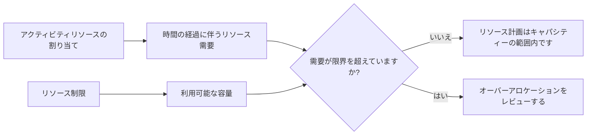

# P6 のリソース制限

Primavera P6 のリソース制限は、一定期間内に使用できるリソースの量を定義します。これらは、アクティビティの割り当てによって作成されたリソース需要と、プロジェクトが実際に持つキャパシティを比較するために使用されます。

簡単に言うと、リソース制限は、「プロジェクトで使用できるリソースの量はどれくらいか?」という質問に答えます。

スケジュールで 1 人の乗組員が同時に 5 つのアクティビティに取り組む必要がある場合、P6 はその需要を示すことができます。しかし、リソース制限がなければ、その需要が現実的かどうかをスケジュールで明確に示すことができません。この制限により、プランナーは過負荷、容量の問題、およびリソース主導のスケジュールの問題の可能性を確認できるようになります。

## リソース制限とは

リソース制限は、リソースの最大可用性です。これは、1 日あたりの時間数、1 週間あたりの時間数、または稼働期間中に使用可能なユニット数など、期間ごとの単位として定義できます。

例えば：

- 1 人のプランナーが 1 日あたり 8 時間対応します。
- 電気技師 3 名が 1 日 24 時間体制で対応します。
- 1 台のクレーンが 1 日あたり 8 設備時間利用可能です。
- 2 人の検査官が 1 日あたり 16 時間労働します。

アクティビティにリソースがロードされると、P6 はそれらの割り当てによって作成されるリソース需要を計算します。リソース制限は、需要が比較されるキャパシティ ラインを提供します。

## リソース制限が重要な理由

スケジュールは技術的には可能でも実際には不可能であることが多いため、リソース制限は重要です。

論理ネットワークは、いくつかのアクティビティが並行して発生する可能性があると計算する場合があります。日付は許容範囲に見えるかもしれません。クリティカル パスは合理的であるように見えるかもしれません。しかし、これらすべての活動に同じ限定された乗組員、専門家、または装備が必要な場合、計画は実行できない可能性があります。

リソース制限は、計算されたスケジュールと成果物のスケジュールの違いを明らかにするのに役立ちます。

これらは次の場合に役立ちます。

- 過負荷の作業員を特定する。
- 設備需要の確認。
- リソースのヒストグラムをサポートします。
- 人員計画の見直し。
- リソースの平準化を準備しています。
- 論理的には許可されていても一部の作業を開始できない理由を説明します。
- プランが利用可能な容量と一致するかどうかをテストします。

プロジェクト管理では、スケジュールが人員配置、調達サポート、建設計画、または稼得額レポートに使用される場合に、これは特に役立ちます。

## 労働資源の限界

労働制限は、利用可能な人数または労働時間を定義します。

たとえば、プロジェクトで 10 人の電気技師が 1 日あたり 8 時間労働する場合、1 日あたりの労働制限は 1 日あたり 80 時間になる可能性があります。スケジュールの需要が同日の電気技師時間 120 を示している場合、スケジュールではプロジェクトよりも多くの電気技師を求めています。

これは、スケジュールが間違っていることを自動的に意味するものではありません。つまり、プランナーは計画を見直す必要があります。解決策としては、作業員を追加する、順序を変更する、重要ではない作業を移動する、時間外労働を利用する、または現実的で承認されている場合は一時的なピークを受け入れることが考えられます。

労働リソースの制限は、人材の利用可能性が実際に制約されている場合に役立ちます。リソース制御をサポートするために必要な詳細レベルでスケジュールが維持されていない場合、これらはあまり役に立ちません。

## 非労働リソースの制限

非労働制限は、機器およびその他の再利用可能な資産に適用されます。

例としては、クレーン、掘削機、試験装置、特殊工具、発電機、仮設施設などが挙げられます。クレーンが 1 台しか利用できない場合、別のクレーンを追加するか作業を再順序付けしない限り、同じクレーンを必要とする作業をすべて同時に実行することはできません。

ここで、リソース制限が非常に現実的になる可能性があります。機器は、特に高価である場合、エリア間で共有される場合、移動が難しい場合、または重要な作業に必要な場合に、真の制約となることがよくあります。

たとえば、2 つの重量物リフトは両方とも論理的に準備ができている可能性があります。ただし、両方が同じクレーンを必要とする場合、リソース制限により、計画が利用可能なキャパシティーを超えていることが示される可能性があります。

## 物質的なリソースと制限

物質的リソースは、労働リソースや非労働リソースとは異なる動作をします。通常、これらは数量を表すものであり、毎日の労働時間の空き時間を表すものではありません。

材料の割り当てには、計画されたコンクリートの体積、ケーブルの長さ、鋼材のトン数、または設置数量が表示される場合があります。プロジェクトにはまだ物質的な制約があるかもしれませんが、それらは多くの場合、人材や設備に使用される同じ種類の 1 日あたりのリソース利用可能制限ではなく、調達日、納品マイルストーン、在庫追跡、またはスケジュール内の制約によって管理されます。

これは、材料が重要ではないという意味ではありません。これは、プランナーが制限が何を表すものであるかについて注意する必要があることを意味します。

1 日に打設できるコンクリートの最大立方メートルなど、生産能力が問題の場合は、リソースまたは生産モデルが役立つ場合があります。資材が到着したかどうかが問題の場合は、論理的な結びつきや調達マイルストーンがより明確になる可能性があります。

## P6 が制限を使用する方法

P6 は、リソース プロファイル、スプレッドシート、ヒストグラム、およびリソース分析でリソース制限を使用できます。アクティビティ割り当てからの需要を、利用可能な制限に対して表示できます。

リソース平準化が使用される場合、P6 は平準化設定に応じて、需要が制限内に収まるようにリソースの可用性を使用してアクティビティを遅らせることもあります。

これは強力ですが、慎重に扱う必要があります。リソースの平準化により、予測日が変更される可能性があります。制限、カレンダー、優先順位、およびアクティビティのロジックが適切に維持されていない場合、平準化された結果は数学的に見えるかもしれませんが、実用的ではありません。

したがって、リソース制限は、更新の最後に押されるボタンではなく、制御されたスケジュール プロセスの一部である必要があります。

## リソース制限を使用する場合

リソースが実際に限られており、スケジュールに分析をサポートするのに十分な品質のリソースがロードされている場合は、リソース制限を使用します。

良い使用例は次のとおりです。

- 人数が決まっているプロジェクト。
- クレーンや専用設備を共用。
- エンジニアリングまたは試運転の専門家は限られています。
- シャットダウン、ターンアラウンド、停電。
- 人員のピークを制御する必要がある建設計画。
- 同じリソース プールが複数のプロジェクトをサポートするプログラム。

リソース制限は、what-if 分析の際にも役立ちます。プランナーは、現在の計画が利用可能なキャパシティで機能するかどうか、または追加の作業員、時間外労働、または順序変更が必要かどうかをテストできます。

## いつ注意すべきか

リソース データが不完全またはシンボリックである場合は注意してください。

コスト負荷のためだけにリソースが追加された場合、単位は実際の可用性を表さない可能性があります。すべての作業が汎用リソースに割り当てられている場合、ヒストグラムの範囲が広すぎて実際の決定をサポートできない可能性があります。実際のユニットが更新されないと、リソース計画はすぐに現実から乖離してしまう可能性があります。

人為的な制限にも注意してください。制限が低すぎると、レベリング中に不必要な遅延が発生する可能性があります。制限が高すぎると、実際の容量の問題が隠れてしまう可能性があります。

制限は実際の計画上の質問と一致する必要があります。実際の乗務員の空き状況、予算に基づいた人員配置、設備へのアクセス、または管理目標をテストしているのでしょうか?それぞれに異なる設定が必要になる場合があります。

## よくある間違い

よくある間違いは、リソース制限が何を表すかについて同意せずにリソース制限を設定することです。リソースには 1 日あたり 80 時間が表示される場合がありますが、それは現在の作業員、最大作業員、予算上の作業員、または請負業者が約束した作業員ですか?

もう 1 つの間違いは、平準化の結果を確認せずに使用することです。 P6 はリソース ルールに基づいてアクティビティを移動できますが、プランナーは結果が構築に意味があるかどうかを確認する必要があります。

もう一つの問題は、カレンダーを無視することです。リソースの制限は可用性に関連付けられており、可用性は作業時間に依存します。リソース カレンダーが実際の作業パターンと一致しない場合、制限により誤解を招く過負荷や誤った可用性が生じる可能性があります。

リソースを過負荷にし、ヒストグラムを単なるレポートであるかのように受け入れることもよくあります。過負荷は計画信号です。単に無視するのではなく、レビューのきっかけとなるべきです。

## グッドプラクティス

最も重要なリソースから始めます。すべてのリソースに詳細な制限が必要なわけではありません。プロジェクトの完了や主要なマイルストーンに影響を与える重要な作業員、不足している機器、主要な専門家、リソースに焦点を当てます。

制限が通常の容量、最大容量、または承認されたピーク容量のいずれを表すかを定義します。その定義に一貫性を持たせてください。

スケジュールの更新中にリソース プロファイルを確認します。予測が変化すると、リソースの需要も変化します。制限は、ロジック、カレンダー、残りの期間、進捗状況とともに確認する必要があります。

リソースの平準化を慎重に使用し、設定を文書化してください。平準化された結果を平準化されていないスケジュールと比較して、チームが何が変更され、なぜ変更されたのかを理解します。

最も重要なのは、作業を実行する人々と一緒に出力を検証することです。ヒストグラムは、実際のリソース計画を反映している場合にのみ役立ちます。

## 結論

P6 のリソース制限は、利用可能な容量を定義します。これにより、プロジェクト チームは、スケジュールで要求されるものと、プロジェクトが現実的に提供できるものを比較することができます。

リソース制限をうまく活用すると、過負荷を特定し、人員計画をサポートし、機器の需要を制御し、スケジュールの現実性を向上させるのに役立ちます。下手に使用すると、誤解を招くヒストグラムや人為的な平準化結果が作成される可能性があります。

最適なリソース制限はシンプルかつ意図的であり、実際のプロジェクトの決定に結びついています。これらは、実際的な質問の 1 つを解決するのに役立ちます。それは、プロジェクトが実際に持っているリソースを使ってこの計画を実行できるかということです。
## 関連コンテンツ
- [Primavera P6 進捗 0% からスタートした活動 - 概要](../../metrics/13_activity_started_progress_zero/02_guide_template.md)
- [P6 のリソース タイプ](../12_RESOURCE%20TYPES%20IN%20P6/12_RESOURCE%20TYPES%20IN%20P6.md)
- [P6 でのリソースのバランス](../14_RESOURCES%20BALANCING%20IN%20P6/14_RESOURCES%20BALANCING%20IN%20P6.md)
