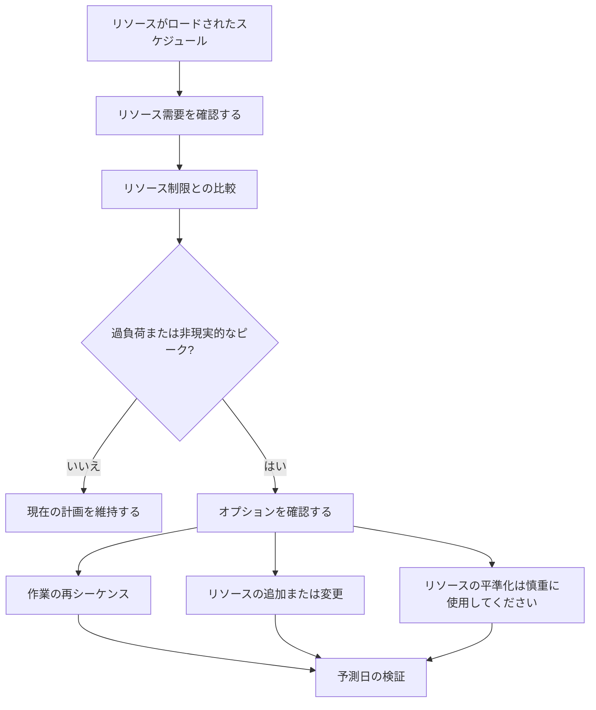

Primavera P6 のリソース バランシングは、利用可能な容量に対してリソース需要を確認し、利用可能なリソースで作業を実行できるように計画を調整するプロセスです。これは、プロジェクト チームがスケジュールが論理的に正しいだけなのか、それともリソースの観点からも現実的であるのかを理解するのに役立ちます。

日々のスケジューリングでは、リソース バランシングとリソース平準化という言葉が同じ意味であるかのようによく使われます。これらは関連していますが、まったく同じではありません。

リソースのバランシングは、より広範な計画のレビューです。これには、ヒストグラム、リソース プロファイル、人員の空き状況、機器の需要、人員のピーク、計画の現実性などの確認が含まれます。

リソース平準化は、リソースの可用性と平準化設定に基づいてアクティビティを移動できる P6 機能です。

この機能は便利ですが、制御して使用する必要があります。 P6 は平準化された結果を計算できますが、スケジューラはその結果がプロジェクトにとって意味があるかどうかを判断する必要があります。

## リソースバランシングとは

リソース バランシングでは、プロジェクトが実際に持っているリソースを使ってこのスケジュールを実行できるかという実際的な質問が生じます。

スケジュールには、適切なロジック、許容可能な日付、および合理的なクリティカル パスが含まれている場合があります。しかし、同じ限られた人員や設備があまりにも多くの場所で同時に作業する必要がある場合、その計画は現実的ではない可能性があります。

リソースのバランスをとるということは、その需要を検討し、それを管理する方法を決定することを意味します。

考えられるアクションは次のとおりです。

- 重要ではない作業の移動。
- リソースを追加します。
- 作業をさまざまなスタッフまたはエリアに分割します。
- アクティビティの順序を変更します。
- 残業や交代勤務を利用する。
- カレンダーの調整。
- リソース制限を更新しています。
- 一時的なピークが現実的で承認されている場合は、それを受け入れます。

目標は、ヒストグラムを完全に平坦にすることではありません。実際のプロジェクトには山もあれば谷もあります。目標は、リソースの需要が理解され、達成可能であり、実行計画と一致していることを確認することです。

## なぜそれが重要なのか

スケジュールは計算だけでなく実行をサポートするものであるため、リソースのバランスが重要になります。

計画では来週 50 人の溶接工が必要だが、請負業者が 30 人しか用意できない場合、スケジュールには需要を満たすことができないことが示されています。 2 つの重要な作業で同時に同じクレーンが必要な場合、少なくとも 1 つを移動する必要がある場合があります。エンジニアリングレビュー活動がすべて同じ専門家を必要とする場合、建設が始まる前にボトルネックが現れる可能性があります。

リソースのバランスをとらないと、プロジェクトは実際よりも多くの容量があると考える可能性があります。

これは以下に影響を与える可能性があります。

- 短期的な先取り計画。
- 人員予測。
- 設備の企画。
- クリティカル パスの信頼性。
- 収益額の予測。
- コストとキャッシュ フローの曲線。
- 進捗に関するコミットメント。
- 回復計画。

リソース バランシングは、CPM スケジュールを実際の現場およびオフィスのキャパシティと結び付けるのに役立ちます。

## リソースの分散とリソースの平準化

リソースのバランシングは、管理および計画のアクティビティです。

リソースの平準化は、スケジュール計算です。

その区別は重要です。プランナーは、ヒストグラムを確認し、プロジェクトの知識に基づいてスケジュールを調整することで、リソースのバランスを手動で調整できます。 P6 リソースの平準化は、リソース需要が可用性を超えた場合にアクティビティを自動的に遅らせることにも役立ちます。

どちらのアプローチも役立ちます。

スケジューラが判断、フィールド入力、構築可能性のレビュー、またはどのアクティビティを移動するかについて慎重に制御する必要がある場合は、手動バランシングの方が適しています。

P6 リソースの平準化は、リソース データが信頼でき、リソース制限が定義されており、カレンダーが正確で、スケジューラがリソースの可用性が強制されたときにスケジュールがどのように変化するかをテストしたい場合に役立ちます。

平準化は計画上の判断に取って代わるべきではありません。それをサポートするはずです。

## P6 がレベリングする前に必要なもの

P6 リソース平準化機能を使用する前に、スケジュールでリソース分析を行う準備ができている必要があります。

少なくとも次のことを確認してください。

- アクティビティには意味のあるリソースが割り当てられています。
- リソース単位は実際の需要を反映します。
- リソース制限は実際の可用性を反映します。
- リソースカレンダーは正しいです。
- アクティビティカレンダーは正確です。
- ロジックは、スケジュールの決定をサポートするのに十分な完成度を持っています。
- 制約は理解されています。
- 優先順位が定義または確認されます。
- 現在のスケジュールが保存されているため、平準化された結果を比較できます。

これらの項目が弱い場合、レベリングによって正確に見える結果が得られる可能性がありますが、役に立たない可能性があります。

たとえば、すべての建設労働力が 1 つの一般的な「建設作業員」リソースに割り当てられている場合、P6 はリソースの過負荷を示す可能性がありますが、その結果は、問題が土木、配管、電気、機械のいずれであるかをプロジェクトに伝えることができない可能性があります。リソースの設定は計画上の決定と一致する必要があります。

## P6 によるリソース平準化の使用方法

P6 リソースの平準化は、リソースの割り当てと可用性をレビューします。設定によっては、リソースの過剰割り当てを削減または削除するアクティビティが遅れる場合があります。

計算では、リソース制限、アクティビティ ロジック、フロート、カレンダー、優先順位、平準化オプションを考慮できます。正確な結果は、プロジェクトの構成方法によって異なります。

実際には、P6 はリソースの需要が可用性よりも高い状況を探し、リソースが利用可能な日付にアクティビティを移動しようとします。

これにより、よりリソースを有効活用できるスケジュールを作成できますが、クリティカル パスが変更されたり、マイルストーンが遅れたり、見直しが必要な方法で作業が移動したりする可能性もあります。

平準化後、スケジューラは結果を元の予測と比較する必要があります。

- どのアクティビティが移動しましたか?
- どのマイルストーンが変更されましたか?
- クリティカルパスは変更されましたか?
- レベリングで使用可能なフロートが使用されましたか、またはプロジェクトの終了が遅れましたか?
- 新しい日付は構築可能ですか?
- その結果、リソースの問題は解決されましたか、それとも別の問題が生じましたか?

平準化されたスケジュールを盲目的に受け入れるべきではありません。

## リソース バランシングを使用する場合

リソースの可用性が実行に影響を与える場合は、必ずリソース バランシングを使用してください。

これは特に次の場合に役立ちます。

- 作業員に制限がある建設スケジュール。
- シャットダウン、ターンアラウンド、停電。
- 限られた専門家による試運転計画。
- 共有レビュー担当者とのエンジニアリング スケジュール。
- 高価な設備や共有設備を使用するプロジェクト。
- 1 つのリソース プールが複数のプロジェクトをサポートするプログラム。
- 追加リソースが検討されている復旧計画。

リソースのバランシングは、ベースラインの承認前にも役立ちます。非現実的な人員や設備の可用性を前提としたベースラインは、後で防御することが困難になる可能性があります。

更新中に、リソース バランシングは、残りの作業を現在のチームと機器で実行できるかどうかを確認するのに役立ちます。

## いつ注意すべきか

リソースデータが保持されていない場合は注意してください。

実際のユニットが更新されていない場合、リソース曲線が現実から乖離する可能性があります。リソースがコスト負荷のみに割り当てられている場合、単位は実際の容量を表していない可能性があります。カレンダーが間違っている場合は、リソースの利用可能性も間違っている可能性があります。

契約上のスケジュールまたは基準スケジュールでリソースの平準化を使用する場合にも注意してください。 Leveling can move dates and affect float.チームは、平準化されたスケジュールが公式の計画なのか、仮定のシナリオなのか、それとも内部計画の観点なのかを理解する必要があります。

Leveling can also hide logic weaknesses.平準化によってアクティビティが移動した場合、レビュー担当者は元のロジックが不完全または間違っていたことを見逃す可能性があります。 Always review logic first, then resources.

## 実際の使用方法

最も重要なリソースを特定することから始めます。すべてのマイナーなリソースを同じ詳細レベルでバランスを取ろうとしないでください。マイルストーンに影響を与える可能性のある主要なスタッフ、重要な専門家、共有機器、リソースに焦点を当てます。

次に、P6 でリソース プロファイルまたはヒストグラムを確認します。需要のピーク、過負荷、ギャップ、突然の変化を探します。

需要とリソース制限を比較します。需要が制限を超える場合は、責任チームと問題について話し合ってください。答えはスケジュール設定だけではなく、運用面にあるかもしれません。

次に、修正方法を決定します。

- リソース制限が間違っている場合は、リソース制限を更新します。
- リソース需要が間違っている場合は、割り当てを修正します。
- シーケンスが非現実的である場合は、ロジックまたはアクティビティのタイミングを調整します。
- 過負荷が実際にある場合は、リソースを追加するか、残業を使用するか、作業を移動するか、またはピークを受け入れるかを決定します。
- 自動レベリングが適切な場合は、制御されたシナリオとして実行し、結果を比較します。

リソースの平準化を実行する前に、平準化されていないスケジュールのコピーを保存してください。これはチームに参照点を与え、何が変更されたかを説明するのに役立ちます。

## グッドプラクティス

リソース バランシングは、1 回限りのクリーンアップ作業としてではなく、スケジュール レビューの一環として使用します。

ベースライン開発、大規模な再予測、復旧計画、および定期的な更新サイクル中にリソース曲線を確認します。

質の低いスケジュールを平準化し、結果が信頼できるものになることを期待しないでください。まず、ロジック、カレンダー、アクティビティのステータス、残りの期間、リソースの割り当てを修正します。

P6 機能を使用する場合のドキュメント レベリング設定。リソースの平準化は、選択したオプションに応じて異なる結果を生成する可能性があるため、設定はスケジュール レコードの一部です。

最も重要なことは、作業の所有者と一緒にリソース計画を検証することです。プロジェクト チームは、リソースのピークが達成可能かどうか、シーケンスが現実的かどうか、追加のリソースが実際に利用可能かどうかを確認する必要があります。

## 結論

P6 のリソース バランシングは、プロジェクト チームが利用可能なリソースでスケジュールを実行できるかどうかをテストするのに役立ちます。日付とロジックを人的資源、設備、専門家の利用可能性、実際の生産能力と結び付けます。

P6 リソースの平準化は、リソースの可用性に基づいてアクティビティを移動することでこのレビューをサポートできますが、慎重に使用し、計算後にレビューする必要があります。

バランスのとれたスケジュールは、必ずしも完全にスムーズなスケジュールであるとは限りません。これは、リソースの需要が目に見えて現実的で、プロジェクトが実際に提供される方法と一致するスケジュールです。
## 関連コンテンツ
- [Primavera P6 進捗 0% からスタートした活動 - 概要](../../metrics/13_activity_started_progress_zero/02_guide_template.md)
- [P6 のリソース制限](../13_RESOURCES%20LIMITS%20IN%20P6/13_RESOURCES%20LIMITS%20IN%20P6.md)
- [SS と FF の関係](../15_SS%20&%20FF%20RELATIONS/15_SS%20&%20FF%20RELATIONS.md)
