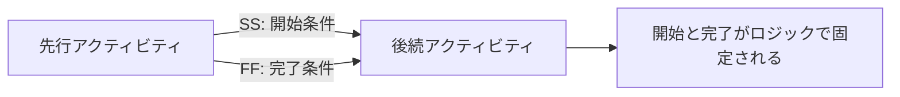

# SS と FF の関係

Start-to-Start（SS）と Finish-to-Finish（FF）は、Primavera P6 で有効なロジック関係です。2つのアクティビティが重なって実行される場合、単純な Finish-to-Start 関係よりも実行順序を正確に表現できます。

問題は SS や FF そのものではありません。問題は、アクティビティの両端を管理する必要があるのに、SS または FF を単独で使うことです。単独の SS は後続アクティビティの開始を管理しますが、完了を管理しません。単独の FF は後続アクティビティの完了を管理しますが、開始を管理しません。そのため、多くのスケジューラーはこの使い方を half relationship、つまり半分のロジックと考えます。

## SS と FF の意味

SS 関係は、後続アクティビティが先行アクティビティの開始時、または先行アクティビティ開始から定義された lag 後に開始できることを示します。

FF 関係は、後続アクティビティが先行アクティビティの完了時、または先行アクティビティ完了から定義された lag 後に完了できることを示します。

どちらも実際の作業を表現できます。設計レビューは設計作業の開始後に始まることがあります。試験は据付完了後にしか完了できないことがあります。エリア別施工では、一つの作業が別の作業の開始後に始まりますが、完了側の管理も必要です。

## 単独 SS が不完全になり得る理由

単独 SS は後続アクティビティの開始だけを固定します。後続アクティビティの完了を何が管理するかは説明しません。

後続アクティビティの期間が変わったり、現実的でない位置まで延びたりした場合、下流ロジックが影響を拾わなければ、スケジュールは正しく影響を示せません。開始はつながっていますが、完了は浮いたままになる可能性があります。

P6 では predecessor があるため接続されて見えますが、実際には作業の流れを完全に表していない場合があります。

## 単独 FF が不完全になり得る理由

単独 FF は反対の問題を作ります。後続アクティビティの完了を固定しますが、いつ開始できるかを説明しません。

更新済みスケジュールでは、early start が過去に計算されすぎることがあります。アクティビティが Data Date、またはそれ以前に開始できるように見える場合がありますが、それは作業が本当に準備できているからではなく、開始条件がロジックで定義されていないためです。

これは float、critical path、短期計画の判断を歪める可能性があります。

## SS + FF の組み合わせ

作業が本当に重なっている場合、より強いモデルは SS + FF の組み合わせです。

SS は後続アクティビティがいつ開始できるかを管理します。FF は後続アクティビティがいつ完了できるかを管理します。両方を使うことで、重複作業の論理的な範囲を定義できます。

これは連続作業、エリア別施工、設計とレビューのサイクル、据付と試験、反復作業に有効です。

## 単独 SS または FF が許容される場合

すべての単独 SS または FF が自動的に悪いわけではありません。

後続アクティビティの完了が別の有効な downstream 関係で管理されているなら、単独 SS は許容される場合があります。後続アクティビティの開始が別の有効な predecessor で管理されているなら、単独 FF も許容される場合があります。重要なのは、アクティビティの開始と完了の両方がネットワーク内のどこかで管理されているかです。

スケジューラーは、なぜ単独関係で十分なのかを説明できる必要があります。

## P6 での確認方法

P6 では、SS predecessors、SS successors、FF predecessors、FF successors を持つアクティビティを確認します。特に、唯一の predecessor が FF のアクティビティ、または唯一の successor が SS のアクティビティに注意します。

有用な項目は Activity ID、Activity Name、Start、Finish、Activity Status、Total Float、Predecessors、Successors、Relationship Type、Lag、Constraints、利用可能であれば Driving Relationship です。

確認する質問:

- このアクティビティは何によって開始できるのか。
- 完了を何が管理しているのか。
- 重なりは物理的または契約的に実在するのか。
- lag が不足した詳細を隠していないか。
- 関係は実行計画を説明しているか。
- 独立レビュー者がこのロジックを理解できるか。

## よくある問題

よくある問題は、重なりを可能にする本当の条件をモデル化せずに、SS で作業を前倒しすることです。

もう一つは、FF で完了日を保持しながら開始側を開いたままにすることです。

SS と FF は、本来アクティビティをより小さく分解すべき場面で使われることもあります。作業範囲が大きすぎる場合、関係で結果を強制するのではなく、より明確なステップに分けるべきです。

## 良い実務

SS と FF は意図を持って使います。日付調整の便宜ではなく、実際の順序を表すべきです。

SS を使う場合は、後続アクティビティの完了もロジックで管理されているか確認します。FF を使う場合は、後続アクティビティの開始もロジックで管理されているか確認します。

開始と完了の両方を結ぶ必要がある重複作業では、SS + FF の組み合わせを使います。単独 SS または FF が意図的な場合は、その理由を文書化します。

## 結論

SS と FF は P6 で有用なツールですが、規律が必要です。単独で使うと、アクティビティの片側だけを管理する不完全なロジックを作る可能性があります。

信頼できる CPM スケジュールは、作業がなぜ開始できるのか、何が完了を管理するのかを説明できるべきです。SS と FF がその質問に答えるなら、スケジュールを強化します。片側を開いたままにするなら、それはレビューすべき弱いロジックです。
## 関連コンテンツ
- [駆動ロジックなしでデータ日付に開始されるアクティビティ: このスケジュール指標が重要な理由 - 概要](../../metrics/01_activities_starting_in_dd_with_no_logic_driving/02_guide_template.md)
- [P6 でのリソースのバランス](../14_RESOURCES%20BALANCING%20IN%20P6/14_RESOURCES%20BALANCING%20IN%20P6.md)
- [CPM（Critical Path Method）](../16_CPM%20(CRITICAL%20PATH%20METHOD)/16_CPM%20(CRITICAL%20PATH%20METHOD).md)
