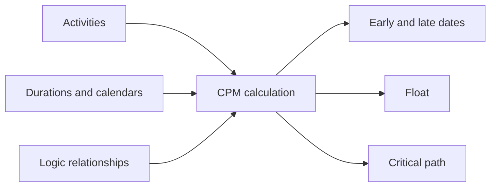

# CPM（Critical Path Method）

Critical Path Method、つまり CPM は、本格的なプロジェクトスケジュールの背後にある基本的な計算方法です。活動リストをロジックでつながったモデルに変え、プロジェクトチームが重要な質問に答えられるようにします。プロジェクトはいつ完了できるのか、どの活動が完了日を管理しているのか、スケジュールのどこに余裕があるのか。

Primavera P6 では、CPM は schedule ボタンの背後に隠れていることが多いです。ソフトウェアは日付、float、critical activities を非常に速く計算します。しかし、方法そのものを理解することは重要です。プランナーが CPM を理解していないと、スケジュールは計算できても、その結果が実際の実行計画を表していない場合があります。

## CPM が行うこと

CPM は、活動、期間、カレンダー、関係のネットワークからプロジェクト期間を計算します。

基本的な考え方はシンプルです。プロジェクト期間は、すべての活動期間の合計ではありません。ネットワーク内で依存している作業の最も長い連続した経路の期間です。この経路が critical path です。

この経路上の活動が遅れると、同じ経路上で時間を回復しない限り、プロジェクト完了も遅れます。

## CPM に必要な入力

CPM はスケジュールネットワークの品質に依存します。

まず、スケジュールには明確な作業単位を表す活動が必要です。各活動には、定義された範囲、合理的な期間、明確な完了条件が必要です。

次に、各活動には期間が必要です。多くの P6 スケジュールでは、これは生産性、リソース、カレンダー、実行前提に基づく deterministic な見積りです。

さらに、活動にはロジックが必要です。関係は、何が先に必要か、何が並行できるか、どの条件で後続活動が開始または完了できるかを定義します。

CPM はロジックが良いかどうかを判断しません。与えられたロジックで計算します。欠けたロジック、弱い constraints、過剰な lag、不完全な SS/FF 関係があると、数学的には正しくても実務上信頼できない結果になります。

## Forward Pass と Backward Pass

CPM は主に2つの計算過程でスケジュールを計算します。

Forward pass は Data Date からプロジェクト完了へ向かって進みます。ロジック、期間、カレンダー、制約をもとに、各活動が最も早く開始・完了できる日付を計算します。これが Early Start と Early Finish です。

Backward pass はプロジェクト完了から開始側へ戻ります。プロジェクト完了や選択された目標を遅らせずに、各活動が最も遅く開始・完了できる日付を計算します。これが Late Start と Late Finish です。

早い日付と遅い日付が計算されると、P6 は float を計算できます。

## Float

Float は、活動が定義されたスケジュール目標に影響する前に動ける時間です。

Total Float は P6 で最もよく確認される値です。活動がプロジェクト完了または controlling path に影響するまで、どれだけ遅れられるかを示します。

Free Float はより局所的です。活動が直接の後続活動の early start に影響せずに遅れられる時間を示します。

Float は自由に使ってよい余り時間ではありません。スケジュールの柔軟性です。Float が消費されると、プロジェクトは将来の遅れに対する保護を失います。

## Critical Path

Critical path は、プロジェクト完了を管理する最も長い依存活動の経路です。多くのスケジュールでは total float がゼロまたはマイナスの活動を critical としますが、より良いレビューは longest path を理解し、それが実際に妥当か確認することです。

良い critical path は、信頼できる実行の流れを示します。設計リリース、procurement、施工順序、試験、commissioning、handover など、本当に完了を管理する活動を通るべきです。

Critical path が不自然な milestones、不必要な constraints、欠けたロジック、完了を実際には管理しない活動を通る場合、スケジュールは誤った信号を出している可能性があります。

## Near-Critical 作業

プロジェクトチームは zero float の活動だけを見るべきではありません。

Near-critical 活動は float が少なく、少しの遅れで critical になる可能性があります。閾値はプロジェクトの規模と感度によります。大規模プロジェクトでは、float が 10 または 20 working days 未満の活動も重点監視が必要です。

Near-critical path が重要なのは、リスクが一つの線だけに留まらないからです。密度の高い施工、commissioning、shutdown 期間では、複数の経路が同時に critical に近づくことがあります。

## CPM とリスク分析

CPM は deterministic な答えを出します。各活動が計画期間どおりに完了するなら、プロジェクトはこの日に終わる、という答えです。

Schedule Risk Analysis はさらに不確実性を扱います。活動期間に範囲や確率分布を設定し、多数のシミュレーションを実行して、目標日に完了する確率を推定します。

しかし、リスク分析は CPM ネットワークに依存します。ロジックが弱ければ、リスク結果も弱くなります。Monte Carlo は欠けたロジック、非現実的な期間、悪い構造を修正できません。

## Primavera P6 における CPM

P6 は CPM 計算を速くしますが、その速さは前提を隠すことがあります。

スケジュール計算時、P6 は Data Date、calendars、durations、relationships、constraints、actuals、remaining durations、schedule options を使用します。これらの小さな変更でも float、critical path、forecast dates が変わることがあります。

そのため、プランナーは F9 を押して結果を受け入れるだけでは不十分です。計算結果が実際の実行計画と一致しているか確認する必要があります。

## 良い実務

CPM ネットワークは実際の実行ロジックから構築します。チェックを通すため、または望む日付を作るためだけに関係を追加しないでください。

各更新後に critical path を確認します。現在のプロジェクト状況に対して、開始と終了が妥当か確認します。

Float の変化を追跡します。プロジェクトは計画どおりに見えても、float が静かに消費されている場合があります。

Near-critical paths を確認します。次のスケジュール問題がどこに出るかを示すことが多いです。

CPM を支えるため、スケジュールを十分にクリーンに保ちます。Open starts、open finishes、hard constraints、過剰な lag、不完全な関係は計算価値を下げます。

## 結論

CPM は Primavera P6 スケジュールを project control ツールに変えるエンジンです。活動ネットワークから early dates、late dates、float、critical path を計算します。

しかし、CPM の信頼性は計算対象のスケジュールに依存します。良い活動、現実的な期間、適切なカレンダー、強いロジックが結果を意味のあるものにします。

CPM の価値は完了日を示すことだけではありません。本当の価値は、その完了日がなぜ管理されているのか、どこに柔軟性があるのか、management attention をどこに向けるべきかを説明することです。
## 関連コンテンツ
- [制約で始まるクリティカル パスまたはフロート パス - 概要](../../metrics/09_cp_or_float_path_starting_with_constraint/02_guide_template.md)
- [SS と FF の関係](../15_SS%20&%20FF%20RELATIONS/15_SS%20&%20FF%20RELATIONS.md)
- [プロジェクトスケジュールを作成する](../17_DEVELOPE%20A%20PROJECT%20SCHEDULE/17_DEVELOPE%20A%20PROJECT%20SCHEDULE.md)
