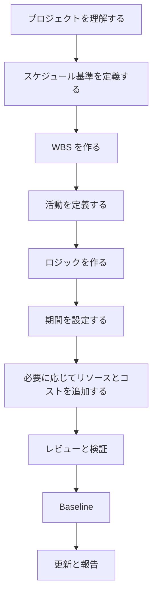

# プロジェクトスケジュールを作成する

プロジェクトスケジュールをゼロから作成することは、Primavera P6 に活動を入力するだけではありません。スコープ、実行戦略、制約、リソース、プロジェクトの約束を、レビュー、承認、更新、意思決定に使える時間モデルへ変換することです。

良いスケジュールは計算される前に構築されます。P6 ファイルの品質は、最初の活動を入力する前の考え方に左右されます。

## 作成フロー

## まずプロジェクトを理解する

P6 を開く前にプロジェクトを理解します。

契約、作業範囲、仕様、主要 milestones、実行戦略、procurement 制約、許認可、アクセス制限、handover 要求を確認します。その後、project management、engineering、procurement、construction、commissioning、subcontractors、suppliers と話します。

スケジュールは、チームがどのようにプロジェクトを実行するつもりかを示すモデルです。プランナーがその意図を理解していなければ、スケジュールは仮定の上に作られます。

## スケジュール基準を定義する

Scheduling basis は、スケジュールをどのように作るかを説明します。WBS、calendars、activity coding、level of detail、relationship rules、lag policy、P6 settings、Data Date convention、reporting requirements、baseline approach を定義します。

この文書は、なぜスケジュールがその形になっているかを説明します。品質レビューや将来の更新比較にも役立ちます。

## WBS を作る

Work Breakdown Structure はスケジュールの組織構造です。プロジェクトがどのように管理され、報告されるかを反映する必要があります。

WBS は phase、area、system、discipline、deliverable、contract package、または組み合わせで構成できます。Filtering、progress measurement、responsibility assignment、reporting を支える必要があります。

WBS がプロジェクト管理方法に合っていないと、活動が正しくてもスケジュールは使いにくくなります。

## 活動を定義する

活動は明確で測定可能な作業単位を表すべきです。各活動には定義された scope、明確な start condition、明確な finish condition、責任者が必要です。

大きすぎる活動は更新しにくく、小さすぎる活動は維持が難しくなります。適切な詳細度は、プロジェクト段階、契約要求、報告要求、管理期待により異なります。

活動名は重要です。良い名前は、どの作業を、どこで実施し、どの対象物、システム、成果物に関連するかを示すべきです。

## ロジックを作る

ロジックは CPM スケジュールの中心です。何が先に必要か、何が並行できるか、どの条件で活動が開始または完了できるかを定義します。

ロジックは作業を理解している人と一緒に作ります。P6 で机上だけで順序を作らないでください。Discipline leads、construction managers、commissioning、procurement、subcontractors と確認します。

作業を最もよく表す場合は FS を使います。実際に重複作業がある場合のみ SS と FF を慎重に使います。Negative lag を避け、明確に承認された理由がない限り SF を避けます。正当な project start と finish milestones を除き、活動には通常 predecessor と successor が必要です。

## 期間を設定する

期間は希望ではなく現実的であるべきです。Scope、productivity、resources、calendars、vendor input、subcontractor input、類似作業の経験に基づきます。

期間は単なる数字ではありません。特定の crew、production rate、work calendar、access condition、execution method を仮定しています。これらが変われば期間も変わる可能性があります。

重要な期間前提を文書化します。Reviews、updates、change management、delay analysis に役立ちます。

## リソースとコストを追加する

スケジュールを resource planning、cost loading、earned value、cash flow に使う場合、リソースとコストは慎重に追加します。

Resource loading は labor demand、equipment demand、material quantities、overloads を示します。Cost loading はスケジュールを budgets、forecasts、payment/progress curves に接続します。

見た目だけのためにリソースを追加しないでください。プロジェクトがそのデータを使うなら、更新時にも維持する必要があります。

## レビューと検証

Baseline 承認前に、スケジュールは技術的にも運用的にもレビューされる必要があります。

Open starts、open finishes、relationship types、lags、constraints、long durations、missing logic、float distribution、critical path reasonableness を確認します。DCMA-style checks は有用ですが、プロジェクト判断が必要です。

プロジェクトチームと一緒にスケジュールを確認します。ロジック、期間、リソース、milestones が実際の実行計画に合っているか確認します。指標を通っても現場レビューに通らないスケジュールは準備できていません。

## Baseline を設定する

レビューと承認後、スケジュールは baseline になります。Baseline は progress、variance、delay、recovery、performance を測定する基準です。

Baseline は正式に設定します。承認版を保存し、非管理変更から保護し、approvals を文書化します。後の baseline 変更は change control に従います。

プロジェクトが遅れるたびに変わる baseline は baseline ではありません。それは動く目標です。

## 更新サイクルを作る

スケジュールは一貫して更新される場合だけ有用です。

誰が progress を提供するか、いつ収集するか、どの証拠が必要か、actual dates をどう確認するか、remaining durations をどうレビューするか、どの reports を発行するかを定義します。Active construction と commissioning は weekly または biweekly updates が必要な場合があります。初期段階は monthly でもよい場合があります。

更新サイクルは baseline を静的文書から生きた control tool に変えます。

## 結論

プロジェクトスケジュール作成は構造化されたプロセスです。プロジェクトを理解し、basis を定義し、WBS を作り、活動を作成し、ロジックを作り、期間を設定し、必要ならリソースを載せ、検証し、baseline を設定し、更新で維持します。

最良のスケジュールは P6 を急いで開くことから生まれません。作業を理解し、仮定を確認し、プロジェクトチームが信頼できるモデルを作ることから生まれます。
## 関連コンテンツ
- [駆動ロジックなしでデータ日付に開始されるアクティビティ: このスケジュール指標が重要な理由 - 概要](../../metrics/01_activities_starting_in_dd_with_no_logic_driving/02_guide_template.md)
- [CPM（Critical Path Method）](../16_CPM%20(CRITICAL%20PATH%20METHOD)/16_CPM%20(CRITICAL%20PATH%20METHOD).md)
- [Activity Codes](../18_ACTIVITY%20CODES/18_ACTIVITY%20CODES.md)
