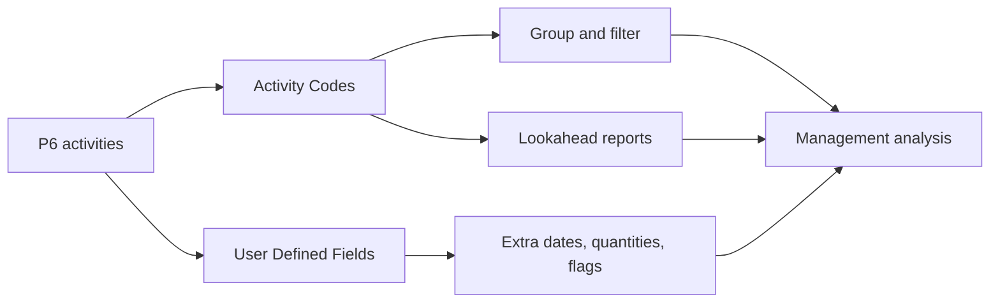

# Activity Codes

Primavera P6 の Activity Codes は、スケジュールを単なる活動リストから project controls に使えるデータベースへ変える主要な機能です。これにより、プロジェクトチームはスケジュールをさまざまな管理視点で group、filter、sort、report、analyze できます。

スケジュールは bar chart だけではありません。P6 では各活動が record であり、responsibility、phase、area、system、discipline、contract、milestone type などの属性を持つことができます。Activity Codes はその情報を管理された形で整理します。

## Activity Codes とは

Activity Codes は活動に割り当てる構造化された分類フィールドです。各 code type は1つの reporting dimension を表し、各 code value はその dimension 内の選択肢です。

例:

- Code type: Area.
- Code values: Unit 1, Unit 2, Tank Farm, Utilities.

または:

- Code type: Discipline.
- Code values: Civil, Mechanical, Electrical, Instrumentation, Commissioning.

WBS は作業がプロジェクト構造のどこにあるかを示します。Activity Codes は、その作業を reporting と analysis のためにどう見るかを示します。

## Activity Codes ではないもの

Activity Codes は WBS の代替ではありません。WBS は scope hierarchy です。Codes は同じ活動を別の角度で見るためのものです。

Activity Codes は logic の代替ではありません。Logic は作業順序を定義します。

Activity Codes は resources の代替ではありません。Resources は labor、equipment、material demand、cost loading を定義します。

これらを混同すると、スケジュールは維持しにくくなります。良い P6 スケジュールは WBS、logic、resources、Activity Codes、UDFs を別々の目的で使います。

## Global と Project Activity Codes

P6 には Global Activity Codes と Project Activity Codes があります。

Global Activity Codes は複数プロジェクトで共有されます。標準 phase、corporate responsibility groups、program-level reporting categories など、portfolio 全体で同じ分類が必要な場合に有効です。

Project Activity Codes は特定プロジェクトに属します。Areas、systems、contract packages、work fronts、turnover packages、local reporting categories など、1つのプロジェクト内で意味を持つ属性に適しています。

Global codes は変更が他プロジェクトに影響するため慎重に使います。1つのプロジェクトだけで意味を持つ属性には project codes を使います。

## 一般的な Activity Code Types

有用な code types はプロジェクトによりますが、一般的な例は次の通りです:

- Responsible Party.
- Discipline.
- Project Phase.
- Area or Location.
- System or Subsystem.
- Contract Package.
- Work Package.
- Milestone Type.
- Turnover Package.
- Reporting Level.

良い code types は reporting needs から生まれます。Codes を作る前に、このスケジュールはどんな質問に答える必要があるかを確認します。

例:

- 来月 Area A でどの作業が予定されているか。
- Electrical contractor の活動はどれか。
- どの systems が commissioning を動かしているか。
- どの contract package が遅れているか。
- Client に報告すべき milestones はどれか。

## User Defined Fields

User Defined Fields、つまり UDFs は Activity Codes とは異なります。Codes は活動を category に分類します。UDFs は dates、numbers、text、costs、quantities、yes/no indicators などの custom data を保存します。

情報が単なる category ではない場合は UDFs を使います。

例:

- Contractual finish date.
- Forecast finish date.
- Risk flag.
- Quantity planned.
- Quantity installed.
- Change order number.
- Drawing reference.
- Inspection status.

Activity Codes は grouping と filtering に向いています。UDFs は P6 標準フィールドにない追加情報の保存に向いています。

## Reporting で重要な理由

良い coding は reports を速く、信頼できるものにします。

一貫した Activity Codes があれば、scheduler は discipline lookaheads、area reports、contract package summaries、commissioning system reports、milestone reports、dashboards を毎回 filter を作り直さずに作成できます。

Codes がない場合、reporting は手作業になりがちです。チームは data を export し、spreadsheets を編集し、labels を手で追加し、毎 update で同じ作業を繰り返します。これはエラーと時間の浪費を生みます。

Codes はスケジュールを再利用可能な data source にします。

## Governance

Activity Codes には governance が必要です。誰もが自由に values を作ると、スケジュールはすぐに不整合になります。

例えば、ある人が "Electrical"、別の人が "Elec"、別の人が "E&I" を使うと、同じ category が複数の labels に分かれ、report が活動を漏らす可能性があります。

可能であれば baseline 前に code types と valid values を定義します。各 code の意味、維持責任者、mandatory かどうかを文書化します。

Coding completeness は他の schedule quality と同じように確認します。Mandatory codes が多くの活動で欠けていれば、その codes に基づく reports は信頼できません。

## Over-Engineering を避ける

Codes が多いほど control が良くなるわけではありません。

各 code と UDF は maintenance work を生みます。Report、filter、dashboard、analysis で使わない code は、維持する価値が低いかもしれません。

重要な reporting questions から始めます。それに答える十分な構造を作りますが、いつか役に立つかもしれないという理由だけで fields を作らないようにします。

## 良い実務

Coding structure は baseline 後ではなく、schedule development 中に設計します。

Codes を project reporting plan と合わせます。Project が area、discipline、contract、system で report するなら、それらの dimensions は P6 にあるべきです。

Code values は一貫し、管理されるべきです。重複や不明確な略語を避けます。

Custom dates、quantities、references、indicators には UDFs を使います。数値や日付情報を Activity Codes に無理に入れないでください。

各 update で coding を確認します。新しい活動には reports 発行前に required codes を付けます。

## 結論

Activity Codes は単なる administrative labels ではありません。Primavera P6 スケジュールが management questions に速く一貫して答えるための仕組みです。

正しく使えば、codes はスケジュールの filter、group、report、analyze を容易にします。UDFs は P6 標準フィールドでは扱えないプロジェクト固有情報を保存し、この能力を広げます。

Bar chart は時間を示します。Coding structure は、スケジュールをどう読み、分け、使うかを説明します。
## 関連コンテンツ
- [Primavera P6 で不足している依存関係 - 概要](../../12_metrics_jp/21_missing_dependencies/01_overview_template.md)
- [プロジェクトスケジュールを作成する](../17_DEVELOPE%20A%20PROJECT%20SCHEDULE/17_DEVELOPE%20A%20PROJECT%20SCHEDULE.md)
- [Schedule Basis](../19_SCHEDULE%20BASIS/19_SCHEDULE%20BASIS.md)
