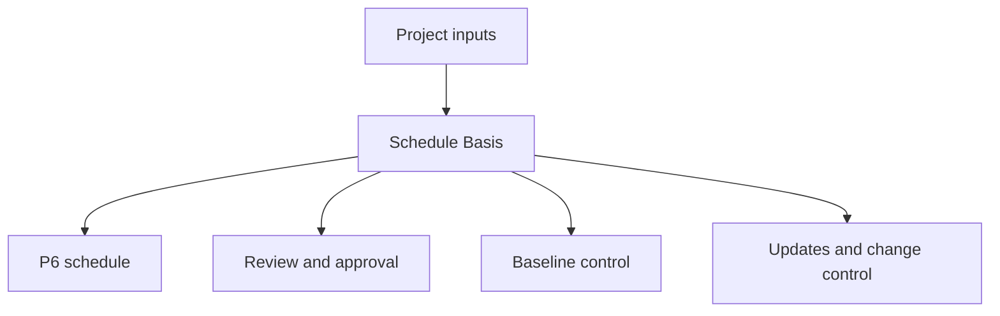

Schedule Basis、または Basis of Schedule は、プロジェクトスケジュールがどのように作られ、どの assumptions に支えられているかを説明する文書です。Primavera P6 ファイルの written companion です。

スケジュールは dates、logic、float、milestones、resources、critical path を示します。Schedule Basis は、それらがなぜその形になっているかを説明します。

## 用途

Schedule Basis は review、approval、baseline control、updates、change management、delay analysis を支援します。Reviewer が schedule の rules、assumptions、inputs、limitations を理解する助けになります。

これがなければ、P6 ファイルは計算できても、チームはどの assumptions が使われたか、管理判断に使えるかを理解しにくくなります。

## 誰が書き、誰に向けるか

Schedule Basis は通常 scheduler または planning engineer が作成し、project manager、engineering、procurement、construction、commissioning、project controls、contracts、cost teams から input を受けます。

対象は project team、client、PMO、reviewers、claims analysts、そして schedule がどう作られたかを理解する必要がある人です。

## なぜ重要か

Schedule には多くの判断が入っています。Calendars、durations、logic、crews、milestones、approval cycles、permits、resource limits は dates と float に影響します。

Schedule Basis はその判断を見えるようにします。曖昧さを減らし、auditability を支え、baseline 時点の assumptions に関する将来の争いを減らします。

## 含めるべき内容

包括的な Basis of Schedule には以下を含めます:

- Project scope and exclusions.
- Schedule purpose and contractual use.
- Schedule development methodology.
- WBS and activity coding structure.
- Calendars, shifts, holidays, weather, non-work periods.
- Key assumptions and constraints.
- Start, completion, access, approval, material delivery milestones.
- Approval and permit cycles.
- Handover and turnover assumptions.
- Logic rules, relationship types, lag policy.
- Duration basis, productivity rates, norms.
- Crews, resource availability, labor limits, equipment limits.
- Cost rules, if applicable.
- Critical path and near-critical path explanation.
- Risk assumptions and major uncertainties.
- Update cycle, status rules, reporting approach.

## Assumptions

Assumptions は明確で検証可能であるべきです。Site access dates、engineering releases、vendor delivery dates、permit approval durations、client review periods、crew availability、weather allowances、commissioning sequence assumptions などが含まれます。

Assumption が dates、float、resources、handover に影響するなら、Schedule Basis に記載します。

## Calendars and Work Periods

文書は P6 で使う主要 calendars を説明します。Working days、shifts、holidays、seasonal shutdowns、weather calendars、night work、weekend work、non-work periods を含めます。

Calendars は activity dates と float に直接影響します。Engineering、procurement、construction、commissioning、resources で異なる calendars を使う場合は理由を説明します。

## Crews, Resources, Limits

Durations は resource assumptions が理解されて初めて意味を持ちます。Schedule Basis は crew assumptions、resource availability、labor limits、equipment limits、overtime または shift strategy を説明します。

Resource loading がある場合は、manpower planning、cost loading、earned value、resource leveling のどれに使うかを説明します。

## Milestones, Approvals, Permits, Handover

主要 milestones をリストし説明します。Project start、contractual completion、access granted、client approvals、third-party interfaces、material delivery、permits、system handovers、final turnover を含めます。

Approval and permit cycles は assumed durations と responsible parties を示します。Client または third party action が schedule を drive する場合、それを明確にします。

## Methodology, Productivity, Costs

Schedule Basis は schedule がどのように開発されたかを説明します。Sources used、workshops、sequencing logic、duration estimating method、productivity rates、norms、validation process を含めます。

Cost loading がある場合は rules を示します。Costs が resource、expense、activity、WBS、contract package、earned value method のどれで割り当てられるかを説明します。

## Critical Path and Risk

Schedule Basis は critical path を要約し、なぜ妥当かを説明します。Near-critical paths、major risks、schedule sensitivities、execution 中に変わる可能性がある assumptions も示します。

これにより、team は planned finish date だけでなく、それを何が control しているか理解できます。

## 良い実務

Schedule Basis は baseline approval 前に書きます。P6 file と整合させます。Approved changes が assumptions、calendars、milestones、resource strategy、methodology を変える場合は更新します。

Generic narrative にしないでください。他の scheduler が schedule の作られ方を理解できるだけ具体的であるべきです。

## 結論

Schedule Basis は schedule の背後にある説明です。Schedule が何を assume し、どう作られ、何を含み、何を除外し、dates が valid であり続ける条件は何かを示します。

強い Basis of Schedule は P6 file を review、defend、update、trust しやすくします。
## 関連コンテンツ
- [駆動ロジックなしでデータ日付に開始されるアクティビティ: このスケジュール指標が重要な理由 - 概要](../../metrics/01_activities_starting_in_dd_with_no_logic_driving/02_guide_template.md)
- [Activity Codes](../18_ACTIVITY%20CODES/18_ACTIVITY%20CODES.md)
