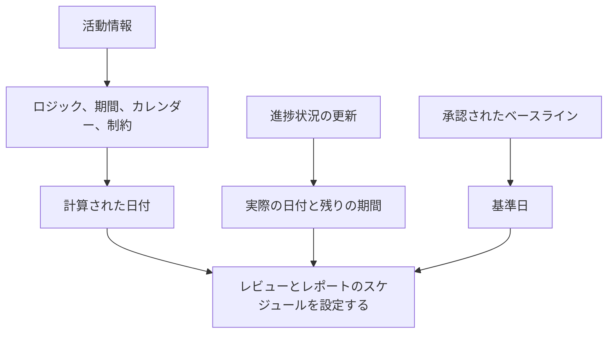

Primavera P6 の日付は、アクティビティの開始日と終了日が 1 つだけではないため、混乱を招く可能性があります。計画日、現在のスケジュール日、早い日、遅い日、実際の日、基準日、制約日、予想日、およびレイアウトやプロジェクトの設定に応じて外部または予測関連の日付を含めることができます。

これらの日付はすべて同じことを意味するわけではありません。一部は CPM ロジックによって計算されます。一部は進行状況の更新中に入力されます。一部は比較のために使用されます。スケジュールを制御または制限するために使用されるものもあります。この違いを理解することは、スケジュールの品質、PMO レポート、遅延分析の準備、および基本的なプロジェクト管理にとって不可欠です。

最も重要な質問は単純です。この日付は何を示しているのでしょうか?また、その日付はどこから来たのでしょうか?

## なぜ P6 にはこれほど多くの日付があるのか

P6は単なる日付リストではありません。計算モデルです。ソフトウェアは、アクティビティの期間、カレンダー、関係、制約、リソース、進行状況、およびデータ日付から日付を計算します。

プランナーはさまざまな質問に答える必要があるため、さまざまな日付フィールドが存在します。

- 当初の計画は何でしたか？
- 現在の予想は何ですか?
- 実際に何が起こったのでしょうか？
- アクティビティの開始または終了はどちらが早くなりますか?
- プロジェクトに影響を与えずに開始または終了できる最新の時間はどれですか?
- 制約によってアクティビティが強制されていますか?
- 現在の計画はベースラインと比較してどうですか?

問題は、これらの日付タイプがその目的を理解せずに混在しているときに始まります。

## データ日付

データ日付はアクティビティの日付ではありませんが、すべてのアクティビティの日付がどのように解釈されるかを制御します。

データ日付は、実際のパフォーマンスと予測作業の境界です。データ日付より前の作業は実現またはステータス化される必要があります。データ日以降の作業を予測する必要があります。

アクティビティにデータ日付より後の実際の日付がある場合、通常はステータス エラーになります。開いているアクティビティが駆動ロジックなしでデータ日付に正確に開始される場合は、順序が欠落していることを示している可能性があります。予想される終了がデータ日付より前である場合、それは更新情報が古いことを示している可能性があります。

アクティビティの日付を確認する前に、データの日付を確認してください。

## 開始と終了

開始日と終了日は、ほとんどのユーザーが P6 レイアウトで目にする主なスケジュール日です。これらは、スケジュール データに基づいてアクティビティの現在の計算日またはスケジュールされた日付を表します。

開始されていないアクティビティの場合、開始日と終了日は予測日です。進行中のアクティビティについては、実際のステータスと残りの予測を組み合わせることができます。完了したアクティビティについては、実際の日付と一致している必要があります。

これらは通常、レポート、先読みスケジュール、管理上の議論で使用される日付です。ただし、その背後にあるロジックとステータスを確認せずに受け入れるべきではありません。

[開始] と [終了] を使用して次の質問に答えます: 現在、アクティビティの開始と終了の予定はいつですか?

## 早めの開始と早めの終了

早期開始と早期終了は CPM 計算日です。これらは、先行ロジック、カレンダー、制約、および現在のスケジュール条件に基づいて、アクティビティが開始および終了できる最も早い日付を示します。

早めの日付は、スケジュール計算の順方向の説明に役立つため重要です。これらは、ロジックが許す限りすぐに作業がネットワークを介してどのように移動できるかを示しています。

多くのアクティビティがデータ日の早期開始となっている場合、レビュー担当者は、それらが本当に準備ができているかどうか、またはオープン スタート、制約されたアクティビティ、または弱くリンクされたアクティビティであるかどうかを確認する必要があります。

[早期開始] と [早期終了] を使用して、現在のネットワークに従ってこのアクティビティが最も早く発生するのはどれくらいか? に答えます。

## 遅刻開始と遅刻終了

「遅い開始」と「遅い終了」には、スケジュール設定に応じて、プロジェクトの終了や制御終了点を遅らせることなくアクティビティを開始または終了できる最も遅い日付が表示されます。

遅い日付は逆方向パスの一部です。これらは浮動小数点数を計算するために使用されます。早い日付と遅い日付の差は、アクティビティにどの程度の柔軟性があるかを示すのに役立ちます。

日付が遅いのが奇妙に見える場合は、制約、後継者の欠落、オープン終了、カレンダー、または異常なプロジェクト終了設定を探してください。

「遅い開始」と「遅い終了」を使用して、このアクティビティが制御完了日に影響を与えるまでにどのくらい遅れて移動できるか?に答えます。

## 実際の開始と実際の終了

実際の開始と実際の終了はステータスの事実です。現場またはプロジェクトの実行中に実際に起こったことを表す必要があります。

「実際の開始」とは、アクティビティが実際に開始されたことを意味します。 「実際の終了」とは、アクティビティが実際に完了したことを意味します。これらの日付は、計画目標または予測日付として使用しないでください。

実際の日付は通常、データ日付以前である必要があります。実際の日付がデータ日より後である場合、スケジュールでは将来の作業がすでに開始または完了したものとして報告されるため、更新の信頼性が低下します。

「実際の開始」と「実際の終了」を使用して、実際に何が起こったのかを答えます。

## 計画開始と計画終了

計画開始と計画終了はよく誤解されます。スケジュールの作成、更新、表示方法によっては、これらのフィールドが正式に承認されたベースラインのように動作しない場合があります。

ユーザーの中には、計画日が元の計画を永久に表示することを期待する人もいます。それは必ずしも安全な仮定であるとは限りません。正式な差異レポートの場合、割り当てられたベースラインは、通常、計画日付に無造作に依存するよりも信頼性が高くなります。

「計画開始」と「計画終了」は、プロジェクト管理手順でそれらの管理方法とその意味が明確に定義されている場合にのみ使用してください。

## ベースライン開始とベースライン終了

基準日は、割り当てられた基準スケジュールから取得されます。これらは、現在のスケジュールと承認された計画を比較するために使用されます。

たとえば、BL1 開始日と BL1 終了日には、承認されたベースラインからのアクティビティの開始日と終了日が表示される場合があります。現在の開始と終了には最新の予測が表示されます。それらの差は分散を示します。

基準日は、パフォーマンス レポート、スケジュールの差異、変更管理、遅延分析の準備の中核となります。

「ベースラインの開始」と「ベースラインの終了」を使用して、現在のスケジュールと承認された計画を比較してどうですか? に答えます。

## 制約日

制約日付は、強制される日付制御です。これらは、開始日、開始日または後、終了日、終了日またはその前、必須開始、または必須終了などの制約タイプに関連付けられています。

制約が自動的に間違ってしまうわけではありません。実際の契約日、アクセス制限、許可の解除、停止期間、または所有者の要件を表すものもあります。ただし、制約によって欠落しているロジックが隠蔽されたり、非現実的な日付が強制される可能性もあります。

厳しい制約、特に必須の開始と必須の終了はまれであり、文書化されている必要があります。

制約日を使用して回答します。課された日付はこのアクティビティを制御または制限していますか?

## 終了予定日と予測タイプの日付

予想終了は、プロジェクト チームがアクティビティの終了を予想する時期を把握するために、更新中によく使用されます。設定や手順によっては、予定日が P6 のアクティビティ日付の計算方法や表示方法に影響を与える可能性があります。

予想フィニッシュは、現場チームが現実的なゴール予想を提供する場合、進行中の作業に役立ちます。しかし、メンテナンスをしないと陳腐化してしまう可能性があります。データ日付より前の予想終了は、一般的な警告サインです。

一部のプロジェクトでは、レポートに予測関連の日付フィールドまたはユーザー定義フィールドも使用します。重要なのは、それらが計算されたものなのか、手動で入力されたものなのか、インポートされたものなのかをチームが理解できるように、それらを明確に定義することです。

予想日または予想日を使用して回答します。チームの最新の予想は何ですか? それは定義された更新手順によって管理されていますか?

## 一次制約日と二次制約日

P6 は、選択した制約フィールドに応じて、アクティビティに対して複数の制約条件を保持できます。通常、主な制約は標準レイアウトに表示される主要な制約ですが、二次的な制約も解釈に影響を与える可能性があります。

スケジュールを確認するときに、開始と終了だけを見ないでください。制約タイプおよび制約日付フィールドをレイアウトに追加します。日付が期待どおりに動作しない場合、最初に確認すべきことの 1 つが制約です。

## どの日付を使用する必要がありますか?

各日付を目的に応じて使用します。

- 現在のスケジュールの予測には「開始」と「終了」を使用します。
- CPM の計算とフロートを理解するには、早期と後期の日付を使用します。
- 完了した作業または開始された作業には実際の日付を使用します。
- 承認された計画との差異を確認するには、基準日を使用します。
- 制約日付を使用して、課された日付制御を特定します。
- 予想終了フィールドまたは予測フィールドは、更新プロシージャで定義されている場合にのみ使用します。
- データ日付を使用して、実際のパフォーマンスと予測作業を区別します。

## よくある間違い

よくある間違いの 1 つは、間違った日付を比較することです。たとえば、計画日がプロジェクト手順によって制御されていない場合、現在の開始日と計画された開始日を比較することは意味がありません。

もう 1 つの間違いは、実際の開始を予測として扱うことです。実際の日付は、意図ではなく、実際のパフォーマンスを表す必要があります。

3 番目の間違いは、時刻を無視することです。 P6 は日付を時間とともに保存するため、カレンダーの違いによって明らかな 1 日のずれや変動が生じる可能性があります。

最後に、制約日付を非表示にしないでください。日付が課されている場合、レビュー担当者はそれを確認する必要があります。

## 結論

P6 の日付は、スケジュールのストーリーのさまざまな部分を伝えるため、強力です。現在の日付は予測を示しています。早い日付と遅い日付では CPM の計算について説明します。実際の日付には何が起こったかが記録されます。基準日は比較をサポートします。制約の日付により、課された制御が明らかになります。予想される日付は、適切に維持されていれば更新をサポートできます。

強力なスケジュールの見直しでは、「日付は何ですか?」だけを尋ねるのではありません。 「これはどのような日付なのか、どこから来たのか、そして信頼できるものなのか」と尋ねます。

プロジェクト チームが各日付フィールドの意味を理解すると、スケジュールの説明と監査が容易になり、プロジェクト管理の信頼性が高まります。
