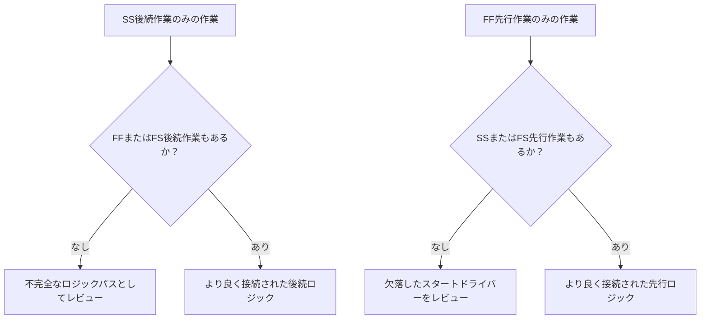

ロジックは、プロジェクトスケジュール内の順序付けと依存関係の数学的表現です。何が何より前に起こらなければならないか、どの作業が同時に起こることができるか、そしてプロジェクトチームが最初の作業から最終完了までどのように進むつもりかを説明します。

良いPrimavera P6スケジュールでは、ロジックは装飾ではありません。日付、フロート（float）、クリティカルパス（critical path）、予測の動きをスケジュールが計算できるエンジンです。レビュー、問い直し、改善できる方法で実行の物語を語ります。

スケジュールが「基礎を作り、次に壁を建て、次に屋根を建てる」と言うなら、ロジックはその順序を計算可能なネットワークに変えるものです。プランナーはタイムラインを描くだけではありません。プランナーは納品パスを定義しています。

## ロジックは作業の物語を語る

すべてのプロジェクトチームには、プロジェクトを実行するための意図された方法があります。エンジニアリングはエリアごとに設計をリリースするかもしれません。調達はパッケージごとに機器を納品するかもしれません。土木工事は構造工事が始まる前にアクセスを準備するかもしれません。機械的完了は試運転が開始できる前に起こる必要があるかもしれません。

ロジックリンクはその計画の数学的表現です。

このシンプルな図は単なる順序ではありません。意思決定モデルです。基礎が遅れれば、壁が遅れるかもしれません。壁が遅れれば、屋根が遅れるかもしれません。屋根が遅れれば、内装工事に影響するかもしれません。スケジュールはロジックがある場合のみその影響を示すことができます。

堅牢なロジックとは、スケジュールが作業がなぜ開始するか、なぜ完了するか、そして計画の一部が動くと何が起こるかを説明できることを意味します。

## データ日付における堅牢なロジックの重要性

「データ日付（Data Date）にドライビングロジックなしで開始する作業」というメトリクスは、スケジュール品質の強力なテストです。

データ日付は実際の実績と予測作業の境界です。作業がデータ日付にちょうど開始する場合、レビュー担当者はシンプルな問いを立てるべきです：この開始を左右しているものは何か？

作業に有効な先行ロジックがあれば、スケジュールは開始を説明できます。エリアがリリースされたかもしれません。資材納品が完了したかもしれません。先行作業が完了し、次のクルーが開始できるようになったかもしれません。

作業にドライビングロジックがなければ、開始はより弱いです。作業がデータ日付にあるのは、先行作業がないため、ロジックが不完全なため、制約が強制しているため、または更新が完全にステータスされていないためかもしれません。

だからこそ堅牢なロジックが重要です。スケジュールはデータ日付が動いたからといって作業の準備が整って見えることを許してはなりません。作業が開始できる実際の条件を示すべきです。

## バランス：適切なロジック、冗長でないロジック

良いロジックはバランスが取れています。スケジュールは作業を先行作業と後続作業に適切に接続するのに十分な関係が必要です。同時に、同じ依存関係を不必要な方法で繰り返す冗長なロジックを避けるべきです。

ロジックが少なすぎると、オープンスタート、オープンフィニッシュ、信頼性のないフロート、弱いクリティカルパス結果が生まれます。ロジックが多すぎると、ネットワークのレビューが困難になり、作業の真のドライバーが隠れることがあります。

目標は関係の数を最大化することではありません。必須および必要な依存関係を明確に表現することです。

各作業について、スケジューラーは次に答えられるべきです：

- この作業が開始できるのは何が許可するから？
- この作業は次に何を可能にするか？
- どの関係が本当に作業を左右しているか？
- 重複または不必要な関係はあるか？
- レビュー担当者は意図された順序を理解できるか？

このバランスはPMOスケジュールレビューの中心です。密なネットワークが自動的に強いネットワークではありません。軽いネットワークが自動的にクリーンなネットワークではありません。正しいネットワークは、雑然とすることなく実行計画を説明します。

## すべての作業にはスタートドライバーが必要

堅牢なロジックとは、有効なプロジェクト開始または外部認可の例外を除いて、すべての作業がその開始を許可またはトリガーする先行作業を持つことを意味します。

建設作業のスタートドライバーは、エリアアクセス、先行作業の完了、資材の可用性、設計リリース、許可承認、または前工程の完了かもしれません。調達作業の場合、設計承認または発注リリースかもしれません。試運転の場合、機械的完了、テストパッケージの準備完了、またはシステム引渡しかもしれません。

このスタートドライバーが欠落すると、作業はスケジュール内の人工的な位置にフロートできます。更新中に、データ日付に現れることがあります。これは誤った準備完了感を生み出します。

「ポンプの設置」という作業を考えてみてください。データ日付に開始するが、基礎完成、ポンプ納品、またはエリア引渡しの先行作業がない場合、スケジュールはなぜ設置が開始できるかを説明していません。作業は計画されているかもしれませんが、ロジックは堅牢ではありません。

## SSとFFはハーフな関係

スタート・ツー・スタート（SS）とフィニッシュ・ツー・フィニッシュ（FF）の関係は有用ですが、慎重に使用すべきです。多くのスケジュールレビューでは、それ自体では作業を完全なロジックパスに完全に配置しないため、「ハーフ」な関係として理解するのが最善です。

SS関係は作業がいつ開始できるかを説明できますが、作業がいつ完了しなければならないか、または何を引き渡すかを説明しないかもしれません。FF関係は完了の整合を説明できますが、作業がいつ開始できるかを説明しないかもしれません。

それはSSやFFが間違っているということではありません。重複する作業は一般的で、多くの場合現実的です。問題は作業が完全に接続されているかどうかです。

例えば：

- SS後続作業を持つ作業は通常、FF またはFS後続作業も持つべきです。
- FF先行作業を持つ作業は通常、SS またはFS先行作業も持つべきです。

これにより、作業が工期の一方の側だけで接続されることを防ぎます。スケジュールは作業がどのように開始するかと、作業がどのように完了するかの両方を説明すべきです。

## 実践における堅牢なロジック

実践的なロジックレビューは、データ日付近くの作業、クリティカルおよびニアクリティカルな作業、主要な引渡しパスから始めるべきです。これらのエリアは現在の意思決定への影響が最も大きいです。

P6では、有用なレビュー列には作業ID、作業名、WBS、開始、完了、作業ステータス、トータルフロート、先行作業、後続作業、関係タイプ、ラグ、制約、カレンダー、利用可能な場合はドライビング関係指標が含まれます。

データ日付に開始する各作業について、問いかけてください：

- 作業は本当に開始する準備ができているか？
- どの先行作業が開始を許可するか？
- その先行作業は完了、進行中、または予測？
- 関係はドライビングか？
- 制約または期待日がロジックを置き換えているか？
- 作業は有効な後続ロジックも持っているか？

答えが不明確な場合、作業は担当オーナーとともにレビューされるべきです。修正は、欠落した先行作業の追加、関係タイプの変更、制約の削除、実際値の更新、または有効な例外の文書化かもしれません。

## 人工的なロジックを避ける

ひとつの間違いは、メトリクスをパスするためだけに関係を追加することです。それは堅牢なロジックを作りません。人工的なロジックを作ります。

関係は実際の依存関係を表すべきです。リンクが建設順序、エンジニアリングリリース、調達ニーズ、アクセス、承認、テスト、試運転、または引渡しを反映しないなら、ネットワークに属さないかもしれません。

もうひとつの間違いは、より安全に見えるからといって冗長なロジックを残すことです。同じ依存関係がすでにより明確な関係で表されているなら、余分なリンクはクリティカルパスを混乱させ、ネットワークの監査を困難にするかもしれません。

堅牢なロジックは明確で、目的があり、防御可能です。

## 結論

ロジックは、プロジェクトがどのように実行されるかの数学的な物語です。何が最初に起こらなければならないか、何が一緒に起こることができるか、次に何が続くかを定義します。

堅牢なロジックとは、できるだけ多くのリンクを追加することではありません。正しいリンクを追加することを意味します：各作業を実際の先行作業と後続作業に接続するのに十分ですが、ネットワークが冗長または誤解を招くものにならないよう、それ以上は追加しません。

データ日付にドライビングロジックなしで作業が開始する場合、スケジュールはその物語の弱点を露わにしています。作業は準備が整っているように示されているかもしれませんが、ネットワークはその理由を説明していません。

信頼できるスケジュールはその問いに明確に答えるべきです。何がこの作業の開始を許可するか？それは次に何を可能にするか？スケジュールが両方に答えられるなら、ロジックは堅牢になりつつあります。答えられないなら、予測が信頼される前に、プロジェクトチームにはより多くの順序付け作業が残っています。
