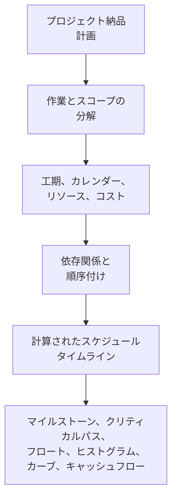

プロジェクトスケジュールは、単なる日付の一覧ではありません。それはプロジェクト納品計画のグラフィカルかつ論理的な表現です。プロジェクトが開始から完了までどのように実行されるか、作業パッケージがどのように連携するか、主要なマイルストーン（milestone）がいつ達成されるべきか、そしてプロジェクトチームが意思決定に使用すべき情報は何かを説明します。

簡単に言えば、スケジュールはプロジェクト計画をロードマップに変換します。プロジェクトマネージャー、プランナー、建設チーム、エンジニア、調達担当者、PMOレビュー担当者にとって、スケジュールは調整と管理のための主要なツールのひとつとなります。

スケジュールはタイムラインですが、タイムラインだけではありません。弱いスケジュールは日付を示すかもしれません。しかし強いスケジュールは、その日付が信頼できる理由を説明します。

## 納品ロードマップとしてのスケジュール

すべてのプロジェクトは意図から始まります。チームは何を納品しなければならないかを知っています：建物、設備、産業システム、シャットダウン、インフラ資産、または作業パッケージ。しかし納品には、最終目標を知るだけでは不十分です。チームは順序を理解しなければなりません。

何が最初に来るか？何が並行して行えるか？設計承認、資材納品、アクセス、許可リリース、テスト、または引渡しを待つ必要があるものは何か？どの作業が完了日を決定するか？クライアントにとって最も重要なマイルストーンはどれか？

スケジュールは、計画を作業、工期、依存関係、カレンダー、リソース、コスト、マイルストーンに変換することで、これらの問いに答えます。

グラフィカルなタイムラインは、人々が作業を視覚的に把握できるため有用です。ロジックネットワークは、ソフトウェアが作業を計算できるため有用です。両者が組み合わさることで、スケジュールはコミュニケーションツールと管理ツールの両方となります。

## スケジュールへのインプット

スケジュールは、その構築に使用された情報と同等の信頼性しか持ちません。Primavera P6では、スケジュールはいくつかの主要なインプットによって構成されます。

最初のインプットは作業リストです。作業はプロジェクトを管理可能な作業単位に分解します。各作業は、計画、状況確認、測定ができるほど明確である必要があります。

2番目のインプットは決定論的な工期です。これは各作業を完了するために必要な計画作業時間です。工期は、実行方法、生産性の前提、人員配置、アクセス、作業面の制約、プロジェクト条件を反映する必要があります。

3番目のインプットは依存関係ロジックです。依存関係は作業間の関係を説明します。ある作業が他の作業が開始する前に完了する必要があるかもしれません。2つの作業が同時に開始されるかもしれません。2つの完了を揃える必要があるかもしれません。これらの関係がCPMネットワークを作り出します。

4番目のインプットは順序付けです。順序付けは実行の実際の順序です。施工性、エンジニアリングフロー、調達タイミング、アクセス、試運転ロジック、引渡し戦略、クライアントの優先事項を考慮します。

5番目のインプットはリソースとコストです。リソースの割り当てにより、スケジュールは時間の経過とともに労務、機器、資材の需要を示すことができます。コストの割り当てにより、スケジュールはキャッシュフロー、アーンドバリュー、財務予測をサポートできます。

これらのインプットが完全かつ現実的であれば、スケジュールは有用なアウトプットを生み出すことができます。

## スケジュールが示すもの

適切に構築されたスケジュールは、プロジェクトの総所要期間を示します。計画された完了マイルストーンと中間成果物を示します。労務や機器の需要がいつ増減するかを示すリソースヒストグラムを生成します。進捗カーブ、キャッシュフローカーブ、アーンドバリュー報告、ルックアヘッド計画をサポートします。

最も重要なのは、クリティカルパス（最長経路）を特定することです。これはプロジェクトの完了を左右する作業の連鎖です。その経路上の作業が遅れると、プロジェクト完了日も遅れる可能性があります。だからこそロジックが非常に重要です。適切な依存関係がなければ、クリティカルパスはプロジェクトの本当のドライバーを示さないかもしれません。

フロート（float）もまた重要なアウトプットです。フロートは、ある作業が別の作業やプロジェクトの完了に影響を与える前に、どれだけの柔軟性があるかを示します。しかし、フロートはスケジュールネットワークが完全な場合にのみ意味を持ちます。作業のロジックが欠如していると、フロートは実態よりも良く見えたり悪く見えたりすることがあります。

## ロジックがタイムラインを信頼できるものにする理由

ここで「データ日付（Data Date）にドライビングロジックなしで開始する作業」というメトリクスが重要になります。

P6のデータ日付は、実績とプレビジョンの境界です。データ日付より前のすべては、すでに起きたことを表す必要があります。データ日付より後のすべては、今後の計画を表す必要があります。

作業がデータ日付にドライビングロジックなしで正確に開始する場合、スケジュールは警告信号を発しています。作業がすぐに開始できるように見えるかもしれませんが、スケジュールはその理由を説明できないかもしれません。エリアが利用可能であることを示す先行作業がない、資材納品へのリンクがない、設計承認への紐付けがない、検査リリースへの接続がない、前工程の作業からのロジックがない、という状況かもしれません。

スケジュールは単に作業を日付に配置すべきではないため、これは重要です。その日付への経路を説明すべきなのです。

必要な先行作業がすべて完了し、ロジックが開始を支持するためにデータ日付に作業が開始する場合、その日付は防御可能です。作業がオープン、ドライブされていない、制約付き、または適切に更新されていないために開始する場合、その日付は弱いです。プロジェクトチームは作業の準備が整っていると信じるかもしれませんが、実際の条件がモデル化されていない場合があります。

## 実践的な例

データ日付が6月1日のプロジェクトスケジュールを想像してください。更新後、いくつかの作業が6月1日に開始します：

- エリアBにケーブルトレイを設置する。
- パイプの圧力試験を開始する。
- 機器のアライメントを開始する。
- 断熱クルーを動員する。

一見すると、ルックアヘッドは忙しく、準備が整っているように見えます。しかしスケジューラーがロジックを見直すと、問題が明らかになります。ケーブルトレイの設置は資材納品に紐付けられていません。圧力試験は配管完了に紐付けられていません。機器のアライメントには機械的完了の先行作業が欠落しています。断熱クルーの動員にはアクセスリリースの先行作業がありません。

スケジュールはデータ日付に作業を示していますが、なぜ作業が開始できるかを説明していません。それは信頼できるロードマップではありません。近い将来の意図のリストです。

修正方法は、実際のCPMロジックを追加または修正することです。資材納品がケーブルトレイ設置を左右するなら、それを接続します。配管完了が圧力試験を左右するなら、それを接続します。アクセスリリースが断熱を左右するなら、その条件をモデル化します。再計算後、一部の作業はデータ日付近くで開始するかもしれませんが、スケジュールはその理由を説明できるようになります。

## 良いスケジュールがすべきこと

良いスケジュールは、チームが計画を見て、テストし、管理するのを助けるべきです。

何をする必要があるかを示すべきです。作業の順序を説明すべきです。誰がいつ行動する必要があるかを特定すべきです。クリティカルパスを明らかにすべきです。リソース計画、進捗測定、キャッシュフロー予測、PMO報告をサポートすべきです。

また、弱点を可視化すべきです。ロジックの欠如、ハード制約、古い日付、オープンスタート、オープンフィニッシュ、データ日付に集中する作業は、単なる技術的な問題ではありません。それらは、プロジェクトチームが準備状況、リスク、管理をどのように理解するかに影響します。

## 結論

スケジュールは、時間、ロジック、測定可能な作業として表現されたプロジェクト納品計画です。ロードマップであり、計算モデルであり、コミュニケーションツールです。

適切に構築されると、プロジェクトチームに何が必要か、いつ必要か、なぜ日付が信頼できるかを伝えます。作業がドライビングロジックなしにデータ日付に開始すると、その信頼性は損なわれます。スケジュールは計画を説明することをやめ、次のステップを推測し始めます。

そのため、スケジュール品質レビューは常にシンプルな問いを立てるべきです：スケジュールは、なぜ作業が開始するときに開始するかを説明しているか？答えがイエスであれば、スケジュールはその役割を果たしています。答えがノーであれば、ロードマップは信頼される前にさらなるロジックが必要です。
