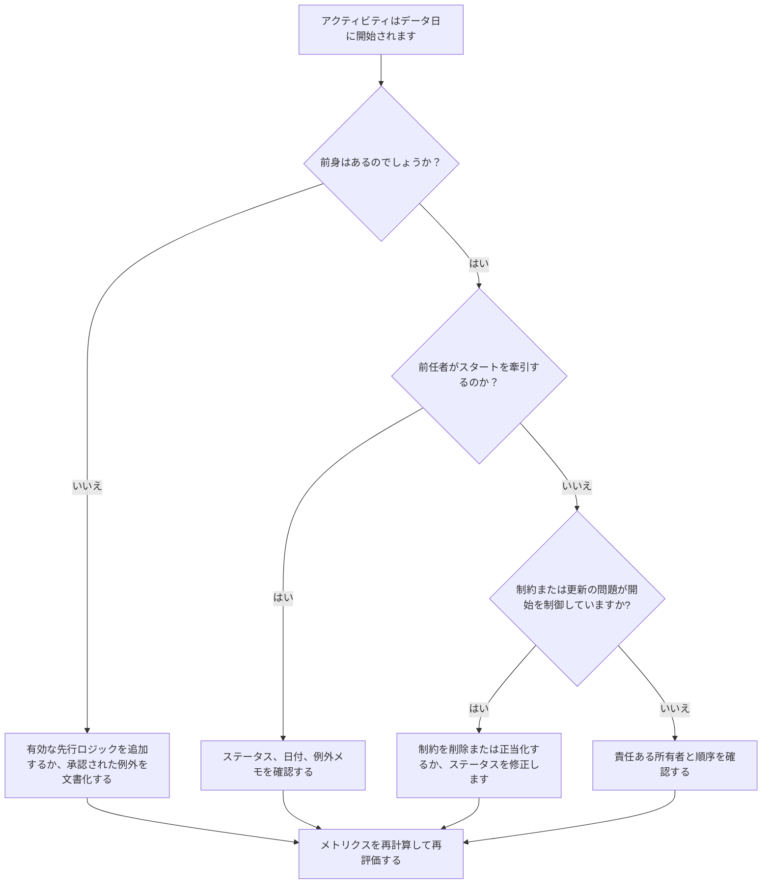

# 駆動ロジックなしでデータ日付に開始されるアクティビティ - 改善ガイド

## 目的

このガイドは、スケジューラおよびプロジェクト管理チームが、開始を促す有効な先行ロジックなしで、Primavera P6 データ日に開始するようにスケジュールされたアクティビティを削減または排除するのに役立ちます。これは、品質レビュー、PMO ヘルス チェック、更新サイクルの検証のスケジュールに適用されます。

目的は、短期的な作業が明確な CPM ロジックによってサポートされていること、および関係の欠落、制約、手動の日付、または進捗状況の更新が不完全であることだけが原因でアクティビティがデータ日付に開始されていないことを確認することです。

## 始める前に

アクションを実行する前に、次の情報を収集してください。

- このメトリクスの現在の評価結果。
- プロジェクト データ 最新のスケジュール計算に使用される日付。
- 開始日がデータ日付と等しい、開いているアクティビティまたは開始されていないアクティビティのリスト。
- 各アクティビティの先行および後続関係の詳細。
- 制約、予想される日付、実際の日付、およびカレンダーの割り当て。
- 更新に使用される P6 スケジュール オプション (関連する場合、保持されるロジックや進行状況の上書き設定など)。
- プロジェクトの開始アクティビティ、外部インターフェイスのマイルストーン、所有者主導の開始など、承認された例外。

## 結果を理解する

強力な結果は、先行ロジックを駆動することなく、データ日付から開始される未解決のアクティビティがゼロになることです。これは、現在および短期的な作業がスケジュール ネットワークに接続されており、データ日付が欠落した順序を隠していないことを意味します。

許容可能な結果には、文書化された少数の例外が含まれる場合があります。これらは無視するのではなく、検討して承認する必要があります。たとえば、続行通知マイルストーンや外部から承認されたアクティビティには通常の先行タスクが必要ない場合がありますが、その理由がレビュー担当者に見える必要があります。

弱い結果は、複数のアクティビティが明確な論理的要因なしにデータ日付に開始されていることを意味します。これは、未処理の開始、先行関係の欠落、過剰な制約、不完全な進行状況の更新、または最新の更新後に適切に再順序付けされなかったアクティビティを示している可能性があります。

## 改善目標

目標は、有効な駆動ロジックのない、データ日から始まる未解決のアクティビティが 0 件であることです。

改善の目標は、カウントを減らすことだけではありません。より深い目標は、データ日付付近の各アクティビティに予測開始の正当な理由があることを確認することです。修正後、影響を受ける各アクティビティには、適切な先行ロジック、文書化された例外、または修正されたステータス/日付条件のいずれかが含まれている必要があります。

## 行動計画

### ステップ 1: 主要な問題を特定する

データ日付と等しい開始日を持つ、オープンなアクティビティまたは開始されていないアクティビティをフィルタリングする P6 レイアウトまたはレポートを作成します。アクティビティ ID、アクティビティ名、WBS、開始、終了、ステータス、合計フロート、カレンダー、主制約、先行者、後続者、および駆動関係インジケーター (可能な場合) の列を含めます。

それぞれのアクティビティを確認し、次のことを尋ねます。

- このアクティビティには前身のものはありますか?
- 前任者が存在する場合、彼らは実際にスタートを切っているのでしょうか?
- アクティビティは制約によって保持または移動されていますか?
- アクティビティに実際の開始または進行状況の更新がありませんか?
- アクティビティはプロジェクト開始マイルストーンなどの有効な例外ですか?
- そのアクティビティは、一般にロジックが弱い WBS 領域に属していますか?

検出結果を実際の原因 (欠落している先行タスク、非駆動先行タスク、制約または予想される日付、更新/ステータス エラー、または承認された例外) にグループ化します。

### ステップ 2: 推奨される修正を適用する

不足しているロジックまたは弱いロジックから始めます。必要に応じて、終了から開始、開始から開始、または終了から終了の関係など、実際の作業順序を表す有効な先行関係を追加します。メトリクスを満たすためだけに関係を追加することは避けてください。それぞれの関係は、実際の建設、エンジニアリング、調達、アクセス、承認、または引き継ぎの依存関係を反映する必要があります。

次に制約を確認します。開始制約によりアクティビティがデータ日付に開始される場合は、その制約が契約上または運用上正当であるかどうかを確認してください。不要な制約を削除し、アクティビティをロジックによって駆動できるようにします。制約が有効な場合は、その理由を文書化し、それがクリティカル パスを歪めないことを確認します。

進捗状況を確認します。作業がすでに開始されている場合は、実際の開始期間と残りの期間を正しく更新します。作業が開始されていない場合は、予測の開始日がデータ日付のままであることを確認します。更新サイクルによってアクティビティが現在の日付になったからといって、アクティビティを開始する準備ができているように見える必要はありません。

変更を加えた後、スケジュールを再計算し、影響を受けるアクティビティを再度確認します。開始日がロジックによって決定され、正しくステータスが設定されているか、承認された例外として文書化されていることを確認します。

### ステップ 3: 一般的なブロッカーを削除する

一般的な阻害要因としては、不明確な現場フィードバック、インターフェース情報の不足、短期的な作業が準備できているように見せなければならないというプレッシャーなどが挙げられます。これらを解決するには、規律責任者、建設マネージャー、調達所有者、またはパッケージ マネージャーとともに影響を受けるアクティビティを確認します。

もう 1 つの一般的な障害は、ロジックの代わりに制約を誤用することです。場合によっては制約が必要になる場合がありますが、制約によってスケジュール ネットワークが置き換えられるべきではありません。制約が保持される場合は、その制約が存在する理由と、それが浮動小数点数と最長パスにどのように影響するかを文書化します。

また、問題の原因がスケジュール計算設定または更新方法にあるのかどうかも確認してください。進行状況の上書き、保持されたロジック、順序外の進行状況、または不完全な実現化が結果に影響を与えている場合は、メトリクスを再評価する前に、更新メソッドをプロジェクト制御手順に合わせて調整します。

### ステップ 4: 変更を検証する

次の評価の前に、修正されたスケジュールを検証します。駆動ロジックを使用せずに、データ日付から始まるオープンまたは未開始のアクティビティに対してフィルターを再実行します。残りの各項目が修正されているか、承認された例外として文書化されていることを確認します。

再計算後に、合計フロート、最長パス、および短期先読みアクティビティを確認します。ロジックを修正すると、クリティカル パスが変更されたり、追加のシーケンス問題が明らかになったりする場合があります。スケジュールの変更が大きい場合は、その影響をプロジェクト管理責任者または PMO レビュー担当者に伝えます。

## 改善スケジュール

### 1 日目: 確認と診断

メトリックを実行し、データ日付を確認し、アクティビティ リストを作成します。結果を欠落ロジック、非駆動ロジック、制約、ステータス エラー、および潜在的な例外に分類します。

### 2 ～ 3 日目: 優先アクションの実施

最も影響の大きいアクティビティ、特にクリティカルまたはクリティカルに近いアクティビティを最初に修正します。有効な先行ロジックを追加し、不要な制約を削除し、誤ったステータスを更新し、例外を文書化します。

### 4 ～ 5 日目: 初期の結果を監視する

スケジュールを再計算し、影響を受けるアクティビティがロジック駆動になっているかどうかを確認します。総フロート、最長パス、マイルストーンの日付に予期しない変更がないか確認します。

### 6日目: 最終調整

残りの障害物は、責任ある規律またはパッケージ所有者と協力して解決してください。保持されている例外が正当化され、明確に文書化されていることを確認します。

### 7 日目: 再評価と比較

評価を再度実行し、新しい結果を以前の結果およびターゲットしきい値と比較します。メトリクスが現在未解決のアクティビティがゼロになっているかどうか、またはさらなるアクションが必要かどうかを確認します。

## 進捗状況の追跡

シンプルなトラッカーを使用して修正と承認を管理します。

| 日付 | 講じられたアクション | 予想される影響 | 結果・観察 | 次のステップ |
| --- | --- | --- | --- | --- |
| [日付] | 推進ロジックなしでデータ日から始まるアクティビティをレビューしました | 不足しているロジックまたは弱いロジックを特定する | 【観察結果】 | 修正を責任ある所有者に割り当てる |
| [日付] | 有効な先行関係を追加しました | CPM シーケンスの改善 | 【観察結果】 | フロートの影響を再計算して確認する |
| [日付] | 削除された制約または正当化された制約 | 人為的なスタートを減らす | 【観察結果】 | 残りの例外を確認する |
| [日付] | 誤ったアクティビティステータスを更新しました | 更新精度の向上 | 【観察結果】 | 評価を再実行する |

## 結果が改善しない場合

結果が改善しない場合は、同じアクティビティがまだ失敗しているかどうか、またはデータ日付に新しいアクティビティが表示されているかどうかを確認します。失敗が繰り返される場合は、WBS 領域の不完全なロジック、脆弱な更新規律、一貫性のない制約の使用など、より広範なスケジュール開発の問題を示している可能性があります。

解決しない問題は、プロジェクト管理リーダー、計画マネージャー、または PMO レビュー担当者にエスカレーションしてください。主要なスケジュールについては、影響を受ける作業パッケージに焦点を当てたロジック レビュー ワークショップを検討してください。スケジュールが契約上のレポート、遅延分析、または収益額の予測に使用される場合、未解決の項目は品質上の懸念事項として扱われる必要があります。

## メンテナンス

スケジュールを発行する前に、更新サイクルごとにこのメトリックを確認してください。チェックは、特に進行状況の更新、順序変更、スコープの大幅な変更、または復旧計画の後に、標準的なスケジュールの健全性レビューの一部として行う必要があります。

適切なメンテナンス習慣には、P6 レイアウトで先行列と後続列を表示し続けること、各送信前にオープン スタートを確認すること、承認された例外を文書化すること、データ日付の移動により駆動されていないアクティビティの新しいグループが作成されないことを確認することが含まれます。

## 概要チェックリスト

- [ ] 現在の結果をレビューしました
- [ ] 目標閾値を確認しました
- [ ] データ日付が確認されました
- [ ] 特定されたデータ日に開始されるアクティビティ
- [ ] 特定された主な問題
- [ ] 欠落または弱いロジックを修正しました
- [ ] 制約が検討され、正当化または削除されました
- [ ] ステータスの日付を確認しました
- [ ] 承認された例外を文書化
- [ ] スケジュールが再計算されました
- [ ] 結果の監視
- [ ] 評価の繰り返し
- [ ] 次のステップの文書化
## 関連コンテンツ
- [駆動ロジックなしでデータ日付に開始されるアクティビティ: このスケジュール指標が重要な理由 - 概要](01_overview_template.md)
- [ブログテンプレート](03_blog_template.md)
- [スケジュールとは](../../12b_blogs_jp/01_WHAT%20A%20SCHEDULE%20IS/01_blog.md)
- [堅牢なロジック](../../12b_blogs_jp/02_ROBUST%20LOGIC/02_ROBUST%20LOGIC.md)
