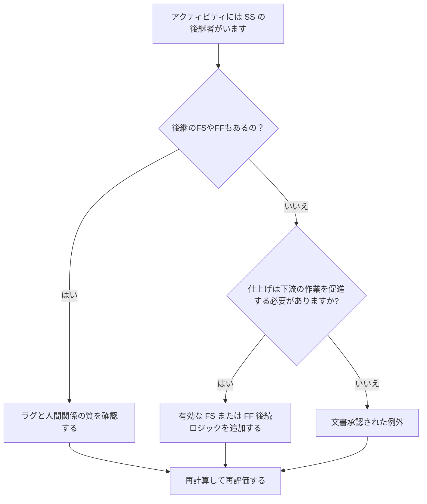

# SS 後継者がいる場合と FS または FF 後継者がいない場合の活動 - 改善ガイド

## 目的

このガイドは、スケジューラーが、開始から開始までの後継アクティビティはあるが、終了から開始または終了から終了までの後継アクティビティがないアクティビティを確認して修正するのに役立ちます。アクティビティの開始だけでなく終了も下流のスケジュール ネットワークに接続されていることを確認することで、より強力な CPM ロジックをサポートします。

## 始める前に

アクションを実行する前に、次の情報を収集してください。

- このメトリクスの現在の評価結果。
- SS 後継者があり、FS または FF 後継者が存在しないアクティビティのリスト。
- 各アクティビティの後続関係の詳細。
- アクティビティの種類、期間、ステータス、カレンダー、合計フロート、および WBS。
- アクティビティまたは後続アクティビティに影響を与える遅延、制約、または予定日。
- 関連する建設、エンジニアリング、調達、または引き渡しシーケンス情報。

## 結果を理解する

この条件では、未解決のアクティビティがゼロになるという強力な結果が得られます。これは、下流の作業を開始するアクティビティにも、作業の完了が重要となる終了ベースのロジックがあることを意味します。

許容可能な結果には、努力レベルのアクティビティ、管理アクティビティ、または終了ロジックが必要ない意図的に重複した作業など、文書化された例外が含まれる場合があります。これらは有効であると仮定するのではなく、検討する必要があります。

弱い結果は、いくつかのアクティビティが後続アクティビティを開始できるが、後続アクティビティの終了または開始から自身の完了までを制御しないことを意味します。これにより、未完了の作業がスケジュールに影響を与えなくなる可能性があります。

## 改善目標

目標は、SS サクセサを持つ未解決アクティビティが 0 で、FS または FF サクセサが存在しないことです。

目標は、各アクティビティに、完了が下流の作業に影響を与える現実的な完了主導の後続機能があること、または完了ロジックの欠如が正当化され文書化されていることを確認することです。

## 行動計画

### ステップ 1: 主要な問題を特定する

少なくとも 1 つの SS サクセサーがあり、FS または FF サクセサーが存在しないアクティビティをリストする P6 レイアウトまたはエクスポートを作成します。アクティビティ ID、アクティビティ名、WBS、元の期間、残りの期間、合計フロート、後続者、関係タイプ、ラグ、制約、アクティビティ ステータスが含まれます。

それぞれのアクティビティを確認し、次のことを尋ねます。

- この活動が始まることでどんな仕事が始まるのか？
- このアクティビティの終了に依存する作業、マイルストーン、引き渡し、または検査は何ですか?
- FS または FF の後継機はありませんか?
- SS 関係は、重複する作業を正しくモデル化するために使用されていますか?
- アクティビティは、努力レベルやサポート アクティビティなどの有効な例外ですか?

### ステップ 2: 推奨される修正を適用する

アクティビティの完了によって後の作業を制御する必要がある、終了ベースのロジックを追加します。アクティビティが終了するまで後続プログラムを開始できない場合は、FS を使用します。後続がオーバーラップできるが、先行が終了するまで終了できない場合は、FF を使用します。

ラグありのSS関係を見直します。フィニッシュ依存性を近似するためにラグが使用されている場合は、より明確な FS または FF 関係で置き換えるか補足します。メトリックを満たすためだけにロジックを追加することは避けてください。それぞれの関係は実際の作業順序を反映する必要があります。

アクティビティが有効な例外である場合は、ノートブックのトピック、UDF、コメント フィールド、またはスケジュール品質トラッカーに理由を文書化します。

### ステップ 3: 一般的なブロッカーを削除する

一般的な阻害要因には、古いスケジュールからコピーされたロジック、過剰な SS 関係、不明瞭な引き継ぎポイント、現場または分野のリーダーからの入力の欠如などが含まれます。これらを解決するには、責任ある所有者と一緒に実際の作業手順を確認します。

もう 1 つの障害は、重複する作業には常に SS ロジックのみが必要であるという考えです。オーバーラップは有効かもしれませんが、多くの場合、前任者の仕上げが後続の仕上げ、検査、売上高、または後続のアクティビティを制御する必要があります。

### ステップ 4: 変更を検証する

修正後にスケジュールを再計算します。メトリクスを再実行し、残りの各アクティビティが修正されるか、承認された例外として文書化されていることを確認します。

総フロート、クリティカル パス、最長パス、および短期的なマイルストーンへの影響を確認します。終了ロジックを追加するとキー日付が変更される場合は、その結果をプロジェクト管理リーダーまたは PMO レビュー担当者に伝えます。

## 改善スケジュール

### 1 日目: 確認と診断

メトリクスを実行し、影響を受けるアクティビティのリストを確認し、アクティビティを終了ロジックの欠落、弱い SS ロジック、ラグの問題、および考えられる例外に分類します。

### 2 ～ 3 日目: 優先アクションの実施

重要なアクティビティおよびほぼ重要なアクティビティを最初に修正します。有効な FS または FF サクセサを追加し、不適切な SS ロジックを調整し、正当な例外を文書化します。

### 4 ～ 5 日目: 初期の結果を監視する

スケジュールを再計算し、フロート、最長パス、マイルストーンの日付での動きを確認します。

### 6日目: 最終調整

残りの不確実な項目は、責任ある規律、パッケージ所有者、または構築リーダーと協力して解決してください。

### 7 日目: 再評価と比較

評価を再度実行し、結果をターゲットしきい値と比較します。

## 進捗状況の追跡

シンプルなトラッカーを使用して修正と承認を管理します。

| 日付 | 講じられたアクション | 予想される影響 | 結果・観察 | 次のステップ |
| --- | --- | --- | --- | --- |
| [日付] | SS のみの後継アクティビティの見直し | 欠落している終了ロジックを特定する | 【観察結果】 | 修正の割り当て |
| [日付] | FS または FF 後継ロジックを追加 | CPMの継続性を改善する | 【観察結果】 | スケジュールを再計算する |
| [日付] | 文書化された有効な例外 | レビューのトレーサビリティを向上させる | 【観察結果】 | 指標を再評価する |

## 結果が改善しない場合

結果が改善しない場合は、フィルターが有効な例外、重複ロジック、またはネットワーク開発が弱い特定の WBS 領域のアクティビティを識別しているかどうかを確認してください。問題が繰り返される場合は、チームが計画中に SS 関係に過度に依存していることを示している可能性があります。

未解決の項目が重要な作業、ほぼ重要な作業、契約上の作業、または引き継ぎ関連の作業に影響を与える場合は、計画リーダーまたは PMO レビュー担当者にエスカレーションします。

## メンテナンス

このメトリクスは、各スケジュールの更新中およびベースラインの承認前に確認してください。再順序付け、復旧計画、コピーされたスケジュールの作成、または大幅な範囲の変更の後は、特に注意してください。

## 概要チェックリスト

- [ ] 現在の結果をレビューしました
- [ ] 目標閾値を確認しました
- [ ] 特定された主な問題
- [ ] SS後継機種のレビュー
- [ ] 欠落している FS または FF ロジックを修正
- [ ] ラグと制約のチェック
- [ ] 有効な例外が文書化されている
- [ ] スケジュールが再計算されました
- [ ] 結果の監視
- [ ] 評価の繰り返し
- [ ] 次のステップの文書化
## 関連コンテンツ
- [SS 後継者がいる場合と FS または FF 後継者がいない場合の活動 - 概要](01_overview_template.md)
- [ブログテンプレート](03_blog_template.md)
- [スケジュールとは](../../12b_blogs_jp/01_WHAT%20A%20SCHEDULE%20IS/01_blog.md)
- [堅牢なロジック](../../12b_blogs_jp/02_ROBUST%20LOGIC/02_ROBUST%20LOGIC.md)
