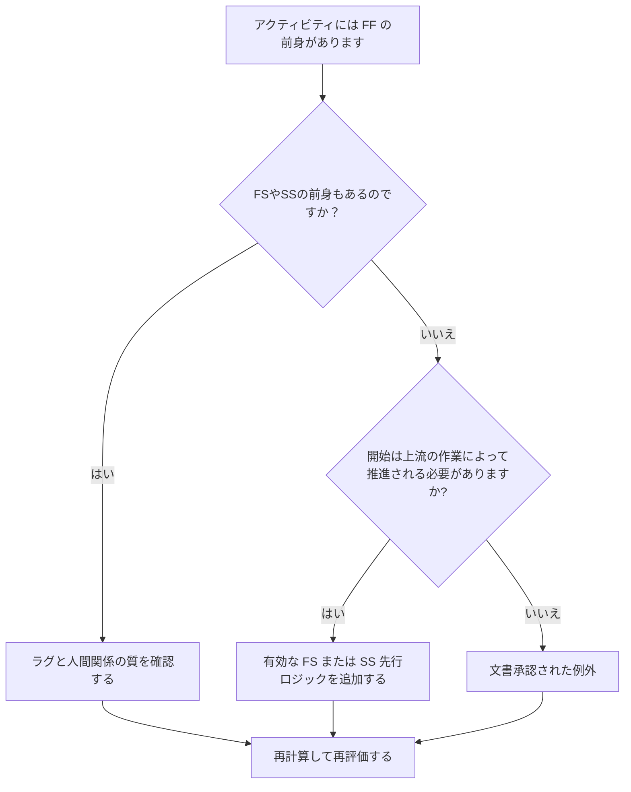

# FF 先行者が存在し、FS または SS 先行者が存在しないアクティビティ - 改善ガイド

## 目的

このガイドは、スケジューラが、「終了から終了」の先行要素はあるが、「終了から開始」または「開始から開始」の先行要素がないアクティビティを確認して修正するのに役立ちます。アクティビティの終了だけでなく開始が上流のスケジュール ネットワークに接続されていることを確認することで、より強力な CPM ロジックをサポートします。

## 始める前に

アクションを実行する前に、次の情報を収集してください。

- このメトリクスの現在の評価結果。
- FF 先行操作があり、FS または SS 先行操作が存在しないアクティビティのリスト。
- 各アクティビティの先行関係の詳細。
- アクティビティの種類、期間、ステータス、カレンダー、合計フロート、および WBS。
- アクティビティまたはその先行アクティビティに影響を与える遅延、制約、または予想される日付。
- 関連する建設、エンジニアリング、調達、アクセス、承認、または引き渡しシーケンス情報。

## 結果を理解する

この条件では、未解決のアクティビティがゼロになるという強力な結果が得られます。これは、終了が以前の作業に関連付けられているアクティビティにも、必要に応じて有効な開始駆動ロジックがあることを意味します。

許容可能な結果には、努力レベルのアクティビティ、管理アクティビティ、または開始ロジックが不要な意図的にモデル化された並列作業など、文書化された例外が含まれる場合があります。これらは有効であると仮定するのではなく、検討する必要があります。

弱い結果は、先行アクティビティに関連していくつかのアクティビティが終了する可能性があるが、その開始が上流の作業によって制御されないことを意味します。これにより、実際のシーケンスがサポートするよりも早くアクティビティを開始できる可能性があります。

## 改善目標

目標は、FF 先行操作があり、FS または SS 先行操作がない未解決のアクティビティが 0 であることです。

目標は、各アクティビティに、開始が上流の作業に依存する現実的な開始駆動先行要素があること、または開始ロジックの欠如が正当化され文書化されていることを確認することです。

## 行動計画

### ステップ 1: 主要な問題を特定する

少なくとも 1 つの FF 先行要素を持ち、FS または SS 先行要素を持たないアクティビティをリストする P6 レイアウトまたはエクスポートを作成します。アクティビティ ID、アクティビティ名、WBS、元の期間、残りの期間、合計フロート、先行者、関係タイプ、ラグ、制約、アクティビティ ステータスが含まれます。

それぞれのアクティビティを確認し、次のことを尋ねます。

- このアクティビティを開始する前に何が必要ですか?
- 先代のFFはフィニッシュアライメントのみを制御しているのでしょうか？
- FS または SS の前任者が欠落していますか?
- FF 関係は、重複する作業を正しくモデル化するために使用されていますか?
- アクティビティは、努力レベルやサポート アクティビティなどの有効な例外ですか?

### ステップ 2: 推奨される修正を適用する

アクティビティの開始が以前の作業に依存する必要がある場合、開始駆動ロジックを追加します。先行アクティビティが終了するまでアクティビティを開始できない場合は、FS を使用します。先行アクティビティが開始された後、または定義された進行ポイントに到達した後にアクティビティを開始できる場合は、SS を使用します。

ラグありのFF関係を見直します。開始依存関係を概算するためにラグが使用されている場合は、より明確な FS または SS ロジックで置き換えるか補足します。メトリクスを満たすためだけに関係を追加することは避けてください。それぞれの関係は実際の作業順序を反映する必要があります。

アクティビティが有効な例外である場合は、ノートブックのトピック、UDF、コメント フィールド、またはスケジュール品質トラッカーに理由を文書化します。

### ステップ 3: 一般的なブロッカーを削除する

一般的な阻害要因としては、古いスケジュールからのコピーされたロジック、FF 関係の過剰使用、不明確なアクセス ポイントまたはリリース ポイント、現場または専門分野のリーダーからの入力の欠如などが挙げられます。これらを解決するには、責任のある所有者と一緒に実際の開始条件を確認してください。

もう 1 つの障害は、2 つのアクティビティを同時に終了する必要がある場合には FF ロジックで十分であるという考えです。終了位置合わせは有効である可能性がありますが、多くの場合、後続アクティビティには明確な開始条件が必要です。

### ステップ 4: 変更を検証する

修正後にスケジュールを再計算します。メトリクスを再実行し、残りの各アクティビティが修正されるか、承認された例外として文書化されていることを確認します。

初期の日付、合計フロート、クリティカル パス、最長パス、および短期的なマイルストーンへの影響を確認します。開始ロジックを追加してキー日付が変更された場合は、その結果をプロジェクト管理リーダーまたは PMO レビュー担当者に伝えます。

## 改善スケジュール

### 1 日目: 確認と診断

メトリクスを実行し、影響を受けるアクティビティのリストを確認し、アクティビティを欠落している開始ロジック、弱い FF ロジック、ラグの問題、および考えられる例外に分類します。

### 2 ～ 3 日目: 優先アクションの実施

重要なアクティビティおよびほぼ重要なアクティビティを最初に修正します。有効な FS または SS 先行処理を追加し、不適切な FF ロジックを調整し、正当な例外を文書化します。

### 4 ～ 5 日目: 初期の結果を監視する

スケジュールを再計算し、初期の日付、フロート、最長パス、およびマイルストーンの日付での動きを確認します。

### 6日目: 最終調整

残りの不確実な項目は、責任ある規律、パッケージ所有者、または構築リーダーと協力して解決してください。

### 7 日目: 再評価と比較

評価を再度実行し、結果をターゲットしきい値と比較します。

## 進捗状況の追跡

シンプルなトラッカーを使用して修正と承認を管理します。

| 日付 | 講じられたアクション | 予想される影響 | 結果・観察 | 次のステップ |
| --- | --- | --- | --- | --- |
| [日付] | FFのみの先行アクティビティの見直し | 欠落している開始ロジックを特定する | 【観察結果】 | 修正の割り当て |
| [日付] | FS または SS 先行ロジックを追加しました | CPMの継続性を改善する | 【観察結果】 | スケジュールを再計算する |
| [日付] | 文書化された有効な例外 | レビューのトレーサビリティを向上させる | 【観察結果】 | 指標を再評価する |

## 結果が改善しない場合

結果が改善しない場合は、フィルターが有効な例外、重複ロジック、またはネットワーク開発が弱い特定の WBS 領域のアクティビティを識別しているかどうかを確認してください。問題が繰り返される場合は、チームが計画中に FF 関係に過度に依存していることを示している可能性があります。

未解決の項目がクリティカル、クリティカルに近い、契約上の、アクセス関連、または引き継ぎ関連の作業に影響を与える場合は、計画リーダーまたは PMO レビュー担当者にエスカレーションします。

## メンテナンス

このメトリクスは、各スケジュールの更新中およびベースラインの承認前に確認してください。再順序付け、復旧計画、コピーされたスケジュールの作成、または大幅な範囲の変更の後は、特に注意してください。

## 概要チェックリスト

- [ ] 現在の結果をレビューしました
- [ ] 目標閾値を確認しました
- [ ] 特定された主な問題
- [ ] FFの前作をレビュー
- [ ] 欠落していた FS または SS ロジックを修正
- [ ] ラグと制約のチェック
- [ ] 有効な例外が文書化されている
- [ ] スケジュールが再計算されました
- [ ] 結果の監視
- [ ] 評価の繰り返し
- [ ] 次のステップの文書化
## 関連コンテンツ
- [FF 先行者が存在し、FS または SS 先行者が存在しないアクティビティ - 概要](01_overview_template.md)
- [ブログテンプレート](03_blog_template.md)
- [スケジュールとは](../../12b_blogs_jp/01_WHAT%20A%20SCHEDULE%20IS/01_blog.md)
- [堅牢なロジック](../../12b_blogs_jp/02_ROBUST%20LOGIC/02_ROBUST%20LOGIC.md)
