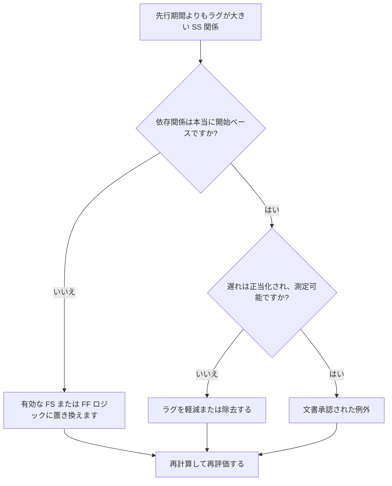

# 先行期間よりもラグが大きい SS 関係 - 改善ガイド

## 目的

このガイドは、スケジューラが先行アクティビティの期間よりも遅れが大きい場合に、開始と開始の関係を確認して修正するのに役立ちます。過剰な SS ラグを実際の作業シーケンスをより適切に表現する関係ロジックに置き換えることにより、より明確な CPM ロジックをサポートします。

## 始める前に

アクションを実行する前に、次の情報を収集してください。

- このメトリクスの現在の評価結果。
- 遅延が先行期間より大きい SS 関係のリスト。
- 先行アクティビティと後続アクティビティの ID、名前、WBS、期間、カレンダー、ステータス。
- 関係ラグ、関係タイプ、および関連する制約。
- スケジュール計算の設定とラグに使用されるカレンダーベース。
- 意図された依存関係を説明するフィールド、エンジニアリング、調達、または引き継ぎロジック。

## 結果を理解する

強力な結果は、ラグが先行者の期間を超える未解決の SS 関係がゼロになることです。

許容可能な結果には文書化された例外が含まれる場合がありますが、これはまれです。 SS ラグが長い場合、多くの場合、関係タイプがモデル化されている依存関係と一致しないことを示します。

結果が弱い場合は、スケジュールに複数の開始間リンクが含まれており、後続プログラムが先行プログラムの期間よりも長い遅延の後にのみ開始されることを意味します。これにより、SS 関係の背後に終了主導のロジックが隠れる可能性があります。

## 改善目標

ターゲットは、先行期間よりも大きなラグを持つ未解決の SS 関係が 0 つであることです。

目標は、各関係が SS のままであるべきか、FS または FF ロジックに変換されるべきか、ラグが削減されるべきか、または有効な例外として文書化されるべきかを確認することです。

## 行動計画

### ステップ 1: 主要な問題を特定する

P6 レイアウトを作成するか、遅延が先行期間よりも大きい SS 関係をリストするエクスポートを作成します。先行アクティビティ ID と後続アクティビティ ID、アクティビティ名、WBS、元の期間、残りの期間、関係タイプ、ラグ、カレンダー、合計フロート、アクティビティ ステータスを含めます。

それぞれの関係を確認し、次のように尋ねます。

- なぜこれほど遅れて後継機がスタートするのでしょうか？
- 後続は実際に、前任者の開始に依存しますか、それとも前任者の終了に依存しますか?
- ラグは、前の元の期間、残りの期間、またはその両方よりも大きいですか?
- ラグは、調達、キュアリング、レビュー時間、アクセス、またはその他の実際の待ち時間をモデル化するために使用されていますか?
- FS または FF 関係を使用すると、依存関係がより明確になりますか?

### ステップ 2: 推奨される修正を適用する

先行ノードの終了後に後続ノードを開始する必要がある場合は、SS 関係を FS 関係に置き換えます。作業が重複する可能性があるが、先行作業が終了するまで後続作業が終了できない場合は、FF ロジックを使用します。

関係が本当に開始ベースである場合は、ラグ値を確認してください。大まかなプレースホルダーとして使用されたり、コピーされたロジックから継承された場合の過度のラグを軽減します。遅れが実際の待機期間を表している場合は、単位、カレンダー、説明が正しいことを確認してください。

スケジュールに表示されるべきアクティビティの代わりに長いラグを使用することは避けてください。ラグがレビュー、修正、提供、動員、または承認にかかる時間を表す場合は、それらの作業を別のアクティビティとしてモデル化することを検討してください。

### ステップ 3: 一般的なブロッカーを削除する

一般的な阻害要因としては、以前のスケジュールからコピーされたロジック、隠れた待機期間、カレンダーの混乱、ネットワークをシンプルに保つという圧力などが挙げられます。これらを解決するには、意図された依存関係を責任のある所有者に確認してください。

もう 1 つの阻害要因は、ラグを無害なものとして扱うことです。遅延が長いとレビューが難しくなり、リスクが隠れてしまう可能性があり、待機期間がアクティビティとして認識されないため、遅延分析が困難になる可能性があります。

### ステップ 4: 変更を検証する

修正後にスケジュールを再計算します。メトリクスを再実行し、残りの各項目が修正されているか、承認された例外として文書化されていることを確認します。

合計フロート、最長パス、クリティカル パス、および短期的なマイルストーンを確認します。関係の変化により主要な日付が変更された場合は、その結果をプロジェクト管理リーダーまたは PMO レビュー担当者に伝えます。

## 改善スケジュール

### 1 日目: 確認と診断

メトリクスを実行し、影響を受ける関係リストを確認し、項目を間違った関係タイプ、過剰なラグ、非表示のアクティビティ、カレンダーの問題、および考えられる例外に分類します。

### 2 ～ 3 日目: 優先アクションの実施

まず、クリティカルな関係およびクリティカルに近い関係を修正します。必要に応じて SS ロジックを FS または FF に変換し、不当なラグを削減し、有効な例外を文書化します。

### 4 ～ 5 日目: 初期の結果を監視する

スケジュールを再計算し、フロート、最長パス、マイルストーンの日付での動きを確認します。

### 6日目: 最終調整

残りの不確実な項目は、責任ある規律、パッケージ所有者、または構築リーダーと協力して解決してください。

### 7 日目: 再評価と比較

評価を再度実行し、結果をターゲットしきい値と比較します。

## 進捗状況の追跡

シンプルなトラッカーを使用して修正と承認を管理します。

| 日付 | 講じられたアクション | 予想される影響 | 結果・観察 | 次のステップ |
| --- | --- | --- | --- | --- |
| [日付] | レビューされた SS ラグが以前の期間よりも大きい | 弱いロジックまたは不明確なロジックを特定する | 【観察結果】 | 修正の割り当て |
| [日付] | FS または FF に変換された関係 | CPM ロジックの明確性の向上 | 【観察結果】 | スケジュールを再計算する |
| [日付] | 遅延の削減または文書化 | レビューのトレーサビリティを向上させる | 【観察結果】 | 指標を再評価する |

## 結果が改善しない場合

結果が改善しない場合は、特定の WBS 領域、分野、またはコピーされたスケジュール セクションで同じ関係パターンが繰り返されていないかどうかを確認してください。繰り返し発見された結果は、チームが実際の依存関係をモデル化する代わりに、SS ラグを標準的なショートカットとして使用していることを示している可能性があります。

未解決の項目がクリティカル、クリティカルに近い、契約、調達、承認、引き継ぎ関連の作業に影響を及ぼす場合は、エスカレーションします。

## メンテナンス

このメトリクスは、各スケジュールの更新中およびベースラインの承認前に確認してください。コピーしたスケジュールの作成、順序変更、復旧計画、または範囲の大幅な変更後は特に注意してください。

## 概要チェックリスト

- [ ] 現在の結果をレビューしました
- [ ] 目標閾値を確認しました
- [ ] 特定された主な問題
- [ ] SS関係の見直し
- [ ] 過剰な遅延が修正または正当化される
- [ ] 必要に応じて FS または FF の置換を適用
- [ ] 必要に応じてモデル化された隠された作品
- [ ] スケジュールが再計算されました
- [ ] 結果の監視
- [ ] 評価の繰り返し
- [ ] 次のステップの文書化
## 関連コンテンツ
- [先行期間よりもラグが大きい SS 関係 - 概要](01_overview_template.md)
- [ブログテンプレート](03_blog_template.md)
- [スケジュールとは](../../12b_blogs_jp/01_WHAT%20A%20SCHEDULE%20IS/01_blog.md)
- [堅牢なロジック](../../12b_blogs_jp/02_ROBUST%20LOGIC/02_ROBUST%20LOGIC.md)
