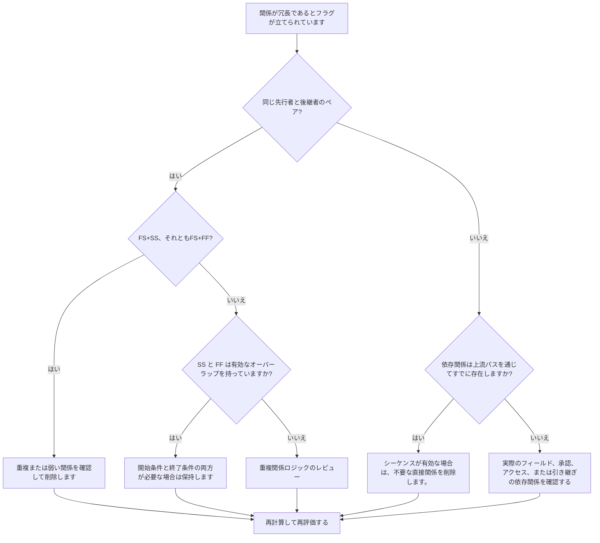

# Primavera P6 スケジュールの冗長ロジック - 改善ガイド

## 目的

このガイドは、スケジューラが Primavera P6 スケジュールから冗長なロジックを特定して削除するのに役立ちます。これは、重複関係パターン、反復される先行ロジック、および実際の作業シーケンスを表さない不要な依存関係に適用されます。

## 始める前に

アクションを実行する前に、次の情報を収集してください。

- このメトリクスの現在の評価結果。
- 冗長ロジックとしてフラグが付けられたアクティビティと関係のリスト。
- フラグが設定された各アクティビティの先行アクティビティと後続アクティビティの詳細。
- 関係タイプ、ラグ、カレンダー、合計フロート、および駆動関係インジケーター。
- WBS、活動コード、規律または作業パッケージの所有権。
- 実際の依存関係を説明するフィールド、エンジニアリング、調達、承認、または引き継ぎ情報。

## 結果を理解する

強力な結果は、未解決の冗長関係がゼロになることです。

許容可能な結果には、重複しているように見えるロジックが防御可能な理由で意図的に使用される、まれに文書化された例外が含まれる場合があります。冗長ロジックは通常、スケジュールの品質の問題となるため、これらのケースは慎重に検討する必要があります。

弱い結果は、スケジュールに繰り返しまたは不要な関係ロジックが含まれていることを意味します。これは、コピーされたスケジュール セクションがクリーンアップされない場合、既存のパスを確認せずに関係が追加される場合、または同じアクティビティ間で複数の依存関係の種類が使用される場合に発生することがあります。

## 改善目標

目標は、未解決の冗長関係が 0 であることです。

目標は、実際の依存関係を表す関係のみを保持し、実際の作業シーケンスを重複、マスク、誇張するロジックを削除することです。

## 行動計画

### ステップ 1: 主要な問題を特定する

P6 レイアウト、レポート、または外部関係レビューを作成して、冗長な可能性のあるロジックを特定します。以下のケースに焦点を当てます。

- 同じ先行者が同じ後続者に複数回接続しました (特に FS と SS または FS と FF)。
- 重複が正しくモデル化されており、開始条件と終了条件の両方が重要である場合、同じ 2 つのアクティビティ間の SS と FF が有効になる可能性があります。
- 自身の先行者と同じ先行者および関係タイプを持つアクティビティであり、チェーンを通じて繰り返し継承されたロジックを作成します。
- 同じ依存関係が複数のステップ前に現れる、より長く繰り返される先行チェーン。
- 順序、日付、フロート、ハンドオーバー、アクセス、またはリスク制御を変更しない依存関係。

フラグが立てられた関係をそれぞれ確認し、次のように尋ねます。

- この関係は実際の依存関係を追加しますか?
- 依存関係は、同じアクティビティ間の別の関係によってすでに表されていますか?
- 依存関係はすでに上流パスによって表されていますか?
- 関係を削除すると、有効なスケジュール ロジックが変更されますか、それともネットワークが簡素化されるだけですか?
- この関係が日付を決定するのには正当な理由があるのでしょうか、それとも冗長なロジックが追加されただけなのでしょうか?

### ステップ 2: 推奨される修正を適用する

完全な重複と、反復された先行者と後続者のペアから開始します。同じ 2 つのアクティビティが FS と SS、または FS と FF で接続されている場合、どちらの関係が実際の依存関係を表すかを判断します。ロジックを重複させたり弱めたりする関係を削除します。

SS と FF のペアを個別に確認します。この組み合わせは、一方の関係が重複する作業をいつ開始できるかを制御し、もう一方の関係がいつ終了できるかを制御する場合に有効になります。両方の状況が現実であり、作業手順によって文書化されている場合にのみ保管してください。

次に、継承された先行ロジックを確認します。アクティビティ C にアクティビティ B と同じ先行関係があり、アクティビティ B がすでにアクティビティ C の先行関係にある場合、以前のアクティビティからの直接の関係は不要な場合があります。既存のパスを通じて CPM シーケンスが正しいままである場合は、それを削除します。

最後に、作業順序、アクセス、承認、引き継ぎ、リスク管理、または契約上のロジックをサポートしない不要な依存関係を削除します。

### ステップ 3: 一般的なブロッカーを削除する

一般的な阻害要因としては、古いスケジュールからのロジックのコピー、ネットワークが接続されているように見せるためのオーバーモデリング、既存のパスを確認せずに更新中に関係を追加するなどが挙げられます。

もう一つの障害は、人間関係を解消するとスケジュールが弱くなるのではないかという不安です。目的は、有効なコントロールを削除することではありません。これは、ネットワーク内にすでに存在するコントロールを重複させる関係を削除することです。

### ステップ 4: 変更を検証する

冗長ロジックを削除または調整した後、スケジュールを再計算します。合計フロート、推進関係、最長パス、クリティカル パス、主要なマイルストーンの日付を確認します。

関係を削除すると日付が予期せず変更される場合は、削除されたリンクが実際に有効な依存関係を提供していたかどうか、または欠落している別の関係をより正確に追加する必要があるかどうかを調査してください。

## 改善スケジュール

### 1 日目: 確認と診断

メトリクスを実行し、影響を受ける関係リストを確認し、結果を重複ペア、FS と SS/FF の組み合わせ、継承された先行ロジック、および不要な依存関係に分離します。

### 2 ～ 3 日目: 優先アクションの実施

まず、クリティカルな関係およびクリティカルに近い関係を修正します。正確な重複を削除し、繰り返される先行ペアをクリーンアップし、有効な SS と FF の組み合わせを文書化します。

### 4 ～ 5 日目: 初期の結果を監視する

スケジュールを再計算し、フロートの移動、最長経路、運転関係、マイルストーンの日付を確認します。

### 6日目: 最終調整

不確実な項目は、責任ある規律、パッケージ所有者、または構築リーダーと相談して解決してください。

### 7 日目: 再評価と比較

評価を再度実行し、結果をターゲットしきい値と比較します。

## 進捗状況の追跡

シンプルなトラッカーを使用して修正と承認を管理します。

| 日付 | 講じられたアクション | 予想される影響 | 結果・観察 | 次のステップ |
| --- | --- | --- | --- | --- |
| [日付] | 冗長関係リストを確認しました | 重複または不要なロジックを特定する | 【観察結果】 | 修正の割り当て |
| [日付] | 重複した関係を削除しました | CPM ネットワークを簡素化する | 【観察結果】 | スケジュールを再計算する |
| [日付] | 文書化された有効な例外 | レビューのトレーサビリティを向上させる | 【観察結果】 | 指標を再評価する |

## 結果が改善しない場合

結果が改善しない場合は、特定の WBS 領域、コピーされたプロジェクトセクション、分野、またはスケジュール更新期間に冗長ロジックが集中していないかを確認してください。繰り返しの結果は、関係のクリーンアップが通常のスケジュール ワークフローの一部ではないことを示している可能性があります。

未解決の冗長ロジックがクリティカル、クリティカルに近い、契約上の、アクセス、承認、または引き継ぎ関連の作業に影響を与える場合は、エスカレーションします。

## メンテナンス

このメトリクスは、各スケジュールの更新中およびベースラインの承認前に確認してください。コピーされたスケジュールの開発、順序変更、復旧計画、または大規模なロジックの改訂後は特に注意してください。

## 概要チェックリスト

- [ ] 現在の結果をレビューしました
- [ ] 目標閾値を確認しました
- [ ] 特定された主な問題
- [ ] 重複した先行者と後続者のペアが確認されました
- [ ] FS と SS または FS と FF の組み合わせを修正
- [ ] 有効な SS と FF の組み合わせが文書化されている
- [ ] 継承された先行ロジックの見直し
- [ ] 不要な依存関係が削除されました
- [ ] スケジュールが再計算されました
- [ ] 結果の監視
- [ ] 評価の繰り返し
- [ ] 次のステップの文書化
## 関連コンテンツ
- [Primavera P6 スケジュールの冗長ロジック - 概要](01_overview_template.md)
- [ブログテンプレート](03_blog_template.md)
- [スケジュールとは](../../12b_blogs_jp/01_WHAT%20A%20SCHEDULE%20IS/01_blog.md)
- [堅牢なロジック](../../12b_blogs_jp/02_ROBUST%20LOGIC/02_ROBUST%20LOGIC.md)
